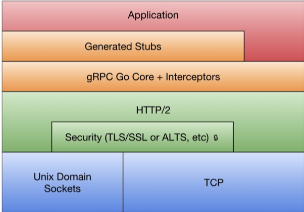
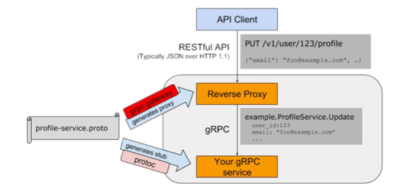

# RPC

RPC 是远程过程调用的缩写（Remote Procedure Call），通俗地说就是调用远处的一个函数，是分布式系统中不同节点间流行的通信方式。

而由于 Protobuf 支持多种不同的语言，其本身特性也十分方便描述服务接口（也就是方法列表），因此非常适合作为 RPC 世界的接口交流语言。

Go 语言标准库中提供了一个简单的 RPC 实现，其位置为 `net/rpc` 中。

## RPC 入门

### Hello World

首先构造 HelloService 类型，其中 Hello 方法用于打印功能：

```go
// HelloService 定义 hello 方法的结构体
type HelloService struct{}

// Hello 方法打印 hello 
// 其必须满足 Go 的 RPC 规则：方法只能有两个可序列化参数，第二个必须为指针类型，并返回一个 error，且必须是公开的方法
func (p *HelloService) Hello(request string, reply *string) error {
	*reply = "hello " + request
	return nil
}
```

然后就可以将 HelloService  注册成 RPC 函数

```go
// server.go
func main() {
	// 注册 RPC 服务
	rpc.RegisterName("HelloService", new(HelloService))
	// 打开 TCP 连接
	listener, err := net.Listen("tcp", ":1234")
	if err != nil {
		log.Fatal("Listen TCP error:", err)
	}

	conn, err := listener.Accept()
	if err != nil {
		log.Fatal("Accept error:", err)
	}
	rpc.ServeConn(conn)
}
```

注册后，`rpc.RegisterName` 方法会将 `HelloService` 所有满足 RPC 规则的对象方法注册为 RPC 函数，所有注册的方法会放在 `HelloService` 服务空间下，接下来我们可以建立一个 `client` 客户端来尝试连接调用该函数：

```go
// client.go
func main() {
	client, err := rpc.Dial("tcp", "localhost:1234")
	if err != nil {
		log.Fatal("dialing:", err)
	}

	var reply string
    // 第一个参数为服务空间及服务方法名，第二第三个为定义的 rpc 方法的两个参数
	err = client.Call("HelloService.Hello", "world", &reply)
	if err != nil {
		log.Fatal(err)
	}
	fmt.Println(reply)
}
// go run server.go
// go run client.go
// hello world
```

### 更加安全规范的 RPC 服务

在 RPC 应用中，一般有接口规范设计，服务端实现，客户端调用三种人员，在代码中也最好将其分离为 `api`, `client`, `server` 层

在 `api`  层中需要声明服务名字和接口，同时还可以在接口规范部分对客户端调用增加简单的包装

```go
package api

import "net/rpc"

const HelloServiceName = "path/to/pkg.HelloService"

type HelloServiceInterface interface {
	Hello(request string, reply *string) error
}

func RegisterHelloService(svc HelloServiceInterface) error {
	return rpc.RegisterName(HelloServiceName, svc)
}

type HelloServiceClient struct {
	*rpc.Client
}

func (h HelloServiceClient) Hello(request string, reply *string) error {
	return h.Client.Call(HelloServiceName + ".Hello", request, reply)
}
// 使其在编译时期就能报错而不是运行时报错
var _ HelloServiceInterface = (*HelloServiceClient)(nil)

func DialHelloService(network, address string) (*HelloServiceClient, error) {
	c, err := rpc.Dial(network, address)
	if err != nil {
		return nil, err
	}
	return &HelloServiceClient{Client: c}, nil
}

```

使用包装后的 `api` 层后的 `client` 层为

```go
func main() {
	client, err := api.DialHelloService("tcp", "localhost:1234")
	if err != nil {
		log.Fatal("dialing: ", err)
	}

	var reply string
	err = client.Hello("world", &reply)
	if err != nil {
		log.Fatal(err)
	}
	fmt.Println(reply)
}

```

可以直接调用 api 的方法进行 rpc 连接。

`server` 层代码则为

```go
type HelloService struct {}

func (p *HelloService) Hello(request string, reply *string) error {
	*reply = "Hello: " + request
	return nil
}

func main() {
	_ = api.RegisterHelloService(new(HelloService))

	listener, err := net.Listen("tcp", ":1234")
	if err != nil {
		log.Fatal("Listen TCP error:", err)
	}

	for {
		conn, err :=  listener.Accept()
		if err != nil {
			log.Fatal("Accept error ", err)
		}

		go rpc.ServeConn(conn)
	}
}

```

在新的RPC服务端实现中，我们用RegisterHelloService函数来注册函数，这样不仅可以避免命名服务名称的工作，同时也保证了传入的服务对象满足了RPC接口的定义。最后我们新的服务改为支持多个TCP链接，然后为每个TCP链接提供RPC服务。

### 使用 JSON 传输数据

使用 `json` 只需要使用 `client` 和 `server` 中拨号和服务的方法改变一些即可，在 `server` 中调用

```go
go rpc.ServeCodec(jsonrpc.NewServerCodec(conn))
```

使用 `jsonrpc` 的编码器对传输数据进行编码即可。

此时 `client` 端也需要改变

```go
conn, err := net.Dial("tcp", "localhost:1234")
if err != nil {
    log.Fatal("net Dail:", err)
}
client := rpc.NewClientWithCodec(jsonrpc.NewClientCodec(conn))
var reply string
err = client.Call("HelloService.Hello", "hello", &reply)
if err != nil {
    log.Fatal(err)
}
fmt.Println(reply)
```

使用 `net.Dial` 方法对 `RPC` 接口进行调用，连接时使用 `rpc.NewClientWithCodec(jsonrpc.NewClientCodec(conn))` 使用 `json` 的编码器进行编解码。

使用 HTTP 协议传输 JSON 数据


# Protobuf

Protocol buffers 是一种语言中立，平台无关，可扩展的序列化数据的格式，可用于通信协议，数据存储等。其在序列化数据方面，相对于 XML 其更加小巧，更加快速，更加简单。甚至可以在无需部署程序的情况下更新数据结构。

因此其很适合做数据存储或者 RPC 数据交换格式。


## 1. 使用

```protobuf
syntax = "proto3";
message SearchRequest {
	string query=1;
	int32  page_num = 2;
	int32  result_pre_page = 3;
}
```

第一行如果不声明 `syntax="proto3"` 则默认使用 `proto2` 进行解析。

### 1. 分配字段编号

每个字段都有唯一的编号，这些字段编号用于标识消息二进制格式中的字段，并且在使用消息类型后不应该更改。范围 `1~15` 需要一个字节进行编码，而 `16~2047` 字段编号则需要两个字节。所以应该保留 1 到 15 作为非常频繁出现的消息元素，为未来可能出现的高频元素留出一些空间。

可以指定的最小字段编号为 1， 最大为 $2^{29}-1$ 或者 536870911。不能使用数字 `19000-19999` 因为这些数字是保留字段，如果使用了保留字段则 protobuf 编译时会报错

### 2.保留编号

如果您通过完全删除某个字段或将其注释掉来更新消息类型，那么未来的用户可以在对该类型进行自己的更新时重新使用该字段号。如果稍后加载到了的旧版本 `.proto` 文件，则会导致服务器出现严重问题，例如数据混乱，隐私错误等等。确保这种情况不会发生的一种方法是指定删除字段的字段编号（或名称，这也可能会导致 JSON 序列化问题）为 `reserved`。如果将来的任何用户试图使用这些字段标识符，Protocol Buffers 编译器将会报错。

```protobuf
message Foo {
  reserved 2, 15, 9 to 11;
  reserved "foo", "bar";
}
```

### 3.各个语言类型与 protobuf 对应关系

`repeated` 字段：可以在一个 message 中重复任何数字多次，可以理解为数组


### 4.枚举类型

protobuf 中可以在 `message` 类型中嵌入枚举类型

```protobuf
message SearchRequest {
  string query = 1;
  int32 page_number = 2;
  int32 result_per_page = 3;
  enum Corpus {
    UNIVERSAL = 0;
    WEB = 1;
    IMAGES = 2;
    LOCAL = 3;
    NEWS = 4;
    PRODUCTS = 5;
    VIDEO = 6;
  }
  Corpus corpus = 4;
}
```

枚举类型中一定要以 0 值开始

- 枚举为 0 的是作为零值，当不赋值的时候，就会是零值。
- 为了和 proto2 兼容。在 proto2 中，零值必须是第一个值。

在不同 message 中使用相同名称的 Enum 值可以指定别名以和别的 message 中的区分开来，需要指定 `option` 

`allow_alias=true;`

```protobuf
message MyMessage1 {
  enum EnumAllowingAlias {
    option allow_alias = true;
    UNKNOWN = 0;
    STARTED = 1;
    RUNNING = 1;
  }
}
message MyMessage2 {
  enum EnumNotAllowingAlias {
    UNKNOWN = 0;
    STARTED = 1;
    // RUNNING = 1;  // Uncommenting this line will cause a compile error inside Google and a warning message outside.
  }
}
```

对于无法识别的枚举值，不同的语言有不同的处理。对于Go语言来说，因为枚举类型以int32来表示，所以对应的值依然用int32解析出来，只不过没有对应的枚举值而已。这种情况还是会存在的，比如proto有改动，或者代码强行设置了一个未知的枚举值。

**保留字段**

您可以使用 `max` 关键字指定您的保留数值范围上升到最大可能值。

```protobuf
enum Foo {
  reserved 2, 15, 9 to 11, 40 to max;
  reserved "FOO", "BAR";
}
```

### 5.其他类型和嵌套类型

可以使用 `import` 引用其他 proto 文件中的定义

其他类型

```protobuf
message SearchResponse {
	repeated Result results = 1;
}

message Result {
	string url = 1;
	string title = 2;
	repeated string snippets = 3;
}
```

嵌套类型 

```protobuf
message SearchResponse {
    message Result {
        string url = 1;
        string title = 2;
        repeated string snippets = 3;
    }
	repeated Result results = 1;
}
```

如果需要使用嵌套类型中的类型可以这样使用

```protobuf
message Search {
	SearchResponse.Result result = 1;
}
```


### 6.更新 message

如果后面开发中需要对定义的 message 增加字段，这时就可以体现 protobuf 的优势了，不需要改动之前的代码，不过需要满足以下要求

1. 不要改动原有字段的数据结构。
2. 如果您添加新字段，则任何由代码使用“旧”消息格式序列化的消息仍然可以通过新生成的代码进行分析。您应该记住这些元素的默认值，以便新代码可以正确地与旧代码生成的消息进行交互。同样，由新代码创建的消息可以由旧代码解析：旧的二进制文件在解析时会简单地忽略新字段。（具体原因见 [未知字段](https://github.com/halfrost/Halfrost-Field/blob/master/contents/Protocol/Protocol-buffers-encode.md#9-未知字段) 这一章节）
3. 只要字段号在更新的消息类型中不再使用，字段可以被删除。您可能需要重命名该字段，可能会添加前缀“OBSOLETE_”，或者标记成保留字段号 `reserved`，以便将来的 `.proto` 用户不会意外重复使用该号码。
4. int32，uint32，int64，uint64 和 bool 全都兼容。这意味着您可以将字段从这些类型之一更改为另一个字段而不破坏向前或向后兼容性。如果一个数字从不适合相应类型的线路中解析出来，则会得到与在 C++ 中将该数字转换为该类型相同的效果（例如，如果将 64 位数字读为 int32，它将被截断为 32 位）。
5. sint32 和 sint64 相互兼容，但与其他整数类型不兼容。
6. 只要字节是有效的UTF-8，string 和 bytes 是兼容的。
7. 嵌入式 message 与 bytes 兼容，如果 bytes 包含 message 的 encoded version。
8. fixed32 与 sfixed32 兼容，而 fixed64 与 sfixed64 兼容。
9. enum 就数组而言，是可以与 int32，uint32，int64 和 uint64 兼容（请注意，如果它们不适合，值将被截断）。但是请注意，当消息反序列化时，客户端代码可能会以不同的方式对待它们：例如，未识别的 proto3 枚举类型将保留在消息中，但消息反序列化时如何表示是与语言相关的。（这点和语言相关，上面提到过了）Int 域始终只保留它们的值。
10. 将单个**值**更改为新的成员是安全和二进制兼容的。如果您确定一次没有代码设置多个**字段**，则将多个字段移至新的字段可能是安全的。将任何**字段**移到现有字段中都是不安全的。（注意字段和值的区别，字段是 field，值是 value）

### 9.Map 类型

`repeated` 类型可以表示数组， Map 类型则可以用来表示字典

`map<key_type, value_type> map_field = N;`

`key_type` 可以是任何 int 或者 string 类型(任何的标量类型，具体可以见上面标量类型对应表格，但是要除去 float、double 和 bytes)

**枚举值也不能作为 key**。

`key_type` 可以是除去 map 以外的任何类型。

需要特别注意的是 ：

- map 是不能用 repeated 修饰的。
- 线性数组和 map 迭代顺序的是不确定的，所以你不能依靠你的 map 是在一个特定的顺序。
- 为 `.proto` 生成文本格式时，map 按 key 排序。数字的 key 按数字排序。
- 从数组中解析或合并时，如果有重复的 key，则使用所看到的最后一个 key（覆盖原则）。从文本格式解析映射时，如果有重复的 key，解析可能会失败。

map 类型的数组可以使用 message 来实现

```protobuf
message MapFieldEntry {
	key_type key = 1;
	value_type value = 2;
}
repeated MapFieldEntry map_field = N;
```


### 10.JSON Mapping

Proto3 支持 JSON 中的规范编码，使系统之间共享数据变得更加容易。编码在下表中按类型逐个描述。

如果 JSON 编码数据中缺少值或其值为空，则在解析为 protocol buffer 时，它将被解释为适当的默认值。如果一个字段在协议缓冲区中具有默认值，默认情况下它将在 JSON 编码数据中省略以节省空间。具体 Mapping 的实现可以提供选项决定是否在 JSON 编码的输出中发送具有默认值的字段。


### 11.proto3 定义 RPC Serivces

如果要使用 RPC（远程过程调用）系统的消息类型，可以在 `.proto` 文件中定义 RPC 服务接口，protocol buffer 编译器将使用所选语言生成服务接口代码和 stubs。所以，例如，如果你定义一个 RPC 服务，入参是 SearchRequest 返回值是 SearchResponse，你可以在你的 `.proto` 文件中定义它，如下所示：

```protobuf
service SearchService {
  rpc Search (SearchRequest) returns (SearchResponse);
}
```

与 protocol buffer 一起使用的最直接的 RPC 系统是 gRPC：在谷歌开发的语言和平台中立的开源 RPC 系统。gRPC 在 protocol buffer 中工作得非常好，并且允许你通过使用特殊的 protocol buffer 编译插件，直接从 `.proto` 文件中生成 RPC 相关的代码。


## 2. protoc-go 

### 1. 普通使用

首先建立一个 `hello.proto` 文件

```protobuf
syntax = "proto3";

package main;
option go_package = "main";

message String {
  string value = 1;
}

service HelloService {
  rpc Hello (String) returns (String);
}
```

可以通过下列命令生成相应的 Go 代码

```bash
protoc --go_out=. hello.proto
```

该语句意思为，使用 prtoc-gen-go 插件生成代码到当前目录。

### 2.使用 gRPC 生成

使用 `protoc --go_out=plugins=grpc:. hello.proto` 可以使用 protoc-gen-go 中自带的 grpc 插件生成 RPC 代码，该语句才会生成 proto 文件中 service 部分。


### 3.定制代码生成插件

Protobuf 的 protoc 编译器是通过插件机制实现对不同语言的支持。比如 protoc 命令出现`--xxx_out`格式的参数，那么 protoc 将首先查询是否有内置的 xxx 插件，如果没有内置的 xxx 插件那么将继续查询当前系统中是否存在protoc-gen-xxx 命名的可执行程序，最终通过查询到的插件生成代码。对于 Go 语言的 protoc-gen-go 插件来说，里面又实现了一层静态插件系统。比如 protoc-gen-go 内置了一个 gRPC 插件，用户可以通过`--go_out=plugins=grpc`参数来生成 gRPC 相关代码，否则只会针对 message 生成相关代码。

参考gRPC插件的代码，可以发现 generator.RegisterPlugin 函数可以用来注册插件。插件是一个 generator.Plugin 接口：

```go
// A Plugin provides functionality to add to the output during
// Go code generation, such as to produce RPC stubs.
type Plugin interface {
    // 插件名.
    Name() string
    // 通过 g 参数对插件进行初始化， g 参数包含 proto 文件的所有信息
    Init(g *Generator)
    // Generate 生成代码文件不包含 import 文件
    Generate(file *FileDescriptor)
    // GenerateImports 生成导入包代码
    GenerateImports(file *FileDescriptor)
}
```

因此我们可以根据这个接口，设计一个 netrpcPlugin 插件，用于为标准库 RPC 框架生成代码：

```go
type netrpcPlugin struct{ *generator.Generator }

func (p *netrpcPlugin) Name() string {
	return "netrpc"
}

func (p *netrpcPlugin) Init(g *generator.Generator) {
	p.Generator = g
}

func (p *netrpcPlugin) GenerateImports(file *generator.FileDescriptor) {
	if len(file.Service) > 0 {
		p.genImportCode(file)
	}
}

func (p *netrpcPlugin) Generate(file *generator.FileDescriptor) {
	for _, svc := range file.Service {
		p.genServiceCode(svc)
	}
}
func init() {
	generator.RegisterPlugin(new(netrpcPlugin))
}
```

需要使用 `init` 来注册该插件，因为Go语言的包只能静态导入，我们无法向已经安装的protoc-gen-go添加我们新编写的插件。我们将重新克隆protoc-gen-go对应的main函数：

```go
package main

import (
	"io/ioutil"
	"os"

	"github.com/golang/protobuf/proto"
	"github.com/golang/protobuf/protoc-gen-go/generator"
)

func main() {
	// Begin by allocating a generator. The request and response structures are stored there
	// so we can do error handling easily - the response structure contains the field to
	// report failure.
	g := generator.New()

	data, err := ioutil.ReadAll(os.Stdin)
	if err != nil {
		g.Error(err, "reading input")
	}

	if err := proto.Unmarshal(data, g.Request); err != nil {
		g.Error(err, "parsing input proto")
	}

	if len(g.Request.FileToGenerate) == 0 {
		g.Fail("no files to generate")
	}

	g.CommandLineParameters(g.Request.GetParameter())

	// Create a wrapped version of the Descriptors and EnumDescriptors that
	// point to the file that defines them.
	g.WrapTypes()

	g.SetPackageNames()
	g.BuildTypeNameMap()

	g.GenerateAllFiles()

	// Send back the results.
	data, err = proto.Marshal(g.Response)
	if err != nil {
		g.Error(err, "failed to marshal output proto")
	}
	_, err = os.Stdout.Write(data)
	if err != nil {
		g.Error(err, "failed to write output proto")
	}
}
```

接下来使用编译时，为了避免 `protoc-gen-go` 失效，我们将其命名为 `protoc-gen-go-netrpc` 然后将其编译，放入 GOPATH/bin 目录下，然后使用以下命令进行重新编译

```go
protoc --go-netrpc_out=plugins=netrpc:. hello.proto
```

其中`--go-netrpc_out`参数告知protoc编译器加载名为protoc-gen-go-netrpc的插件，插件中的`plugins=netrpc`指示启用内部唯一的名为netrpc的netrpcPlugin插件。在新生成的hello.pb.go文件中将包含增加的注释代码。

至此，手工定制的Protobuf代码生成插件终于可以工作了。

**完整代码**

首先需要生成 `import` 包

```go
func (p *netrpcPlugin) genImportCode(file *generator.FileDescriptor) {
	p.P(`import "net/rpc"`)
}
```

然后要在自定义的 genServiceCode 方法中为每个服务生成相关的代码。分析可以发现每个服务最重要的是服务的名字，然后每个服务有一组方法。而对于服务定义的方法，最重要的是方法的名字，还有输入参数和输出参数类型的名字。

为此我们定义了一个ServiceSpec类型，用于描述服务的元信息：

```go
type ServiceSpec struct {
    ServiceName string
    MethodList  []ServiceMethodSpec
}

type ServiceMethodSpec struct {
    MethodName     string
    InputTypeName  string
    OutputTypeName string
}
```

新建一个方法用于解析每个服务的 ServiceSpec 原信息

```go
func (p *netrpcPlugin) buildServiceSpec(svc *descriptor.ServiceDescriptorProto) *ServiceSpec {
	spec := &ServiceSpec{
		ServiceName: generator.CamelCase(svc.GetName()),
	}

	for _, m := range svc.Method {
		spec.MethodList = append(spec.MethodList, ServiceMethodSpec{
			MethodName: generator.CamelCase(m.GetName()),
			InputTypeName: p.TypeName(p.ObjectNamed(m.GetInputType())),
			OutputTypeName: p.TypeName(p.ObjectNamed(m.GetOutputType())),
		})
	}
	return spec
}
```

输入参数是 `svc *descriptor.ServiceDescriptorProto` 类型，其完整的描述了一个服务的所有信息，然后就可以通过 `genServiceCode` 来生成服务代码

```go
func (p *netrpcPlugin) genServiceCode(svc *descriptor.ServiceDescriptorProto) {
	spec := p.buildServiceSpec(svc)

	var buf bytes.Buffer
	t := template.Must(template.New("").Parse(tmplService))
	err := t.Execute(&buf, spec)
	if err != nil {
		log.Fatal(err)
	}
	p.P(buf.String())
}
```

这里使用 Go 的模板来生成服务代码，通过期望的代码来生成模板

```go
type HelloServiceInterface interface {
    Hello(in String, out *String) error
}

func RegisterHelloService(srv *rpc.Server, x HelloService) error {
    if err := srv.RegisterName("HelloService", x); err != nil {
        return err
    }
    return nil
}

type HelloServiceClient struct {
    *rpc.Client
}

var _ HelloServiceInterface = (*HelloServiceClient)(nil)

func DialHelloService(network, address string) (*HelloServiceClient, error) {
    c, err := rpc.Dial(network, address)
    if err != nil {
        return nil, err
    }
    return &HelloServiceClient{Client: c}, nil
}

func (p *HelloServiceClient) Hello(in String, out *String) error {
    return p.Client.Call("HelloService.Hello", in, out)
}
```

其中 Hello 之类的为名字，最终使用的模板为

```go
const tmplService = `
{{$root := .}}
type {{.ServiceName}}Interface interface {
	{{- range $_, $m := .MethodList}}
		{{$m.MethodName}}(in *{{$m.InputTypeName}}, out *{{$m.OutputTypeName}}) error
	{{- end}}
}
func Register{{.ServiceName}}(srv *rpc.Server, x {{.ServiceName}}Interface) error {
	if err := srv.RegisterName("{{.ServiceName}}", x); err != nil {
		return err
	}
	return nil
}
type {{.ServiceName}}Client struct {
	*rpc.Client
}
var _ {{.ServiceName}}Interface = (*{{.ServiceName}}Client)(nil)
func Dial{{.ServiceName}}(network, address string) (*{{.ServiceName}}Client, error) {
	c, err := rpc.Dial(network, address)
	if err != nil {
		return nil, err
	}
	return &{{.ServiceName}}Client{Client: c}, nil
}
{{range $_, $m := .MethodList}}
func (p *{{$root.ServiceName}}Client) {{$m.MethodName}}(in *{{$m.InputTypeName}}, out *{{$m.OutputTypeName}}) error {
	return p.Client.Call("{{$root.ServiceName}}.{{$m.MethodName}}", in, out)
}
{{end}}
`
```


# RPC 实战

## 客户端 RPC 实现原理


Go 语言客户端 RPC 调用使用 `client.Call` 进行同步阻塞调用，其实现如下

```go
func (client *Client) Call(serviceMethod string, args interface{}, reply interface{}) error {
	call := <-client.Go(serviceMethod, args, reply, make(chan *Call, 1)).Done
	return call.Error
}
```

其内部通过调用 `client.Go` 函数来进行异步调用，然后等待 `Done` 管道返回调用结果，其内部实现为

```go
func (client *Client) Go(serviceMethod string, args interface{}, reply interface{}, done chan *Call) *Call {
	call := new(Call)
	call.ServiceMethod = serviceMethod
	call.Args = args
	call.Reply = reply
	if done == nil {
		done = make(chan *Call, 10) // buffered.
	} else {
		if cap(done) == 0 {
			log.Panic("rpc: done channel is unbuffered")
		}
	}
	call.Done = done
	client.send(call)
	return call
}
```

首先初始化一个 call 变量，然后通过 `client.send` 将 call 的完整参数发送给 RPC 框架，其调用是线程安全的，因此可以多个 Goroutine 同时向同一个 RPC 链接发送调用命令。

当全部调用完成时，`client.send` 会调用 `client.done` 来通知调用完成：

```go
func (call *Call) done() {
	select {
	case call.Done <- call:
		// ok
	default:
		// We don't want to block here. It is the caller's responsibility to make
		// sure the channel has enough buffer space. See comment in Go().
		if debugLog {
			log.Println("rpc: discarding Call reply due to insufficient Done chan capacity")
		}
	}
}
```

由以上可以看出，`call.Done` 必须初始化时设定一个缓冲量保证多个 RPC 调用可以有效返回。


## KVStoreService 实现

server 端实现了一个模拟数据库的 KV map, 和一个 Watch 方法来检测 map 中的值是否改变

```go
// KVStoreService 模拟数据库
type KVStoreService struct {
	m      map[string]string
	filter map[string]func(key string)
	mu     sync.Mutex
}

// NewKVStoreService 初始化 KVStore 模拟数据库
func NewKVStoreService() *KVStoreService {
	return &KVStoreService{
		m:      make(map[string]string),
		filter: make(map[string]func(key string)),
	}
}

// Get 根据 key 获取值
func (p *KVStoreService) Get(key string, value *string) error {
	p.mu.Lock()
	defer p.mu.Unlock()

	if v, ok := p.m[key]; ok {
		*value = v
		return nil
	}

	return fmt.Errorf("not found")
}

// Set 存储 key ,value 值到 map 中
func (p *KVStoreService) Set(kv [2]string, reply *struct{}) error {
	p.mu.Lock()
	defer p.mu.Unlock()

	key, value := kv[0], kv[1]

	if oldValue := p.m[key]; oldValue != value {
		for _, fn := range p.filter {
			fn(key)
		}
	}
	p.m[key] = value
	return nil
}

// Watch 输入超时的秒数. 当 key 变化时将 key 作为返回值返回, 如果超过时间依然没有被修改, 则返回超时错误
func (p *KVStoreService) Watch(timeoutSecond int, keyChanged *string) error {
	id := fmt.Sprintf("watch-%s-%03d", time.Now(), rand.Int())
	ch := make(chan string, 10)

	p.mu.Lock()
	p.filter[id] = func(key string) { ch <- key }
	p.mu.Unlock()

	select {
	case <-time.After(time.Duration(timeoutSecond) * time.Second):
		return fmt.Errorf("timeout")
	case key := <-ch:
		*keyChanged = key
		return nil
	}
}

// 反向 RPC 服务器端连接客户端监听的端口来进行服务
func main() {
	rpc.Register(&KVStoreService{
		m:      make(map[string]string),
		filter: make(map[string]func(key string)),
	})
	for {
		conn, _ := net.Dial("tcp", "localhost:1234")
		if conn == nil {
			time.Sleep(time.Second)
			continue
		}
		rpc.ServeConn(conn)
		conn.Close()
	}
}
```

client 端

```go
// doClientWork 调用 RPC 函数
func doClientWork(clientChan <-chan *rpc.Client) {
	// 从管道中获取一个 client 调用后将其关闭
	client := <-clientChan
	defer client.Close()
	go func() {
		var keyChanged string
		err := client.Call("KVStoreService.Watch", 30, &keyChanged)
		if err != nil {
			log.Fatal(err)
		}
		fmt.Println("watch: ", keyChanged)
	}()

	err := client.Call(
		"KVStoreService.Set", [2]string{"abc", "abc-value"},
		new(struct{}),
	)
	if err != nil {
		log.Fatal(err)
	}
	fmt.Println("hello")
	time.Sleep(time.Second * 3)
}

// 反向 RPC 调用, 由客户端监听
func main() {
	listener, err := net.Listen("tcp", ":1234")
	if err != nil {
		log.Fatal("ListenTCP error:", err)
	}

	clientChan := make(chan *rpc.Client)
	go func ()  {
		for {
			conn, err := listener.Accept()
			if err != nil {
				log.Fatal("Accept error:", err)
			}

			clientChan <- rpc.NewClient(conn)
		}	
	}()
	doClientWork(clientChan)
}
```


## 携带上下文信息

基于上下文我们可以针对不同客户端提供定制化的RPC服务。我们可以通过为每个 链接提供独立的RPC服务来实现对上下文特性的支持。

首先改造HelloService，里面增加了对应链接的conn成员：

```go
type HelloService struct {

	conn net.Conn

}
```

然后为每个链接启动独立的RPC服务：

```go
func main() {

    listener, err := net.Listen("tcp", ":1234")

    if err != nil {

    	log.Fatal("ListenTCP error:", err)

    }

    for {

        conn, err := listener.Accept()

        if err != nil {

            log.Fatal("Accept error:", err)

        }

        go func() {

            defer conn.Close()

            p := rpc.NewServer()

            p.Register(&HelloService{conn: conn})

            p.ServeConn(conn)

        } ()

    }
}
```

接下来 Hello 方法就可以根据不同的上下文信息而做出不同的抉择

```go
func (p *HelloService) Hello(request string, reply *string) error {
	if !p.isLogin {
		return fmt.Errorf("please login")
	}
	*reply = "hello:" + request + ", from" + p.conn.RemoteAddr().String()
	return nil
}
```

就可以使用 conn 来携带上下文信息.

# gRPC

gRPC 是 Google 公司基于Protobuf 开发的跨语言的开源 RPC 框架。gRPC 基于 HTTP/2 协议设计，可以基于一个 HTTP/2 链接提供多个服务，对于移动设备更加友好。

**gRPC 技术栈**



## gRPC 入门

gRPC 使用 `context.Context` 来进行上下文支持。是每个参数调用都可获取上下文信息，客户端在调用时也可以添加 `grpc.CallOption` 来添加额外上下文信息。其 `proto` 文件定义为

```protobuf
syntax = "proto3";

option go_package=".;main"

message String {

	string value = 1;

}

service HelloService {

	rpc Hello (String) returns (String);

}
```

 使用 `protoc --go_out=plugins=grpc:. hello.proto` 可以使用 protoc-gen-go 中自带的 grpc 插件生成 RPC 代码，该语句才会生成 proto 文件中 service 部分。

其会生成以下接口代码：

```go
type HelloServiceServer interface {

	Hello(context.Context, *String) (*String, error)

}

type HelloServiceClient interface {

	Hello(context.Context, *String, ...grpc.CallOption) (*String, error)

}
```

因此可以去编写服务端代码为：

```go
type HelloServiceImpl struct{}

func (p *HelloServiceImpl) Hello(ctx context.Context, args *String) (*String, error) {

	reply := &String{Value: "hello:" + args.GetValue()}

	return reply, nil

}

func main() {

    grpcServer := grpc.NewServer()

    RegisterHelloServiceServer(grpcServer, new(HelloServiceImpl))

    lis, err := net.Listen("tcp", ":1234")

    if err != nil {

    	log.Fatal(err)

    }

    grpcServer.Serve(lis)

}
```

其启动过程和 `rpc` 启动过程相像，使用 `grpc` 代码生成的 `RegisterHelloServiceServer` 来注册服务，然后调用 net 包去监听端口最后调用 `grpcServer.Serve(lis)` 来进行服务。然后可以通过客户端来进行连接

```go
func main() {

	conn, err := grpc.Dial("localhost:1234", grpc.WithInsecure())

    if err != nil {

    	log.Fatal(err)

    }

    defer conn.Close()

    client := NewHelloServiceClient(conn)

    reply, err := client.Hello(context.Background(), &String{Value: "hello"})

    if err != nil {

    	log.Fatal(err)

    }

    fmt.Println(reply.GetValue())

}
```

gRPC 调用与标准调用有一点区别，就是 gRPC 不支持异步调用。不过可以在多个 Goroutine 之间安全共享 HTTP/2 的连接，可以通过另一个 Goroutine 阻塞调用的方式来模拟异步调用。


## gRPC 流

RPC 是远程调用，所以每次调用的函数参数和数值不能太大，否则会影响调用的时间，因此传统 RPC 调用不适合大文件上传和下载的场景同时传统RPC 模式也不适用于对时间不确定的订阅和发布模式。为此， gRPC 框架针对服务器端和客户端分别提供了流特性。

在 `proto` 文件中加入 `stream` 关键字表示开启流

```protobuf
syntax = "proto3";

option go_package = ".;stream";

message String {
  string value = 1;
}

service HelloService {
  rpc Hello (String) returns (String);
  rpc Channel (stream String) returns (stream String);
}
```

gRPC 流中有 `send` 和 `Recv` 方法来负责流的接受和发送

```go
func (x *helloServiceChannelServer) Send(m *String) error {
	return x.ServerStream.SendMsg(m)
}

func (x *helloServiceChannelServer) Recv() (*String, error) {
	m := new(String)
	if err := x.ServerStream.RecvMsg(m); err != nil {
		return nil, err
	}
	return m, nil
}
```

## gRPC 证书认证

gRPC 建立在 HTTP/2 协议上，对 TLS 有很好的支持，在前面的 gRPC 代码中的服务都没有提供证书支持，因此客户端在链接服务器时，使用了 `grpc.WithInsecure()` 选项跳过了对服务器证书的验证。没有启用证书的 gRPC 服务和客户端通信时是使用明文通讯，信息传输不安全，为了保障 gRPC 通信不被第三方监听，可以对服务器启动 TLS 加密特性。

可以用以下命令为服务器和客户端分别生成私钥和证书

```shell
openssl genrsa -out server.key 2048
openssl req -new -x509 -days 3650 \
 	-subj "/C=GB/L=China/O=grpc-server/CN=server.grpc.io" \
 	-key server.key -out server.crt

openssl genrsa -out client.key 2048
openssl req -new -x509 -days 3650 \
	-subj "/C=GB/L=China/O=gprc-client/CN=client.grpc.io" \
	-key client.key -out client.crt
```

以上命令会生成 `server.key`, `server.crt` , `client.key`, `client.crt` 四个文件，其中以 `.key` 结尾的为私钥文件。以 `.crt` 为后缀的为证书文件，也可以理解为公钥文件。在 subj 参数中的 `/CN=server.grpc.io` 表示服务器的名字为 `server.grpc.io` ，在验证服务器证书时需要用到该信息。

一般中还会加入 CA 证书来保证证书在传递过程中不被篡改，通过根证书，一般操作为

```makefile
default:
	# ca
	openssl genrsa -out ca.key 2048
	openssl req -new -x509 -days 3650 \
		-subj "/C=GB/L=China/O=gobook/CN=github.com" \
		-key ca.key -out ca.crt

	# server
	openssl genrsa \
		-out server.key 2048
	openssl req -new \
		-subj "/C=GB/L=China/O=server/CN=server.io" \
		-key server.key \
		-out server.csr
	openssl x509 -req -sha256 \
		-CA ca.crt -CAkey ca.key -CAcreateserial -days 3650 \
		-in server.csr \
		-out server.crt

	# client
	openssl genrsa \
		-out client.key 2048
	openssl req -new \
		-subj "/C=GB/L=China/O=client/CN=client.io" \
		-key client.key \
		-out client.csr
	openssl x509 -req -sha256 \
		-CA ca.crt -CAkey ca.key -CAcreateserial -days 3650 \
		-in client.csr \
		-out client.crt

clean:
	-rm *.key *.crt *.csr *.srl
```

而后客户端和服务端可以验证证书

```go
func startServer() {
	certificate, err := tls.LoadX509KeyPair(server_crt, server_key)
	if err != nil {
		log.Panicf("could not load server key pair: %v", err)
	}

	certPool := x509.NewCertPool()
	ca, err := ioutil.ReadFile(ca)
	if err != nil {
		log.Panicf("could not read ca certificate: %v", err)
	}
	// 从 CA 证书中加入客户端验证
	if ok := certPool.AppendCertsFromPEM(ca); !ok {
		log.Panicf("faided to append client certs")
	}

	// 创建 TLS 证书
	creds := credentials.NewTLS(&tls.Config{
		ClientAuth: tls.RequireAndVerifyClientCert,
		Certificates: []tls.Certificate{certificate},
		ClientCAs: certPool,
	})

	// 创建 grpc 服务
	server := grpc.NewServer(grpc.Creds(creds))
	RegisterGreeterServer(server, new(myGrpcServer))

	lis, err := net.Listen("tcp", port)
	if err != nil {
		log.Fatalf("could not listen port: %v, err: %v", port, err)
	}

	if err := server.Serve(lis); err != nil {
		log.Fatalf("grpc server error: %v", err)
	}
}

func doClientWork() {
	certificate, err := tls.LoadX509KeyPair(client_crt, client_key)
	if err != nil {
		log.Fatalf("could not load client key pair: %v", err)
	}

	certPool := x509.NewCertPool()
	ca, err := ioutil.ReadFile(ca)
	if err != nil {
		log.Panicf("could not read ca certificate: %v", err)
	}
	// 从 CA 证书中加入客户端验证
	if ok := certPool.AppendCertsFromPEM(ca); !ok {
		log.Panicf("faided to append client certs")
	}

	// 创建 TLS 证书
	creds := credentials.NewTLS(&tls.Config{
		InsecureSkipVerify: false,
		ServerName: tlsServerName,
		Certificates: []tls.Certificate{certificate},
		RootCAs: certPool,
	})

	conn, err := grpc.Dial("localhost"+port, grpc.WithTransportCredentials(creds))
	if err != nil {
		log.Fatal(err)
	}
	defer conn.Close()

	c := NewGreeterClient(conn)
	r, err := c.SayHello(context.Background(), &HelloRequest{Name: "gopher"})
	if err != nil {
		log.Fatal("could not greet: ", err)
	}

	log.Printf("doClientWork: %s", r.Message)
}

```

## Token 认证

gRPC 为每个 gRPC 方法调用提供了认证支持，这样基于用户 Token 对不同的方法访问进行权限管理。要实现对每个 gRPC 方法进行认证，需要实现 `grpc.PerRPCCredentials` 接口：

```go
type PerRPCCredentials interface {
    GetRequestMetadata(ctx contex.Contex, uri ...string) (map[string]string, error)
    RequireTransportSecurity() bool
}
```

在 GetRequestMetadata 方法中返回认证需要的必要信息。 RequireTransportSecurity 方法表示是否要求底层使用安全链接。在真实的环境中建议必须要求底层启用安全的链接，否则认证信息有泄露和被篡改的风险。

我们可以创建一个Authentication类型，用于实现用户名和密码的认证：

```go
type Authentication struct {
	Login string
	Password string
}

func (a *Authentication) GetRequestMetadata(context.Context, ...string) (map[string]string, error) {
	return map[string]string{"login": a.Login, "password": a.Password}, nil
}

func (a *Authentication) RequireTransportSecurity() bool {
	return false
}
```

然后在每次请求gRPC服务时就可以将Token信息作为参数选项传人:

```go
func doClientWork() {
	auth := Authentication{
		Login:    "gopher",
		Password: "password",
	}

	conn, err := grpc.Dial("localhost"+port, grpc.WithInsecure(), grpc.WithPerRPCCredentials(&auth))
	if err != nil {
		log.Fatal(err)
	}
	defer conn.Close()

	c := NewGreeterClient(conn)
	r, err := c.SayHello(context.Background(), &HelloRequest{Name: "gopher"})
	if err != nil {
		log.Fatal("could not greet: ", err)
	}
	log.Println("doClientWork: ", r.Message)
}

```

通过grpc.WithPerRPCCredentials函数将Authentication对象转为grpc.Dial参数。因 为这里没有启用安全链接，需要传人grpc.WithInsecure()表示忽略证书认证。

然后在gRPC服务端的每个方法中通过Authentication类型的Auth方法进行身份认 证：

```go
func (a *Authentication) Auth(ctx context.Context) error {

    md, ok := metadata.FromIncomingContext(ctx)

    if !ok {

    	return fmt.Errorf("missing credentials")

    }

    var appid string

    var appkey string

    if val, ok := md["login"]; ok { appid = val[0] }

    if val, ok := md["password"]; ok { appkey = val[0] }

    if appid != a.Login || appkey != a.Password {

        return grpc.Errorf(codes.Unauthenticated, "invalid token")

    }
    return nil
}
```

## 截取器

gRPC中的 grpc.UnaryInterceptor 和 grpc.StreamInterceptor 分别对普通方法和流方法提供了截取器的支持。

要实现普通方法的截取器，需要为grpc.UnaryInterceptor的参数实现一个函数：

```go
func filter(ctx context.Context, req interface{}, info *grpc.UnaryServerInfo,handler grpc.UnaryHandler) (resp interface{}, err error) {
    log.Println("fileter:", info)
    return handler(ctx, req)
}
```

函数的ctx和req参数就是每个普通的RPC方法的前两个参数。第三个info参数表示 当前是对应的那个gRPC方法，第四个handler参数对应当前的gRPC方法函数。上 面的函数中首先是日志输出info参数，然后调用handler对应的gRPC方法函数。

如果截取器函数返回了错误，那么该次gRPC方法调用将被视作失败处理。因此， 我们可以在截取器中对输入的参数做一些简单的验证工作。同样，也可以对handler 返回的结果做一些验证工作。截取器也非常适合前面对Token认证工作。

不过gRPC框架中只能为每个服务设置一个截取器，因此所有的截取工作只能在一 个函数中完成。开源的`grpc-ecosystem`项目中的`go-grpc-middleware`包已经基于 gRPC对截取器实现了链式截取器的支持。

## gRPC 和 Protobuf 扩展

### 验证器

在开源社区中，github.com/mwitkow/go-proto-validators 已经基于Protobuf的扩展 特性实现了功能较为强大的验证器功能。要使用该验证器首先需要下载其提供的代码生成插件：

```shell
go get github.com/mwitkow/go-proto-validators/protoc-gen-govalidators
```

然后基于该包写 `proto` 文件

```protobuf
syntax = "proto3";

package main;

option go_package=".;main";

import "github.com/mwitkow/go-proto-validators@v0.3.2/validator.proto";

message Message {
  string important_string = 1 [(validator.field) = {regex:"^[a-z]{2,5}$"}];
  int32 age = 2 [(validator.field) = {int_gt: 0, int_lt: 100}];
}
```

其中 `validator.field` 表示扩展时 `validator` 包中定义的名为 `field` 扩展选项

我们可以使用以下命令生成验证函数代码：

```makefile
gen:
	protoc  \
	  --proto_path=${GOPATH}/pkg/mod \
	  --proto_path=${GOPATH}/pkg/mod/github.com/gogo/protobuf@v1.3.0/protobuf \
	  --proto_path=. \
	  --go_out=. \
	  --go-grpc_out=. \
	  --govalidators_out=gogoimport=true:. \
	  *.proto
```

其中两个 `--proto_path/-I` 指定 proto 文件去磁盘中哪个地方寻找 proto 扩展文件。

即可生成验证器函数，并结合截取器，可以对每个方法输入参数和返回值进行验证。

### REST 接口

gRPC 一般用于集群内部通信 ，对外暴露服务一般需要提供等价 REST 接口。可以使用开源的 `grpc-gateway` 项目



通过在 Protobuf 文件中添加路由相关的元信息，通过自定义代码插件生成路由相关的处理代码，最终将 REST 请求转给更后端的 gRPC 服务器处理。

```protobuf
syntax = "proto3";

package main;
option go_package=".;main";

import "google/api/annotations.proto";

message StringMessage {
  string value = 1;
}

service RestService {
  rpc Get(StringMessage) returns(StringMessage) {
    option (google.api.http) = {
      get: "/get/{value}"
    };
  }
  rpc Post(StringMessage) returns(StringMessage) {
    option(google.api.http) = {
      post: "/post"
      body: "*"
    };
  }
}
```

然后通过 proto 将其代码文件生成

```makefile
protoc \
    -I=. -I=${GOPATH}/pkg/mod/github.com/grpc-ecosystem/grpc-gateway/v2@v2.0.0/third_party/googleapis  \
    --go_out=. \
    --go-grpc_out=. \
    helloworld.proto
protoc \
    -I=. -I=${GOPATH}/pkg/mod/github.com/grpc-ecosystem/grpc-gateway/v2@v2.0.0/third_party/googleapis \
    --grpc-gateway_out=logtostderr=true:. \
    helloworld.proto
protoc \
    -I=. -I=${GOPATH}/pkg/mod/github.com/grpc-ecosystem/grpc-gateway/v2@v2.0.0/third_party/googleapis \
    --swagger_out=. \
    helloworld.proto
```

第一个为 grpc 生成，第二个为生成 `gateway` 第三个通过 Swagger 格式文件用于描述接口规范