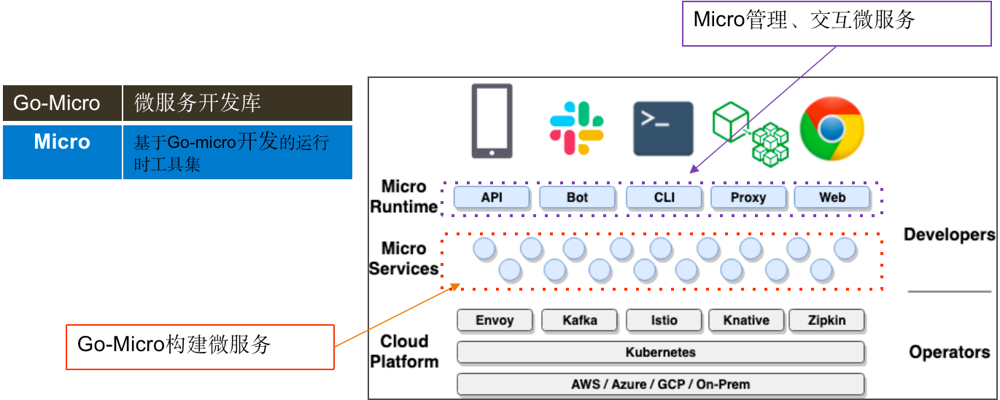
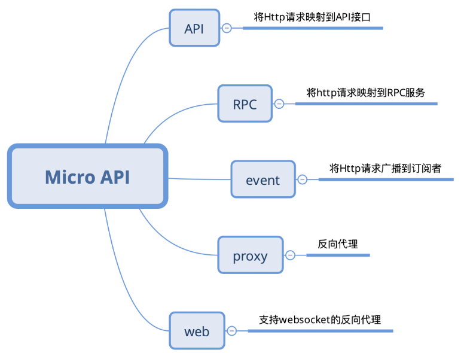
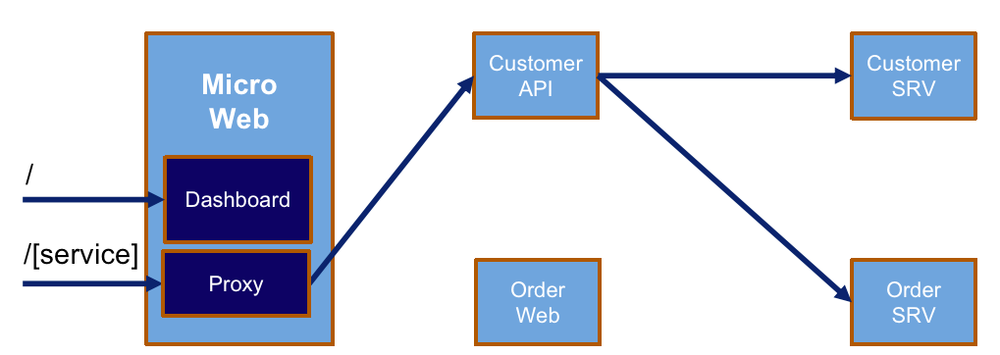
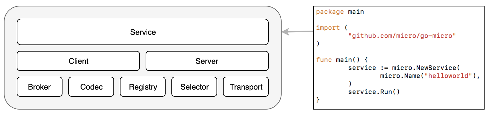
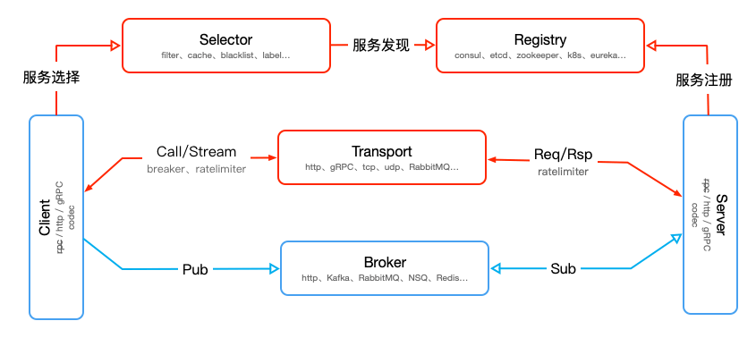
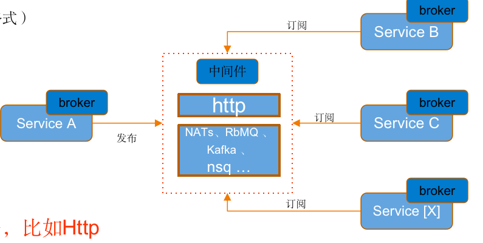
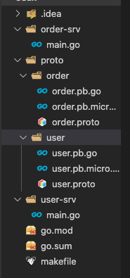
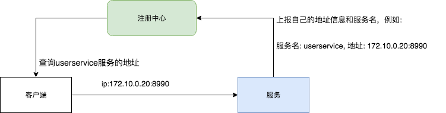

# 概述

Micro 是一组工具，能够帮助开发者快速构建和管理微服务。它包含两个重要组成部分

1. [**go-micro**](https://github.com/micro/go-micro): 一个Golang微服务开发框架。它是核心。 开发者可以利用它快速开发出微服务。这些微服务最常见的形态是 gRPC。
2. [**micro**](https://github.com/micro/micro): 一个命令行工具。 虽非必须， 但它可以为Micro开发和管理提供很多便利。 例如， 生成模板项目， 查看服务运行状态， 调用服务等。 此工具也是基于 **go-micro** 开发的。

除此以外， 实践中还会用到 [**go-plugins**](https://github.com/micro/go-plugins)，这是一系列插件。涉及服务发现、异步消息、传输协议等方方面面。它还有开源社区 **slack**。


# go-micro

## 架构

go-micro的作用是简化微服务开发、构建分布式系统。 而有些工作是在每个分布式系统中都需要的。所以 go-micro把这些常见任务统一抽象成接口。 这使得开发者不必理会底层实现细节， 降低了学习和开发成本， 快速搭建灵活、健壮的系统。

它是一个可插入的RPC框架，用于在Go中编写微服务：

- **服务发现**: 应用程序自动注册到服务发现系统
- **负载平衡**: 客户端负载平衡，用于平衡服务实例之间的请求
- **同步通信**: 提供请求 / 响应传输层。
- **异步通信**: 内置发布 / 订阅功能。
- **消息编码**: 基于消息的内容类型头的编码 / 解码。
- **RPC 客户机/服务器包**: 利用上述功能并公开接口来构建微服务



这是基于Go-Micro框架构建的微服务架构模型，我们只用关心红色圈与紫色圈中的那部分，基建部分不用关心。Micro本身也是由Go-Micro编写，故而Micro自身也是一个服务。

Micro 工具集套件有 API，Bot，CLI，Proxy，Web

**API**

功能：将 Http 请求转向内部应用

API 网关一共有 5 种类型：



**Web**

功能：Web 反向代理与管理控制台



**Proxy**

功能：代理 Micro 风格的请求，支持异构系统只需要==瘦客户端==便可调用 Micro 服务

> 瘦客户端指在客户端-服务器网络体系中的一个基本无需应用程序的计算哑终端
>
> 与 Micro API 不同的是 Proxy 只处理 Micro 风格的 RPC 请求，而非 Http 请求

**CLI**

功能：以命令行操控 Micro 服务

执行：`micro help` 了解更多

**Bot**

功能：与常见的通信软件对接，负责传送信息，远程指令等操作

## 框架组成

go-micro 框架主要由以下模块组成：



**Service**：

具体实例化的服务，包含两个重要组件 `Client`，`Server`

* Client：发送 RPC 请求和广播信息
* Server：接收 RPC 请求和消费信息

**Plugins**

* Broker：异步通信组件
* Codec：数据编码组件。支持格式包含 json，bson，protobuf，msgpack 等
* Registry：服务注册组件，提供服务发现机制（默认为 Consul，最新默认为 mdns）
* Selector：客户端均衡器，用于控制负载均衡，
* Transport：同步通信组件

各个组件调用关系：



### Broker

Broker 是一个异步消息组件，可用于在 Go Micro 微服体系中通过事件驱动实现基于发布/订阅机制的异步通信

通过 HTTP，MQ 来实现异步消息

其代码接口如下

```go
type Broker interface {
   Options() Options
   Address() string
   Connect() error
   Disconnect() error
   Init(...Option) error
   Publish(string, *Message, ...PublishOption) error
   Subscribe(string, Handler, ...SubscribeOption) (Subscriber, error)
   String() string
}
```



> 中间件不一定是消息服务

### Registry

服务注册组件，用于服务发现

```go
type Registry interface {
   Register(*Service, ...RegisterOption) error
   Deregister(*Service) error
   GetService(string) ([]*Service, error)
   ListServices() ([]*Service, error)
   Watch(...WatchOption) (Watcher, error)
   String() string
   Options() Options
}
```

目前服务注册发现的组件有：

1. 基于通用型注册中心，如Etcd、Consul、Zookeeper、Eureka
2. 基于网络广播，如mDNS、Gossip
3. 基于消息中间件，如NATs

### Seletor

选择器组件，用于负载均衡

目前默认支持两种选择算法：随机和轮询

### Transport

同步请求组件用于微服务的传输层，Go Micro 默认支持基于 HTTP 和 gRPC 协议进行通信，此外还可以通过 Go Plugins 引入 RabbitMQ、TCP、UDP、NATS 等协议支持，和 Registry 组件类似，我们可以通过系统环境变量 `MICRO_TRANSPORT` 或者命令行参数 `--transport` 指定传输协议，如果不设置的话默认使用 HTTP 传输协议。

 

## go-micro 编写微服务

 首先需要安装 `protobuf` 和 `grpc` 环境，可以参考 [RPC与Protobuf](./RPC和Protobuf.md) ，然后安装 go-micro 编译器组件

```shell
go get github.com/micro/protoc-gen-micro/v2
```

创建项目，包含用户服务和订单服务（实际上一个微服务就是一个独立的项目）



首先需要编写，order 和 user 的 proto 接口文件

```protobuf
// order.proto
syntax = "proto3";

package order;
// module/proto/dirname
option go_package = "micro-learning/user/proto/order";

message GetOrderRequest {
    int32 id = 1;
}

message Order {
    int32 id = 1;
    string name = 2;
    double price = 3;
    string username = 4;
    string address = 5;
    string phone = 6;
    string createTime = 7;
}
// 定义 order 服务接口
service OrderSrv {
	// 获取订单信息接口
    rpc GetOrder(GetOrderRequest) returns (Order);
}
```

```protobuf
// user.proto
syntax = "proto3";

package user;
option go_package="micro-learning/user/proto/user";
// 获取账号信息的请求消息
message GetAccountRequest {
  int32 id = 1;
}
// 用户账号信息
message Account {
  int32 id = 1;
  string username = 2;
  string address = 3;
  string phone = 4;
}
// 用户服务
service UserSrv {
  // 获取账号信息
  rpc GetAccount(GetAccountRequest) returns (Account);
}
```

接着需要 protoc 编译器，生成 go 语言框架代码，在根目录建立 makefile

```makefile
build:
	protoc -I=. --go_out=paths=source_relative:. --micro_out=paths=source_relative:. ./proto/user/user.proto
	protoc -I=. --go_out=paths=source_relative:. --micro_out=paths=source_relative:. ./proto/order/order.proto
```

编写用户服务和订单服务

```go
// user/main.go
package main

import (
	"context"
	"micro-learning/user/proto/user"

	"github.com/micro/go-micro/v2"
)

// UserServiceHandler 定义用户服务，实现 proto 协议接口
type UserServiceHandler struct {}

// GetAccount 查询账户信息接口
func (u *UserServiceHandler) GetAccount(ctx context.Context, req *user.GetAccountRequest, rsp *user.Account) error {
	rsp.Id = req.Id
	rsp.Address = "天龙区"
	rsp.Phone = "123000"
	rsp.Username = "Hello Micro"
	
	return nil
}

func main() {
	service := micro.NewService(
		micro.Name("go.micro.api.userservices"),
	)
	service.Init()
	
	user.RegisterUserSrvHandler(service.Server(), new(UserServiceHandler))

	if err := service.Run(); err != nil {
		panic(err)
	}
}
```

然后可以编写订单服务，看微服务中订单服务是如何调用用户服务的

```go
// order/main.go
package main

import (
	"context"
	"micro-learning/user/proto/order"
	"micro-learning/user/proto/user"
	"time"

	"github.com/micro/go-micro/v2"
)

// OrderServiceHandler 定义用户服务，实现 proto 协议接口
type OrderServiceHandler struct {}

// service 初始化 micro 服务对象
var service micro.Service

// GetOrder 实时查询订单信息的接口
func (o *OrderServiceHandler) GetOrder(ctx context.Context, req *order.GetOrderRequest, rsp *order.Order) error {
	userID := 1312

	// 初始化用户服务对象
	userSrv := user.NewUserSrvService("go.micro.api.userservices", service.Client())

	// 调用用户服务
	u, err := userSrv.GetAccount(context.TODO(), &user.GetAccountRequest{Id: int32(userID)})
	if err == nil {
		rsp.Username = u.Username
		rsp.Address = u.Address
		rsp.Phone = u.Phone
	}

	rsp.Name = "可乐"
	rsp.Price = 3.0
	rsp.Id = req.Id
	rsp.CreateTime = time.Now().Format(time.RFC3339)
	return nil
}

func main() {
	service = micro.NewService(
		micro.Name("go.micro.api.orderservice"),
	)
	service.Init()

	order.RegisterOrderSrvHandler(service.Server(), new(OrderServiceHandler))
	if err := service.Run(); err != nil {
		panic(err)
	}
}
```

**调试微服务接口**

go micro框架为我们提供了两种调试微服务接口的方法：

- 通过micro命令工具调试服务接口
- 通过micro web后台调试服务接口

调用服务接口命令语法：

```shell
micro call 服务名 接口 参数
```

参数以json的形式提交。

例子：

调用订单服务：go.micro.api.orderservice 的OrderSrv.GetOrder接口，以json的形式传入了一个参数id

```shell
micro call go.micro.api.orderservice OrderSrv.GetOrder '{"id":1}'
```

> 服务名是启动微服务定义的唯一标识，接口格式为：proto 文件定义的 service 名 ＋ rpc 接口名

## 服务发现机制

Go-Micro 的 Register 模块负责服务发现，Go micro 框架以插件的形式内置了几种常用的服务发现组件，分别为 Consul，mDNS，Etcd。

Consul 和 Etcd 都是基于注册中心实现服务发现



1. 服务启动的时候，主动向注册中间注册自己的服务信息（服务名、Ip、port）
2. 客户端，通过服务名去注册中心，查询服务信息，拿到对应的ip和port，一个**服务名可能查询到多个服务地址**，默认 go micro 框架的 Selector 模块，通过随机算法从多个服务地址中选择一个进行通信（这样也就实现了**负载均衡**处理），然后向服务发起接口调用。

### mDNS

mDNS（多播 DNS）是一种局域网内使用的 DNS 机制，其原理是将主机名解析为不包含本地名称服务器的小型网络中得 IP 地址。它是一种零配置服务。当有新的节点加入局域网的时候，如果打开了mDNS，就主动向局域网其他所有节点广播，自己提供的服务（域名是什么、ip地址是什么、端口号是什么）, 这样我们任何一个节点都知道局域网提供了什么服务。

Go Micro 的默认注册机制为 mDNS。

> 基于 mDNS 的服务发现，不需要任何额外的中间件和配置，适合个人开发做实验。在多人协作开发中，可能会有部分微服务是在云服务器上面，通过 mDNS 无法查询这些服务信息。

### Consul

Consul 是微服务架构中，解决服务器发现、配置中心的分布式中间件。

**特性**

- **服务发现**： 解决在分布式环境中，如何找到可用的服务地址的问题，支持通过DNS和HTTP查询服务地址。
- **健康检查**： 定时监控服务是否正常，对于异常的服务会主动下线。
- **键值存储**： 配置中心解决方案，是一种key/value存储结构，区别就是key是以目录树结构形式组织的，可以用来存储系统配置信息。
- **多数据中心**： 支持多数据中心部署。

**架构**

consul 是分布式、高可用的系统


consul 主要由 client 和 server 两种组件组成，其支持多数据中心，上图有两个 DataCenter，他们通过 internet 互联，但为了提高通信效率，只有 server 节点才加入跨数据中心的通信。

每个 DataCenter 拥有多个 server 和 client 其都称为 Agent，添加多个 server 会提高系统的可用性，但是也会提高各个 server 间通信的成本，推荐 server 数量为 3 个或者 5 个，

