# 概述

Micro 是一组工具，能够帮助开发者快速构建和管理微服务。它包含两个重要组成部分

1. [**go-micro**](https://github.com/micro/go-micro): 一个Golang微服务开发框架。它是核心。 开发者可以利用它快速开发出微服务。这些微服务最常见的形态是 gRPC。
2. [**micro**](https://github.com/micro/micro): 一个命令行工具。 虽非必须， 但它可以为Micro开发和管理提供很多便利。 例如， 生成模板项目， 查看服务运行状态， 调用服务等。 此工具也是基于 **go-micro** 开发的。

除此以外， 实践中还会用到 [**go-plugins**](https://github.com/micro/go-plugins)，这是一系列插件。涉及服务发现、异步消息、传输协议等方方面面。它还有开源社区 **slack**。


# go-micro

## 架构

go-micro的作用是简化微服务开发、构建分布式系统。 而有些工作是在每个分布式系统中都需要的。所以 go-micro把这些常见任务统一抽象成接口。 这使得开发者不必理会底层实现细节， 降低了学习和开发成本， 快速搭建灵活、健壮的系统。

它是一个可插入的RPC框架，用于在Go中编写微服务：

- **服务发现**: 应用程序自动注册到服务发现系统
- **负载平衡**: 客户端负载平衡，用于平衡服务实例之间的请求
- **同步通信**: 提供请求 / 响应传输层。
- **异步通信**: 内置发布 / 订阅功能。
- **消息编码**: 基于消息的内容类型头的编码 / 解码。
- **RPC 客户机/服务器包**: 利用上述功能并公开接口来构建微服务

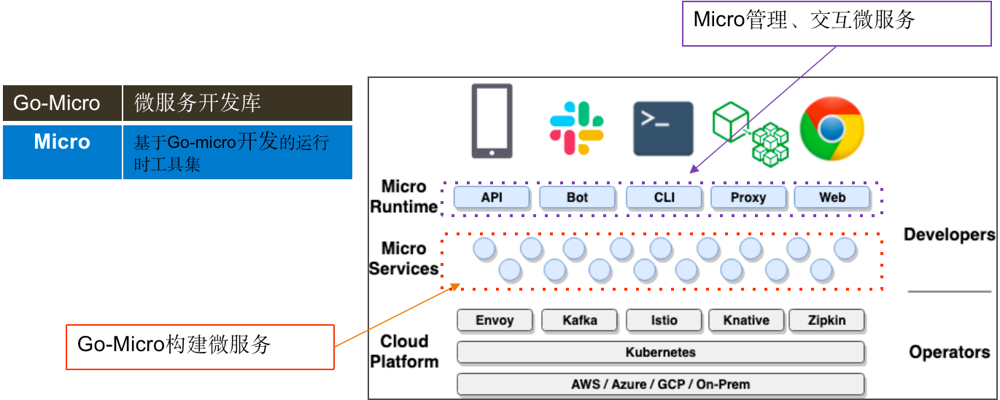

这是基于Go-Micro框架构建的微服务架构模型，我们只用关心红色圈与紫色圈中的那部分，基建部分不用关心。Micro本身也是由Go-Micro编写，故而Micro自身也是一个服务。

Micro 工具集套件有 API，Bot，CLI，Proxy，Web

**API**

功能：将 Http 请求转向内部应用

API 网关一共有 5 种类型：

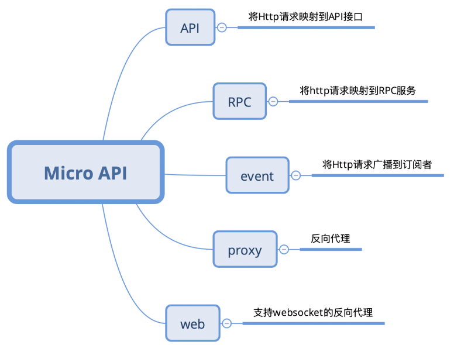

**Web**

功能：Web 反向代理与管理控制台

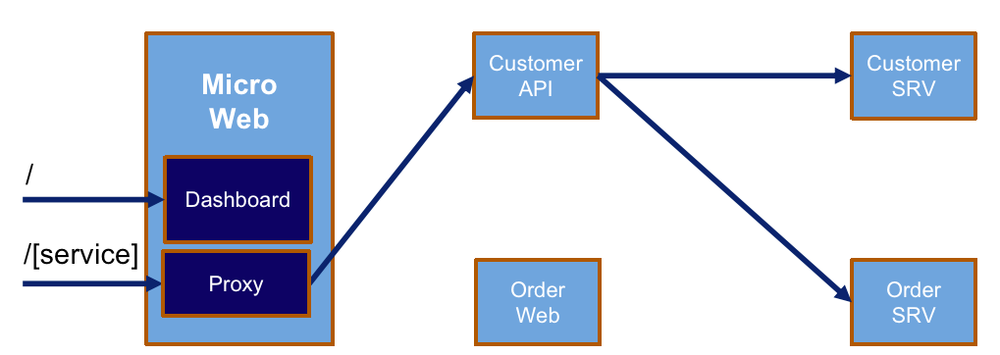

**Proxy**

功能：代理 Micro 风格的请求，支持异构系统只需要==瘦客户端==便可调用 Micro 服务

> 瘦客户端指在客户端-服务器网络体系中的一个基本无需应用程序的计算哑终端
>
> 与 Micro API 不同的是 Proxy 只处理 Micro 风格的 RPC 请求，而非 Http 请求

**CLI**

功能：以命令行操控 Micro 服务

执行：`micro help` 了解更多

**Bot**

功能：与常见的通信软件对接，负责传送信息，远程指令等操作

## 框架组成

go-micro 框架主要由以下模块组成：

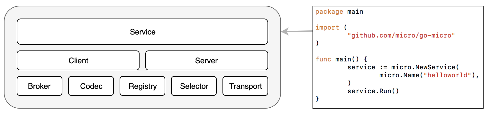

**Service**：

具体实例化的服务，包含两个重要组件 `Client`，`Server`

* Client：发送 RPC 请求和广播信息
* Server：接收 RPC 请求和消费信息

**Plugins**

* Broker：异步通信组件
* Codec：数据编码组件。支持格式包含 json，bson，protobuf，msgpack 等
* Registry：服务注册组件，提供服务发现机制（默认为 Consul，最新默认为 mdns）
* Selector：客户端均衡器，用于控制负载均衡，
* Transport：同步通信组件

各个组件调用关系：

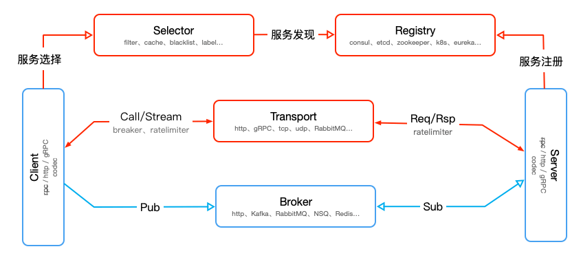

### Broker

Broker 是一个异步消息组件，可用于在 Go Micro 微服体系中通过事件驱动实现基于发布/订阅机制的异步通信

通过 HTTP，MQ 来实现异步消息

其代码接口如下

```go
type Broker interface {
   Options() Options
   Address() string
   Connect() error
   Disconnect() error
   Init(...Option) error
   Publish(string, *Message, ...PublishOption) error
   Subscribe(string, Handler, ...SubscribeOption) (Subscriber, error)
   String() string
}
```

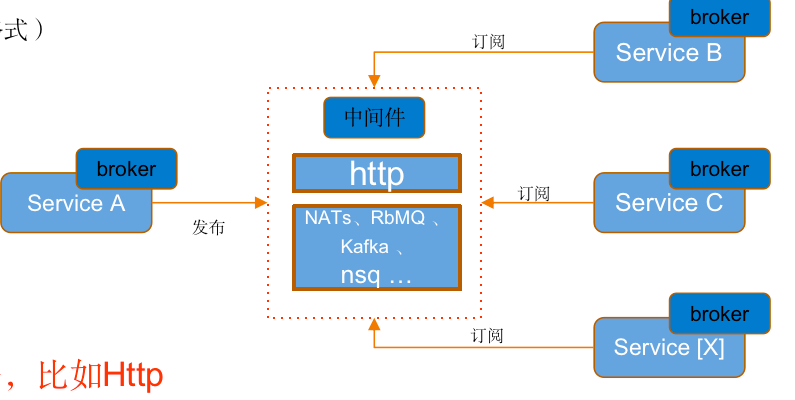

> 中间件不一定是消息服务

### Registry

服务注册组件，用于服务发现

```go
type Registry interface {
   Register(*Service, ...RegisterOption) error
   Deregister(*Service) error
   GetService(string) ([]*Service, error)
   ListServices() ([]*Service, error)
   Watch(...WatchOption) (Watcher, error)
   String() string
   Options() Options
}
```

目前服务注册发现的组件有：

1. 基于通用型注册中心，如Etcd、Consul、Zookeeper、Eureka
2. 基于网络广播，如mDNS、Gossip
3. 基于消息中间件，如NATs

### Seletor

选择器组件，用于负载均衡

目前默认支持两种选择算法：随机和轮询

### Transport

同步请求组件用于微服务的传输层，Go Micro 默认支持基于 HTTP 和 gRPC 协议进行通信，此外还可以通过 Go Plugins 引入 RabbitMQ、TCP、UDP、NATS 等协议支持，和 Registry 组件类似，我们可以通过系统环境变量 `MICRO_TRANSPORT` 或者命令行参数 `--transport` 指定传输协议，如果不设置的话默认使用 HTTP 传输协议。

 

## go-micro 编写微服务

 首先需要安装 `protobuf` 和 `grpc` 环境，可以参考 [RPC与Protobuf](./RPC和Protobuf.md) ，然后安装 go-micro 编译器组件

```shell
go get github.com/micro/protoc-gen-micro/v2
```

创建项目，包含用户服务和订单服务（实际上一个微服务就是一个独立的项目）

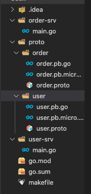

首先需要编写，order 和 user 的 proto 接口文件

```protobuf
// order.proto
syntax = "proto3";

package order;
// module/proto/dirname
option go_package = "micro-learning/user/proto/order";

message GetOrderRequest {
    int32 id = 1;
}

message Order {
    int32 id = 1;
    string name = 2;
    double price = 3;
    string username = 4;
    string address = 5;
    string phone = 6;
    string createTime = 7;
}
// 定义 order 服务接口
service OrderSrv {
	// 获取订单信息接口
    rpc GetOrder(GetOrderRequest) returns (Order);
}
```

```protobuf
// user.proto
syntax = "proto3";

package user;
option go_package="micro-learning/user/proto/user";
// 获取账号信息的请求消息
message GetAccountRequest {
  int32 id = 1;
}
// 用户账号信息
message Account {
  int32 id = 1;
  string username = 2;
  string address = 3;
  string phone = 4;
}
// 用户服务
service UserSrv {
  // 获取账号信息
  rpc GetAccount(GetAccountRequest) returns (Account);
}
```

接着需要 protoc 编译器，生成 go 语言框架代码，在根目录建立 makefile

```makefile
build:
	protoc -I=. --go_out=paths=source_relative:. --micro_out=paths=source_relative:. ./proto/user/user.proto
	protoc -I=. --go_out=paths=source_relative:. --micro_out=paths=source_relative:. ./proto/order/order.proto
```

编写用户服务和订单服务

```go
// user/main.go
package main

import (
	"context"
	"micro-learning/user/proto/user"

	"github.com/micro/go-micro/v2"
)

// UserServiceHandler 定义用户服务，实现 proto 协议接口
type UserServiceHandler struct {}

// GetAccount 查询账户信息接口
func (u *UserServiceHandler) GetAccount(ctx context.Context, req *user.GetAccountRequest, rsp *user.Account) error {
	rsp.Id = req.Id
	rsp.Address = "天龙区"
	rsp.Phone = "123000"
	rsp.Username = "Hello Micro"
	
	return nil
}

func main() {
	service := micro.NewService(
		micro.Name("go.micro.api.userservices"),
	)
	service.Init()
	
	user.RegisterUserSrvHandler(service.Server(), new(UserServiceHandler))

	if err := service.Run(); err != nil {
		panic(err)
	}
}
```

然后可以编写订单服务，看微服务中订单服务是如何调用用户服务的

```go
// order/main.go
package main

import (
	"context"
	"micro-learning/user/proto/order"
	"micro-learning/user/proto/user"
	"time"

	"github.com/micro/go-micro/v2"
)

// OrderServiceHandler 定义用户服务，实现 proto 协议接口
type OrderServiceHandler struct {}

// service 初始化 micro 服务对象
var service micro.Service

// GetOrder 实时查询订单信息的接口
func (o *OrderServiceHandler) GetOrder(ctx context.Context, req *order.GetOrderRequest, rsp *order.Order) error {
	userID := 1312

	// 初始化用户服务对象
	userSrv := user.NewUserSrvService("go.micro.api.userservices", service.Client())

	// 调用用户服务
	u, err := userSrv.GetAccount(context.TODO(), &user.GetAccountRequest{Id: int32(userID)})
	if err == nil {
		rsp.Username = u.Username
		rsp.Address = u.Address
		rsp.Phone = u.Phone
	}

	rsp.Name = "可乐"
	rsp.Price = 3.0
	rsp.Id = req.Id
	rsp.CreateTime = time.Now().Format(time.RFC3339)
	return nil
}

func main() {
	service = micro.NewService(
		micro.Name("go.micro.api.orderservice"),
	)
	service.Init()

	order.RegisterOrderSrvHandler(service.Server(), new(OrderServiceHandler))
	if err := service.Run(); err != nil {
		panic(err)
	}
}
```

**调试微服务接口**

go micro框架为我们提供了两种调试微服务接口的方法：

- 通过micro命令工具调试服务接口
- 通过micro web后台调试服务接口

调用服务接口命令语法：

```shell
micro call 服务名 接口 参数
```

参数以json的形式提交。

例子：

调用订单服务：go.micro.api.orderservice 的OrderSrv.GetOrder接口，以json的形式传入了一个参数id

```shell
micro call go.micro.api.orderservice OrderSrv.GetOrder '{"id":1}'
```

> 服务名是启动微服务定义的唯一标识，接口格式为：proto 文件定义的 service 名 ＋ rpc 接口名

## 服务发现机制

Go-Micro 的 Register 模块负责服务发现，Go micro 框架以插件的形式内置了几种常用的服务发现组件，分别为 Consul，mDNS，Etcd。

Consul 和 Etcd 都是基于注册中心实现服务发现

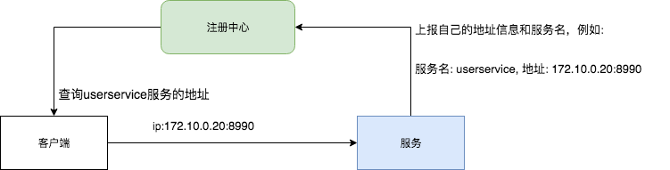

1. 服务启动的时候，主动向注册中间注册自己的服务信息（服务名、Ip、port）
2. 客户端，通过服务名去注册中心，查询服务信息，拿到对应的ip和port，一个**服务名可能查询到多个服务地址**，默认 go micro 框架的 Selector 模块，通过随机算法从多个服务地址中选择一个进行通信（这样也就实现了**负载均衡**处理），然后向服务发起接口调用。

### mDNS

mDNS（多播 DNS）是一种局域网内使用的 DNS 机制，其原理是将主机名解析为不包含本地名称服务器的小型网络中得 IP 地址。它是一种零配置服务。当有新的节点加入局域网的时候，如果打开了mDNS，就主动向局域网其他所有节点广播，自己提供的服务（域名是什么、ip地址是什么、端口号是什么）, 这样我们任何一个节点都知道局域网提供了什么服务。

Go Micro 的默认注册机制为 mDNS。

> 基于 mDNS 的服务发现，不需要任何额外的中间件和配置，适合个人开发做实验。在多人协作开发中，可能会有部分微服务是在云服务器上面，通过 mDNS 无法查询这些服务信息。

### Consul

Consul 是微服务架构中，解决服务器发现、配置中心的分布式中间件。

**特性**

- **服务发现**： 解决在分布式环境中，如何找到可用的服务地址的问题，支持通过DNS和HTTP查询服务地址。
- **健康检查**： 定时监控服务是否正常，对于异常的服务会主动下线。
- **键值存储**： 配置中心解决方案，是一种key/value存储结构，区别就是key是以目录树结构形式组织的，可以用来存储系统配置信息。
- **多数据中心**： 支持多数据中心部署。

**架构**

consul 是分布式、高可用的系统


consul 主要由 client 和 server 两种组件组成，其支持多数据中心，上图有两个 DataCenter，他们通过 internet 互联，但为了提高通信效率，只有 server 节点才加入跨数据中心的通信。

每个 DataCenter 拥有多个 server 和 client 其都称为 Agent，添加多个 server 会提高系统的可用性，但是也会提高各个 server 间通信的成本，推荐 server 数量为 3 个或者 5 个，在 Leader 挂掉时会启动选举机制选取下一个 Leader。

集群内的 Consul 通过 gossip proto（流言协议）维护成员关系，某个节点可以了解集群内现在还有哪些节点，这些节点时 client 还是 server，单个数据中心的流言协议会同时使用 TCP 和 UDP 通信，且都是用 8301 端口。跨数据中心流言协议也同时使用 TCP 和 UDP 通信，且同时使用 8302 端口。

集群内数据的读写请求既可以直接发到Server，也可以通过Client使用RPC转发到Server，请求最终会到达Leader节点，在允许数据轻微陈旧的情况下，读请求也可以在普通的Server节点完成，集群内数据的读写和复制都是通过TCP的8300端口完成。

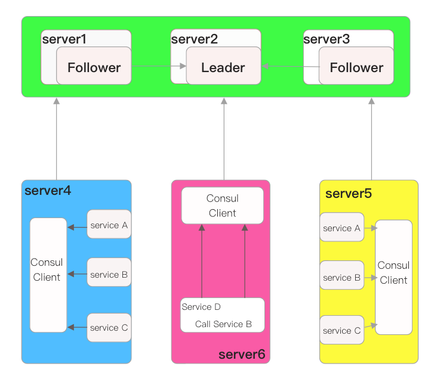

其流程大致如上图，设 Server1-3 都布置了 Consul Server 节点，且选举了 Server2 作为 Leader。那在这些服务器上最好只部署 Consul 程序，以尽量维护 Consul Server 的稳定。

在服务器 Server 4 和 Server5 通过 Consul Client 分别注册 Service A、B、C，每个 Service 分别部署在了两个服务器上，可以避免 Service 的单点问题。服务注册到 Consul 可以使用 HTTP API（8500）端口的方式，也可以通过 Consul 配置文件的方式。Consul Client 可以被认为是无状态的，它将注册信息通过 RPC（8300）端口转发到 Consul Server，服务信息保存到 Server 的各个节点中，通过 **Raft** 实现强一致性

Server6 中，Service D 需要访问 Service B，其首先需要访问本机 Consul Client 提供的 HTTP API，然后被转发到 Consul Server 中，其查询到 Service B 的信息将其返回，然后 Service D 拿到了 B 的所有部署 IP 和端口，那他可以选择其中一个部署发起请求。

**Consul 健康检查**

服务的健康检查由服务注册到的Agent来处理，这个Agent既可以是Client也可以是Server，而当进行健康检查的 Agent 挂掉后不会有其他的 Agent 来接管健康检查。

### Etcd

etcd 是一个开源的可信赖的分布式统一键值存储服务，它能为整个分布式集群存储一些关键数据，协助分布式集群的正常运转。

在分布式系统中，etcd 保存了很多服务配置发现以及配置信息，所以往往会有 3~5 个 etcd 节点构成高可用的集群，其解决分布式一致性问题的方案是共识算法，其采用的是 Raft 算法。

#### Raft

每个 Raft 集群中包含多个服务器，但在任意时刻，每一台服务器只可能处于 `Leader`， `Follower`， `Candidate` 三种状态；正常状态时只会存在一个 Leader，其余的均为 Follower。

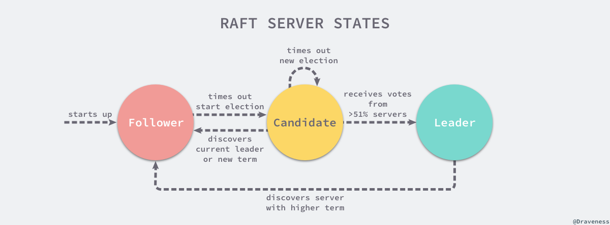

所有的 Follower 节点都是被动的，它们不会主动发出任何的请求，只会响应 Leader 和 Candidate 发出的请求，对于每一个用户的可变操作，都会被路由给 Leader 节点进行处理，除了 Leader 和 Follower 节点之外，Candidate 节点其实只是集群运行过程中的一个临时状态。

Raft 集群中的时间也被切分为不同的任期（Term），每一个任期都会由 Leader 选举开始，选举结束后就会进入正常操作阶段直到 Leader 节点出现问题才会新一轮的选择。

每个服务器都会存储当前集群的最新任期，其就像一个单调递增的逻辑时钟，能够同步各个节点之间的状态，当前节点持有的任期会随着每一个请求被传递到其他节点上。

Raft 协议有三个子问题：节点选举、日志复制以及安全性


接下里会以 etcd 为例介绍 Raft 协议如何解决这三个子问题

#### 节点选举

使用 Raft 协议的 etcd 集群在启动节点时，会遵循 Raft 协议的规则，所有节点一开始都被初始化为 Follower 状态，新加入的节点会在 `NewNode` 中做一些配置的初始化，包括用于接收各种信息的 Channel：

```go
// https://sourcegraph.com/github.com/etcd-io/etcd@1cab49e/-/blob/raft/node.go#L190-225
func StartNode(c *Config, peers []Peer) Node {
	r := newRaft(c)
	r.becomeFollower(1, None)
	r.raftLog.committed = r.raftLog.lastIndex()
	for _, peer := range peers {
		r.addNode(peer.ID)
	}

	n := newNode()
	go n.run(r)
	return &n
}
```

做完初始化和 Raft 配置之后，就会进入一个由 for 和 select 组成的超大型循环

```go
// https://sourcegraph.com/github.com/etcd-io/etcd@1cab49e/-/blob/raft/node.go?utm_source=share#L315
func (n *node) run(r *raft) {
    ...
    lead := node
    for {
        ...
        if lead != r.lead {
            ...
            lead = r.lead
        }
        
        select {
        case m := <-n.recvc:
			r.Step(m)
		case <-n.tickc:
			r.tick()
		case <-n.stop:
			close(n.done)
			return
        }
    }
}
```

代码进行了精简化，因为当前只需要关心三个 Channel 中的消息，也就是用于接受其他节点消息的 `recvc`、用于触发定时任务的 `tickc` 以及用于暂停当前节点的 `stop`。

**定时器和心跳**

当节点从任意状态调用 `becomeFollower` 时，都会将定时器设置为 `tickElection`

```go
// https://sourcegraph.com/github.com/etcd-io/etcd@1cab49e/-/blob/raft/raft.go#L636-643
func (r *raft) tickElection() {
	r.electionElapsed++

	if r.promotable() && r.pastElectionTimeout() {
		r.electionElapsed = 0
		r.Step(pb.Message{From: r.id, Type: pb.MsgHup})
	}
}
```

如果当前节点可以成为 Leader，且上次 Leader 节点的信息或者心跳信息已经超过了等待时间，当前节点就会发送 `pb.MsgHub` 信息尝试开始新的选举。

而如果 Leader 节点再正常运行，就会调用它的定时器 `tickHeartbeat` 向所有节点广播心跳信息，也就是 MsgBeat 类型的 RPC 信息：

```go
func (r *raft) tickHeartbeat() {
	r.heartbeatElapsed++
	r.electionElapsed++

	if r.heartbeatElapsed >= r.heartbeatTimeout {
		r.heartbeatElapsed = 0
		r.Step(pb.Message{From: r.id, Type: pb.MsgBeat})
	}
}
```

当 Follower 接受到了来自 Leader 的 RPC 消息 `MsgHeartbeat` 时，会将当前节点的选举超时时间重置并通过 `handleHeartbeat` 向 Leader 节点发出响应 —— 通知 Leader 当前节点能够正常运行。

而 Candidate 节点接受到该消息后，会先执行 `becomeFollower` 设置当前节点和 Raft 协议设置


如果 Follower 一段时间未接受到 Leader 的心跳请求，当前节点就是会通过 `MsgHup` 消息进入预选举或者选举流程。

**竞选流程**

```go
// https://sourcegraph.com/github.com/etcd-io/etcd@1cab49e/-/blob/raft/raft.go#L785-927
func (r *raft) Step(m pb.Message) error {
  // ...

	switch m.Type {
	case pb.MsgHup:
		if r.state != StateLeader {
			if r.preVote {
				r.campaign(campaignPreElection)
			} else {
				r.campaign(campaignElection)
			}
		} else {
			r.logger.Debugf("%x ignoring MsgHup because already leader", r.id)
		}
	}
  // ...
  return nil
}
```

如果收到 MsgHup 的节点不是 Leader 节点，就会根据当前集群的配置进入 PreELection 或者 Election 阶段，PreElection 节点不会真正增加当前节点的 Term，它的主要作用是得到当前集群能否成功选举出一个 Leader 的答案，防止 Term 无休止增加。

```go
func (r *raft) campaign(t CampaignType) {
	var term uint64
	var voteMsg pb.MessageType
	if t == campaignPreElection {
		r.becomePreCandidate()
		voteMsg = pb.MsgPreVote
		// PreVote RPCs are sent for the next term before we've incremented r.Term.
		term = r.Term + 1
	} else {
		r.becomeCandidate()
		voteMsg = pb.MsgVote
		term = r.Term
	}
	if r.quorum() == r.poll(r.id, voteRespMsgType(voteMsg), true) {
		// We won the election after voting for ourselves (which must mean that
		// this is a single-node cluster). Advance to the next state.
		if t == campaignPreElection {
			r.campaign(campaignElection)
		} else {
			r.becomeLeader()
		}
		return
	}
	for id := range r.prs {
		if id == r.id {
			continue
		}
		r.logger.Infof("%x [logterm: %d, index: %d] sent %s request to %x at term %d",
			r.id, r.raftLog.lastTerm(), r.raftLog.lastIndex(), voteMsg, id, r.Term)

		var ctx []byte
		if t == campaignTransfer {
			ctx = []byte(t)
		}
		r.send(pb.Message{Term: term, To: id, Type: voteMsg, Index: r.raftLog.lastIndex(), LogTerm: r.raftLog.lastTerm(), Context: ctx})
	}
}
```

当前节点会立刻调用 becomeCandidate 将当前节点的 Raft 状态变为候选人；在这之后它会将票投给自己。

如果集群中存在多个节点，就会向集群中的其他节点发出 MsgVote 消息，请求其他节点投票，如果其他节点投的票就是消息的来源或者其他节点没有投票也没有 Leader，那么就会向来源的节点投票，否则就会通知该节点当前节点拒绝投票。

而 Candidate 节点每接收到一个 `MsgVoteResp` 类型的消息，就会将自己的选票加一，如果票数大于法定人数 `quorum`，当前节点就会成为集群中的 Leader 并向其他节点发送当前节点当选的消息，通知其增加 Term。

#### 存储

etcd 目前支持 V2 和 V3 两个大版本，V2 版本是一个纯内存的实现，所有的数据都没有存储在磁盘上，而 V3 版本实例支持了数据的持久化。

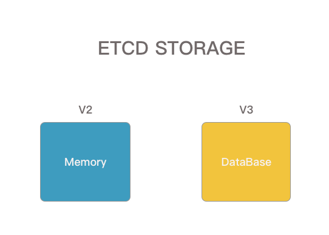

在 V3 版本中， etcd 通过 backend 后端这一设计，很好的封装了存储引擎的实现细节，为上层提供了一个更一致的接口。

```go
// https://sourcegraph.com/github.com/etcd-io/etcd@1cab49e/-/blob/mvcc/backend/backend.go#L51-69
type Backend interface {
	ReadTx() ReadTx
	BatchTx() BatchTx

	Snapshot() Snapshot
	Hash(ignores map[IgnoreKey]struct{}) (uint32, error)
	Size() int64
	SizeInUse() int64
	Defrag() error
	ForceCommit()
	Close() error
}
```

etcd 内部使用的是开源的嵌入式键值存储数据库 `bolt`，首先可以看下 etcd 内部实现 Backend 的 backend 结构体

```go
// https://sourcegraph.com/github.com/etcd-io/etcd@1cab49e/-/blob/mvcc/backend/backend.go#L80-104
type backend struct {
	size int64
	sizeInUse int64
	commits int64

	mu sync.RWMutex
	db *bolt.DB

	batchInterval time.Duration
	batchLimit    int
	batchTx       *batchTxBuffered

	readTx *readTx

	stopc chan struct{}
	donec chan struct{}

	lg *zap.Logger
}
```

其中 db 可以看出其使用了 `BoltDB` 作为底层存储、另外两个 `readTx` 和 `batchTx` 分别实现了 ReadTx 和 BatchTx 接口

```go
// https://sourcegraph.com/github.com/etcd-io/etcd@1cab49e/-/blob/mvcc/backend/read_tx.go#L30-36
type ReadTx interface {
	Lock()
	Unlock()

	UnsafeRange(bucketName []byte, key, endKey []byte, limit int64) (keys [][]byte, vals [][]byte)
	UnsafeForEach(bucketName []byte, visitor func(k, v []byte) error) error
}

// https://sourcegraph.com/github.com/etcd-io/etcd@1cab49e/-/blob/mvcc/backend/batch_tx.go#L28-38
type BatchTx interface {
	ReadTx
	UnsafeCreateBucket(name []byte)
	UnsafePut(bucketName []byte, key []byte, value []byte)
	UnsafeSeqPut(bucketName []byte, key []byte, value []byte)
	UnsafeDelete(bucketName []byte, key []byte)
	Commit()
	CommitAndStop()
}
```

 可以看出这两个接口可以对外提供数据库的读写操作，而 Backend 能对这两者提供的方法进行封装，为上层屏蔽存储的具体实现：


每当使用 `newBackend` 创建新的结构体时，都会创建一个 readTx 和 batchTx 结构体，一个只负责只读请求，另一个负责处理读写请求：

```go
// https://sourcegraph.com/github.com/etcd-io/etcd@1cab49e/-/blob/mvcc/backend/backend.go#L137-176
func newBackend(bcfg BackendConfig) *backend {
	bopts := &bolt.Options{}
	bopts.InitialMmapSize = bcfg.mmapSize()
	db, _ := bolt.Open(bcfg.Path, 0600, bopts)

	b := &backend{
		db: db,
		batchInterval: bcfg.BatchInterval,
		batchLimit:    bcfg.BatchLimit,
		readTx: &readTx{
			buf: txReadBuffer{
				txBuffer: txBuffer{make(map[string]*bucketBuffer)},
			},
			buckets: make(map[string]*bolt.Bucket),
		},
		stopc: make(chan struct{}),
		donec: make(chan struct{}),
	}
	b.batchTx = newBatchTxBuffered(b)
	go b.run()
	return b
}
```

​	在进行了初始化后，就会开一个 goroutine 异步的对所有批量读写事务就行定时提交

```go
// https://sourcegraph.com/github.com/etcd-io/etcd@1cab49e/-/blob/mvcc/backend/backend.go#L289-305
func (b *backend) run() {
	defer close(b.donec)
	t := time.NewTimer(b.batchInterval)
	defer t.Stop()
	for {
		select {
		case <-t.C:
		case <-b.stopc:
			b.batchTx.CommitAndStop()
			return
		}
		if b.batchTx.safePending() != 0 {
			b.batchTx.Commit()
		}
		t.Reset(b.batchInterval)
	}
}
```

对于上层来说，`backend` 其实只是对底层存储的一个抽象，很多时候并不会直接跟它打交道，往往都是使用它持有的 `ReadTx` 和 `BatchTx` 与数据库进行交互。

##### 只读事务

目前大多数的数据库对于只读类型的事务没有什么限制，尤其是 MVCC 之后，所有只读请求不会被写请求锁住，这大大提升了读的效率。由于 etcd 在 BoltDB 的同一个 goroutine 中开启了两个相互依赖的只读事务和读写事务会发生死锁，为了避免这种情况，etcd 还引入了 `sync.RWLock` 保证死锁不会出现：

```go
// https://sourcegraph.com/github.com/etcd-io/etcd@1cab49e/-/blob/mvcc/backend/read_tx.go#L38-47
type readTx struct {
	mu  sync.RWMutex
	buf txReadBuffer

	txmu    sync.RWMutex
	tx      *bolt.Tx
	buckets map[string]*bolt.Bucket
}
```

你可以看到在整个结构体中，除了用于保护 `tx` 的 `txmu` 读写锁之外，还存在另外一个 `mu` 读写锁，它的作用是保证 `buf` 中的数据不会出现问题，`buf` 和结构体中的 `buckets` 都是用于加速读效率的缓存。


对于一个 readTx 来说，对上层提供了两个获取存储引擎中数据的结构分别是 `UnsafeRange` 和 `UnsafeForEach`。

其中 `UnsafeRange` 会先从自己持有的缓存 `txReadBuffer` 中读取数据，如果不满足要求则会从 `buckets` 缓存中查找对应的 `BoltDB bucket` 并从 `BoltDB` 数据库中读取。

在 etcd 中无论我们想要去获取单个 key 或者是范围 key 都是最终都是通过 Range 来实现的，这是只读事务的最主要功能

##### 读写事务

只读事务只提供了读数据的能力，包括 `UnsafeRange` 和 `UnsafeForeach`，而读写事务 `BatchTx` 提供的就是读和写数据的能力了：

```go
// https://sourcegraph.com/github.com/etcd-io/etcd@1cab49e/-/blob/mvcc/backend/batch_tx.go#L40-46
type batchTx struct {
	sync.Mutex
	tx      *bolt.Tx
	backend *backend

	pending int
}
```

读写事务同时提供了不带缓存的 `batchTx` 实现以及带缓存的 `batchTxBuffered` 实现，后者其实『继承了』前者的结构体，并额外加入了缓存 `txWriteBuffer` 加速读请求：

```go
// https://sourcegraph.com/github.com/etcd-io/etcd@1cab49e/-/blob/mvcc/backend/batch_tx.go#L243-246
type batchTxBuffered struct {
	batchTx
	buf txWriteBuffer
}
```

当我们向 etcd 中写入数据时，最终都会调用 `batchTx` 的 `unsafePut` 方法将数据写入到 BoltDB 中，就是调用了 BoltDB 提供的 API 操作一下 bucket 中的数据，而另一个删除方法的实现与这个也差不多。

它们都是通过 `Bolt.Tx` 找到对应的 `Bucket`，然后做出相应的增删操作，但是这写请求在这两个方法执行后其实并没有提交，我们还需要手动或者等待 etcd 自动将请求提交：

```go
// https://sourcegraph.com/github.com/etcd-io/etcd@1cab49e/-/blob/mvcc/backend/batch_tx.go#L184-188
func (t *batchTx) Commit() {
	t.Lock()
	t.commit(false)
	t.Unlock()
}

// https://sourcegraph.com/github.com/etcd-io/etcd@1cab49e/-/blob/mvcc/backend/batch_tx.go#L210-241
func (t *batchTx) commit(stop bool) {
	if t.tx != nil {
		if t.pending == 0 && !stop {
			return
		}

		start := time.Now()

		err := t.tx.Commit()

		rebalanceSec.Observe(t.tx.Stats().RebalanceTime.Seconds())
		spillSec.Observe(t.tx.Stats().SpillTime.Seconds())
		writeSec.Observe(t.tx.Stats().WriteTime.Seconds())
		commitSec.Observe(time.Since(start).Seconds())
		atomic.AddInt64(&t.backend.commits, 1)

		t.pending = 0
	}
	if !stop {
		t.tx = t.backend.begin(true)
	}
}
```

在每次调用 `Commit` 对读写事务进行提交时，都会先检查是否有等待中的事务，然后会将数据上报至 Prometheus 中，其他的服务就可以将 Prometheus 作为数据源对 etcd 的执行状况进行监控了。


## Micro 工具集

### Micro API

1. Go-Micro风格服务的网关，负责代理外部请求

2. 不提供统一的接入层，针对不同的微服务类型，提供不同的网关接入{ **HTTP、RPC、API、Event** }

3. 默认基于服务命名空间自动路由，支持 { **Namespace、Host、GRPC** }

| **类型**        | **说明**                                                     |
| --------------- | ------------------------------------------------------------ |
| rpc             | 通过RPC向go-micro应用转送请求，**只支持**Get/Post。GET转发RawQuery，POST转发Body |
| api             | 与rpc差不多，但是会把完整的http头封装向下传送，**不限制**请求方法 |
| http/proxy，web | 以反向代理的方式使用API，相当于把普通的web应用部署在API之后，让外界像调api接口一样调用web服务，web**显式**支持websocket |
| event           | 代理event事件服务类型的请求                                  |
| meta            | 默认值，元数据，通过在代码中的Endpoint配置选择使用上述中的某一个处理器，默认RPC |

调用基于命名空间

```go
func main() {
    service := micro.NewService(
        micro.Name("go.micro.api.learning"),
    )
}
```

解析器接口：go-micro/api/resolver

默认实现：基于命名空间映射服务， go-micro/api/resolver/micro/route.go#apiRoute

设定 micro api namespace 为：go.micro.api 那么

| **http路径**         | **后台服务**             | **接口方法** |
| -------------------- | ------------------------ | ------------ |
| /learning/hi         | go.micro.api.learning    | Learning.Hi  |
| /learning/greeter/hi | go.micro.api.learning    | Greeter.Hi   |
| /v2/learning/hi      | go.micro.api.v2.learning | Learning.Hi  |

其中 proto 文件为：

```protobuf
syntax = "proto3";

package learning;
option go_package="micro-learning/micro-api/proto/learning";

service Greeter {
    rpc Hi(Request) returns (Response) {};
}

service Learning {
    rpc Hi(Request) returns (Response) {};
}

message Request {
    string name = 1;
}

message Response {
    string msg = 1;
}
```

### Micro CLI

功能：基于命令行，与Go-Micro服务交互。

主要功能：

1. 服务列表 (micro list services)

2. 服务信息与状态 (micro health/get service xxx)

3. 上下线服务(micro register/deregister)

4. 调用服务

### Micro Web

Micro Web 是一个可视化的调试管理控制台，Go-Micro 风格的 Web 服务反向代理

启动指令： `micro web`


### Micro Proxy

功能：提供访问Go-Micro服务代理

启动命令：micro proxy

它与Micro API不一样的地方在于，API将Go-Micro服务暴露为Http接口，而Proxy的职责则是为不同网络之间Go-Micro服务提供入口互相访问的入口。所以Proxy是可以选择代理的协议的（mucp，grpc，http）

