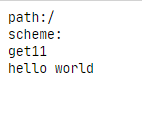

# 基本使用

## 获取 URL 参数或者表单参数的使用

```go
package main

import (
	"io"
	"log"
	"net/http"
)

func helloWorld(w http.ResponseWriter, r *http.Request) {
	r.ParseForm()
	io.WriteString(w, "path:" + r.URL.Path + "\n")
	io.WriteString(w, "scheme:" + r.URL.Scheme + "\n")
	io.WriteString(w, "get" + r.URL.Query().Get("id") + "\n")
	w.Write([]byte("hello world"))
}

func main() {
	http.HandleFunc("/", helloWorld)
	err := http.ListenAndServe(":8080", nil)
	if err != nil {
		log.Fatal("Listen err:", err)
	}
}
```

首先在 `helloworld` 中或者表单值，以及提交的 `get` 值， 在 `main` 函数 中调用了 `http.HandleFunc` 来绑定函数调用，随后启动监听端口来进行服务。



因此可以得到 Go 的 `net/http` 包 Web 服务的基本流程

1. 创建 Listen Socket 监听端口，等待请求
2. 接受请求后，与客户端建立通信
3. 使用 `HandleFunc` 来响应客户端的请求


# 源码分析

## 服务器

### 路由注册过程

接下来从源码角度分析，`net/http` 做了什么事情，首先是 `HandleFunc` 是如何绑定路由以及处理函数的

```go
// server.go
func HandleFunc(pattern string, handler func(ResponseWriter, *Request)) {
	DefaultServeMux.HandleFunc(pattern, handler)
}
...
func (mux *ServeMux) HandleFunc(pattern string, handler func(ResponseWriter, *Request)) {
	if handler == nil {
		panic("http: nil handler")
	}
	mux.Handle(pattern, HandlerFunc(handler))
}
...
func (mux *ServeMux) Handle(pattern string, handler Handler) {
	mux.mu.Lock()
	defer mux.mu.Unlock()

	if pattern == "" {
		panic("http: invalid pattern")
	}
	if handler == nil {
		panic("http: nil handler")
	}
	if _, exist := mux.m[pattern]; exist {
		panic("http: multiple registrations for " + pattern)
	}

	if mux.m == nil {
		mux.m = make(map[string]muxEntry)
	}
	e := muxEntry{h: handler, pattern: pattern}
	mux.m[pattern] = e
	if pattern[len(pattern)-1] == '/' {
		mux.es = appendSorted(mux.es, e)
	}

	if pattern[0] != '/' {
		mux.hosts = true
	}
}
```

`HandleFunc` 调用内部函数，在 `DefaultServeMux.HandleFunc` 注册匹配函数，其首先进行判断处理函数是否为空，不为空则调用核心函数 `Handle` 来处理注册请求，`Handle` 函数会将路由和处理函数建立一个哈希，将 Pattern 映射 HandleFunc，HTTP 服务器后续处理请求时，则直接查询该哈希 `m`


然后观察一下 `ServeMux` 结构体的定义

```go
type ServeMux struct {
    // 用于并发的读写锁
	mu    sync.RWMutex
    // 存储 muxEntry 的 map，key 为 patterm (/hello/world)
	m     map[string]muxEntry
    // 从最长到最短排序的 muxEntry 切片
	es    []muxEntry 
    // 判断是否包含主机名
	hosts bool 
}
type muxEntry struct {
    // h 为处理路由函数
	h       Handler
    // pattern 为匹配路由
	pattern string
}

type Handler interface {
	ServeHTTP(ResponseWriter, *Request)
}
```

简单来说，`ServeMux` 存放了不同 pattern 所对应的 Handler。

### 处理请求

`net/http` 包中提供 `ListenAndServe` 来监听 TCP 连接并处理请求

```go
func ListenAndServe(addr string, handler Handler) error {
	server := &Server{Addr: addr, Handler: handler}
	return server.ListenAndServe()
}
...
func (srv *Server) ListenAndServe() error {
	if srv.shuttingDown() {
		return ErrServerClosed
	}
	addr := srv.Addr
	if addr == "" {
		addr = ":http"
	}
	ln, err := net.Listen("tcp", addr)
	if err != nil {
		return err
	}
	return srv.Serve(ln)
}
```

该函数初始化一个 `Server` 并调用 `server.ListenAndServe()`，而该函数会使用 `Listen` 来监听 TCP 连接端口，最后在调用 `Serve` 方法来处理请求。

```go
func (srv *Server) Serve(l net.Listener) error {
    
	origListener := l
	l = &onceCloseListener{Listener: l}
	defer l.Close()

	if !srv.trackListener(&l, true) {
		return ErrServerClosed
	}
	defer srv.trackListener(&l, false)

	baseCtx := context.Background()

	var tempDelay time.Duration // how long to sleep on accept failure

	ctx := context.WithValue(baseCtx, ServerContextKey, srv)
	for {
		rw, err := l.Accept()
		if err != nil {
			select {
			case <-srv.getDoneChan():
				return ErrServerClosed
			default:
			}

			return err
		}
		connCtx := ctx

		c := srv.newConn(rw)
		c.setState(c.rwc, StateNew) // before Serve can return
		go c.serve(connCtx)
	}
}
```

其核心代码在于，创建完每个服务端连接后，标准库为每个 HTTP 请求创建独立的 goroutine 来使用 `serve` 方法处理请求，如果请求过多，服务器会在内部创建大量的 goroutine 来进行处理，会明显降低服务器处理请求速度。

`serve` 代码简化为（删除大量判断）

```go
func (c *conn) serve(ctx context.Context) {
	c.remoteAddr = c.rwc.RemoteAddr().String()
	ctx = context.WithValue(ctx, LocalAddrContextKey, c.rwc.LocalAddr())
	// HTTP/1.x from here on.

	ctx, cancelCtx := context.WithCancel(ctx)
	c.cancelCtx = cancelCtx
	defer cancelCtx()

	c.r = &connReader{conn: c}
	c.bufr = newBufioReader(c.r)
	c.bufw = newBufioWriterSize(checkConnErrorWriter{c}, 4<<10)

	for {
		w, err := c.readRequest(ctx)

		// Expect 100 Continue support
		req := w.req

		c.curReq.Store(w)


		serverHandler{c.server}.ServeHTTP(w, w.req)
		w.cancelCtx()
		if c.hijacked() {
			return
		}
		w.finishRequest()

	}
}
```

`serve` 代码主要作用为，处理 HTTP 请求以及调用完成请求，读取 HTTP Request 使用 ` c.readRequest(ctx)` 该方法构建一个新的 `response` 

```go
w = &response{
    conn:          c,
    cancelCtx:     cancelCtx,
    req:           req,
    reqBody:       req.Body,
    handlerHeader: make(Header),
    contentLength: -1,
    closeNotifyCh: make(chan bool, 1),

    // We populate these ahead of time so we're not
    // reading from req.Header after their Handler starts
    // and maybe mutates it (Issue 14940)
    wants10KeepAlive: req.wantsHttp10KeepAlive(),
    wantsClose:       req.wantsClose(),
}
```

然后调用 `newBufioWriterSize` ，将数据写入到缓冲区中，初始化后返回 `http.ResponseWriter` 即可用于处理 HTTP 请求，调用 `ServerHTTP` 函数

```go
func (mux *ServeMux) ServeHTTP(w ResponseWriter, r *Request) {
	if r.RequestURI == "*" {
		if r.ProtoAtLeast(1, 1) {
			w.Header().Set("Connection", "close")
		}
		w.WriteHeader(StatusBadRequest)
		return
	}
	h, _ := mux.Handler(r)
	h.ServeHTTP(w, r)
}
...
func (mux *ServeMux) handler(host, path string) (h Handler, pattern string) {
	mux.mu.RLock()
	defer mux.mu.RUnlock()

	// Host-specific pattern takes precedence over generic ones
	if mux.hosts {
		h, pattern = mux.match(host + path)
	}
	if h == nil {
		h, pattern = mux.match(path)
	}
	if h == nil {
		h, pattern = NotFoundHandler(), ""
	}
	return
}
```

最终会调用 `mux.match`函数

```go
func (mux *ServeMux) match(path string) (h Handler, pattern string) {
	// Check for exact match first.
	v, ok := mux.m[path]
	if ok {
		return v.h, v.pattern
	}

	// Check for longest valid match.  mux.es contains all patterns
	// that end in / sorted from longest to shortest.
	for _, e := range mux.es {
		if strings.HasPrefix(path, e.pattern) {
			return e.h, e.pattern
		}
	}
	return nil, ""
}
```

该函数遍历路由注册过程中的哈希 `m ` 并按照规则进行匹配返回。


## 客户端

客户端主要由以下结构体构成

```go
client.go
type Client struct {
    // 事务用于支持 HTTP/HTTPS 请求和 HTTP 代理，默认为 DefaultTransport
	Transport RoundTripper
    // 指定重定向策略
	CheckRedirect func(req *Request, via []*Request) error
    // Jar 用于管理使用 cookie
	Jar CookieJar
	Timeout time.Duration
}
```


服务端用于处理请求并返回相应，客户端则是构建请求等待响应。

### 构建请求

 `http.Request`

```go
// request.go
type Request struct {
	// HTTP 请求方法
	Method string

	// HTTP 请求 url
	URL *url.URL

	// 协议版本
	Proto      string // "HTTP/1.0"
	ProtoMajor int    // 1
	ProtoMinor int    // 0
	// 请求头
	Header Header
	// 请求体
	Body io.ReadCloser
......
	// HTTP Response 
	Response *Response
	ctx context.Context
}

```

其初始化方法为 `NewRequestWithContext`

```go
req := &Request{
    ctx:        ctx,
    Method:     method,
    URL:        u,
    Proto:      "HTTP/1.1",
    ProtoMajor: 1,
    ProtoMinor: 1,
    Header:     make(Header),
    Body:       rc,
    Host:       u.Host,
}
```

主要为对 HTTP 请求字段进行校验并将输入的参数拼接为新的结构体


### 请求

`net/http` 中的 `Transport` 主要实现了 `RoundTripper` 接口中的 `roundTrip` 函数，主要用于发送 HTTP 请求。

其主要为首先判断 URL协议，并寻找对应的 `RoundTripper` 实现，然后调用 `pconn.roundTrip(treq)` 函数获取缓存的链接或者是创建一个新链接。

```go
// transport.go
// 用于判断是否创建了自定义 roundTrip 
if altRT := t.alternateRoundTripper(req); altRT != nil {
    if resp, err := altRT.RoundTrip(req); err != ErrSkipAltProtocol {
        return resp, err
    }
}
// 获取缓存链接或者创建新链接
pconn, err := t.getConn(treq, cm)
if pconn.alt != nil {
    // HTTP/2 path.
    t.setReqCanceler(req, nil) // not cancelable with CancelRequest
    resp, err = pconn.alt.RoundTrip(req)
} else {
    resp, err = pconn.roundTrip(treq)
}

// pconn.roundTrip 通过 channel 来获取新 tcp 连接
resc := make(chan responseAndError)
pc.reqch <- requestAndChan{
    req:        req.Request,
    ch:         resc,
    addedGzip:  requestedGzip,
    continueCh: continueCh,
    callerGone: gone,
}
```

其中 `transport.getConn`为获取连接的方法，其主要通过两种方式来获取用于发送请求的链接

```go
// 排队等候空闲连接
if delivered := t.queueForIdleConn(w); delivered {
    pc := w.pc
    // Trace only for HTTP/1.
    // HTTP/2 calls trace.GotConn itself.
    if pc.alt == nil && trace != nil && trace.GotConn != nil {
        trace.GotConn(pc.gotIdleConnTrace(pc.idleAt))
    }
    // set request canceler to some non-nil function so we
    // can detect whether it was cleared between now and when
    // we enter roundTrip
    t.setReqCanceler(req, func(error) {})
    return pc, nil
}
// 队列等待建立连接
t.queueForDial(w)
select {
    case <-w.ready:
    return w.pc, w.err
}
```

其中 `queueForDial`  为等候连接，一旦空闲，便会开启一个新 `goroutine` 通过调用 `dialConnFor` 来建立新连接

```go
func (t *Transport) queueForDial(w *wantConn) {
	if n := t.connsPerHost[w.key]; n < t.MaxConnsPerHost {
		if t.connsPerHost == nil {
			t.connsPerHost = make(map[connectMethodKey]int)
		}
		t.connsPerHost[w.key] = n + 1
		go t.dialConnFor(w)
		return
	}
}
```

而 `dialConnFor` 最终调用 `dialConn` 来真正建立连接

```go
func (t *Transport) dialConn(ctx context.Context, cm connectMethod) (pconn *persistConn, err error) {
    pconn = &persistConn{
		t:             t,
		cacheKey:      cm.key(),
		reqch:         make(chan requestAndChan, 1),
		writech:       make(chan writeRequest, 1),
		closech:       make(chan struct{}),
		writeErrCh:    make(chan error, 1),
		writeLoopDone: make(chan struct{}),
	}
    ...
    if cm.scheme() == "https" && t.hasCustomTLSDialer() {
    } else {
        conn, err := t.dial(ctx, "tcp", cm.addr())
    }
    ...
    pconn.br = bufio.NewReaderSize(pconn, t.readBufferSize())
	pconn.bw = bufio.NewWriterSize(persistConnWriter{pconn}, t.writeBufferSize())

	go pconn.readLoop()
	go pconn.writeLoop()
    return pconn, nil
}
```

建立 tcp 连接后，还会开启两个 `goroutine` `pconn.readLoop(), pconn.writeLoop()` 会监听写入或读取 tcp 数据。

而 `readLoop()`核心是通过 `readResponse` 来读取 `HTTP` 请求

```go
var resp *Response
if err == nil {
    resp, err = pc.readResponse(rc, trace)
} else {
    err = transportReadFromServerError{err}
    closeErr = err
}
```

`writeLoop()` 中也是调用 `write` 方法写入数据

```go
err := wr.req.Request.write(pc.bw, pc.isProxy, wr.req.extra, pc.waitForContinue(wr.continueCh))
```

