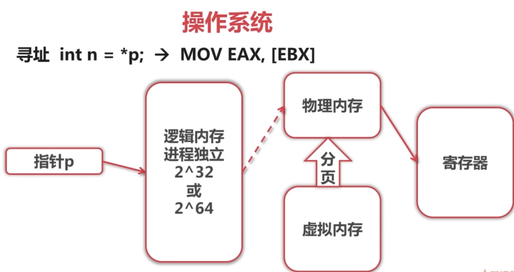

# Go 语言相关

## 语法问题

### 1. Golang 如何创建一个 map

Map 是一种无序的键值对集合，可以通过 key 来快速检索数据。他是无序的，因为是使用 hash 表来实现的

```go
// 使用声明变量来创建
var map_var map[key_data_type]value_data_type
// 使用 make 函数来创建
map_var := make(map[key_data_type]value_data_type)
```

### 2. Golang 初始化顺序

 编译时, 根据 import 先后顺序执行, 先初始化常量再变量然后是 `init` 函数, 最后是 `main` 函数   

### 3. interface  和 nil 的区别

interface 底层有两个成员来实现, 一个是 type 一个是 data, 只有两个都为 `nil` 的时候才能判断为 `nil`. interface 判空: 

在知道类型可以使用, `ai, ok := i.(*int) ai == nil` 

不知道的话需要用反射来判断类型

 1. ```go
    func IsNil(i interface{}) bool {
        defer func() {
            recover()
        }()
        vi := reflect.ValueOf(i)
        return vi.IsNil()
    }
    
    // 不使用 defer recover
    func IsNil(i iterface{}) bool {
        vi := reflect.ValueOf(i)
        if vi.Kind() == reflect.Ptr {
            return vi.IsNil()
        }
        return false
    }
    ```


### 4. 并发安全的 Map : 加锁以及 sync.Map{} 的实现

| 实现方式    | 原理                                                         | 适用场景                                                     |
| ----------- | ------------------------------------------------------------ | ------------------------------------------------------------ |
| map+Mutex   | 通过Mutex互斥锁来实现多个goroutine对map的串行化访问          | 读写都需要通过Mutex加锁和释放锁，适用于读写比接近的场景      |
| map+RWMutex | 通过RWMutex来实现对map的读写进行读写锁分离加锁，从而实现读的并发性能提高 | 同Mutex相比适用于读多写少的场景                              |
| sync.Map    | 底层通分离读写map和原子指令来实现读的近似无锁，并通过延迟更新的方式来保证读的无锁化 | 读多修改少，元素增加删除频率不高的情况，在大多数情况下替代上述两种实现 |

### slice 和 array 的区别

1. `array` 是固定长度的数组，使用前需要确定数组的长度。`array` 是值类型, 如果将数组值付给另一个数组, 实际上是整个数组拷贝一份.
    1. `array` 作为函数传递,传递的是数组的拷贝, 而不是数组的指针
    2. `array` 长度也是 type 的一部分 `[10]int` 和 `[20]int` 是不同的
2. `slice` 是一个引用类型, 是一个动态的指向数组切片的指针
    1. 是不定长的, 总是指向底层数组 `array` 的数据结构
    2. 扩容机制和 `vector` 相似, 1024字节下每次`cap`增加一倍, 1024 以上增加 $\frac{1}{4}$  

 


## 协程问题

### 1. Golang 的 channel

Go 的 channel 来源于 CSP 模型（并发执行的实体组成，实体之间通过发送消息进行通信），Channel 是 Go 的一个核心类型，可以看成是一个管道，通过它并发核心单元可以进行发送或者接受数据进行通讯

```go
// 创建 channel
bufferChan := make(chan int, N) // 缓冲 channel
unBufferChan := make(chan int) //无缓冲 channel
```

如果没有 make 会出现 dead lock 错误：

```go
fatal error: all goroutines are asleep - deadlock!

goroutine 1 [chan receive (nil chan)]:
```

>   channel 分为无缓冲 channel 和有缓冲 channel。两者的区别如下：
>
>   *   无缓冲：发送和接收动作是同时发生的。如果没有 goroutine 读取 channel （<- channel），则发送者 (channel <-) 会一直阻塞。
>   *   缓冲：缓冲 channel 类似一个有容量的队列。当队列满的时候发送者会阻塞；当队列空的时候接收者会阻塞。


### 2. Go 的协程

​    协程为非抢占式调度。用户态模拟进程线程的切换的具体实现，并非 OS 内核提供的功能。有程序员主动控制协程之间的切换。

   golang 提供一种基于消息机制而非共享内存的通信模型。

   消息机制认为每个并发单元都是自包含的独立个体，并且拥有自己的变量，但在不同并发单元间这些变量不共享。每个并发单元输入输出都是消息。


### 3. 创建多个 goroutine 在多核的情况下是如何分配的

首先多核分配多个 goroutine 分别进行执行，如果一个核 M 在执行完后，该核上下文 P 会定期检查全局 runqueue 中的 goroutine，如果有则加入到自己的 runqueue 中进行执行，如果没有，则从其他运行中的 P 中 runqueue 中偷取一半 goroutine 到自己队列中，如果未获取到则会停止这个 M。


### 4.并发协程如何优雅退出

1. for-range 结构退出:

    ```go
    go func(in <-chan int) {
        // Using for-range to exit goroutine
        // range has the ability to detect the close/end of a channel
        for x := range in {
            fmt.Printf("Process %d\n", x)
        }
    }(inCh)
    ```

2. for-select 结构退出

    1. 使用 ok 来退出

    ```go
    go func() {
    	// in for-select using ok to exit goroutine
    	for {
    		select {
    		case x, ok := <-in:
    			if !ok {
    				return
    			}
    			fmt.Printf("Process %d\n", x)
    			processedCnt++
    		case <-t.C:
    			fmt.Printf("Working, processedCnt = %d\n", processedCnt)
    		}
    	}
    }()
    ```

    2. 使用一个标记位 `stopCh` 来退出

        ```go
        func worker(stopCh <-chan struct{}) {
        	go func() {
        		defer fmt.Println("worker exit")
        		// Using stop channel explicit exit
        		for {
        			select {
        			case <-stopCh:
        				fmt.Println("Recv stop signal")
        				return
        			case <-t.C:
        				fmt.Println("Working .")
        			}
        		}
        	}()
        	return
        }
        ```


### 5. 子协程错误传递

使用 `errGroup` 在 `WaitGroup` 的基础上实现子协程错误传递，同时使用 `context` 控制协程的生命周期


## 垃圾回收机制

Golang 使用的垃圾回收机制是三色标记法配合写屏障和辅助 GC，三色标记法是标记-清除法的一种增强版本。


# Docker

## 1. docker 如何映射端口

```dockerfile
docker run -d \
-p 8080:80 # 指定端口映射，将容器80端口映射到主机8080端口
```

  如果不指定端口映射参数，在容器外部无法通过网络来访问容器内的网络应用和服务的。

 

docker 中包含 bridge, host, none 三种网络，还有 container 第四种网络。其中 bridge 是默认网络 none 是无网络， host是宿主机网络， container 是与指定容器共享网络。


bridge 是 通过 iptables 将流量打到 docker0 的子网上的， iptables将来自 8080 端口的流量打到 80 端口上。


## 2. 容器(docker) 和镜像的区别

容器 = 镜像 + 可读层. 这并非为运行态容器. 

运行态容器则是在容器的基础上加上隔离的进程空间 ( 文件系统隔离 )

# 项目相关

## Go 项目相关

### 1. 实现 `sql` 连接池

1. 初始化 DB : `db, err := sql.Open("mysql", "xxxx")`
    1. `sql.Open()`是取出对应的db，这时mysql还没有建立连接，只是初始化了一个`sql.DB`结构，这是非常重要的一个结构，所有相关的数据都保存在此结构中；Open同时启动了一个`connectionOpener`协程
2. 获取链接: `rows, err := db.Query("select * from test")` 
    1. 只有等使用时才会真正建立连接

### 2. 控制查询超时

1. `select` + `time.After`

    1. 代码实现

        ```go
        ch := make(chan string)
        
        go func() {
            time.Sleep(time.Second * 2)
        
            ch <- "result"
        }()
        
        select {
            case res := <-ch:
            fmt.Println(res)
            case <-time.After(time.Second * 1):
            fmt.Println("timeout")
        }
        ```

2. `context` 超时控制

    1.  `context.WithTimeout`  设置超时时间


## JWT （JSON Web Token）

该 token 被设计为紧凑且安全的，特别适用于单点登录场景（SSO）


JWT 由 `Header` `Payload` `Signature` 三部分组成。

>1.  Header：通常由两部分组成，令牌类型和签名所使用的算法
>2.  Payload(有效载荷)：包含 claims，通常是用户数据结构与其他数据的声明
>3.  Signature ：签名用于验证消息在整个过程中没有更改，并且对于使用私钥进行签名的令牌，它还可以验证 JWT 的发送者是他所说的真实身份

## Git 相关

### 1. git 如何切换分支

创建分支，删除分支，重命名分支，列出所有分支：`git branch`

切换分支 `git checkout`

合并分支 `git merge`

### 2. git 如何和两个远程仓库连接

  

```bash
git remote add 代号 仓库地址

# 推到仓库
git push 代称 分支
```


## 如何应对高并发

1）客户端发出请求层面：

*   尽量减少请求数量：
    *   尽量利用浏览器缓存功能，减少访问服务端
    *   考虑使用压缩传输的功能，减少网络流量
    *   使用异步请求，分批获取数据
*   尽量减少对服务端资源的不必要耗费
    *   重复使用某些资源

2）从服务端看

*   增加资源供给
    *   更大的网络带宽
    *   配置更好的服务器
    *   高性能数据库
*   请求分流
    *   集群
    *   分布式系统架构
*   应用优化
    *   更高效的编程语言
    *   优化处理业务逻辑的算法
    *   优化访问数据库的 SQL


# 计算机网络

## 体系架构以及各层协议


**数据链路层协议：**

* CSMA/CD 协议：表示载波监听多点接入/碰撞检测
* PPP 协议：用户计算机和 ISP 进行通信时所使用的的数据链路协议
* MAC 地址：用于标识网络适配器

**网络层协议**：

* ARP 协议：由 IP 地址获得 MAC 地址
* ICMP 协议：为了更有效地转发 IP 数据报和提高交付成功的机会。它封装在 IP 数据报中，但是不属于高层协议
    * ping：向目的主机发送 ICMP Echo 请求报文，目的主机接收之后发送 Echo 回答报文
    * traceroute：用于跟踪一个分组从源点到终点的路径
* IGMP 协议：主要用于建立和管理多播组，对 IP 分组广播进行控制

**传输层：**

* TCP
* UDP

**应用层**：

* DNS ：53 端口号，可以使用 UDP 或者 TCP，大部分使用 UDP 传输
* FTP：控制连接： 21 端口号，数据连接： 20 端口号，使用 TCP 连接
* DHCP：自动配置 IP，子网掩码，网关 IP 地址，使用 UDP

应用层常用端口及传输协议

| 应用             | 应用层协议 | 端口号  | 传输层协议 | 备注                        |
| ---------------- | ---------- | ------- | ---------- | --------------------------- |
| 域名解析         | DNS        | 53      | UDP/TCP    | 长度超过 512 字节时使用 TCP |
| 动态主机配置协议 | DHCP       | 67/68   | UDP        |                             |
| 简单网络管理协议 | SNMP       | 161/162 | UDP        |                             |
| 文件传送协议     | FTP        | 20/21   | TCP        | 控制连接 21，数据连接 20    |
| 远程终端协议     | TELNET     | 23      | TCP        |                             |
| 超文本传送协议   | HTTP       | 80      | TCP        |                             |
| 简单邮件传送协议 | SMTP       | 25      | TCP        |                             |
| 邮件读取协议     | POP3       | 110     | TCP        |                             |
| 网际报文存取协议 | IMAP       | 143     | TCP        |                             |


## TCP/UDP

### UDP 数据报格式


UDP 校验和只提供差错检测，如果出错则丢弃这个 UDP 报文


### TCP 数据报格式


* 序号（Seq）：用于对字节流进行编号，来保证按序交付
* 确认号（ack）：用于接收端确认收到发送端的序号，如果确认号为 `x+1` 那么就说明序号 `x` 为止所有数据已收到

* 数据偏移：tcp 数据偏移表示首部长度， IP 的用于发生分片的情况
* 紧急 URG ：URG=1 时表示紧急指针有效，表示此报文段有紧急数据，不经过缓冲区
* 确认比特（ACK）：ACK=1 时，表示确认号有效
* 推送比特（PSH）：PSH=1，尽快交付给接收端，不用等缓存填满再交付，仍要进入缓冲区
* 复位比特(RST)：RST=1，表示 TCP 连接出现严重差错，需要重新连接
* 同步比特（SYN）：SYN=1，表示这是连接请求和连接接收报文
* 终止比特（FIN）：FIN=1，表示发送端数据已发送完毕
* 窗口：控制对方发送的数据量


### TCP 长连接和短链接

**短链接**： 通信双方有数据需要交互时就建立 TCP 连接，数据发送完成后就断开 TCP 连接。管理起来很简单，不需要额外的控制手段。

**长连接**：在一个TCP连接上可以连续发送多个数据包，在 TCP 连接保持期间，如果没有数据包发送，需要双方发检测包以维持此连接，一般需要自己做在线维持（不发生 RST 包和四次挥手）。 

### TCP 的可靠性

1. 解决乱序和冗余问题: **序列号** （Seq ）
2. 解决干扰问题:**校验和** 
3. 解决丢包问题: **确认应答**（ACK), **拥塞控制** , **超时重传**  

### TCP/IP 三次握手和四次挥手

ACK(确认号)、SYN（同步序号）用于请求连接， FIN（终止）用于终止连接

**三次握手**

第一步：A 向 B 发送连接请求报文段， SYN=1，seq=x，需要消耗掉一个序号（seq）

第二步：如果 B 同意，则发送 SYN=1, ACK=1，确认号 ack=x+1(表示 seq 已收到)，再选择一个 seq=y

第三步：A 做同样操作


**四次挥手**


#### 1.为什么连接时是三次握手, 关闭是四次挥手?

当 Server 端受到 Client 端的 SYN 连接请求时, 可以直接发送 SYN+ACK 报文。关闭连接时，Server 收到 FIN 可能不会立刻关闭通道， 会先回复 ACK，然后把剩下的数据发送完毕时，再发送 FIN 报文，所以需要四次挥手。

#### 2.为什么会有 TIME_WAIT 状态?

1.确保有足够多的时间让对方收到 ACK 包, 2.避免新旧连接混淆

#### 3.为什么不能用两次握手连接?

3 次握手是为了初始化 Seq Number 和确保通信双方都做好发送数据的准备。二次握手的话可能会发生死锁，如果 Server 和 Client 端进行通信时， C 发送同步序号，S 接收到了并发送一个确认号，此时按照二次握手协定，此时 S 已经建立连接开始发送数据包，如果 C 端未收到 S 端确认号，则 C 端不会打开链接忽略 S 发送的数据包，而是继续等待 S 端的 ACK 确认号，S 端在发出的分组超时后，重复发送同样的分组。这样就形成了死锁。

#### 4.如果已经建立了连接，但是客户端突然出现故障了怎么办？

TCP 有一个保活计时器，服务器每收到一次客户端的请求后都会重新复位这个计时器，时间通常是设置为2小时，若两小时还没有收到客户端的任何数据，服务器就会发送一个探测报文段，以后每隔75秒钟发送一次。若一连发送10个探测报文仍然没反应，服务器就认为客户端出了故障，接着就关闭连接。


#### 5. 三次握手的缺陷（SYN Flood）

攻击者首先伪造地址对 服务器发起SYN请求，服务器回应(SYN+ACK)包，而真实的IP会认为，我没有发送请求，不作回应。服务 器没有收到回应，这样的话，服务器不知 道(SYN+ACK)是否发送成功，默认情况下会重试5次（tcp_syn_retries）。这样的话，对于服务器的内存，带宽都有很大的消耗。攻击者 如果处于公网，可以伪造IP的话，对于服务器就很难根据IP来判断攻击者，给防护带来很大的困难。

**防护措施**

* 无效链接监视释放
* 延缓 TCB 分配方法
* 使用 SYN Proxy 防火墙 + SYN Cookie


### TCP 流量控制

流量控制让发送方发送速率不要太快，使接收方来得及接收，也不要使网络发生拥塞。TCP 使用滑动窗口机制来实现流量控制。


### TCP 拥塞控制

拥塞条件：对资源需求总和 > 可用资源

主要通过四个算法进行拥塞控制：慢开始、拥塞避免、快重传、快恢复。

TCP 维护以下两个窗口

1. 接收端窗口 rwnd：接收端根据其接受缓存大小所许诺的最新窗口值，反应接收端容量
2. 拥塞窗口 cwnd：发送端根据自己估计得网络拥塞程度而设置的窗口值，反映了网络当前容量

**慢开始和拥塞避免**

**慢开始**

最开始令 cwnd = 1，发送端先发送一个报文段，当收到确认后，将 cwnd 加倍，之后  cwnd = 2、4、8.。。

慢开始每次都是一个轮次加倍，会使 cwnd 增长速度非常快，从而可能发生网络拥塞。

**拥塞避免**

设定一个慢开始门限 ssthresh 当 $cwnd\ge ssthresh$ 时，进入拥塞避免，每个轮次 cwnd + 1

如果出现了超时，则令 ssthresh = cwnd / 2，然后重新执行慢开始


**快重传和快恢复**

**快重传：**

接收方每收到一个失序的报文就立刻发出重复确认，例如发送方发送了 M1, M2 但是 M3 丢失，此时发送方发送 M4，接收方收到 M4 后立刻发送 M3 的重复确认。

发送方连续接收到 3 个重复确认就应当立即重传对方尚未收到的报文段。


**快恢复**：

1. 当发送方收到连续 3 个重复确认，就执行乘法减小算法，令慢开始门限 ssthresh = cwnd / 2。但接下来不执行慢开始算法。
2. 因为发送方觉得现在没有发生拥塞，而是执行加法增大，每个轮次 cwnd + 1


### TCP 和 UDP 区别

 

| TCP                | UDP                    |
| ------------------ | ---------------------- |
| 面向连接           | 无连接                 |
| 可靠交付           | 最大可能交付【不可靠】 |
| 面向字节流         | 面向报文               |
| 拥塞控制、流量控制 | 没有拥塞控制           |
| 重量级             | 轻量级                 |


## HTTP

### 1. 在浏览器地址栏输入 URL, 按下回车之后经历的流程

​	 1.DNS 解析域名.   

2. TCP 连接三次握手服务端和客户端  
3. 发送 HTTP 请求至服务器  
4. 服务器处理请求并返回 HTTP 报文, 
5. 浏览器解析渲染页面
6. 释放 TCP 连接,


### 2. HTTP 状态码

1xx   ----指示信息--表示请求已接收, 继续处理

2xx  -----成功--表示请求已被成功接收, 理解, 接收

3xx   ----重定向--要完成请求必须进一步操作

4xx   ----客户端错误

5xx   ----服务器错误


### 3. GET 请求和 POST 请求区别

**Http 报文层面**: GET 将请求信息放在 **URL**, POST 放在报文体中, 可以抓包. [安全性并无太大差别]

**数据库层面**:      GET 符合幂等性[一次查询和多次查询一样]和安全性[不改变数据库],  POST 不符合

**其他层面:**         GET 可以被缓存, 被存储, 而 POST 不行

**作用**：			 GET 用于获取资源，POST 用于传输信息

### 4. Cookie 和 Session 的区别

**Cookie**:  由服务器发给客户端的特殊信息, 以文本形式存放在客户端 ( HTTP 响应头中 ). 客户端再次请求时, 会把 Cookie 回发, 服务器收到后, 会解析 Cookie 生成与客户端相对应的内容.

**Session:** 服务端机制. 在服务器上保存的信息, 解析客户端请求并操作 session id, 按需保存状态信息. 

实现方式:  1. Cookie 2. URL 回写实现。

**区别**：

1. Cookie 数据存放在客户的浏览器上， Session 数据存放在服务器上
2. Session 相对于 Cookie 更加安全
3. 若考虑减轻服务器负担， 应当使用 Cookie
4. 存储大小不同， Cookie 小， Session 大
5. 有效期不同
6. Cookie 只能存储 ASCII 码字符串，而 Session 则可以存储任何类型的数据，因此在考虑数据复杂性时首选 Session

### 5.Token 和 Session 的区别

token 支持跨域访问， 相当于是 Session 空间换时间， token 通过算法验证。 token 有可扩展性，可以防止 CSRF （跨站请求伪造）攻击。

### 6.HTTPS 数据传输流程

先使用非对称密钥加密传输（公钥私钥）获取对称密钥的密钥

然后使用对称密钥进行传输（保证效率）


1. 浏览器将支持的加密算法信息发送给服务器
2. 服务器选择一套浏览器支持的加密算法，以证书的形式回发浏览器
3. 浏览器验证证书合法性，并结合证书公钥加密信息发送给服务器
4. 服务器使用私钥解密信息， 验证哈希，加密响应信息回发浏览器
5. 浏览器解密响应信息， 并对信息进行验真，之后进行加密数据交互

### 7.HTTPS 和 HTTP 区别

1. HTTPS 需要到 CA 申请证书， HTTP 不需要
2. HTTPS 密文传输， HTTP 明文传输
3. 连接方式不同，HTTPS 默认使用 443 端口， HTTP 使用 80 端口
4. HTTPS = HTTP + 加密 + 认证 + 完整性保护，较 HTTP 安全

### 8.SSL 或者 TLS 是什么


SSL ( Security  Sockets Layer, 安全套接层 )

* 为网络通信提供安全及数据完整性的一种安全协议
* 是操作系统对外的 API, SSL 3.0 后更名为 TLS
* 采用身份验证和数据加密保证网络通信的安全和数据的完整性


### 9. HTTP 1.0/1.1/2.0 的区别

HTTP1.0 和 HTTP1.1 的区别

* **缓存处理**：HTTP1.1 引入了更多可供选择的缓存头来控制缓存策略
* **带宽优化以及网络连接的使用**
* **错误通知处理：**HTTP1.1 引入了更多错误状态响应码
* **Host头处理**：可以绑定到虚拟主机
* **长连接**：支持长连接


HTTP2.0

* **新的二进制格式**
* **多路复用**
* **header压缩**
* **服务端推送**


## Socket

### I/O 模型

**阻塞式 IO** （BIO）

* 应用进程被阻塞，直到数据从内核缓冲区复制到应用进程缓冲区才返回
* 进程阻塞，操作系统不被阻塞，其他进程还能运行，这种模型 CPU 利用率会比较高

**非阻塞式 I/O** （NIO）

* 应用进程执行系统调用后，内核返回一个错误码。进程可以继续执行，但是要不断执行系统调用获知 I/O 是否完成，这种方式被称为轮询。
* 这种模型 CPU 利用率较低

**I/O 复用**

* 使用 select 或者 poll 或者 epoll 等待数据，可以等待多个 socket 中任何一个变为可读，这个过程会被阻塞
* 它让单个进程有处理多个 I/O 事件的能力，又被称为事件驱动 I/O

**信号驱动 I/O**

* 相当于非阻塞 I/O 的通知方式，由内核发送 SIGIO 信号，应用进程收到后调用 recvfrom 将数据从内核复制到应用进程中
* CPU 利用率比非阻塞高

**异步 I/O （AIO）**

* 应用进程执行 aio_read 系统调用会立即返回，应用进程可以继续执行，不会被阻塞，内核会在所有操作完成之后向应用进程发送信号。
* 和信号驱动 I/O 区别在于异步 I/O 是通知可 I/O 完成， 信号驱动是通知可以 I/O


前 4 中 I/O 也可以称为**同步 I/O**

**同步 I/O** ：将数据从内核缓冲区复制到应用进程缓冲区阶段会发生阻塞。


### epoll、select、poll

**epoll** 是 linux 内核实现 IO 多路复用的一个实现。为同步 I/O。

**IO 多路复用**的意思是在一个操作里同时监听多个输入输出源，在其中一个或多个输入输出源可用的时候返回，然后对其的进行读写操作。

**事件**：是指可读可写事件（可读：内核缓冲区非空，可写：内核缓冲区不满）

**通知**：当事件发生时，主动通知，轮询机制则是通知的反面。


#### epoll

**epoll** 是当一种文件描述符（fd file descriptor）的内核缓冲区非空时，发出可读信号进行通知，当写缓冲区不满时，发送可写信号通知的机制。

**epoll** 核心为 3 个 API，核心数据结构是：1 个红黑树和 1 个双向链表

1. **create**： 内核产生一个 epoll 实例数据结构并返回一个文件描述符，这个特殊的文件描述符是 epoll 实例的句柄。
2. **ctl**：将被监听的文件描述符添加到红黑树或从红黑树中删除或者对监听事件进行修改
3. **wait**：检查 ready list 是否有元素如果有则向用户进程返回 ready list，如果 redy list 比 maxevents 长就只复制前 maxevents 个成员到用户态内存中


所有添加到 epoll 中的事件都会与设备(如网卡)驱动程序**建立回调关系**，也就是说相应事件的发生时会调用这里的回调方法。这个回调方法在内核中叫做**ep_poll_callback**，它会把这样的事件放到上面的rdllist双向链表中。


**epoll 的两种触发方式**

1. 水平触发（level trigger LT）: 只**要这个文件描述符还有数据可读，每次 epoll_wait都会返回它的事件**，提醒用户程序去操作；默认。select 和 poll 只支持该模式

2. 边缘触发（Edge trigger ET）：除非新中断到，即使 socket 上的事件还没处理完，也是不会次次从 epoll_wait 返回。

    


#### epoll，select，poll 对比

1. **用户态将文件描述符传入内核的方式**

    1. select 创建三个文件描述符集并拷贝到内核中，分别监听读、写、异常动作。这里受到单个进程可以打开的fd数量限制，默认是1024。
    2. poll 将传入的 struct pollfd 结构体数组拷贝到内核中进行监听
    3. epoll：内核高速 cache 区建立红黑树和就绪链表，然后通过 **ctl** 函数添加文件描述符在红黑树上增加相应的节点。

2. **内核态检测文件描述符读写状态的方式**

    1. select：采用轮询机制，遍历所有 fd，最后返回一个描述符读写操作是否就绪的 mask 掩码，根据掩码给 fd_set 赋值
    2. poll：轮询机制，查询 fd 状态，就绪则加入到等待队列中并继续遍历
    3. epoll：回调机制，在 **ctl** 的 add 操作时，不仅将文件描述放到红黑树上，也注册了回调函数，内核检测 fd 时会调用回调函数，该回调函数便将就绪 fd 放入 ready list 上

3. **找到就绪的文件描述符并传递给用户态的方式**

    1. select：将之前传入的 fd_set 拷贝传出到用户态并返回就绪的文件描述符总数。用户态并不知道是哪些文件描述符处于就绪态，需要遍历来判断，有事件时返回整个集合。
    2. poll：将之前传入的 fd 数组拷贝传出用户态并返回就绪的文件描述符总数。用户态并不知道是哪些文件描述符处于就绪态，需要遍历来判断。
    3. epoll：wait 函数只需要观察 ready list 上有无数据即可，将链表数据返回给数组并返回就绪的数量，只需要依次遍历即可。其中返回的文件描述符是通过 mmap 让内核和用户共享一块内存进行传递。

    

4. **重复监听的处理方式**

    select 和 poll 都需要将新的监听文件描述符集合/struct pollfd 结构体拷贝传入内核中，重复以上步骤

    epoll 无需重新构建红黑树，沿用已有即可

#### epoll 高效原因

1. select 和 poll 动作基本一致，poll 会采用链表进行 fd 的存储，select 采用 fd 标注位来存放，所以 select 会受到最大连接数限制，poll 不会。select 一般 为 1024
2. select，poll 不会指出哪些文件描述符是就绪的，而是返回整个结合，需要用户自行判断，epoll 返回直接使用即可
3. select，poll 都需要将文件描述符有关数据结构拷贝进内核，再拷贝出来。epoll 的文件描述符本身就在内核态中，系统调用 mmap() 文件映射内存加速内核空间的消息传递，减少复制开销
4. select，poll 采用轮询机制检查就绪状态，epoll 采用回调，当 fd 增加，select，poll 效率会线性降低
5. epoll 的 ET（边缘触发）效率高，系统不会充斥大量你不关心的就绪文件描述符。

> epoll 性能最好是在连接数多且大部分不活跃情况下，少且活跃是 poll 和 select 性能更好
>
> poll 没有最大描述符数量的限制，如果平台支持并且对实时性要求不高，应该使用 poll 而不是 select。
>
> select 的 timeout 参数精度为微秒，而 poll 和 epoll 为毫秒，因此 select 更加适用于实时性要求比较高的场景，比如核反应堆的控制。select 可移植性更好，几乎被所有主流平台所支持。


# 操作系统

## 进程和线程

定义:   进程是资源分配的基本单位(最小资源管理单位)

​		   线程是独立调度的基本单位(最小执行单位)

进程:   由线程, 内存(逻辑内存), 文件/网络句柄组成

线程:   由调用栈, 程序计数器, TLS(线程内存) 组成, 其中程序计数器寄托于进程逻辑内存

区别: 

1. 进程之间不能共享资源,线程可以共享所在进程的地址空间和其他资源
2. 进程有自己独立的地址空间, 线程没有,线程必须依赖进程而存在


### 进程调度算法

#### ①. 批处理系统（保证吞吐量和周转时间）

1. 先来先服务 （有利于长作业）
2. 短作业优先 （长作业可能饿死）
3. 最短剩余时间优先 （抢占式）

#### ②. 交互式系统（快速响应）

1. 时间片轮转
2. 优先级调度
3. 多级反馈队列


### 进程同步（控制多个进程按一定顺序执行）【目的】

目的:

1. 数据传输
2. 共享数据
3. 通知事件
4. 资源共享
5. 进程控制

#### 临界资源

进程互斥访问资源的资源叫做临界资源，对临界资源访问的代码称为**临界区**


#### 同步机制

信号量，自旋锁，管程机制，会和，分布式系统（消息和 rpc）

**信号量**是一个整型变量，可以对其执行 down 和 up 操作也就是  P 和 V 操作。

- **down** : 如果信号量大于 0 ，执行 -1 操作；如果信号量等于 0，进程睡眠，等待信号量大于 0；
- **up** ：对信号量执行 +1 操作，唤醒睡眠的进程让其完成 down 操作。

**管程**引入了条件变量以及相关操作：`wait` 和 `signal()` 来实行同步操作。其中对条件变量使用 `wait` 会导致调用进程阻塞，让出管程。 `signal()` 则用来唤醒阻塞进程。


### 进程通信方法（进程间传输信息）【手段】

1. 管道 PIPE ( 半双工通信[父子进程或兄弟进程] )
2. 命名管道 FIFO ( 去除管道的父子进程限制 )
3. 信号：是一种异步通信方式
4. 消息队列 ( 独立读写进程存在,避免了 FIFO 中同步管道的打开和关闭时可能产生的困难 )
5. 信号量 （为多进程提供对共享数据对象的访问）【同步互斥的机制】
6. 共享存储 （最快的通信方法 IPC）
7. 套接字 Socket （可用于不同机器间的通信）


### 线程通信

共享内存

锁：互斥锁，条件变量，读写锁

信号量

信号

主要目的是用于线程同步

### 进程和线程的区别

1. 进程有自己独立的地址空间，线程没有
2. 进程是资源分配最小单位，线程是 cpu 调度最小单位
3. 通信方式不同
4. 进程切换上下文开销大，而线程开销小


### 为什么进程上下文切换比线程上下文切换代价高？

**进程切换分两步：**

1. 切换页目录以使用新的地址空间
2. 切换内核栈和硬件上下文

**切换的性能消耗：**

1. 线程上下文切换和进程之间最大区别为切换虚拟内存空间依然是相同的
2. 进程切换上下文会扰乱处理器的缓存机制


## 内存

### 常驻内存

指进程在使用过程中正在使用的内存。


### 共享内存

 进程在运行过程中，会加载许多操作系统的动态库，比如 libc.so、libld.so 等。这些库对于每个进程而言都是公用的，它们在内存中实际只会加载一份，这部分称为共享内存。如上图中的A4和B3部分即为共享内存，实际都映射到同一块物理内存。

也是常住内存的一部分。


### 虚拟内存

操作系统寻址时, 使用逻辑内存 ( 逻辑内存大于物理内存因此需要使用虚拟内存[硬盘中] ) 进行映射到物理内存中, 如果寻址的地址位于虚拟内存时, 则需要映射到物理内存中完成寻址, 无法直接使用 int 这种字节比对进行查找( 花销太大 ), 一般是通过分页, 将寻址指针所在分页放入物理内存中完成寻址.  当物理内存不够时, 则需要将物理内存中很久没有的一块交换到虚拟内存中, **这个过程就叫分页或者页面置换**. 




#### 虚拟内存布局


最小端地址为 0，最上端地址最高。自顶向下依次是

1. 内核空间
2. 栈空间：该空间有个栈随机偏移 (Random stack offset) ，该偏移量主要是安全起见，使每个栈的起始位置不同，可以防止恶意访问， Random brk offset 也是同理
3. 堆和内存映射段都属于堆空间，用于存放动态数据
4. BSS 段：存放全局/静态未初始化数据
5. 数据段：存放全局数据和局部数据
6. 代码段（ELF文件） 


### 分页算法( 页面置换算法 )

目的是使页面置换频率最低（缺页率最低）

#### 1.最佳（ OPT ）

所选择的被换出的页面将是最长时间内不再访问的页，通常可以保证最低的缺页率。

是一种理论的算法，因为无法知道一个页多长时间不再被访问。

#### 2.最近最久未使用（ LRU ）

虽然无法知道将来要使用的页面情况，但是可以知道过去使用页面的情况。LRU 将最近最久未使用的页面换出。 

为了实现 LRU，需要在内存中维护一个所有页面的链表。当一个页面被访问时，将这个页面移到链表表头。这样就能保证链表表尾的页面是最近最久未访问的。

每次访问都需要更新链表，因此这种方式实现的 LRU 代价很高。

#### 3.最近未使用 （ NRU）

 每个页面都有两个状态位：R 与 M，当页面被访问时设置页面的 R=1，当页面被修改时设置 M=1。其中 R 位会定时被清零。可以将页面分成以下四类： 

- R=0，M=0
- R=0，M=1
- R=1，M=0
- R=1，M=1

当发生缺页中断时，NRU 算法随机地从类编号最小的非空类中挑选一个页面将它换出。

NRU 优先换出已经被修改的脏页面（R=0，M=1），而不是被频繁使用的干净页面（R=1，M=0）。

#### 4.先进先出 （ FIFO ）

选择换出的页面是最先进入的页面。

该算法会将那些经常被访问的页面也被换出，从而使缺页率升高。

#### 5.第二次机会算法

 FIFO 算法可能会把经常使用的页面置换出去，为了避免这一问题，对该算法做一个简单的修改： 

 当页面被访问 (读或写) 时设置该页面的 R 位为 1。需要替换的时候，检查最老页面的 R 位。如果 R 位是 0，那么这个页面既老又没有被使用，可以立刻置换掉；如果是 1，就将 R 位清 0，并把该页面放到链表的尾端，修改它的装入时间使它就像刚装入的一样，然后继续从链表的头部开始搜索。 

#### 6.时钟

 第二次机会算法需要在链表中移动页面，降低了效率。时钟算法使用环形链表将页面连接起来，再使用一个指针指向最老的页面。 


#### 7. LFU 最少使用

LFU置换算法的页面访问图与LRU置换算法的访问图完全相同；或者说，利用这样一套硬件既可实现LRU算法，又可实现LFU算法。


### 分段

虚拟内存使用分页技术，将地址空间划分成**固定大小**的页，每一页再与内存进行映射。

分段是将每个表（程序编译过程中建立的多个表）分成段，一个段构成一个独立的地址空间。每个段的长度可以不同，并且可以**动态增长**，和分页一样都可以离散分配。


### 段页式

程序地址空间划分成多个拥有独立地址空间的段，每个段上的地址空间划分成大小相同的页。这样即拥有分段系统的共享和保护，又拥有分页系统的虚拟内存功能


### 分段和分页比较

1. **地址维度**：分页是一维地址，分段是二维地址
    1. 分页只需给出地址 a，根据页面大小就可以算出页号和页内偏移地址
    2. 分段给出段号，根据段表找出此段的起始地址，再根据段内地址进行定位，即需要段号和段内地址。
2. **大小可变**：分页大小不变，分段可以动态增长
3. **出现原因**：分页主要用于实现虚拟内存，从而获得更大的地址空间；分段主要是使程序和数据可以被划分为逻辑上独立的地址空间并且有助于共享和保护


## 死锁

一组进程中每个进程持有某种资源但都在等待别的进程释放他或他们现在保持的资源，这就是死锁。


### 死锁条件

1. 互斥：资源必须是临界资源
2. 占有和等待：已经得到某个资源的进程可以再请求新的资源
3. 不可抢占：非抢占式
4. 环路等待

### 死锁处理方法

* 鸵鸟

* 死锁预防

    * 破坏互斥条件
    * 破坏占有和等待条件：进程开始时获取所有所需要的资源或者申请资源时本身不占用资源
    * 破坏不可抢占条件
    * 破坏环路等待

* 死锁检测与死锁恢复
    * 利用抢占恢复
    * 利用回滚恢复
    * 通过杀死进程恢复
    
* 死锁避免

    * 银行家算法

        系统对进程发出的每一个系统能够满足的资源申请进行动态检查，并根据检查结果决定是否分配资源，如果分配后系统可能发生死锁，则不予分配，否则予以分配。


## 程序

#### 1.程序从运行到结束的完整过程

1. 预处理：条件编译，头文件包含，宏替换处理，生成.i 文件
2. 编译：将预处理的文件转换成汇编语言
3. 汇编：汇编变为机器码
4. 链接：连接目标代码，生成可执行程序


#### 2. 操作系统启动过程

1. BIOS 将设备引导记录载入内存，并执行引导记录中的引导程序（Boot）
2. 引导程序将操作系统内核载入内存，并进入内核入口点开始执行
3. 操作系统内核完成系统初始化，并允许用户与操作系统进行交互


#### 3.静态链接库和动态链接库

**静态链接库**（.a）

在编译时期将牵涉到的函数库和对象文件链接成一个可执行文件。程序运行时，无需再调用函数，因为需要的函数已拷贝进程序中。

当静态库更新时，整个程序都需要重新进行链接（编译）；

对于 printf 这种标准函数库，如果每个程序都要有代码，这会极大浪费资源。


**动态链接库**（.so DLL）

将库函数调用推迟到程序运行时进行链接调用，这种方式使程序初始化时间较短，但运行期间的性能比不上静态链接的程序。


## Linux

### 1. 文件查看命令

`more` – 传统且基础的分页阅读工具，仅支持向下翻页和有限次数的向上翻页。

`less` – 比 `more` 功能丰富，支持向下翻页和向上翻页，也支持文本搜索。在打开大文件的时候，比 `vi` 这类文本编辑器启动得更快。

`most` – 在上述两个工具功能的基础上，还加入了同时打开多个文件、同时锁定或滚动多个屏幕、分屏等等大量功能。


### 2. mmap

共享内存允许两个或多个进程共享一给定的存储区，因为数据不需要来回复制，所以是最快的一种进程间通信机制。共享内存可以通过 mmap() 映射普通文件 （特殊情况下还可以采用匿名映射）机制实现，也可以通过systemV共享内存机制实现。

mmap() 系统调用使得一个文件或者其他对象映射进内存


#### mmap 和 write/read 比较

read/write 操作

1. 访问文件，用户态到内核态
2. 读取硬盘文件对应数据，内核采用预读方式先存储在 page cache 中
3. 将 read 中需要的数据，从 page cache 拷贝到缓冲区中

mmap 

1. 只需要一次系统调用，后续操作不需要系统调用
2. 访问的数据不需要再 page cache 和用户缓冲区中拷贝

频繁进行文件读取时，mmap 比 read 高效一些


### 3.文件系统

对分区进行格式化是为了在分区上建立文件系统。一个分区通常只能格式化为一个文件系统，但磁盘阵列技术可以将一个分区格式化为多个文件系统。


主要由以下几个部分组成

* inode：一个文件占用一个 inode，记录文件的属性，同时记录此文件的内容所在的 block 编号
* block：记录文件内容，文件太大时，会占用多个 block。

除此之外还有：

* superblock：记录文件系统整体信息，包括 inode 和 block 的总量、使用量、剩余量以及文件系统格式与相关信息
* block bitmap：记录 block 是否被使用的位图

文件查找通过 inode 找到 block 然后读取。

FAT 则是通过 block 查找 block。（没有 inode）


**文件恢复原理**

当文件被删除后， inode 的数据指针部分被清零，即使文件内容还在，也没有办法吧文件内容组合出来。而 ext3 ext4 文件系统中，文件被删除了，它的 inode 信息会在日志文件中保存一份，然后把要删除文件 inode 相关信息清零。

这个日志文件是循环使用的，当操作过多时，删除的文件的 inode 日志记录会被新的数据替换，这就彻底丧失了根据 inode 找回数据的机会了。


### 4.链接

#### 1.实体链接

`ln [-sf] source_filename dist_filename`

`-s 为符号链接 -f 如果目标文件存在则删除`

在目录下创建一个条目，记录文件名与 inode 编号，这个 inode 就是源文件的 inode。

删除任意一个条目，文件还是存在，只要引用数量不为 0。

不能跨越文件系统，不能链接目录


#### 2. 符号链接

符号链接文件保存着源文件所在的绝对路径，在读取时会定位到源文件上，可以理解为 Windows 的快捷方式。

可以链接目录。


### 5.进程管理

#### 父子进程交互

当一个子进程改变了他的状态时，父进程会得到 **SIGCHLD** 信号，`wait() 或者 waitpid()` 函数会调用返回


SIGCHLD 信号包含了子进程的信息，当子进程退出时，它的进程描述符不会立即释放，是为了让父进程获得其信息。

`wait() 或者 waitpid()` 当父进程收到 SIGCHLD 信号时，会销毁子进程并返回，第二个函数可以用于父进程关注某个子进程。


#### 孤儿进程

父进程退出，还在运行的子进程称为孤儿进程，将由 init 收养并释放。


#### 僵尸进程

当子进程退出时，父进程未调用 `wait() 或者 waitpid()`，那么子进程进程描述符还在系统中，该进程便为僵尸进程。僵尸进程多会导致系统不能产生新的进程，要消灭僵尸进程只需消灭其父进程即可。`kill -9` 杀不死的只需杀死其父进程即可。


#### kill -9 失效原因

1. 该进程为僵尸进程
2. 该进程处于内核态且在等待不可获得资源

#### 一个进程看具体系统调用

strace 命令


# 数据库

## MySQL

### 1.索引相关

#### 1. 索引是什么? 具体是什么数据结构?

1. 索引是一种数据结构, 能够帮助我们快速检索数据库中的数据
2. MySQL 主要有两种数据结构: Hash 索引和  B+ Tree 索引, InnoDB 引擎,默认使用 B+Tree

索引的种类：

* 普通索引
* 联合索引
* 主键索引
* 全文索引
* 唯一索引

#### 2. B + 树和 Hash 索引的比较有什么优缺点?

1. 哈希索引只适合等值查询, 但是无法进行范围查询
2. 哈希索引无法进行排序
3. 哈希索引不支持多列联合索引的最左匹配规则
4. 如果有大量重复值存在, 哈希索引效率会很低, 因为存在哈希碰撞问题

#### 3. B+ 树是什么?

​	B + 树一种多路平衡查找树, 结构如下:


​	其叶子节点是一个双向循环链表, 在范围查询中, 只用找到一个数据, 就可以直接返回剩余的数据. 且数据仅存在于叶子节点, 其扩充规律如下:


B 树是父节点也存在数据的 B+ 树, 且叶子结点不存在指针.


好处:

* B+ 树的磁盘读写代价更低
* 查询效率更加稳定
* 更有利于对数据库的扫描

#### 4. B 树是什么？

m 阶 B 树定义：

* 根节点至少包含两个孩子
* 树中每个节点最多含有 m 个孩子 （ $m \geq 2$ ）
* 除了根节点和叶节点外，其他每个节点至少有 ceil(m / 2) 个孩子
* 所有叶子节点都位于同一层


#### 5. B + Tree **的叶子节点都可以存什么东西**?  聚簇索引和非聚簇索引(密集索引和稀疏索引)

InnoDB 的可能存储整行数据, 也可能是主键的值 . 

聚簇索引和非聚簇索引的区别是: **叶子节点是否存储整行记录**.

InnoDB 主要使用聚簇索引, MyISAM 主键索引和二级索引都是使用非聚簇索引. 

聚簇索引, 表数据和主键一起存储的, 非聚簇索引是分开存储的. 

**聚簇索引的优点:**

1. 取出范围数据时, 其查询速度比非聚簇索引快

 	2. 查找目标数据时理论上比非聚簇索引要快, 因为非聚簇索引定位到对应主键时还要多一次目标记录寻址, 即多一次 I/O
 	3. 使用覆盖索引扫描的查询可以直接使用页节点中的主键值

**聚簇索引的缺点**

1. 插入速度严重依赖于插入顺序
2. 更新主键代价很高, 因为会导致被更新的行移动
3. 二次索引访问需要两次索引查找, 第一次找到主键值, 第二次根据主键找到数据
4. 插入速度比非聚簇索引慢很多

**聚簇索引和非聚簇索引查询如下图所示**


聚簇索引的辅助键索引需要先找到主键索引然后再查询到数据。

非聚簇索引的主键索引和非主键索引都可以直接通过索引寻址来查询到数据


#### 6. 非聚簇索引查询时一定会查询多次吗?

不一定, 可以通过覆盖索引可以只查询一次. *覆盖索引（covering index）指一个查询语句的执行只用从索引中就能够取得，不必从数据表中读取。也可以称之为实现了索引覆盖。*


#### 7. 索引是建立的越多越好吗

* 数据量小的表不需要建立索引，建立会增加额外得索引开销
* 数据变更需要维护索引， 因此更多的索引意味着更多的维护成本
* 更多的索引意味着需要更多的空间


#### 8. 联合索引最左前缀匹配及其成因

创建联合索引的适合会将识别度最高的字段放到最前面. 因为 MySQL 索引查询会遵循最左前缀匹配原则, 即最左优先. 


联合索引会首先对最左边的索引进行排序，然后在对其后的索引进行排序，如该图，创建 (col3, col2) 索引，MySQL 创建的 B + 树大致如图所示。


#### 9.索引优化

1. **独立查询**

    索引列不能是函数参数也不能参与表达式，否则无法使用索引

2. **最左匹配原则**

3. **尽量扩展索引而非新建索引**

4. **选择区分度高的列作为索引**

    区分度： `count(distinct col)/count(*)`


#### 10. 优化慢查询 sql

1. 根据慢日志定位慢查询 sql
2. 使用 explain 等工具分析 sql
3. 修改 sql 或者尽量让 sql 走索引
    1. 减少请求数据量：
        * 只返回必要的列：不用 `select *`
        * 只返回必要的行：使用 `limit` 限制返回的数据
        * 缓存高频查询的数据：使用缓存来防止每次都在数据库中查询
    2. 根据索引优化原则建立索引


### 2.其他模块(锁, 事务等)

#### 1. 数据库事务的四大特性

* A（Atomic）原子性：事务包含的 sql 操作要么全部执行成功，要么全部失败并回滚
* C（Consistency）一致性：事务应该要使数据库从一个一致状态，转变为另一个一致状态，不出现中间过程态，即满足完整性约束
* I（Isolation）隔离性：当事务并发执行时，也要保证事务之间互不干扰
* D（Durability）持久性：当一个事物提交之后，数据库状态永远的发生了改变，这个事物只要提交了，哪怕提交后宕机，他也确确实实的提交了。


#### 2. MySQL事务隔离级别

| 级别     | symbol           | 值   | 描述                                                         |
| -------- | ---------------- | ---- | ------------------------------------------------------------ |
| 读未提交 | READ-UNCOMMITTED | 0    | 存在脏读、不可重复读、幻读的问题                             |
| 读已提交 | READ-COMMITTED   | 1    | 解决脏读的问题，存在不可重复读、幻读的问题                   |
| 可重复读 | REPEATABLE-READ  | 2    | mysql 默认级别，解决脏读、不可重复读的问题，存在幻读的问题。使用 MVCC机制 实现可重复读 |
| 序列化   | SERIALIZABLE     | 3    | 解决脏读、不可重复读、幻读，可保证事务安全，但完全串行执行，性能最低 |

RR 级别可以通过手动对记录加锁的方法来消除幻读

当前读情况下 InnoDB 引擎中在 RR 中默认加了 `next-key locks` 锁来防止幻读, 理论上不会存在幻读

快照读情况下 MYSQL 通过 `mvcc` 来避免幻读


#### 3.1 事务隔离级别并发访问的问题

* 更新丢失-- 所有事务隔离级别都可避免【加锁】。
* 脏读      --  指在一个事务处理过程里读取了另一个未提交的事务中的数据。RC 级别以上可解决
* 不可重复读-一个事务在多次读取数据时，另一个事务修改并提交，导致该事务读取的数据不一致。【读取数据不可靠】
* 幻读      -- 对于数据库中, 相同的区间查询, 插入和删除操作使得对相同的区间查询操作返回不同的结果.

#### 3.2 InnoDB 可重复读隔离级别下如何避免幻读

当前读：`select ... lock in share mode, select ... for update` 即加锁的增删改查语句

快照读：`select` 不加锁的非阻塞读，提升并发性能

**表象**：快照读（非租塞读）--伪 MVCC

**内在**：next-key 锁（record 锁 + gap（间隙）锁）

record 锁

锁定一个记录上的索引，而不是记录本身，如果表没有设置索引， InnoDB 会自动在主键上创建隐藏的聚簇索引。


间隙锁会使用在

* 非唯一索引
* 不走索引的当前读中
* 仅命中部分结果集，或者未命中结果集并且用到主键索引或者唯一索引的当前读中


#### 3.3. MVCC

MVCC(`Multiversion concurrency control`) 就是 同一份数据临时保留多版本的一种方式，进而实现并发控制


#### 4. MyISAM 与 InnoDB 关于锁方面的区别是什么

* MyISAM 默认使用表级锁, 不支持行级锁
* InnoDB 默认使用行级锁, 也支持表级锁

**表级锁**: 为一个表加上读锁或者写锁, 在锁未释放时, 要在读完后再写, 或者写完后再读。

​			**读锁（S）**： 也叫共享锁，可以在读锁再次进行读操作,无法进行写操作 

​			**写锁（X）**： 排斥锁，在写锁完成前无法进行其他读/写操作

InnoDB 是二段锁，即加锁和解锁分为两个步骤，使用时统一加锁，提交时统一解锁。

**行级锁**：为一行加上读锁或者写锁，在没有使用索引时，InnoDB 使用表级锁。


**意向锁**：事务 T 想要对表 A 加 X 锁，只需要先检测是否有其它事务对表 A 加了 X/IX/S/IS 锁，如果加了就表示有其它事务正在使用这个表或者表中某一行的锁，因此事务 T 加 X 锁失败。意向锁之间相互兼容（因为是意向锁）


**三级封锁协议**

1. 修改时必须加 X （写） 锁；可以解决更新丢失问题
2. 读取时必须加 S（读）锁，读完后释放；可以解决脏读问题
3. 读取时必须加 S（读）锁，事务结束后释放；可以解决不可重复读问题


#### 5 MyISAM 和 InnoDB 使用场景

**MyISAM**：

* 频繁执行全表 count 语句
* 对数据进行增删改少，查询非常频繁
* 没有事务

**InnoDB**：

* 数据增删改查都相当频繁
* 可靠性要求比较高，需要使用事务


#### 6. 切分

1. **水平切分**

    将一个表中的记录拆分到多个结构相同的表中，他可以将数据分布到集群的不同节点上，从而缓存单个数据库的压力

    * 可以解决缩表问题，可以保存在不同 MySQL 节点上，也可以通过 MySQL 数据分区技术把一张表挂在同个节点上
    * 不同数据表的切分规则并不一致，要根据实际业务来确定。且扩容比较麻烦，需要增加新的集群分片。正确做法是冷热数据分离，定期吧分片中数据归档。

2. **垂直切分**

    将一张表按列分成多个表，可以将表的密集程度部署到不同的数据库中。

    * 可以降低单节点数据库的负载
    * 但是不能缩表（数据库数据量没有发生改变）

切分一般先水平切分再垂直切分，成本低且简单


#### 7. 主从复制和读写分离

**主从复制**

复制一个和主数据库完全一样的数据库环境，称为从数据库；主数据库一般是准实时的业务数据库


**作用**

1. 做数据热备：主服务器故障后，防止数据丢失
2. 有利于架构扩展，提高单个机器 I/O 性能
3. 读写分离，是数据库能支撑更大的并发


**主从复制过程**

主要涉及三个线程：binlog 线程、I/O 线程和 SQL 线程。

- **binlog 线程** ：负责将主服务器上的数据更改写入二进制日志（Binary log）中。
- **I/O 线程** ：负责从主服务器上读取二进制日志，并写入从服务器的中继日志（Relay log）。
- **SQL 线程** ：负责读取中继日志，解析出主服务器已经执行的数据更改并在从服务器中重放（Replay）。


#### 8. 关系型数据库三大范式

1. 第一范式要求字段具有原子性，不可再分解，不能表中套表

2. 第二范式，非主键字段不能出现部分依赖主键（ 满足第一范式 ）

    1. 例如一张表主键为 （学号，课程号）
    2. 但是仅凭学号就能决定（姓名，年龄和地址），这就是部分依赖主键
    3. 解决方法：拆成两张表，一张表管一件事

    

3. 第三范式，非主键字段不能出现传递依赖。（且满足第二范式）


## Redis

Redis 应用


### 1. redis 的数据结构

1. String **字符串**

    最常用的数据结构, 普通的 k/v 存储都可以归于此类, v 不仅是 string 还可以是数字

2. Hash **字典**

    不同于`string` 将整个对象序列化为`json`,  `Hash` 将对象的各个属性都存入 `Map` 中, 可以只读取/更新对象的某些属性, 像 `Mysql` 中的 `update`。

    可以用于存储用户信息和商品信息

3. List **列表**

    应用为 `消息队列`, 可以利用 `Lists` 的 `PUSH` 操作, 将任务存在 `list` 中, 然后工作线程再用 `POP` 将任务取出进行执行。

4. Set **集合**

    类似于 `List` 列表, 但是 `Set` 可以自动排重, 当存储一个列表数据但不希望出现重复数据时, 可以选择使用 `Set`

    可以应用差，并，交集操作例如应用有共同喜好等

5. Sorted Set **有序集合** ( Zest )

    带有权重的 `Set`, 集合中的元素可以按权重进行有序排列

    用户列表，礼物排行榜，弹幕消息等应用

6. **消息订阅** ( Pub/Sub )

​        可以设定对某一个 `key` 值进行消息发布和消息订阅. `key` 值上进行了消息发布后, 所有订阅它的客户端都会收到相应的信息. 可以用作实时消息系统

7. **事务**( Transactions )

​      事务提交前, 不会执行任何指令, 只会把他们存到一个队列里, 事务提交时, 批量执行所有指令. 只保证事务里的操作会被连续独占的执行, 因为是单线程架构, 执行完之前不会执行别的客户端请求. 没有隔离级别概念, 不保证原子性, 只有执行全部命令的能力, 没有执行到一半回滚的能力.


### 2. 缓存雪崩以及如何解决

缓存同一时间内大面积失效，所有请求都落到数据库造成短时间内承受大量请求而崩掉。

**解决**：在缓存的时候给过期时间加上一个随机值，这样就会大幅度的减少缓存在同一时间过期。


### 3. 如何解决缓存穿透

缓存穿透是指恶意请求缓存中不存在的数据，所有请求都落到数据库造成短时间内承受大量请求而崩掉。

* 在接口层增加校验规则，用户鉴权，参数做校验，不合法的直接 return 掉
* 如果查询返回数据为空，扔把这个数据进行缓存，并设计一个很短的过期时间
* 将所有可能存在的数据存在一个足够大的位图中（使用 redis 的布隆过滤器）

### 4. 如何解决缓存击穿

缓存击穿为对于一些设置了过期时间的key，如果这些key可能会在某些时间点被超高并发地访问，是一种非常“热点”的数据。在过期后，大并发访问热点数据导致服务器崩掉。

* 使用互斥锁，缓存失效先去获得锁，获得锁去访问数据库，否则休眠一段时间再重试
* 设置热点数据永不过期


### 5. Redis 挂掉了，请求全部走数据库怎么解决

事发前：实现Redis的高可用集群(主从架构+Sentinel 或者Redis Cluster)，尽量避免Redis挂掉这种情况发生。

事发中：**设置本地缓存**(ehcache)+**限流**(hystrix)+降级，尽量避免我们的数据库挂掉(起码能保证我们的服务还是能正常工作的)

事发后：**redis持久化**（RDB+AOF），重启后自动从磁盘上加载数据，快速恢复缓存数据。


### 6. Redis 持久化机制：RDB 和 AOF

**RDB（快照持久化）**：

通过快照方式，即在指定时间间隔内将内存中的数据集快照写入磁盘。

在创建快照之后用户可以备份该快照，可以将快照复制到其他服务器以创建相同数据的服务器副本，或者重启服务器后恢复数据。RDB 是 Redis 默认的持久化方式。

缺点：RDB需要定时持久化，风险是可能会丢两次持久之间的数据，量可能很大。


**AOF（append-only file）持久化**：

记录每次的写操作到日志上，重启时重放日志以重建数据。

缺点：AOF每秒fsync一次指令硬盘，如果硬盘IO慢，会阻塞父进程；风险是会丢失1秒多的数据；在Rewrite过程中，主进程把指令存到mem-buffer中，最后写盘时会阻塞主进程。


可以 RDB + AOF混合持久化


子进程通过信号量来通知父进程


### 7. Redis 集群

Redis Sentinal 哨兵 着眼于高可用，在 master 宕机时会自动将 slave 提升为 master，继续提供服务。

Redis Cluster 着眼于扩展性，在单个 redis 内存不足时，使用 Cluster 进行分片存储。


### 8. 如何解决 Redis 的并发竞争 Key 问题

多个系统同时对一个 key 进行操作，最后执行的顺序和我们期望的顺序不同，导致了结果的不同。

解决方案为分布式锁（zookeeper 和 redis 都可以实现分布式锁）。


### 9. Redis 分布式锁

先拿setnx（set if not exist）来争抢锁，抢到之后，再用expire给锁加一个过期时间防止锁忘记了释放。

或者使用官方提供的 RedLock 分布式锁实现


**如果在setnx之后执行expire之前进程意外crash或者要重启维护了，那会怎么样？**

可以同时把setnx和expire合成一条指令来用的


### 10. 主从复制

Redis 可以通过 `slaveof <host> <port>` 命令或者通过配置 `slaveof` 选项，是当前服务器（slave）复制指定服务器（master）的内容。

**主从复制的好处：**

- 数据冗余，实现数据的热备份
- 故障恢复，避免单点故障带来的服务不可用
- 读写分离，负载均衡。主节点负载读写，从节点负责读，提高服务器并发量
- 高可用基础，是哨兵机制和集群实现的基础


**实现原理**

sync 命令（全量复制）

1. 主服务器创建快照文件，发给从服务器，并在发送期间使用缓冲区记录执行的写命令。快照文件发送完毕后，开始向从服务器发送存储在缓冲区的写命令
2. 从服务器丢弃所有旧数据，载入主服务器发来的快照文件，之后从服务器开始接受主服务器发来的写命令
3. 主服务器每执行一次写命令，就向从服务器发送相同的写命令。

psync (部分复制)


### 11.Redis 和 Memcache 区别

* 数据类型：Memcache 只支持字符串， Redis 有 5 种不同类型
* 持久化：Memcache 不支持持久化，Redis 有 AOF RDB 两种持久化方式
* 分布式：Memcache 不支持分布式，Redis 支持分布式 Redis Cluster
* 内存管理机制：Redis 很久没用的数据会交换到磁盘，Memcache 将内存分割成特定长度块来存储数据，这样会浪费内存


### 12.布隆过滤器原理

布隆过滤器是一个位图（bit map)

当要映射一个值到布隆过滤器中，需要使用多个不同哈希函数生成多个哈希值，将其存入


此时再存入 “tencent”


此时 4 也被置 1 ，当存入的元素越来越多，被置 1 的也越来越多，所以也可能出现误判，查询到 “baidu”时只能说他可能存在，简单来说：

- 布隆过滤器说某个元素在，可能会被误判。
- 布隆过滤器说某个元素不在，那么一定不在。


### 13. Zset（Sorted set）底层原理

有序集合对象的编码可以是`ziplist`或者`skiplist`。同时满足以下条件时使用 ziplist 编码：

- 元素数量小于128个
- 所有member的长度都小于64字节

`ziplist`编码的有序集合使用紧挨在一起的压缩列表节点来保存，第一个节点保存member，第二个保存score。ziplist内的集合元素按score从小到大排序，score较小的排在表头位置。


`skiplist`编码的有序集合底层是一个命名为`zset`的结构体，而一个 zset 结构同时包含一个字典和一个跳跃表。跳跃表按 score 从小到大保存所有集合元素。而字典则保存着从 member 到 score 的映射，这样就可以用 O(1) 的复杂度来查找 member 对应的 score 值。虽然同时使用两种结构，但它们会通过指针来共享相同元素的 member 和 score，因此不会浪费额外的内存。


跳表 `skiplist` 基于并联的链表，也是链表的一种，在链表基础上增加了跳跃功能


这种链表，需要查找某个数据，就需要从头开始逐个进行比较来查找。

现在每两个相邻的节点再次增加一个指针，使指针指向下下个节点


每次查找只需进行比较当前，然后回退就行查找。


`skiplist` 正是受这种多层链表的想法的启发而设计出来的。

实际上，按照上面生成链表的方式，上面每一层链表的节点个数，是下面一层的节点个数的一半，这样查找过程就非常类似于一个二分查找，使得查找的时间复杂度可以降低到O(log n)。但是，这种方法在插入数据的时候有很大的问题。新插入一个节点之后，就会打乱上下相邻两层链表上节点个数严格的2:1的对应关系。如果要维持这种对应关系，就必须把新插入的节点后面的所有节点（也包括新插入的节点）重新进行调整，这会让时间复杂度重新蜕化成O(n)。删除数据也有同样的问题。

所以 `skiplist` 不要求上下相邻两层链表之间的节点个数有严格的对应关系，而是每一层随机出一个层数（level）。


### 14. Redis 应用问题

**假如Redis里面有1亿个key，其中有10w个key是以某个固定的已知的前缀开头的，如果将它们全部找出来？**

使用keys指令可以扫出指定模式的key列表。


**如果这个redis正在给线上的业务提供服务，那使用keys指令会有什么问题？**

redis的单线程的。keys指令会导致线程阻塞一段时间，线上服务会停顿，直到指令执行完毕，服务才能恢复。这个时候可以使用scan指令，scan指令可以无阻塞的提取出指定模式的key列表，但是会有一定的重复概率，在客户端做一次去重就可以了，但是整体所花费的时间会比直接用keys指令长。


**使用过Redis做异步队列么，你是怎么用的？**

一般使用list结构作为队列，rpush 生产消息，lpop 消费消息。当 lpop 没有消息的时候，要适当 sleep 一会再重试。


**可不可以不用sleep呢？**

list还有个指令叫 blpop，在没有消息的时候，它会阻塞住直到消息到来。


**能不能生产一次消费多次呢**？

使用 pub/sub 主题订阅者模式，可以实现1:N的消息队列。


**pub/sub 有什么缺点？**

在消费者下线的情况下，生产的消息会丢失，得使用专业的消息队列如 rabbitmq 等。


**redis如何实现延时队列？**

使用 sortedset，拿时间戳作为 score，消息内容作为 key 调用 zadd 来生产消息，消费者用 zrangebyscore 指令获取 N 秒之前的数据轮询进行处理。


## MongoDB

### 1.MongoDB 优势有哪些

* 面向集合(`Collection`)和文档(`document`)的存储，以JSON格式的文档保存数据。
* 高性能，支持`Document`中嵌入`Document`减少了数据库系统上的I/O操作以及具有完整的索引支持，支持快速查询
* 高效的传统存储方式：支持二进制数据及大型对象
* 高可用性，数据复制集，MongoDB 数据库支持服务器之间的数据复制来提供自动故障转移（`automatic failover`）
* 高可扩展性，分片(`sharding`)将数据分布在多个数据中心,MongoDB支持基于分片键创建数据区域.
* 丰富的查询功能, 聚合管道(`Aggregation Pipeline`)、全文搜索(`Text Search`)以及地理空间查询(`Geospatial Queries`)
* 支持多个存储引擎,WiredTiger存储引、In-Memory存储引擎

### 2. 集合和文档与关系型数据库术语对比

* 集合（Collection）相当于表（Table），一个集合中有多个文档（Document）其中文档可以有多个不同的字段。

- 文档`Document`由key-value构成。文档`Document`是动态模式,这说明同一集合里的文档不需要有相同的字段和结构。类似于关系型数据库中table中的每一条记录。

### 3. MongoDB 使用场景

如果业务中存在大量复杂的事务逻辑操作，则不要用`MongoDB`数据库；在处理非结构化 / 半结构化的大数据使用`MongoDB`，操作的数据类型为动态时也使用`MongoDB`，比如：

- 内容管理系统，切面数据、日志记录
- 移动端`Apps`：`O2O`送快递骑手、快递商家的信息（包含位置信息）
- 数据管理，监控数据

  

### 4.MongoDB 的索引

MongoDB 使用 B 树数据结构作为索引

其索引类型有：

* **单字段索引**
* **复合索引**
* **多 key 索引**：索引字段为数组时，创建出来的为多 key 索引
* **哈希索引**：按照某个字段的 hash 值做索引，只能用于精确查询
* **地理位置索引**
* **文本索引**


