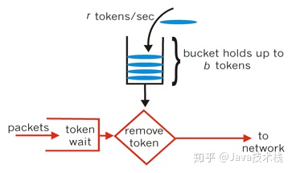

## Nginx

### 为什么使用 Nginx（好处）？

* 跨平台，配置简单、高并发连接，内存消耗小
* 健康检查功能，节省宽带，稳定性高，异步请求
* 性能高：采用异步非阻塞事件处理机制，运用了 epoll 模型，提供队列，排队解决
* 可以反向代理，负载均衡：隐藏源服务器的存在和特征

缺点

* 动态处理差：nginx 处理静态文件好，耗费内存少，处理动态页面很鸡肋

### Nginx 限流

- Nginx 限流就是限制用户请求速度，防止服务器受不了
- 限流有3种
    1. 正常限制访问频率（正常流量）
    2. 突发限制访问频率（突发流量）
    3. 限制并发连接数
- Nginx 的限流都是基于漏桶流算法

### 漏桶算法和令牌桶算法

**漏桶算法**

漏桶可以看作是一个带有常量服务时间的单服务器队列，如果漏桶（包缓存）溢出，那么数据包会被丢弃。 在网络中，漏桶算法可以控制端口的流量输出速率，平滑网络上的突发流量，实现流量整形，从而为网络提供一个稳定的流量。

**令牌桶算法**

令牌桶算法的原理是系统会以一个恒定的速度往桶里放入令牌，而如果请求需要被处理，则需要先从桶里获取一个令牌，当桶里没有令牌可取时，则拒绝服务。从原理上看，令牌桶算法和漏桶算法是相反的，一个“进水”，一个是“漏水”。

### Nginx 负载均衡

- 为了避免服务器崩溃，大家会通过负载均衡的方式来分担服务器压力。将对台服务器组成一个集群，当用户访问时，先访问到一个转发服务器，再由转发服务器将访问分发到压力更小的服务器。
- Nginx负载均衡实现的策略有以下五种：
    - 轮询（默认）
        - 每个请求按时间顺序逐一分配到不同的后端服务器，如果后端某个服务器宕机，能自动剔除故障系统。
    - 权重 Weight
        - 权重越大访问概率越高
    - ip_hash( IP绑定)
        - 每个请求按访问 IP 的哈希结果分配，使来自同一个 IP 的访客固定访问一台后端服务器，`并且可以有效解决动态网页存在的 session 共享问题`
    - fair（第三方插件）
        - 对比 weight、ip_hash 更加智能的负载均衡算法，fair 算法可以根   据页面大小和加载时间长短智能地进行负载均衡，响应时间短的优先分配。
    - url_hash（第三方插件）
        - 按访问 url 的 hash 结果来分配请求，使每个 url 定向到同一个后端服务器，可以进一步提高后端缓存服务器的效率。