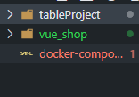
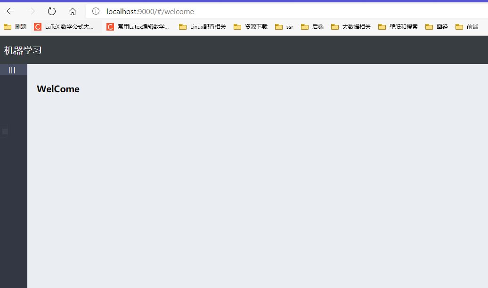

通过 docker-compose 部署前端 Vue 到 Nginx 中，并部署后端 Django 项目。



其中 tableProject 为 Django 项目，vue_shop 为 vue 项目

## Dockerfile

首先需要通过 Dockerfile 打包生成镜像，在 `tableProject` 目录下新建 Dockerfile，由于后端是 python 项目，需要进行依赖安装，首先安装 `pipreqs` 

```shell
python -m pip install pipreqs
```

然后将项目依赖打包进 `requirements.txt` 中，其中 `--encoding` 指定编码方式

```shell
pipreqs . --encoding=utf8
```

虽然 `pipreqs` 可以将项目依赖打包进 `requirements.txt` 中，但是会有些依赖缺失，此时需要手动将缺失依赖加入到`requirements.txt` 中，完成依赖迁移。

接下来编写后端 `Dockerfile`

```dockerfile
FROM python:3.7.1-stretch
ENV PYTHONUNBUFFERED 1
RUN mkdir /code
WORKDIR /code
ADD ./requirements.txt /code/
ADD ./cmake-3.17.2-Linux-x86_64.sh /tmp/cmake-install.sh
RUN  chmod u+x /tmp/cmake-install.sh \
      && mkdir /usr/bin/cmake \
      && /tmp/cmake-install.sh --skip-license --prefix=/usr/bin/cmake \
      && rm /tmp/cmake-install.sh
ENV PATH="/usr/bin/cmake/bin:${PATH}"
RUN pip install -r requirements.txt -i https://pypi.tuna.tsinghua.edu.cn/simple
ADD . /code/
EXPOSE 8000
CMD [ "python", "./manage.py runserver 0.0.0.0:8000" ]
```

使用 cmake 是因为在项目中使用到了 `xgboost` 包依赖编译需要用到高版本 cmake，直接从宿主机打包进镜像中，在 docker 中跑 `0.0.0.0` 是为了和宿主机外部机进行通信，不能使用 `localhost` 或者 `127.0.0.1` ，这两个 IP 地址会迂回指向 docker 虚拟机内部，外部无法获取到其暴露的接口。

接下来编写 vue 前端 nginx `Dockerfile`，进入到 `vue_shop` 目录下，新建 `makefile` 帮助打包

```makefile
SHELL := /bin/bash
PATH  := node_modules/.bin:$(PATH)

NOW := $(shell date +"%Y-%m-%d %H:%M:%S")
PROJECT := ml-frontend
PKG_NAME := $(PROJECT).tar.gz

REGISTRY := yjg.eugeo.net
NAME := devops/$(PROJECT)
TAG := v$(shell date +"%Y%m%d")
IMG := $(REGISTRY)/$(NAME):$(TAG)

# update helm values.yaml
CONTENT := $(subst TAG,$(TAG),'9 s/.*/  tag: TAG/g')

all : install pkg build-img


install:
	@echo -e "33[32m$(NOW): Build ${PROJECT} project33[0m"
	npm run build

pkg:
	@echo -e "33[32m$(NOW): start packing33[0m"
	tar zcf $(PKG_NAME) dist/*

build-img:
	@echo -e "33[32m$(NOW): Start build image...33[0m"
	cp -Ra dist nginx/
	docker build -t $(IMG) nginx

clean:
	@echo -e "33[32m$(NOW): clean...33[0m"
	-rm -rf $(PKG_NAME) dist nginx/dist
	-docker rmi $(IMG)

```

 在 `vue_shop/nginx` 目录下新建 `Dockerfile` 

```dockerfile
FROM nginx:1.14.2

LABEL maintainer="tlknvr@gmail.com"

COPY dist /usr/share/nginx/html

COPY mlnet.conf /etc/nginx/conf.d/default.conf

WORKDIR /etc/nginx

EXPOSE 80

CMD ["nginx", "-g", "daemon off;"]
```

其中，mlnet.conf 为

```nginx
upstream django-backend {
    server web:8000;
}

server {
    listen 80;
    server_name localhost;

    location / {
        root /usr/share/nginx/html;
        index index.html index.htm;
        autoindex on;
        try_files $uri $uri/ /index.html =404;
    }

    location /api/ {
        # proxy_set_header Host $host;
        # proxy_set_header X-Real-IP $remote_addr;
        # proxy_set_header X-Forwarded-For $proxy_add_x_forwarded_for;
            proxy_pass   http://django-backend;
    }

    error_page 500 502 503 504 /50x.html;
    location = /50x.html {
        root /usr/share/nginx/html;
    }
}
```

nginx 主要是通过反向代理，是前端后端通信，避免跨域问题，以及为前端显示的 web 服务器作用。

## Docker-compose

在编写完 Dockerfile 后，到根目录新建 `docker-compose.yaml` 使用 docker-compose 对容器进行编排

```docekr-compose
version: "3"
services: 
  web:
    build: ./tableProject/
    image: ml-backend:v1.0.0
    container_name: ml-backend
    command: python3 manage.py runserver 0.0.0.0:8000
    volumes: 
      - ./tableProject:/code
    ports: 
      - "8000:8000"
    restart: always
  nginx:
    build: ./vue_shop/nginx/
    image: ml-frontend:v1.0.0
    container_name: ml-frontend
    ports: 
      - "9000:80"
    links: 
      - "web"
    restart: always

```

编写好后，使用 `docker-compose up -d` 编译镜像并运行服务，此时打开 `localhost:9000` 即可观察到 vue 前端项目网页。



## 附

linux 快速更换国内网易源

```shell
mv /etc/apt/sources.list /etc/apt/sources.list.bak
    echo "deb http://mirrors.163.com/debian/ jessie main non-free contrib" >> /etc/apt/sources.list
    echo "deb http://mirrors.163.com/debian/ jessie-proposed-updates main non-free contrib" >>/etc/apt/sources.list
    echo "deb-src http://mirrors.163.com/debian/ jessie main non-free contrib" >>/etc/apt/sources.list
    echo "deb-src http://mirrors.163.com/debian/ jessie-proposed-updates main non-free contrib" >>/etc/apt/sources.list
    #更新安装源
    apt-get update 
```

docker-compose 常用命令

```shell
$ docker-compose build web   构建后端Django项目容器
$ docker-compose build nginx 构建前端Vue项目容器
$ docker-compose up 前台启动项目
$ docker-compose up 后台启动项目
$ docker-compose images 查看项目所有镜像
$ docker-compose ps 查看项目所有容器
$ docker-compose logs -f [service name] 如:web/nginx  查看容器log信息
$ docker-compose config 查看docker-compose.yml文档内容并校验
$ docker-compose port nginx 80   # 查看服务的端口映射
0.0.0.0:9000
$ docker-compose stop db 停止单个容器
$ docker-compose start db 启动单个容器
$ docker-compose restart db 重启单个容器
$ docker-compose start   启动所有容器
$ docker-compose stop  停止所有容器
$ docker-compose restart  重启所有容器
$ docker-compose rm  删除所有已停止的容器

# 以下是所有的docker-compose一些命令参数
Commands:
  build              Build or rebuild services
  bundle             Generate a Docker bundle from the Compose file
  config             Validate and view the Compose file
  create             Create services
  down               Stop and remove containers, networks, images, and volumes
  events             Receive real time events from containers
  exec               Execute a command in a running container
  help               Get help on a command
  images             List images
  kill               Kill containers
  logs               View output from containers
  pause              Pause services
  port               Print the public port for a port binding
  ps                 List containers
  pull               Pull service images
  push               Push service images
  restart            Restart services
  rm                 Remove stopped containers
  run                Run a one-off command
  scale              Set number of containers for a service
  start              Start services
  stop               Stop services
  top                Display the running processes
  unpause            Unpause services
  up                 Create and start containers
  version            Show the Docker-Compose version information
```

