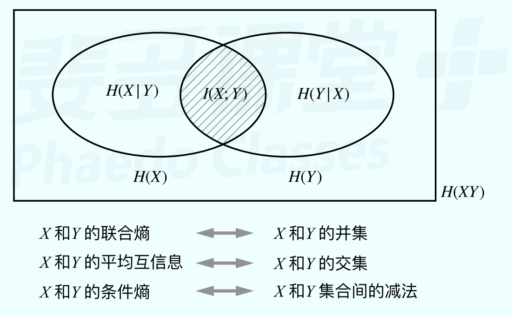
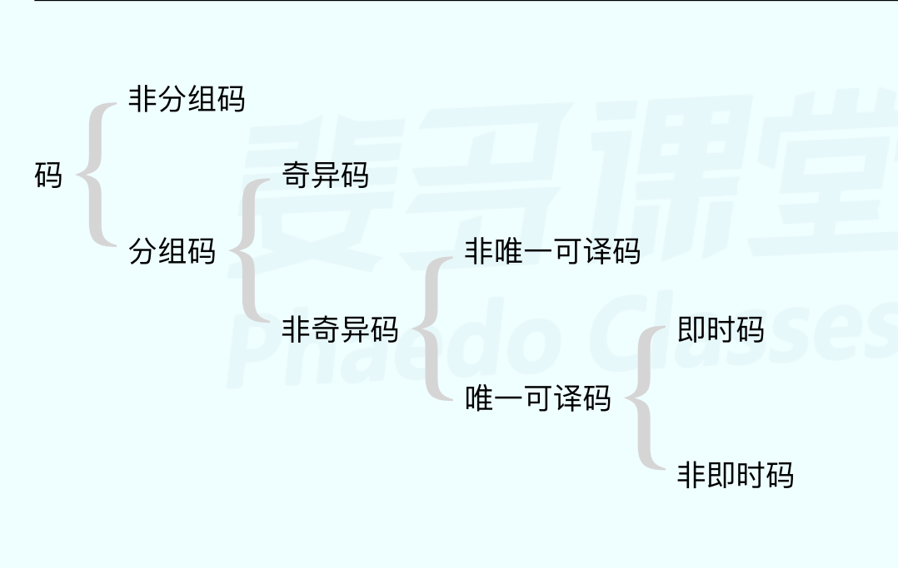
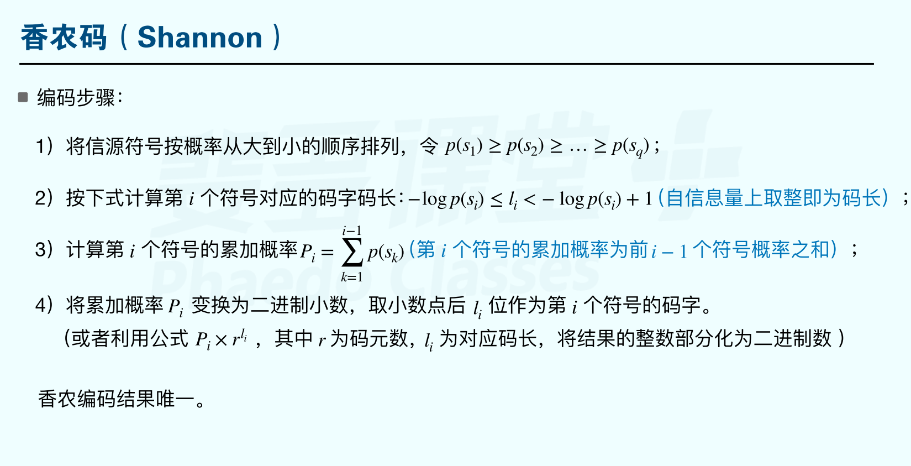
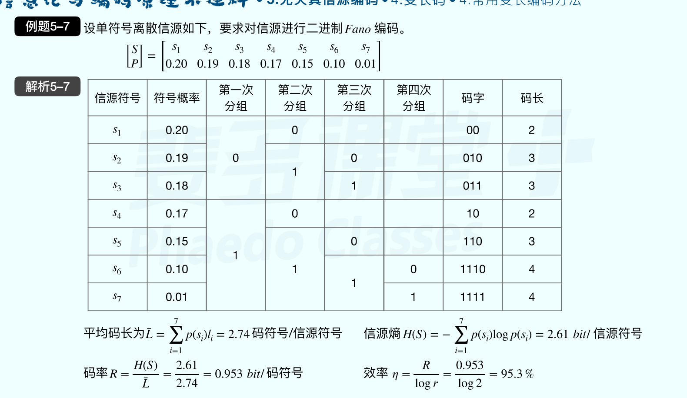
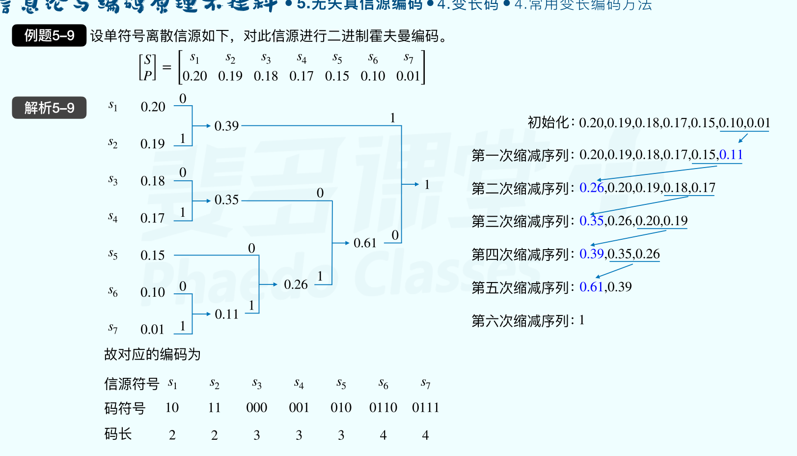
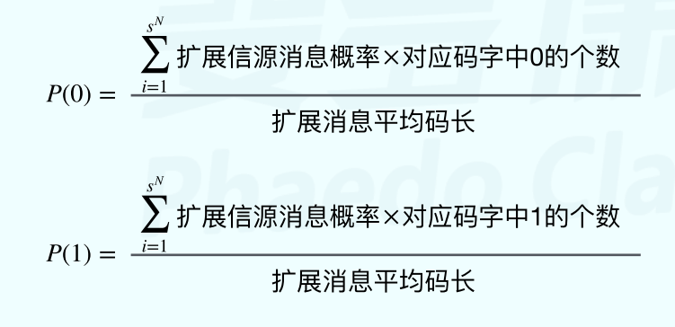
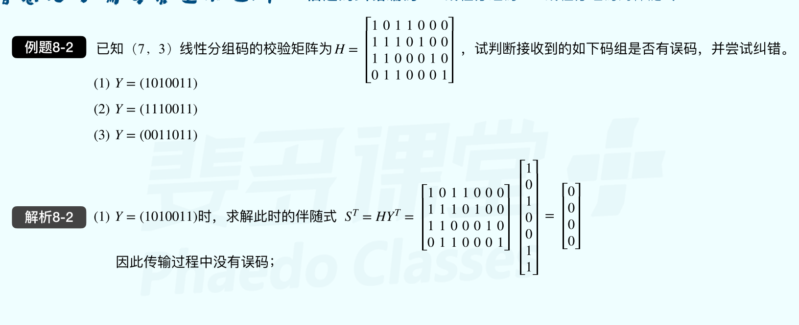
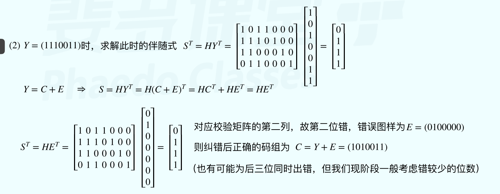
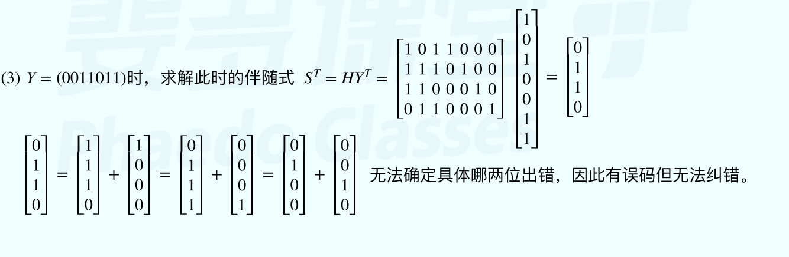
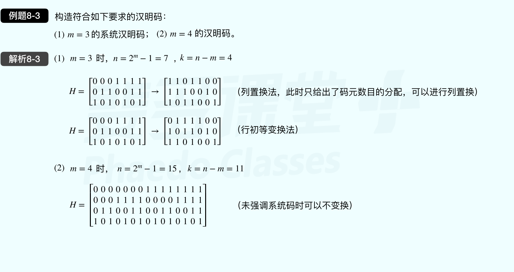

# 绪论

## 信息的概念及物理含义

   香农信息定义：事物运动状态或存在方式的不确定性的描述

   物理含义（通信目的）：消除不确定性，获得信息

   信息性质：语法信息、语义信息、语用信息

   地位：客观信息和主观信息

## 通信系统模型及各部分的功能：

信源 -> 编码器 -> 信道（会增加干扰和噪声）-> 译码器 ->信宿

信源：发送信息的实体

编码器：进行信源编码，去冗余（压缩），增加通信有效性

信道: 信道编码，增加冗余，增加可靠性

译码器：译码

信宿：接收译码后的信息的实体

# 离散信源熵

## 概率论基础

离散概率型： $P_x=P_YP_{X|Y}=>\left(\sum_{j=1}^{N}P(y_j)P(x_i|y_j)\right)$

常用公式：

条件概率：  $P(X=X_i|Y=Y_j)=\frac{P(x_iy_j)}{P(y_j)}$

全概率公式： $P(X_i)=\sum_{j=1}^{N}P(y_j)P(x_i|y_j)$

贝叶斯公式： $P(x_i|y_j)=\frac{P(x_iy_j)}{P(y_j)}=\frac{P(y_j|x_i)P(x_i)}{\sum_{i=1}^{n}P(x_i)P(y_j|x_i)}$

## 自信息量的计算及其物理含义

### 1. 自信息量

定义：信源发出一个消息本身包含的信息量，由消息的不确定度决定

公式:  $I(x_i)=\log{\frac{1}{P(x_i)}}=-\log{P(x_i)}$ bit

意义：事件发生前表征不确定度大小，发生后表示其所提供的信息量

### 2. 条件自信息量

公式： $I(x_i|y_j)=-\log{P(x_i|y_j)}$

物理含义：表示在特定条件下( $y_j$ 已发生)下随机事件 $x_i$ 所带来的信息量。

### 3. 联合自信息量

公式：$I(x_iy_j)=-\log{P(x_iy_j})$

物理含义：说明两个随机事件同时发生时得到的信息量，如果两随机变量相互独立则是 $I(x_i)+I(y_j)$

## 离散信源熵

### 1. 信源熵（ 先验熵 | 无条件熵 ）

定义： 信源中个信息所包含自信息量的数学期望，表征信源整体不确定度( 平均自信息 )

公式： $H(x)=E[I(x_i)]=\sum_{i=1}^{n}P(x_i)I(x_i)=-\sum_{i=1}^{n}P(x_i)\log{P(x_i)}$

r  进制的信源熵公式 $H_r(X) = \frac{H(X)}{\log r}$ bit/符号

用计算器计算时，换算关系为 $\log_{2}10*\lg p(x_i)=3.322 \lg p(x_i)$

意义： 

1. 输出前信源的不确定度
2. 输出后每个消息（符号）所包含的平均信息量
3. 信源的整体不确定度

性质

1. 对称性：说明熵只与变量总体结构相关，与信源总体统计特性有关

2. 确定性：概率总和为 1

3. 扩展性：增加一个概率极小事件，信源熵不变。

4. 强可加性：$H(XY)=H(x)+H(Y|X)=H(Y) + H(X|Y)$

    1. $H(X|Y) \leq H(X)$
    2. $H(XY) \leq H(X) + H(Y)$
    3. $H(X_1X_2\cdots X_N)\leq H(X_1)+H(X_2)+\cdots + H(X_N)$

5. 非负性：仅对离散信源成立

6. 上凸性：信源熵是概率分布的严格上凸函数

7. 最大离散熵定理：当各个符号出现的概率相等时，熵最大。

    $$H(p1,p2,..,p_n)\leq H(\frac{1}{n},\frac{1}{n},...,\frac{1}{n})=\log n$$

### 2. 条件熵

1. $H(x|y)=\sum_{j=1}^{n}P(y_j)H(X|Y_j)=-\sum_{j=1}^{m}\sum_{i=1}^{n}P(x_iy_j)P(x_i|y_j)$
    1. 后验熵 | 信道疑义度 | 损失熵
2. $H(y|x)=\sum_{j=1}^{n}P(x_i)H(Y|X_i)=-\sum_{j=1}^{m}\sum_{i=1}^{n}P(x_iy_j)P(y_j|x_i)$
    1. 噪声熵

### 3. 联合熵

$H(XY)=-\sum_{j=1}^{m}\sum_{i=1}^{n}P(x_iy_j)\log P(x_iy_j)$

共熵

### 4. 互信息熵（ 信道部分详解 ）

$I(x;y)=H(x)-H(x|y)=H(y)-H(y|x)=H(x)+H(y)-H(xy)=I(y;x)$

从 y 获得的关于 x 的平均信源熵

I(y;x) 表示收到 Y 获得的信息量减去由噪声引起的额外信息量

## 信源序列熵

### 1. 无记忆信源序列熵求解

无记忆信源定义：信源发出的符号（消息）相互独立

扩展信源（ 序列熵 ）：独立同分布（ 各符号取自同一个信源空间 ）
$$
\begin{bmatrix}x\\\\P(x)\end{bmatrix}=\begin{bmatrix}a_1 & ... & a_i & ... & a_q\\\\P_1 & ... & P_i & ... & P_q\end{bmatrix}
$$
则输出扩展信源为
$$
\begin{bmatrix}x^N\\\\ \vec P(x)\end{bmatrix}=\begin{bmatrix}\alpha_1 & ... & \alpha_i & ... & \alpha_{q^N}\\\\P_1 & ... & P_i & ... & P_{q^N}\end{bmatrix}
$$
其中每个  $\alpha_i$ 可视为信源 X 中 N 个  $a_i$ 组成的序列。
$$
\alpha_i=(a_1,a_2,\cdots,a_N )\Rightarrow P(\alpha_{iN})=\prod_{k=1}^NP(a_{ik})
$$
得信源熵为： $H(X^N)=NH(X)$

### 2. 有记忆信源序列熵

公式如下 
$$
H(\vec X)=H(X^N)=H(X_1)+H(X_2|X_1)+\cdots + H(X_N|X_N-1\cdots X_2X_1)
$$
平均符号熵计算
$$
H_N(\vec X)=\frac{1}{N}H(\vec X)
$$
极限熵
$$
H_\infty=\lim_{N\rightarrow \infty}H_N(\vec X)
$$
在有限记忆长度为 m+1 的信源中，其极限熵等于 m 阶条件熵
$$
H_\infty=H_{m+1}=H(X_{m+1}|X_1X_2\cdots X_m)
$$

# 离散信道容量

信道数学模型 

$\vec x \rightarrow P(\vec Y | \vec X) \rightarrow \vec Y$

其中中间的是噪声干扰，也叫噪声熵。

信道疑义度  $H(X|Y)$  表示信宿接收信源一个符号后对输入仍然存在的不确定度

## 1. 互信息量

公式： $I(x_i;y_j)=I(x_i)-I(x_i|y_j)=\log \frac{P(x_i|y_j)}{P(x_i)}$

物理意义：$y_j$ 出现前后关于输入  $x_i$  存在的不确定度的减少量。

性质：

1. 互易性： $I(x_i;y_j)=I(y_j;x_i)$
2. 可正可负可为零
3. 不可能大于其中任意一个时间的自信息

## 2. 平均互信息量（ 互信息熵 ）

$$
I(X;Y)=E[I(x_i;y_j)]=\sum_{i=1}^{m}\sum_{j=1}^{n}P(x_iy_j) \log \frac {P(x_i|y_j)}{P(x_i)}
$$

**对输出端有:**
$$
I(X;Y)=H(X)-H(X|Y)
$$
其中 H(X) 表示==先验熵==， **H(X|Y)** 表示==后验熵 | 损失熵 | 信道疑义度==

意义： 表示从 Y 获得的关于 X 的平均信息量

**对输入端有**：
$$
I(Y;X)=H(Y)-H(Y|X)
$$
其中 **H(Y|X)** 表示==噪声熵==

意义： 收到 Y 获得的信息量减去由噪声引起的额外信息量

**对整个通信系统有**：
$$
I(X;Y)=H(X)+H(Y)-H(XY)
$$
意义： 通信前后不确定度的减少量

性质:

1. 非负性
2. 对称性
3. 极值性： $I(X;Y)\leq min{H(X), H(Y)}$
4. 凸性定理： 输入信源概率分布和信道传递概率分布的凸函数
5. 数据处理定理：消息多级处理后，随着处理器数目增多，输入消息和输出消息的平均信息量趋于变小

总结：使用韦拉图表示平均互信息

## 3. 信道容量

在最佳输入分布时，最大信息传输率 R 即为信道容量，即
$$
C=\max_{P(x)}\{I(X;Y\} (bit/symbol)
$$
最大值由信道特性决定，**与信源无关**。

最佳输入即为等概分布。

### 1. 信息传输率 R

本质上为互信息熵， $R=I(X;Y)$

$R_t$ ：每秒传输的平均互信息量 $\frac{1}{t}I(X;Y)$

### 2. 无噪无损信道

H(X|Y)、H(Y|X) 均为 0

特性：

1. 输入输出一一对应
2. 给定任意 $ x_i$ ，必定存在 $y_j $ 使得 $P(y_j|x_i)=P(x_i|y_j)=1$
3. $I(X;Y)=H(X)=H(Y)$

最佳输入分布为等概分布： $C=\max_{P(x)}\{I(X;Y\}=\max_{P(x)}H(x)=\log r= \log s$

其中 r 为信道矩阵的行代表输入， s 为信道矩阵的列代表输出。

### 3. 无噪有损信道（ 确定信道 ）

H(Y|X) = 0, H(X|Y) 不为零

特性：

1. 多输入对应一个输出

2. 给定任意$ x_i$，存在一个 $y_j $ 使得 $P(y_j|x_i)=1$

3. $I(X;Y)=H(Y)$

4.  $C=\max_{P(x)}\{I(X;Y\}=\max_{P(x)}H(Y)= \log s$

    

### 4. 有噪无损信道

与无噪有损信道相反。

### 5. 一般离散信道

比较复杂，直接看书了解一下即可。

### 6.  离散输入对称信道（行对称信道）

每行元素相同（ 不管排列 ）

信道容量： 
$$
C=\max_{P(x)}[H(Y)-H(Y|X)]=\log s-H(P_1^`,P_2^`,\cdots,P_s`)
$$
等于 log 列 减去任意一行元素的信源熵。

### 7. 离散输出对称信道（列对称信道）

同 6

### 8. 对称信道

每行都相同元素

每列都相同元素

若行数小于列数，则列元素集合为行元素子集。

信道容量同 6。

#### 1. 强对称信道（ 均匀信道 ）

1. 行数等于列数
2. 对于每个输入符号，正确传递概率相等，错误传递概率均匀分配到输入行中。
3. 为 r x r 对称信道

信道容量:
$$
C=\max_{P(x)}[H(Y)-H(Y|X)]=\log s-H(P_1^`,P_2^`,\cdots,P_s`)=\log r - H(p) - P\log (r-1)
$$
其中 p 为 1 - 正确传递概率。

#### 2. 准对称信道

1. 非对称信道
2. 可以按列（ 输出 ）划分一些对称的子矩阵
3. 划分子集为 1  时，它为对称信道

信道容量
$$
C=\max_{P(x)}[H(Y)-H(Y|X)]=\log r-H(P_1^`,P_2^`,\cdots,P_s`)-\sum_{k=1}^{n}N_k\log M_k
$$
其中 n 为该信道矩阵可被划分为的对称矩阵的个数

$N_k$ 为第 k 个子矩阵行元素之和

$M_k$ 为第 k 个子矩阵列元素之和

# 信源编码

作用： 

1. 使信源适合于信道传输
2. 在不失真或在一定失真条件下，用尽可能的符号传输

目的： 

​     提高有效性，使用压缩信源的冗余度实现。

冗余度取决于符号间记忆的相关性与符号概率分布的非均匀性。

码的种类： 定长码，变长码，奇异码（ 存在相同码字 ），非奇异码，N 次扩展吗

分组码：将信源符号集中的每个信源符号 $S_i$ 映射为一个固定的码字 $W_i$

唯一可译码充要条件： 任意次展开均为非奇异码。

即使码的充要条件：码组中任一码字都不是其他码字的前缀。

## 1.无失真

### 定长码与定长码编码定理

定长编码：

1. 设信源符号中有 q 个符号
2. 设码符号集中有 r 种码元
3. 设编码后定长码码长为 l，则码字总数为 $r^l$
4. 若编码要满足非奇异性，则需要 $r^l \geq q$
5. 若是扩展编码则是  $r^l \geq q^N$

定长码编码定理：
$$
\frac{l}{N} \geq \frac{H(s)+\epsilon}{\log r}
$$
若满足上个公式，则当扩展次数 N 足够大是可以几乎无失真编码。

$\epsilon$ 为任意大于 0 的数。

反之，若满足下列公式，则不可能无失真编码
$$
\frac{l}{N} \leq \frac{H(s)-2\epsilon}{\log r}
$$
编码信息率 R 和编码效率 $\eta$
$$
R=\frac{H(s)}{l/N}
$$

$$
\eta=\frac{R}{\log r}
$$

当适用在有记忆信源时，H(S) 替换为 $H_\infty$

### 变长码

#### 1. Kraft 和 McMillan 不等式

设符号集长度为 q 码元种类为 r 码字长度为 q， 码长分别为 ${l_1,l_2,\dots,l_q}$

则即使码存在的充要条件为 $\sum_{i=1}^{q}r^{-l_i}\leq1$ ( Kraft不等式 )

唯一可译码存在的充要条件时 $\sum_{i=1}^{q}r^{-l_i}\leq1$ ( McMillan 不等式 )

#### 2. 变长码相关计算

**平均码长**： $\bar L=\sum_{i=1}^{q}p(s_i)l_i$ 单位是 码元 / 符号

其中 q 为信源长度， $p(s_i)$ 为符号概率， l 为码长

**码率**： $R=\frac{H(s)}{\bar L}$ bit / 码元

**最佳码/紧致码**： 平均码长最小的唯一可译码。

#### 3. 变长无失真信源编码定理（ 香农第一定理 ）

设离散无记忆信源的熵为 H(S)， 它的 N 次扩展信源为 $S^N$,对扩展信源进行编码，一定有一种编码方法构成唯一可译码，使平均码长满足 $\frac{H(S)}{\log r}\leq \frac{\bar L_N}{N}\leq \frac{H(S)}{\log r}+\frac{1}{N}$

说明：

1. 平均码长界限定理只考虑单个信源符号，而香农第一定理考虑的消息序列，将 $H(S^N)=NH(S)$ 带入平均码长界限定理即可证得香农第一定理

2. N -> $\infty$ 时，$\lim_{N\rightarrow \infty} {\frac{\bar L_N}{N}}=\frac{H_\infty}{\log r}$。即一般离散信源需考虑符号间依赖性进一步降低平均码长

3. 无失真信源编码平均码长下界为信源熵 $H_r(S)$， 码率 $R=\frac{H(s)}{\bar L}$ ，其中 $\bar L = \frac{\bar L_N}{N}$

    效率为 $\eta=\frac{R}{\log r}=\frac{H(S)/ \bar L}{\log r}$

    

香农第一定理给出了第一个理论极限：平均码长的压缩下限，它和信源的熵有关。

#### 4. 常用变长编码方法

1. 香农编码

    

2. 费诺码

3. 哈夫曼码（ 最佳码 ）

    

4. 游程编码

    其编码方案是，只在各行（或列）数据的代码发生变化时依次记录该代码以及相同代码重复的个数，从而实现数据的压缩。

5. 字典编码

    其基本思想是 用符号代替一串[字符](https://baike.baidu.com/item/字符)；这一串字符可以是有意义的，也可以是无意义的。

#### 5. 求解扩展信源编码二元码元符号的概率 P(0) 和 P(1) 的方法

## 2. 限失真

传输时的失真原因：

1. 噪声干扰
2. 传输率超过信道容量
3. 信源熵为无失真压缩极限，再压缩会失真

限失真编码的合理性

1. 信宿灵敏度和分辨率有限
    2. 允许失真，可提高信息传输率，降低通信成本

### 失真度

失真函数： $d(x,y)\geq0$ ：自定义限失真函数

常用失真函数：

1. 汉明失真： 

    $d(x_i,y_j)=\begin{cases} 0, \quad x_i = y_j \\\\ 1, \quad x_i \ne y_j \end{cases} $

2. 平方误差失真函数

    $d(x_i,y_j)=(x_i-y_j)^2$

平均失真度：
$$
\bar D=E[d(x_i,y_j)]=\sum_{j=1}^{m}\sum_{i=1}^{n}P(x_iy_j)d(x_i,y_j)
$$
表示信源再给定信道 P(Y|X) 中传输时引起的失真度总量。

$D^*$ 记作允许失真度

保真度准则： $\bar D \leq D^*$

$B_{D^*}$ 记作满足保真度准则的信道。

### 信息率失真函数

公式：
$$
R(D)=\min_{P(y_j|x_i)\in B_{D^*}}\{I(X;Y)\}
$$
R(D) 表示信息率允许压缩到的最小值，为信源特有参数。

此时满足 $I(X;Y)=H(Y)-H(Y|X)=H(Y)$

#### 信道容量和率失真函数的区别

C 表示信道传输信息的能力，为信道特性

R(D) 表示满足失真要求而在线信源消息所必须获得的最小平均信息量， 为信源特有参数

### 限失真信源编码定理（ 香农第三定理 ）

设离散无记忆平稳信源的率失真函数为 R(D)，只要满足 $R\geq R(D)$，当信源序列 N 足够大时，一定存在一种编码方法，其译码失真小于或等于 $D+\epsilon$，其中 $\epsilon$ 为任意小的正数。

在允许失真 D 的条件下，信源最小的、可达的信息传输率时信源的 R(D)，提供了压缩的下界。

# 信道编码

目的：提高通信系统的可靠性

本质：由于移动通信存在干扰和衰落，在信号传输过程中将出现差错，故对数字信号必须采用纠、检错技术，即纠、检错编码技术，以增强数据在信道中传输时抵御各种干扰的能力，提高系统的可靠性。对要在信道中传送的数字信号进行的纠、检错编码就是信道编码。

编码：给信源编码符号序列增加冗余码元（ 监督码元 ），这些冗余码元与信息码元间以某种确定的规则相互关联与约束。

## 信道编码的基本概念

### 1. 码重

码重是指码字序列中非零元素的个数

### 2. 汉明距离（ 码距 ）

定义：$D(\alpha_i,\beta_j)=\sum_{k=1}^{n}x_{ik} \oplus y_{jk}$

例如：
$$
\alpha_i=0\,0\,0\,1\,1\,0\,0\,1\,1 \\\\ \beta_j=1\,1\,1\,0\,1\,0\,1\,0\,0\,
$$
则这两个码字的汉明距离为：$D(\alpha_i,\beta_j)=7$

### 3. 最小汉明距离（最小码距）

在二元码中，任意两个码字之间的汉明距离的最小值便是码 C 的最小码距
$$
D_{min}=\min[D(\omega_i,\omega_j)]
$$

## 译码规则

对每种输出符号 $y_j$ 都有一个确定的函数 $F(y_j)$ 对应一个唯一的输入，则该函数为译码规则。

每个输出都有 r 种译码规则，故共有 $r^s$ 中译码规则。其中 r 为输入， s 为输出。

### 两种典型译码规则

令 $F(y_j)=X^*$，$X^*\in X$ 

#### 1. 最大后验概率准则（ MAP ）

又称最小错误概率译码算法

$P(x^*|y_j)\geq P(x_i|y_j),x_i\in X,x_i \ne x^*$

#### 2. 极大似然译码（ ML ）

$$
P(x^*)P(y_j|x^*)\geq P(x_i)P(y_j|x_i),x_i\in X,x_i \ne x^*
$$

当输入符号等概分布时，收到 $y_j$ 后译码成矩阵 P 中第 j 列最大元素对应的信源符号。

#### 3. 两种规则使用方法

1. MAP

    1. 转移概率矩阵每行乘以 $P(x_i)$ 得**联合概率分布矩阵**

    2. 以每列矩阵中最大概率对应的输入概率 $x_i$ 作为译码准则

    3. 所有译码结果对应的联合概率之和为正确概率，矩阵中其余的和为错误概率
        $$
        \bar P_E=\sum p(x_iy_j)
        $$
        $P(x_iy_j)$ 为联合概率分布矩阵每列中最大的概率

2. ML

    1. 输入为等概分布或者先验概率未知时使用
    
    2. 以**转移概率矩阵**每列中最大元素对应的 $x_i$ 作为译码准则

    3. 所有译码准则所对应的转移概率之和乘以 $\frac{1}{r}$ 为正确概率
        $$
        \bar P_E=\sum \frac{1}{r} p(y_j|x_i)
        $$
        $P(y_j|x_i)$ 为转移概率矩阵中每列最大的概率
    

#### 4. 最小汉明距离译码准则

$P_E$ 与各种编码、译码方法有关。

1. 编码可采用选择发端的 M 个消息所对应的码字间的最小距离 $d_{min}$ 尽可能大的方法。
2. 译码时采用将接收序列 $\beta_j$ 译成与之最近的那个码字 $\alpha^*$ 的译码规则 

## 错误概率

设译码规则 $F(y_j)=x_i$ ，正确译码概率为：$P[F(y_j)|y_j]=p(x_i|y_j)$，错误概率则为：$p(e|y_j)=1-p(x_i|y_j)$。

平均错误译码概率为：$P_E=\sum_{j=1}^{s}p(y_j)p(e|y_j)=1-\sum_{j=1}^{s}p(x_iy_j)$

平均正确译码概率为：$\bar P_E=\sum_{j=1}^{s}p(x_iy_j)$

与错误概率有关的因素：

1. 信道统计特性
2. 译码过程
    1. 译码过程
    2. 译码规则

**费诺不等式**
$$
H(X|Y) \leq H(P_E)+P_E \log(r-1)
$$
物理意义：当信源、信道给定时，信道疑义度给定了译码错误的下限。

表明仅指定译码规则不够，还需要对信道的输入符号进行编码才能进一步降低 $P_E$

## 五种简单编码方法

1. 奇偶校验法
2. 定比码
3. 群计数码
4. 正反码
5. 模 p 法

## 差错控制方式

1. 反馈重传（ ARQ ）

    发送端编码后发出能够检错的码，接收后校验，若有错则重传

2. 前向纠错（ FEC ）

    自带纠错能力的纠错编码，接收端接收后根据译码规则译码

3. 混合纠错

    发送端发送既有自动纠错同时具有检错能力的码

## 有噪信道编码定理（ 香农第二定理 ）

离散平稳无记忆信源，信道容量为 C，若编码信息率（ 编码效率 ）R < C。当码长足够长时，至少有一种编码，使译码错误概率任意小，相反则反之。

该定理指出了信道编码的极限性能，为研究指明反向。

1. 高效率：信息传输率 R 接近信道容量 C。
2. 高可靠性：译码差错任意小
3. 必要条件：R < C。

## 线性分组码

### 1. 基本概念

设二元信息码组由 k 个信息码元组成，有 $2^k$ 个不同码组；编码器输出长度为 n 的码字其中附加 $r = n - k$ 个校验码元（监督码元）。每个校验码元为该信息组某些码的模二和则这二元信息码组为 （n，k）分组码。

#### 1.1 编码效率 （ 信息率 ）

线性分组码的编码效率为合法码字（信息码元）与码长之比。
$$
R=\frac{\log 2^k}{n}=\frac{k}{n}
$$
分组码总共有 $2^n$ 个码字，其中有 $2^k$ 个合法码字。

#### 1.2 校验矩阵

设 （7，3）分组码： $C=[C1\ C2\ C3\ C4\ C5\ C6\ C7]$

其中前三个为信息元，后四个为校验元。

给出信息元和校验元的约束关系如下：
$$
\begin{cases} C4=C1+C3 \\\\ C5=C1+C2+C3 \\\\ C6=C1+C2 \\\\ C7=C2+C3  \end{cases} \stackrel{模二加}{\Rightarrow} \begin{cases} C1+C3+C4=0 \\\\ C1+C2+C3+C5=0 \\\\ CC1+C2+C6=0 \\\\ C2+C3+C7=0  \end{cases}
$$
将上式化为矩阵形式如下：
$$
H \begin{bmatrix}  1 & 0 & 1 &1 & 0&0&0 \\\\ 1&1&1&0&1&0&0 \\\\ 1&1&0&0&0&1&0 \\\\ 0&1&1&0&0&0&1 \end{bmatrix} C^T\begin{bmatrix} C1 \\\\ C2 \\\\ C3 \\\\ C4 \\\\ C5 \\\\ C6 \\\\ C7 \end{bmatrix} = 0^T\begin{bmatrix} 0 \\\\ 0 \\\\ 0 \\\\ 0 \end{bmatrix}
$$
H 被称为监督矩阵（ 校验矩阵 ）。

(n, k) 线性分组码的校验矩阵为 (n-k) X n 维。

其中 H 矩阵前三列为信息列，后 4 列为校验列。

则可以将 H 矩阵表示为 $H=[Q \quad I]$ 。

Q 为 （n-k) X k 维矩阵，I 为 (n-k) X (n-k) 的单位阵。

这种表示的校验矩阵被称为标准 / 典型校验矩阵。

==注==：校验矩阵只可进行行变换，因为列变换会破坏约束关系。

#### 1.3 生成矩阵

$$
\begin{cases} C1+C3+C4=0 \\\\ C1+C2+C3+C5=0 \\\\ C1+C2+C6=0 \\\\ C2+C3+C7=0  \end{cases} \Rightarrow  \begin{cases} C1=0 \\\\ C2=0 \\\\ C3=0 \\\\C4=C1+C3 \\\\ C5=C1+C2+C3 \\\\ C6=C1+C2 \\\\ C7=C2+C3  \end{cases}
$$

化为矩阵形式为:
$$
m\begin{bmatrix} C1 & C2 & C3  \end{bmatrix}G \begin{bmatrix}  1 & 0 & 0 &1 & 1&1&0 \\\\ 0&1&0&0&1&1&1 \\\\ 0&0&1&1&1&0&1  \end{bmatrix}  = [C1\ C2\ C3\ C4\ C5\ C6\ C7]
$$
可以得到 C=mG，则在已知 G 的情况下可以根据信息矢量 m 获得包含校验位的整个对应码字，G 为生成矩阵。

G 为 k x n 维矩阵，标准 / 典型生成矩阵可表示为 $G=[I \quad P]$ 信息位在前，校验位在后。

**性质：**

生成矩阵每一行都是一个合法码字。

**校验矩阵可与生成矩阵互换**:
$$
H=[Q \quad I]=[P^T \quad I] \Leftrightarrow G=[I \quad P]=[I\quad Q^T]
$$

#### 1.4 伴随式

伴随式是指伴随接受码字的 n-k 维向量，反映了 信道对码字造成的干扰。

设发送码字为 C，接收的码符号序列为 Y，则伴随式为：
$$
S=YH^T或S^T=HY^T
$$
其中 H 为校验矩阵，伴随式不为 0，则代表出现了错误。此时，令
$$
Y=C+E
$$
其中 E 为**错误图样**， C 为发送码字。将 S 进行变换得：
$$
S^T=HY^T=H(C+E)^T=HC^T+HE^T=HE^T或S=EH^T
$$
得出结论：伴随式仅与错误图样有关。

性质：

1. 当 E=0 时，$S^T = 0$
2. 传输过程中出现了一位错误，则 $S^T$ 为校验矩阵中得某一列
3. 出现多个错误，~为校验矩阵若干列的模二和

若有多种错误图样，选择码重最小的作为最终错误图样此时 $C=Y-E=Y+E$ 

### 2. 译码过程（纠错检错）

#### 译码例题

#### 线性分组码的性质

1. 封闭性：线性分组码中任意两个码字之和依然时该码的合法码字。

2. 线性分组码的最小码距等于该码中非零码字的最小码重。

3. 纠错能力：线性分组码具备纠正 u 个及以内的错误的充要条件为
    $$
    d_{min}=2u+1
    $$
    +1 是因为不影响分组码中相邻码字的纠错。

4. 检错能力： 检测 l 个及以内: 
    $$
    d{min}=l+1
    $$
    +1 的目的是不会检测相邻码字为错码。

5. 同时纠、检错能力： 纠 t 检错 l ：
    $$
    d_{min}=t+l+1
    $$
    原因：如果检错为 $t+l$ 那么就不具备纠错能力了。

6. 校验矩阵与最小码距的关系：

    若 H 中任意 t 列线性无关（不相等），但是存在 t+1 列线性相关，则 $d_{min}=t+1$

    

### 3. 汉明码

定义：能纠单个错误的线性分组码，其最小码距为 3   $d_{min}=2*1+1=3$

特性：对于 (n, k) 汉明码，假设校验位共有 m= n - k 位，则其总码长与信息位个数满足：
$$
n=2^m-1 \quad \quad k=2^m-1-m
$$

#### 汉明码的生成矩阵构造

其中 n 列由除全 0 外的 n-k 位码组构成，这样译码时比较方便。

### 4. 循环码

定义：循环码中任一码组经过循环移位后然是许用码组。

多项式：设码字为 C
$$
C(x)=c_1x^{n-1}+c_2x^{n-2}+\cdots+c_{n-1}x+c_n
$$
**循环移位运算**

例：循环码码字为 1100101 即 $C(x)=x^6+x^5+x^2+1$

左移一位，码多项式为 $xC(x)$

对多项式模 ( $x^n+1$ ) 运算： $xC(x) mod(x^7+1)=x^6+x^3+x+1$

对应循环移位码字为 1001011

**两个重要结论**

1. 在循环码中一个 (n,k) 码有 $2^k$ 个不同的非零码组中，没有连续 k 位均为 0 的码组，即连 0 个数最多只能由 k - 1 位。（ 循环移位后会出现全 0 的信息位 ）
2. 在码字中，最低阶次的多项式 g(x)，必须是一个常数项不为 0 的 ( n-k ) 次多项式，而且只有一个。

#### 4.1 生成多项式与生成矩阵

生成多项式：(n,k) 循环码中，前 k-1 位都是 0 的码字，即多项式次数 m=n-k 的码字，为生成多项式 g(x)。

生成矩阵：为保证生成矩阵每行线性不相关，通常使用 g(x) 构造生成矩阵 G
$$
G=\begin{bmatrix} x^{k-1}g(x) \\\\ x^{k-2}g(x) \\\ \cdots \\\\ xg(x) \\\\ g(x)  \end{bmatrix}
$$
行与行之间为循环移位关系。

循环码中合法的码多项式必定是生成多项式的倍式，即$C(x)=V(x)g(x)$。

利用上性质可以进行是否是合法循环码码字的校验。

上述生成矩阵不是系统码的生成矩阵，即为非典型生成矩阵，可以通过初等行变换得到典型阵（不能进行列变换）。

#### 4.2 循环码编码方法

1. $x^{n-k} 乘以信息位 m(x) [信息码元后添 n-k 个 0]$
2. $x^{n-k}m(x)$ 除以 g(x) ，所得的余式即为 r(x) 【校验位】
3. $C(x)=m(x)+r(x)$

## 卷积码

性能优于分组码。

主要用来纠正随机错误。

与分组码的根本区别：它不是将信息序列分组后再单独编码，而是由连续输入的信息序列得到连续输出的已编码序列。即卷积码不但与当前 k 个信息有关，还与 m-1 段编码有关。

# 香农三大定理总结

## 信源编码部分

### 香农第一定理( 变长无失真信源编码定理 )

实现无失真编码时，编码的平均码长压缩极限为信源熵。

### 香农第三定理（ 限失真信源编码定理 ）

在允许失真 D 条件下，信源最小、可达的信息传输率是信源的信息率失真函数 R(D)，信息率函数提供了压缩的下界。

## 信道编码部分

### 香农第二定理（ 有噪信道编码定理 ）

实现高可靠性信道编码的信息率极限是信道容量。

## 总结

香农信息论的三大概念：信源熵、信道容量、信息率失真函数都是临界值，是理论上衡量通信的重要极限。

# 单位汇总

自信息量 & 互信息量，信源熵，信道容量，信息传输率，编码信息率，率失真函数

| 概念                                       | 单位      |
| ------------------------------------------ | --------- |
| 自信息量/互信息量                          | bit       |
| 信源熵，[信道容量，率失真函数]【互信息熵】 | bit/符号  |
| 信息传输率                                 | bit/码元  |
| 编码信息率 R                               | bit/符号  |
| 平均码长                                   | 码元/符号 |

