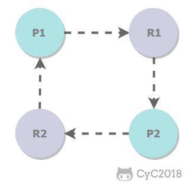

参考自https://github.com/CyC2018/CS-Notes 

# 死锁为什么存在

为保证多进程 ( 或多线程 ) 的安全性, 一个进程在使用临界资源 ( 互斥访问的资源 ) 的时候需要**对临界资源加锁,** 从而防止其他资源使用该临界资源. 当使用完后必须**解锁**才能让其他进程使用该临界资源（ 加锁 ）。

但在某些情况下，进程**无法对临界资源进行解锁，**其他进程无法完成加锁操作，就一直在等待状态。


# 死锁产生条件

- 互斥：每个资源要么已经分配给了一个进程，要么就是可用的，也就是说资源必须是临界资源。
- 占有和等待：已经得到了某个资源的进程可以再请求新的资源。
- 不可抢占：已经分配给一个进程的资源不能强制性地被抢占，它只能被占有它的进程显式地释放。
- 环路等待：有两个或者两个以上的进程组成一条环路，该环路中的每个进程都在等待下一个进程所占有的资源。

图例 R 为资源 P 为请求资源的进程



# 死锁示例代码

Transfer 为转账类i，实现了 Runnable 接口，可以被线程执行。

run() 方法中，为了保证 from 账户的扣钱操作和 to 账户的加钱操作具有原子性，需要用 synchronized 同时锁住 from 和 to 对象。

```java
public class Transfer implements Runnable {

    private final Account from;
    private final Account to;
    private final int amount;

    public Transfer(Account from, Account to, int amount) {
        this.from = from;
        this.to = to;
        this.amount = amount;
    }

    @Override
    public void run() {
        synchronized (from) {
            synchronized (to) {
                from.amount = from.amount - amount;
                to.amount = to.amount + amount;
                System.out.println("success");
            }
        }
    }
}

public class Account {
    int amount;
}
```

 启动了两个线程 t1 和 t2，并且新建两个账户 a1 和 a2，两个线程的转账对象不同。如果 t1 锁住 a1、t2 锁住了 a2， t1 想要锁住 a2、t2 想要锁住 a1，那么就出现环路等待。                                                                                                                                                                                                                                                                                                                                                                                                                                                                                                                                                                                                                                                                                                                                                                                                                                                                                                  

```java
public class DeadLock {
    public static void main(String[] args) {
        Account a1 = new Account();
        Account a2 = new Account();
        Thread t1 = new Thread(new Transfer(a1, a2, 10));
        Thread t2 = new Thread(new Transfer(a2, a1, 10));
        t1.start();
        t2.start();
    }
}
```


# 死锁处理

## 处理方法

- 鸵鸟策略 ： 不管死锁，大部分操作系统采用此方法， 忽略死锁
- 死锁检测与死锁恢复
- 死锁预防
- 死锁避免

##　死锁预防

 死锁预防是在程序运行之前通过某些手段从而保证不发生死锁。 


### 破坏互斥条件

 临界资源需要互斥访问，所以基本不能破坏互斥条件。但也可以使用一些手段来使得多个进程可以用共享的方式去使用临界资源。例如假脱机打印机技术允许若干个进程同时输出，唯一真正请求物理打印机的进程是打印机守护进程。 


### 破坏占有和等待条件

规定所有进程在开始执行前一次性获取全部资源

但这种方式会增加开销，并使得并发程度变低。

对于上例死锁代码：

```java
@Override
public void run() {
    synchronized (Account.class) {
        from.amount = from.amount - amount;
        to.amount = to.amount + amount;
        System.out.println("success");
    }
}
```


### 破坏不可抢占条件

规定在进程请求资源失败时， 释放它获得的所有资源


### 破坏环路等待

给资源统一编号，进程只能按编号顺序来请求资源。

但有些资源本身并不具有编号属性，如果加上编号的话，那么会让程序逻辑变得复杂。


## 死锁检测与死锁回复

 不试图阻止死锁，而是当检测到死锁发生时，采取措施进行恢复。 

主要由两种检测方法：超时检测和检测是否存在环路

 在检测到发生死锁之后，可以使用进程回退或者事务回滚等机制，释放获取的资源，之后再重新执行。 

**死锁恢复**：

- 利用抢占恢复
- 利用回滚恢复
- 通过杀死进程恢复

InnoDB 存储引擎使用检测是否存在环路方式检测死锁，并且将回滚操作代价小的事务进行回滚。

# 活锁与饥饿

 活锁是指进程互相谦让，都释放资源给别的进程，导致资源在进程之间跳动但是进程却一直不执行。 

 饥饿是指将低优先级的进程长时间请求不到所需要的资源。但是饥饿中进程最后可以请求到资源，只要不再有高优先级的进程使用资源，这和死锁有所不同。 