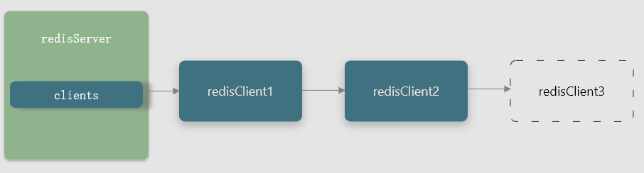

# Redis 介绍

REmote DIctionary Server(Redis) 是一个由Salvatore Sanfilippo写的key-value存储系统。

Redis是一个开源的使用ANSI C语言编写、遵守BSD协议、支持网络、可基于内存亦可持久化的日志型、Key-Value数据库，并提供多种语言的API。

它通常被称为数据结构服务器，因为值（value）可以是 字符串(String), 哈希(Hash), 列表(list), 集合(sets) 和 有序集合(sorted sets)等类型。


# 数据结构与对象

## String

Redis String 内部使用的 SDS（简单动态字符串）来进行编码，SDS 的定义为

```c
struct sdshdr {
    // 记录 buf 数组中已使用字节数量
    // 等于 SDS 所保存字符串的长度
    int len;
    // 记录 buf 数组未使用的字节数量
    int free;
    char buf[];
};
```

其相对于 C 字符串好处为

1. 获取字符串长度的复杂度为 $O(1)$
2. API 安全，不会造成缓冲区溢出
    1. 空间预分配
    2. 惰性空间释放
3. 修改字符串长度 N 次最多需要修改 N 次
4. 可以保存文本或者二进制数据

## 链表

List  列表底层实现之一就是链表，当一个列表将包含了数量较多的元素或者列表中包含的元素都是较长的字符串时，Redis 就会使用链表作为列表键的底层实现。

Redis 的链表是一个双端，无环，多态（支持多种数据类型）， 带链表长度，带头尾指针的链表。


## 压缩列表

zipList 是**列表和哈希**的底层实现之一。当一个列表键只包含少量列表项，而且每个列表项要么就是小整数值，要么为长度比较短的字符串，那么 Redis 就会使用压缩列表作为列表键底层实现。

压缩列表是为了节约内存开发的，由一系列特殊编码的连续内存块组成的顺序型数据结构。一个压缩列表可以包含任意多个节点（entry），每个节点可以保存一个字节数组或者一个整数值。

压缩列表组成部分

* zlbytes：记录整个压缩列表占用的内存字节数：用于对压缩列表进行内存重分配，或者计算 zlend 位置时使用
* zltail：记录压缩列表表尾节点距离压缩列表起始地址有多少字节：无需遍历压缩列表就可确定表尾节点地址
* zllen：记录压缩列表包含的节点数量：当这个属性值小于 65535 时，为节点数量，等于 65535 时需要遍历整个压缩列表才能得知
* entryX：列表节点
* zlend：特殊值，用于标记压缩列表末尾端

压缩列表节点构成 (entryX)

* previous_entry_length：记录前一个节点长度，可以通过指针运算根据当前节点起始地址计算出前一个节点的起始地址。

* encoding：记录节点 content 属性所保存数据类型以及长度
* content：保存节点的值

### 连锁更新

在压缩列表中，每个节点的 previous_entry_length 属性记录前一个节点的长度

1. 如果前一节点长度小于 254 字节，那么该属性需要用 1 字节长的空间保存这个长度值
2. 大于的话，则需要 5 字节空间保存长度值

当 e1 到 eN 节点都在 250 到 253 字节之间，此时 每个节点的 previous_entry_length 属性长度都为 1 字节。

插入一个大于 254 字节到 e1 到 eN 中间或者 e1 前时，会将之后所有节点的 previous_entry_length 全部更新为 5 字节，因为插入这个之后后面的字节全会被扩展到大于 254 字节。这种连续扩展空间就为连锁更新。

连锁更新会在插入或者删除节点时发生，最坏复杂度为 $O(n^2)$ 但是发生概率很低，条件苛刻。

所以可以认为 zipllistPush 等命令平均复杂度为 $O(n)$


## 字典（哈希）

Redis 字典底层使用哈希实现，一个哈希表里面可以有多个哈希表节点，而每个哈希表节点就保存了字典中的一个键值对，其实现为哈希表，哈希节点，字典

```c
typedef struct dictht {
    // 哈希表数组
    dictEntry **table;
    // 哈希表大小
    unsigned long size;
    // 哈希表大小掩码，用于计算索引值，总是等于 size - 1
    unsigned long sizemask;
    // 哈希表已有节点数量
    unsigned long used;
} dictht;

typedef struct dictEntry {
    // 键值对中的键
    void *key;
    // 键值对中的值，可以是 val 可以是指针，可以是 uint64_t 或 int64_t 整数
    union {
        void *val;
        uint64_t u64;
        int64_t s64;
    } v;
    // 指向下一个哈希表节点，形成链表
    struct dictEntry *next;
} dictEntry;

typedef struct dict {
    dictType *type;
    void *privdata;
    dictht ht[2];
    // rehash 索引，当 rehash 不在进行时，值为 -1
    int trehashidx;
} dict;

typedef struct dictType {
    // 计算哈希值函数
    unsigned int (*hashFunction) (const void *key);
    // 复制键函数
    void *(*keyDup) (void *privdata, const void *key);
    // 复制值函数
    void *(*valDup) (void *privdata, const void *obj);
    // 对比键函数
    int (*keyCompare) (void *privdata, const void *key1, const void *key2);
    // 销毁键函数
    void (*keyDestructor) (void *privdata, void *key);
    // 销毁值函数
    void (*valDestructor) (void *privdata, void *obj);
} dictType;
```

`dictEntry` 中 next 指针用于指向另一个哈希表节点，用于解决键冲突（拉链法），这个指针可以将多个哈希值相同的键值对连接起来。

`dict` 中 privdata 保存需要传给类型特定函数的可选参数， `ht` 属性为包含两个项的数组，一般情况下是使用 `ht[0] ` 的哈希表，`ht[1]` 是 rehash 操作中使用的。


### rehash

1. 为字典 `ht[1]` 分配空间，大小取决要执行的操作以及当前 `ht[0]` 包含的键值对 `ht[0].used` 
    1. 扩展操作：$ht[1]=ht[0].used*2$ 的 $2^n$ ，例如 ht[0].used = 4, 扩展时， ht[1] 大小则为 8，因为 8 刚好为 $2^3$ 
    2. 收缩操作：$ht[1]=ht[0].used$ 的 $2^n$ 
2. 将 `ht[0]` 中所有键值对 rehash 到 `ht[1]` 上
    * rehash 指重新计算键的哈希和索引值，然后将键值放到 `ht[1]` 指定位置上
3. 当 `ht[0]` 上所有键值都迁移到 `ht[1]` 上时，释放 `ht[0]`, 将 `ht[1]` 设置为 `ht[0]` 同时生成新的 `ht[1]`


### rehash 扩展和收缩触发时机

**扩展**

1. 服务器正在 BGSAVE 或者 BGREWRITEAOF 命令，且哈希表负载因子大于等于 5
2. 服务器不在进行上述命令操作，且哈希表负载因子大于等于 1

负载因子 `ht[0].used / ht[0].size`

**收缩**

服务器负载因此小于 0.1

### 渐进式 rehash

为了避免 rehash 对服务器性能造成影响，服务器不是一次性将 ht[0] 里面所有的键值对全部 rehash 到 ht[1]，而是分多次，渐进式地将 ht[0] 里面的键值对慢慢 rehash 到 ht[1];

1. 分配空间，让字典同时持有 ht[0] 和 ht[1] 两个哈希表
2. 是 rehashidx = 0 标记 rehash 工作开始，在 rehash 期间，每次对 redis 数据操作（CRUD）都会顺带将 ht[0] 在 rehashidx 索引上所有的键值对 rehash 到 ht[1] 上，rehash 完成后，将 rehashidx 增加一

渐进式 rehash 好处是分而治之，将庞大的一次性 rehash 的计算量分摊到对字典的每个删除，修改，查找，添加操作上。

> 由于有 ht[0], ht[1] 两个哈希表，每次删除，修改，查找操作时会同时在两个哈希表上进行，ht[0] 中没找到就去 ht[1] 中找，rehash 期间新添加的键一律放到 ht[1] 中


## 跳表

SkipList 是一种有序数据结构，查找复杂度平均 $O(logN)$ 最坏 $O(N)$ ，还可以通过顺序型操作来批量处理节点。

大多数情况下，跳表可以和平衡树媲美。

SkipList 是 Sorted Set （有序集合）的底层实现之一。

Redis 跳表由 `zskiplistNode` 和 `zskiplist` 两个结构定义

```c
typedef struct zskiplistNode {
    // 后退指针
    struct zskiplistNode *backward;
    // 分值
    double score;
    // 成员对象
    robj *obj;
    // 层
    struct zskiplistLevel {
        // 前进指针
        struct zskiplistNode *forward;
        // 跨度
        unsigned int span;
    } level[];
} zskiplistNode;

typedef struct zskiplist {
    // 表头节点和表尾节点
    struct zskiplistNode *header, *tail;
    // 表中节点的数量
    unsigned long length;
    // 表中层数最大的节点的层数
    int level;
} zskiplist;
```

**层 zskiplistLevel**

跳表节点的 level 数组可以包含多个元素，每个元素都包含一个指向其他节点的指针，程序可以通过这些层来加快访问其他节点的速度，一般来说，层数量越多，访问其他节点速度越快。

每个跳表节点被创建时，程序根据幂次定律（越大的数出现概率越小）随机生成一个 1 到 32 之间的值作为 level 数组大小。


**前进指针**

每层都有一个前进指针用于从表头到表尾访问节点。


**跨度**

`level[i].span` 用于记录两个节点之间的距离。

该属性用于计算排位（rank）：查找某个节点过程中将沿途访问过所有层的跨度累计起来，得到的结果就是目标节点再跳表中的排位。


**后退指针**

用于表尾到表头遍历，每个节点只有一个后退指针如上图所示。


**分值和成员（score 和 obj）**

分值为一个浮点数，跳表中所有节点都按分值从小到大排序

成员对象为一个指针，它指向一个字符串对象，字符串对象则保存一个 SDS 值。


## 整数集合（intset）

intset 是集合键（Set）的底层实现之一，当集合键只包含整数元素，并且数量不多时会使用 intset 作为底层实现。

intset 是 Redis 保存整数值的集合抽象数据结构，他可以保存类型为 `int16_t, int32_t, int64_t` 的整数值，并且保证集合中不会出现重复元素。其定义如下

```c
typedef struct intset {
    // 编码方式
    uint32_t encoding;
    // 集合包含的元素数量
    uint32_t length;
    // 保存元素的数组
    int8_t contents[];
} intset;
```

`contents` 数组是整数集合的底层实现：整数集合每个元素都是 contents 数组的一个数组项（item），各个项在数组中按值的大小从小到大有序排列，并且数组中不包含重复项。

`encoding` 表示 `contents` 中存储元素的类型。

### 升级

每当添加一个新元素到整数集合中，并且新元素类型比现有所有类型都要长时，整数集合需要进行升级，然后将新元素添加到整数集合中。

1. 根据新元素类型，扩充整数集合底层数组的空间大小，并为新元素分配空间。
2. 将底层所有元素都转换成和新元素相同的类型，并且转换后底层有序性不变
3. 将新元素添加到底层数组中

整数集合不支持降级操作


## Redis 对象

编码以及底层实现

```c
typedef struct redisObject {
    // 类型
    unsigned type:4;
    // 编码
    unsigned encoding:4;
    // 指向底层实现数据结构的指针
    void *ptr;
    // 引用计数
    int refcount;
    // 记录对象最后一次被命令程序访问的时间
    unsigned lru:22;
} robj;
```


1. String **字符串**

    比如说记录微博数，粉丝数等。

    内部编码：`int`, `raw`, `embstr`， embstr 保存长度小于 44 字节的字符串

2. Hash **字典**

    可以用于存储用户信息和商品信息

    内部编码：HT（拉链法），ZipList（压缩表）

3. List **列表**

    比如微博的关注列表，粉丝列表，消息列表等功能

    内部编码：QuickList（Ziplist【特殊编码（二进制）双向链表】 + 双向链表）

4. Set **集合**

    例如应用有共同关注、共同粉丝、共同喜好等

    内部编码：HT， INTSET

5. Sorted Set **有序集合** ( Zsest )

    用户列表，礼物排行榜，弹幕消息等应用

    内部编码：SkipList，ZipList

### 垃圾回收

Redis 采用引用计数实现内存回收机制，被引用加 1， 不再被引用减 1，计数变为 0 时被释放

### 对象共享

对象的引用计数属性还带有对象共享作用，将新建的键值对指向现有值对象，该对象计数加 1，该方法可以节约内存。

Redis 在服务创建时创建 10000 个字符串对象， 0 到 9999 的值为共享对象。

### 空转时长

redisObject 包含一个属性为 lru 的属性，记录对象最后一次被命令程序访问的时间

OBJECT IDLETIME 命令可以打印给定键的空转时长，这一时长就是由当前时间减去键的值对象的 lru 时间计算得出的，该命令不会修改 lru 属性


# 单机数据库

## 数据库

### 切换数据库

Redis 服务器将所有数据库都保存在服务器状态 `redis.h/redisServer` 结构的 db 数组中，db 数组中每个项都代表一个数据库。

初始化服务器时，程序会根据服务器状态的 dbnum 属性来决定应该创建多少个数据库。

每个 Redis 客户端都有自己的目标数据库，当客户端执行数据库读写命令时，目标数据库就会成为这些命令操作对象，默认情况 Redis 客户端操作 0 号数据库，但是在使用时，客户端可以使用 `SELECT` 命令切换数据库，`SELECT` 通过修改 `redisClient.db` 指针让他指向服务器中的不同数据库，从而实现切换目标数据库功能。

> 客户端的 Redis 不显示当前数据库标号，所以对数据库进行操作时最好先执行 SELECT 命令

### 数据库操作

Redis 是一个键值对数据库服务器，其中 `redisDb` 结构的 dict 字典保存了数据库所有的键值对，该字典为键空间（key space）

**添加键**

```redis
SET message "helloworld"
```

添加了一个 key 为 data ，value 为 2013.12.1 的键值对入库

**删除键**

```redis
DEL book
```

删除键 book 以及他的值

**更新键**

```redis
SET message "bla bla"
```

message 的值由 helloworld 修改为 blabla

```redis
HSET message page 320
```

message 的值对象将被更新新增一个 page 键字段。page 键，值为 320

**查找键**

```redis
GET message
```

查找键为 message 的值

```redis
LRANGE albphabet 0 -1
```

遍历键为 albphabet 的列表值。


### TTL

#### 设置键的过期时间和生存时间

通过 `EXPIRE`  或者 `PEXPIRE` 命令，客户端可以以秒或者毫秒精度为数据库中的某个键设置生存时间（Time To Live，TTL），在过了指定时间后，服务器就会自动删除生存时间为 0 的键。

> SETEX 命令可以设置一个字符串键同时设置过期时间，但是只能对于字符串键

通过 `EXPIREAT` 和 `PEXPIREAT` 命令，以秒或者毫秒精度给数据库中某个键设置过期时间（expire time）

过期时间设定为一个 UNIX 时间戳，当键的过期时间来临时，服务器就会自动删除这个键。

`TTL` 和 `PTTL` 命令可以接受一个带生存时间的 key，返回还有多少生存时间。

> Redis 有 4 个命令来设置过期时间，EXPIRE 和 EXPIRE 设置为秒级别，PEXPIRE 和 PEXPIREAT 设置为毫秒级别，但源码中全部都是使用 PEXPIREAT 命令实现的，客户端执行这 4 个命令都会转化为 PEXPIREAT 命令

**保存过期时间**

redisDb 结构的 expires 字典保存了数据库中所有键的过期时间，被称为过期字典：

* 键为一个指针，指向键空间的某个键对象
* 值为 long long 类型表示一个 UNIX 时间戳

**移出过期时间**

PERSIST 可移除一个键的过期时间

其操作为在过期字典中查找给定的键，并解除键和值（过期时间）在过期字典中的关联

#### 过期键删除策略

Redis 采用定期删除和惰性删除两种策略，搭配两种删除策略可以合理使用 CPU 时间和避免浪费内存空间之间取得平衡。

1. 惰性删除：只在取出键时才对键进行过期检查。其对内存不友好，如果有大量键过期且不被使用会浪费很多内存
2. 定期删除：每隔一段时间执行一次删除过期键操作，并限制删除操作执行的时长和频率来减少删除操作对 CPU 时间的影响。

Redis 定期删除实现为在规定时间内分多次遍历服务器中的各个数据库，从数据库的过期字典中随机检查一部分键的过期时间并删除其中的过期键。其有几个特点

1. 每次运行函数，从一定数量数据库中取出一定数量的随机键进行检查，并删除其中的过期键
2. 全局变量 current_db 会记录当前函数检查的进度，并在下一次调用时接着上一次进度进行处理
3. 随着 `activeExpireCycle` 函数不断执行，服务器中所有数据库都将被检查一遍，此时全局变量置为 0，开启新一轮检查

#### AOF 和 RDB 对过期键的处理

**RDB**

1.  生成 RDB 文件时，程序会对数据库中键进行检查，已过期的键不会保存到新 RDB 文件中
2. 载入 RDB 文件时
    1. 如果启动的是**主服务器**则会对 RDB 键进行检查，已过期的键不会被载入到数据库中
    2. 如果是从服务器，则不进行检查，将键全部载入到数据库中，因为主从同步时，从服务器数据会被删除。

**AOF**

1. AOF 写入时，如果键已经过期当没有被惰性或者定期删除，那么 AOF  不会被这个过期键而产生任何影响，如果被惰性或者定期删除了，AOF 中会被追加一条 DEL 命令，显示表示该键已经被删除
2. AOF 重写时，执行 AOF 重写会检查键，如果已过期则不会写入到 Redis 数据库中

#### 复制模式对过期键的处理

复制模式下时，从服务器的过期键删除动作由主服务器控制：

* 主服务器删除一个过期键后，会显示地向所有从服务器发送 DEL 指令，通知删除过期键
* 从服务器再接收客户端发送的读命令时，即使碰到过期键也不会处理，除非接收到主服务器的通知

### 通知机制

客户端可以订阅给定的频道或者模式，来获知数据库中键的变化，以及数据库中命令的执行情况。


## RDB 持久化

RDB 是将 Redis 内存中的数据库状态保存到一个 RDB 文件中保存到磁盘里面，防止数据意外丢失，RDB 持久化既可以手动执行，也可以根据服务器配置选项定期执行。

RDB 文件是一个经过压缩的二进制文件，通过该文件可以还原生成 RDB 文件时的数据库状态。


### RDB 文件创建与载入

**创建**

Redis 有两个命令可以用于生成 RDB，一个是 SAVE，另一个是 BGSAVE

SAVE 调用时会阻塞 Redis 服务器进程直到 RDB 文件创建完毕，服务器阻塞期间，服务器不接受任何请求。

BGSAVE 则是派生一个子进程，然后子进程负责创建 RDB 文件，父进程继续接受客户端请求。


SAVE 和 BGSAVE 底层都是调用 `rdb.c/rdbSave` 函数，区别在于调用方法不同:

```python
def SAVE():
    rdbSave()

def BGSAVE():
    pid = fork()
    if pid == 0:
        rdbSave()
        # 完成后向父进程发送通知
        signal_parent()
    elif pid > 0:
        # 父进程继续处理命令请求，并且轮询等待子进程信号
        handle_request_and_wait_signal()
    else:
        # 处理异常
        handle_fork_error()
```

* SAVE 命令执行时，服务器阻塞，阻塞所有请求

* BGSAVE 命令执行时，会拒绝 SAVE, BGSAVE 命令，BGREWRITEAOF 会被延后到 BGSAVE 命令执行完后执行。

    如果正在执行 BGREWRITEAOF 命令则会拒绝 BGSAVE 命令

**载入 RDB** 

RDB 载入是在服务器启动时自动进行的，启动时检测到了 RDB 文件就会自动载入。服务器启动时会调用 `rdbLoad()`

> 如果服务器开启了 AOF 持久化，服务器会优先使用 AOF 文件还原服务器数据状态。
>
> 只有关闭了 AOF 持久化， 服务器才会使用 RDB 来还原数据库状态

载入时会处于阻塞状态。

### 自动保存设置

用户可以通过设置 save 选项设置多个保存条件，只要其中一个被满足服务器就会自动执行 BGSAVE 命令。如果用户没有设置条件，那么服务器会自动为 save 设置默认选项:

```redis
save 900 1
save 300 10
save 60 10000
```

save 后面为秒数，在后面为修改数据库次数，第一条意思为 900 s 内对数据库修改次数超过 1 次。

服务器会根据 save 选项设置的条件，设置服务器状态 `redisServer` 结构的 `saveparams` 属性, `saveparams` 是一个数组，存储`saveparam` 类型

```c
struct redisServer {
    ...
    struct saveparam *saveparams;
    ...
};
struct saveparam {
    // 时间：秒数
    time_t seconds;
    int changes;
};
```

除了 saveparams 数组外，redisServer 还维持一个 dirty 计数器以及一个 lastsave 属性

* dirty 计数器记录距离上一次 SAVE 或者 BGSAVE 命令后，服务器对数据库进行了多少次修改
* lastsave 属性是一个 UNIX 时间戳，记录服务器上一次成功执行 SAVE 命令或者 BGSAVE 命令的时间

**检测 save 条件**

Redis 周期性调用函数 `serverCron` 默认每隔 100 毫秒就执行一次对服务器维护，其中一项检查为服务器是否已满足 save 条件，满足则执行 BGSAVE 命令。


### RDB 文件结构


RDB 文件由以上 5 个部分组成

1. REDIS 是为了程序载入文件时，快速检查载入的文件是否是 RDB 文件
2. db_version 表示 RDB 文件的版本号 
3. database 部分包含零个或任意多个数据库，以及各个数据库中键值对数据，由以下几部分组成
    1. SELECTDB：长度 1 字节，读入程序遇到这个值时，它知道接下来是一个数据库号码
    2. db_number：保存一个数据库号码，读入该值后会执行 SELECT  命令
    3. key_value_paris：保存数据库中的所有键值对数据，如果键值对带有过期时间，那么过期时间也会和键值对保存到一起。
        1. EXPIRETIME_MS 带过期时间的键值对的开头，表示接下来要读取过期时间
        2. ms：记录 UNIX 时间戳表示过期时间
        3. TYPE：表示键值对的类型
        4. key：键
        5. value：值
4. EOF 长度 1 字节，标志 RDB 正文内容结束
5. check_sum 校验和检查 RDB 是否出错或损坏


## AOF 持久化

除了 RDB 持久化，Redis 还有 AOF 持久化功能，AOF 是通过保存 Redis 服务器所执行的写命令来记录数据库状态


### 实现

AOF 功能可以分为命令追加（append）、文件写入、文件同步（sync）三个步骤

**命令追加**

服务器执行完一个写命令后，以协议格式将被执行的写命令追加到服务前状态的 `aof_buf` 缓冲区末尾：

```c
struct redisServer {
    // ...
    sds aof_buf;
    // ...
};
```


**AOF 写入与同步**

Redis 服务器进程就是一个事件循环（loop），循环中文件事件负责接收客户端的命令请求，以及向客户端发送命令恢复，时间事件则负责实行像 `serverCron` 函数这样的需要定期运行的函数。

由于服务器在处理文件事件可能会执行写命令，追加一些内容到 `aof_buf` 缓冲区上，所以服务器每次结束一个时间循环之前，他都会调用 `flushAppendOnlyFile` 考虑是否将 `aof_buf` 缓冲区中的内容写入和保存到 AOF 文件中。

其行为由服务器配置的 appendfsync 选项值来决定

1. always：直接将 aof_buf 缓冲区写入并同步到 AOF 中
2. everysec：如果距离上次超过 1 s，则对 AOF 进行同步
3. no：将 aof_buf 缓冲区中所有内容写入 AOF 中，但由操作系统决定何时同步

### AOF 文件的载入与数据还原


### AOF 重写

AOF 持久化模式再随着服务器运行时间的流逝，内容会越来越多，文件体积也越来越大，会影响宿主计算机以及载入时间加长。

Redis 提供了 AOF 文件重写功能，通过该功能 Redis 服务器可以创建一个新的 AOF 文件来提到现有的 AOF 文件，新旧两个 AOF 文件保存数据库状态相同，但是新 AOF 文件会删除冗余命令，所以体积会比旧的小很多。

**重写原理**

AOF 文件重写不需要对现有的 AOF 文件进行任何读取、分析、写入操作，是直接读取服务器当前服务器状态实现的，只包含还原当前服务器状态所必须的命令。

> 为了避免执行命令时造成客户端输入缓冲区溢出，重写程序在处理列表、哈希表、集合 、有序结合时会检测键的元素数量如果超过了 `redis.h/REDIS_AOF_REWRITE_ITEMS_PER_CMD` 值时会使用多条命令来记录键的值。目前该值为 64

**后台调用**

AOF 重写程序 `aof_rewrite` 函数可以很好的创建一个新 AOF 文件，当时会进行大量的写入操作，所以调用这个函数的线程将被长时间阻塞。所以 Redis 将 AOF 重写程序放到子进程中执行，可以有两个好处

1. AOF 重写期间，父进程可以继续处理命令请求
2. 子进程带有服务器进程的数据副本，使用子进程而不是线程可以避免使用锁的情况下也能保持数据安全性

> 子进程 AOF 重写进行期间，父进程还会处理请求，新命令可能会对现有数据库状态进行修改从而使得当前和重写后 AOF 文件状态不一致。

为了解决不一致问题，Redis 服务器设置一个 AOF 重写缓冲区，新命令来的时候会同时写入 AOF 缓冲区和 AOF 重写缓冲区。


## 事件

Redis 服务器是一个事件驱动程序，服务器需要处理以下事件：

* 文件事件（file event）：Redis 服务器通过套接字与客户端（或者其他 Redis 服务器）进行连接，文件事件就是服务器对套接字操作的抽象。服务器与客户端（或者其他服务器）通信会产生响应的文件事件，服务器通过监听并处理这些事件来完成一系列网络通信操作。
* 时间事件（time event）：Redis 服务器中的一些操作（比如 `serverCron` 函数）需要在给定时间点执行，而时间事件就是服务器对这类定时操作的抽象。

### 文件事件

Redis 基于 Reactor 模式开发了自己的网络事件处理器：文件处理处理器（file event handler）：

* 使用了 I/O 多路复用同时监听多个 socket，并为其配置不同事件处理器
* 当被监听的 socket **准备好执行**连接应答（accept），读取（read），写入（write）、关闭（close）等操作时，与操作相对应的文件事件就会产生，这时**文件事件处理器**就会调用 socket 之前**关联的事件处理器**来处理这些事件

I/O 多路复用可以保持高性能网络通信模型，又可以很好的与 Redis 中其他单线程运行的模块对接，保持了 Redis 内部单线程设计的简单性。


**文件事件处理器组成**


**I/O 多路复用的实现**

其功能是通过包装常见的 `select,  epoll, evport, kqueue` 这些 I/O 这些多路复用库来实现的。

Redis 在 I/O 多路复用程序用 #include 宏定义相应规则，程序会在编译时自动选择系统中性能最高的 I/O 多路复用函数库。

**事件类型**

* 当套接字变得可读时，套接字产生 AE_READABLE 事件
* 变得可写时（write），套接字产生 AE_WRITABLE 事件

当套接字可读又可写时，服务器先读后写。

**文件事件处理器**

* 对连接服务器的各个客户端进行应答，服务器要为监听套接字关联**连接应答处理器**  （包装 accept）返回 AE_READABLE 
* 接收客户端的命令请求，则关联**命令请求处理器** （包装 read 方法）返回 AE_READABLE 
* 向客户端返回命令执行结果，关联**命令回复处理器** （包装 write 方法）返回 AE_WRITABLE 


### 时间事件

Redis 时间事件分为以下两类：

* 定时事件：一段程序在指定时间之后执行一次
* 周期事件：一段程序每隔指定时间执行一次

时间事件由以下三个属性组成

1. id：全局 ID
2. when：UNIX 时间戳，记录时间事件到达时间
3. timeProc：时间事件处理器
    1. 返回 `ae.h/AE_NOMORE` 那么该事件为定时事件
    2. 否则为周期事件，服务器会根据返回值重新设定 when 时间点

目前 Redis 只使用周期性事件，没有定时时间。


**实现**

服务器将所有时间事件放在一个无序链表中，每当时间执行器运行时，它就遍历整个链表，查找已到达的时间事件，并调用相应的时间处理器。

> 无序链表为不按 when 属性排列的链表。
>
> 其并不影响时间执行器的性能，因为当前 Redis 服务器只使用一个 serverCron 一个时间事件，benchmark 模式下，服务器也只使用两个时间事件。

**实例 **

**serverCron 函数**

Redis 定期对自身资源和状态进行检查和调整，确保服务能长期运行，该函数便为 `redis.c/serverCron` 函数，它的主要工作包括：

* 更新服务器统计信息：时间、内存占用、数据库占用等情况
* 清理数据库中过期的键值对
* 关闭和清理连接失效的客户端
* 尝试进行 AOF 或者 RDB 持久化
* 如果服务器是主服务器，就对从服务器进行定期同步
* 如果处于集群模式，对集群进行定期同步和连接测试

### 事件的调度与执行

Redis 对何时处理文件事件，何时处理时间事件，即对事件的调度与执行由 `ae.c/aeProcessEvents` 函数负责，伪代码为：

```python
def aeProcessEvents():
    # 获取到达时间距离现在最近的时间事件
    time_event = aeSearchNearestTimer()
    # 计算最接近的时间事件距离现在多少毫秒
    remained_ms = time_event.when - unix_ts_now()
    # 如果已经到达 remained_es 可能为负数，则需要将其置零
    if remained_ms < 0:
        remained_ms = 0
    # 根据 remained_ms 值，创建 timeval 结构
    timeval = create_timeval_with_ms(remained_ms)
    # 阻塞并等待文件事件产生，最大阻塞时间由传入的 timeval 结构决定
    # 如果 remained_ms 的值为 0， 那么 aeApiPoll 调用后马上返回，不阻塞
    aeApiPoll(timeval)
    # 处理已产生的文件事件
    processFileEvents()
    # 处理已到达的时间事件
    processTimeEvents()
```

aeProcessEvents 处于循环中，加上初始化和清理函数就是 Redis 服务器的主函数。

其调度和执行规则如下

1. aeApiPoll 函数阻塞由到达时间最接近的时间事件决定，既可以避免服务器对时间事件进行频繁的轮询，也可以确保    aeApiPoll 函数不会阻塞过长时间
2. 因为文件事件是随机的，如果一个文件事件处理完后没有时间事件到来，那么会继续处理下一个文件事件
3. 对文件事件和时间事件处理都是同步、有序、原子的执行的，服务器不会中断时间处理也不会对事件进行抢占，因此为了防止事件饿死，文件事件处理器和时间事件处理器都会尽可能地减少程序阻塞时间，并在必要时让出执行权
4. 因为时间事件在文件事件之后进行而且事件之间不会抢占，所以时间事件实际处理时间比时间事件设定的晚一些

## 客户端

Redis 服务器是一对多服务器，一个服务器可以与多个客户端建立连接。内部通过 I/O 多路复用对客户端命令进行回复。

Redis 服务器状态结构的 clients 属性是一个链表，这个链表保存了所有与服务器连接的客户端的状态结构，对客户端进行批量操作。其内部结构大致为：


### 属性

```c
typedefc struct redisClient {
    // 套接字文件描述符
    int fd;
    // 名字，是一个指针默认为 null，可以自己设定
    robj *name;
    // flags 记录客户端角色以及客户端目前所处的状态
    int flags;
    // querybuf 输入缓冲区保存客户端发送的命令请求
    sds querybuf;
    // argv 为客户端命令参数
    // 是一个数组， argv[0] 为命令，后面为该命令的参数
    robj **argv;
    // argc 客户端命令参数个数
    int argc;
    // cmd 命令的实现函数
    struct redisCommand *cmd;
    // buf 和 bufpos 表示固定输出缓冲区
    // buf 默认大小为 16kb，bufpos 表示目前使用了多少字节
    char buf[REDIS_REPLY_CHUNK_BYTES];
    int bufpos;
    // reply 表示可变输出缓冲区
    // 用链表来保存多个字符串对象，服务器可以为客户端保存一个非常长的命令回复
    list *reply;
    // authenticated 身份验证，记录客户端是否通过了身份验证
    int authenticated;
    // ctime 属性记录了创建客户端的时间，可以计算客户端和服务器连接了几秒
    time_t ctime;
    // lastinteraction 记录客户端和服务器最后一次进行互动
    time_t lastinteraction;
    // obuf_soft_limit_reached_time 记录输出缓冲区第一次到达软性限制（soft limit）的时间
    time_t obuf_soft_limit_reached_time;
} redisClient;
```

### 创建和关闭客户端

**创建**

客户端使用 connect 函数连接服务器时，服务器会调用连接事件处理器，为客户端创建客户端状态，并将该客户端状态添加到服务器状态结构 clients 的末尾。



**关闭**

可以有多种原因被关闭

1. 客户端进程退出或被杀死

2. 客户端发送了带有不符合协议格式的命令请求

3. 客户端成为了 CLIENT KILL 命令目标

4. 用户为服务器设置了 timeout 配置选项，客户端空转时间超过了 timeout 选项设置的值时。

    例外情况：客户端是主服务器（打开了 REDIS_MASTER 标志），从服务器（REDIS_SLAVE），正在被 BLPOP 等命令阻塞（打开了 REDIS_BLOCKED 标志），或者正在执行订阅命令，即使超过了也不会被关闭

5. 客户端发送命令请求大小超过了输入缓冲区限制大小（默认 1 GB）

6. 服务器发送给客户端的命令回复大小超过了输出缓冲区限制大小

    服务器用两种模式限制客户端输出缓冲区的大小

    * 硬性限制（hard limit）：如果输出缓冲区大小超过了硬性限制所设置的大小，那么服务器立即关闭客户端
    * 软性限制（soft limit）：输出缓冲区大小超过了软性限制所设置的大小，但没超过硬性限制，那么服务器就会使用 obuf_soft_limit_reached_time 记录时间，如果持续时间超过了服务器设定的时长则会被关闭

### 伪客户端

**Lua 脚本客户端**

服务器会在初始化的时候创建负责执行 Lua 脚本中包含 Redis 命令的伪客户端，并关联在服务器状态结构的 lua_client 属性中:

```c
struct redisServer {
    //...
    redisClient *lua_client;
    //...
};
```

该伪客户端会在服务器运行的整个生命期一直存在，只有服务器被关闭的时候才会被关闭

**AOF 伪客户端**

服务器载入 AOF 时，会创建用于执行 AOF 文件中 Redis 命令的伪客户端


## 服务器

### 命令请求的执行过程

**1.发送命令请求**

用户键入一个命令请求 -> 客户端 -> 服务器

客户端将命令请求转换成协议格式然后发送给服务器。

**2.读取命令请求**

当客户端与服务器之间的连接套接字因为客户端的写入而变得可读时，服务器将调用命令请求处理器执行以下操作

1. 读取套接字中协议格式的命令请求，将其保存到客户端状态的输入缓冲区中
2. 对输入缓冲区的命令请求进行分析，提取命令请求中的命令参数，以及参数个数然后将其保存在 `argv` 和 `argc` 属性中
3. 调用**命令执行器**，执行客户端命令

**3.命令执行器**

1. 查找命令实现

    根据客户端状态的 `argv[0]` 参数，在命令表（command table）中查找参数所指定的命令，并将找到的命令保存到客户端状态的 cmd 属性中。

    > 命令表是一个字典，键为命令名字，值为 redisCommand 结构，记录了 Redis 命令的实现信息

2. 执行预备操作

    确保命令可以正确、顺利地被执行

    1. 检查客户端状态 cmd 指针是否指向 NULL
    2. 根据 cmd 属性指向的 redisCommand 结构的 arity 属性，检查命令请求的参数个数是否正确
    3. 检查客户端是否通过了身份验证
    4. 如果服务器打开了 maxmemory 功能，那么需要先检测服务器的内存占用情况
    5. 服务器上一次执行 BGSAVE 命令时出错，并且服务器打开了 `stop-writes-on-bgsave-error` 功能，并且是一个写命令的话，则会拒绝执行
    6. 客户端正在用 SUBSCRIBE 命令订阅频道，或者正在用 PSUBSCRIBE命令订阅模式，那么服务器只会执行 SUBSCRIBE, PSUBSCRIBE, UNSUBSCRIBE, PUNSUBSCRIBE 命令
    7. 服务器正在进行数据载入，那么客户端发送的命令必须带有 l 标识才会被服务器执行
    8. 服务器因为执行 Lua 脚本而超时进入阻塞状态，那么服务器只会执行客户端的 SHUTDOWN nosave 命令和 SCRIPT KILL 命令，其他命令会被服务器拒绝
    9. 客户端正在执行事务，那么服务器只执行客户端的 EXEC, DISCARD, MULTI, WATCH 四个命令，其他命令会被放进事务队列中
    10. 服务器打开监视器功能，那么服务器会将要执行的命令和参数等信息发送给监视器

3. 调用命令的实现函数

    只需要执行 `client->cmd->proc(client)` 即可

4. 执行后续工作

    1. 如果服务器开启了慢查询日志功能，那么慢查询日志模块会检查是否需要添加一条心的慢查询日志
    2. 根据刚刚执行命令所耗费的时长，更新被执行命令的 `redisCommand` 结构的 `milliseconds` 属性，并将命令的 `redisCommand` 结构的 calls 计数器的值增一。
    3. 如果服务器开启了 AOF持久化功能，那么会将刚刚执行的命令请求写入到 AOF 缓冲区中
    4. 如果有从服务器复制该服务器，那么服务器会将刚刚执行的命令传播给所有从服务器

**4.客户端接收并打印命令回复**

客户端收到协议格式的命令回复后，它会将这些回复转换成人类可读的格式，共打印给用户观看


### serverCron 函数

Redis 服务器中的 serverCron 函数每隔 100 毫秒执行一次。redisServer 状态结构体如下

```c
struct redisServer {
    //...
    // 精确到秒级的 unix 时间戳
    time_t unixtime;
    // 保存毫秒级 unix 时间戳
    long long mstime;
    
    // 默认每 10 s 更新一次时钟缓存，
    // 用于计算键的空转（idle）时长
    unsigned lruclock:22;
    
    // 上次进行抽样的时间
    long long ops_sec_last_sample_time;
    // 上一次抽样时，服务器已执行命令的数量
    long long ops_sec_last_sample_ops;
    // REDIS_OPS_SEC_SAMPLES 大小的环形数组（默认值为 16）
    // 数组中每个项都记录一次抽样结果
    long long ops_sec_samples[REDIS_OPS_SEC_SAMPLES];
    // ops_sec_samples 数组的索引值
    // 每次抽样后将值自增一
    // 在值等于 16 时重置为 0
    int ops_sec_idx;
    
    // 已使用内存峰值
    size_t stat_peak_memory;
    
    // 关闭服务器标识
    // 1 关闭
    // 0 不做任何操作
    int shutdown_asap;
    
    // 如果值为 1， 那么表示有 BGREWRITEAOF 被延迟了
    int aof_rewrite_scheduled;
    
    // 记录 rdb 子进程 pid，该值为 -1 则没有执行 BGSAVE
    pid_t rdb_child_pid;
    // 记录 aof 子进程 pid，该值为 -1 则没有执行 BGREWRITEAOF
    pid_t aof_child_pid;
    
    // cronloops 记录 serverCron 函数运行次数
    int cronloops;
}
```

以下是 serverCron 函数执行的操作

#### 更新服务器时间缓存

Redis 服务器很多功能需要获取系统当前时间，而每次获取系统的当前时间都需要一次系统调用，为了减少系统调用的执行次数，服务器状态中的 `unixtime` 属性和 `mstime` 属性被用作当前时间的缓存。

serverCron 函数默认每 100 毫秒一次的频率更新 unixtime 和 mstime 属性，所以这两个属性时间精度不高：

1. 服务器在打印日志，更新服务器 LRU 时钟，决定是否执行持久化任务，计算服务器上线时间（uptime）这类对精度不高的情况使用以上两个属性
2. 对于为键设置过期时间，添加慢查询日志这种需要高精度时间的功能，服务器会执行系统调用

#### 更新 LRU 时钟

服务器状态中的 `lruclock` 属性保存了服务器的 LRU 时钟，这个属性和上面介绍的 unixtime 属性，mstime 属性一样是服务器时间缓存的一种，每个 redis 对象都有一个 lru 属性，这个 lru 属性保存了对象最后一次被命令访问的时间：

```c
typedef struct redisObject {
    //...
    unsigned lru:22;
    //...
} robj;
```

当服务器要计算数据库键的空转时间，会将服务器 `lruclock` 属性减去对象的 `lru` 属性结果变为空转时间。

serverCron 默认每 10s 更新一次 lruclock 值

#### 更新服务器每秒执行命令次数

serverCron 函数中的 `trackOperationsPerSecond` 函数以每 100 毫秒一次的频率执行，这个函数功能是以抽样计算的方式，估算并记录服务器在最近一秒钟处理的命令请求数量。

#### 更新服务器内存峰值记录

每次 serverCron 函数执行，程序会查看服务器当前内存使用量，并与 `stat_peak_memory` 进行比较，比它大时将其替换。

#### 处理 SIGTERM 信号

启动服务器时，Redis 会为服务器进程的 SIGTERM 信号管理处理器 `sigtermHandler` 函数，当这个函数接收到 SIGTERM 信号时，会打开服务器状态的 `shutdown_asap` 标识

#### 管理客户端资源

serverCron 每次都会调用 `clientsCron` 函数，该函数会做以下检查

* 如果客户端和服务器之间的连接已经超时，那么程序释放这个客户端
* 如果客户端在上一次执行命令请求之后，输入缓冲区的大小超过了一定大小，那么程序会释放客户端当前的输入缓冲区，并重新创建一个默认大小的输入缓冲区，防止输入缓冲区耗费太多内存

#### 管理数据库资源

每次会调用 `databasesCron` 函数，该函数会删除过期键并对字典进行收缩操作。

#### 执行被延迟的 BGREWRITEAOF

如果当前 BGSAVE 或者 BGREWRITEAOF 命令都没有执行，就根据 aof_rewrite_scheduled 值来执行推迟的命令

#### 检查持久化运行状态

通过 `rdb_child_pid` 和 `aof_child_pid` 两个属性值检测持久化状态，来对命令和后续进行判断

#### 将 AOF 缓冲区内容写入 AOF 文件

如果 AOF 缓冲区有内容，则将其写入 AOF 文件中

#### 关闭异步客户端

服务器关闭那些输出缓冲区大小超过限制的客户端

#### 更新 cronloops 计数器

cronloops 属性作用为在复制模块中实现 每执行 serverCron 函数 N 次就执行一次指定代码的功能

### 初始化服务器

初始化服务器有以下过程

1. 初始化服务器状态结构 `redisServer` 通过 `initServerConfig` 完成
2. 载入配置选项
3. 初始化服务器数据结构
4. 还原数据库状态
5. 执行事件循环

# 多机数据库

## 复制

在 Redis 中， 用户可以通过执行 SLAVEOF 命令或者设置 slaveof 选项，让一个服务器去复制（replicate）另一个服务器。则被复制的服务器为 **主服务器**（master），复制的为从服务器（slave）。

### 旧版复制实现

Redis 复制分为同步（sync）和命令传播（command propagate）两个操作

**同步**

1. 从服务器向主服务器发送 SYNC 命令
2. 主服务器收到后执行 BGSAVE 生成一个 RDB 文件，并声明一个缓冲区记录此时的所有写命令
3. 主服务器生成完 RDB 后会将其发送给从服务器，从服务器读取并载入
4. 主服务器将缓冲区中所有写命令发送给从服务器，从服务器执行这些命令，使自己数据库状态更新和主服务器当前状态一致


**命令传播**

同步命令执行完后，主从服务器后续还需要完成一致，所以主服务器需要对从服务器执行命令传播操作：主服务器会将自己执行的写命令发送给从服务器。

**旧版复制功能缺陷**

旧版在主从同步时，当从服务器断线重连后，需要再次使用 SYNC 进行同步，效率非常低

> SYNC 是一个非常耗费资源的操作，生成 RDB 文件会耗费主服务器大量 CPU、内存和磁盘 I/O 资源
>
> 发送 RDB 给从服务器会耗费从服务器的网络资源并对主服务器响应命令请求的时间产生影响
>
> 从服务器载入 RDB 文件时会由于阻塞无法处理命令请求


### 新版复制实现

新版复制是为了解决旧版复制中处理断线后重新复制情况下的低效问题，Redis 使用 PSYNC 命令代替了 SYNC 命令来执行复制时的同步操作。

PSYNC 有完整重同步和部分重同步两种模式

* 其中完整重同步处理初次同步的问题
* 部分重同步用于处理断线后重复制的问题

SYNC 命令需要生成、传送、载入 RDB 文件，部分重同步只需要将从服务器缺少的写命令发送给从服务器执行就可以了。


#### 部分重同步实现

部分重同步有以下三个部分构成

* 主服务器的复制偏移量和从服务器的复制偏移量
* 主服务器的复制积压缓冲区
* 服务器运行 ID

**复制偏移量**

主服务器和从服务器会分别维护一个复制偏移量：

主从服务器每次发送和接受 N 个字节的数据时，就将自己的复制偏移量的值加上 N。

通过对比复制偏移量，程序很容易地知道主从服务器是否处于一致状态。

而发现偏移量不同后是否执行完全重同步和如何补偿断线的数据则与复制积压缓冲区有关

**复制积压缓冲区**

复制积压缓冲区时主服务器维护的一个固定长度的先进先出队列，默认大小为 1MB

主服务器进行命令传播时不仅会将写命令写给从服务器，同时会写入到该队列中


因此其中会保存一部分最近传播的写命令，同时复制积压缓冲区会为队列中每个字节记录相应的复制偏移量，当从服务器重新连接主服务器时，主服务器会根据从服务器发送过来的复制偏移量 `offset` 进行判断进行何种重同步

* 如果 `offset` 偏移量后面的数据仍然存在复制积压缓冲区中，那么则执行部分重同步
* 否则执行完全重同步

**服务器运行 ID**

主从服务器都有自己的运行 ID，该 ID 会在服务器启动时自动生成，由 40 个随机十六进制字符组成。

从服务器对主服务器进行初次复制时，主服务器会将自己运行 ID 发送给从服务器。

从服务器断线重连后会将 ID 发送给主服务器，主服务器检查

* 如果该 ID 与自己相同，主服务器则尝试进行部分重同步操作
* 否则进行完整重同步

**新版复制完整流程**


### 复制的完整实现

1. 设置主服务器的地址和端口

    客户端向从服务器发送 `SLAVEOF 127.0.0.1:12345` 从服务器发送 OK ，复制在 OK 之后再执行（异步命令）

2. 建立套接字连接（主从服务器）

3. 发送 PING 命令

    1. 检测套接字是否正常
    2. 检测主服务器是否能正常处理命令请求

4. 身份验证