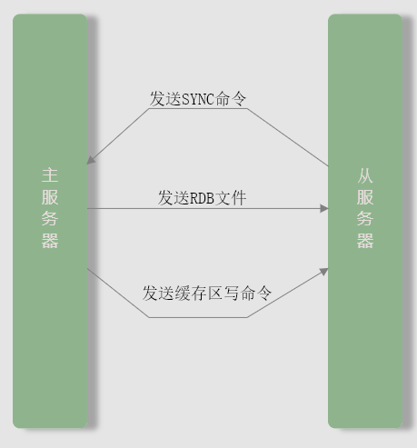
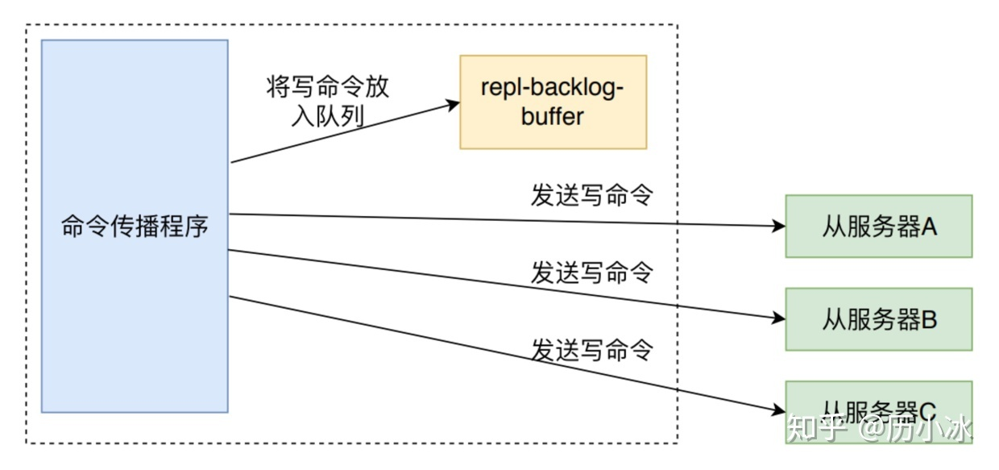
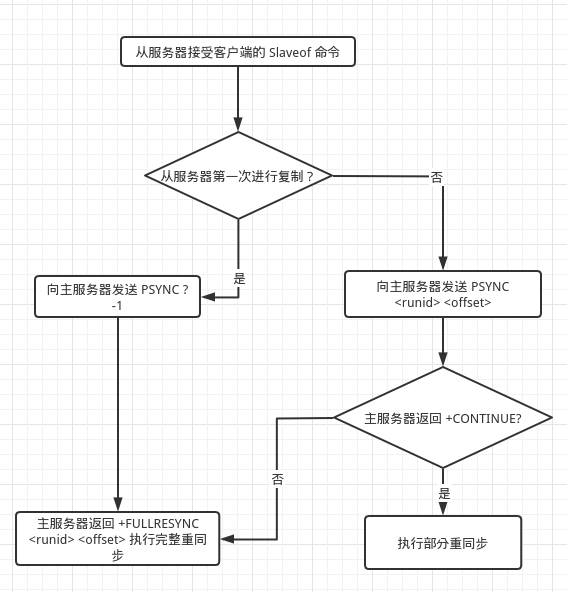
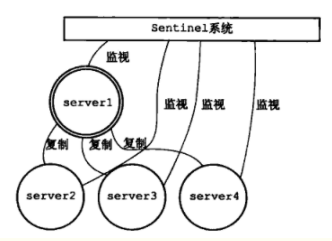
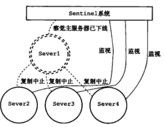
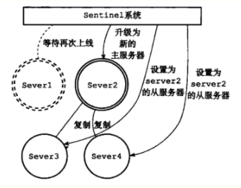
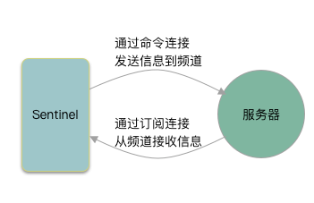
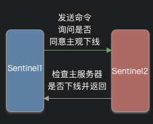

## 复制

在 Redis 中， 用户可以通过执行 SLAVEOF 命令或者设置 slaveof 选项，让一个服务器去复制（replicate）另一个服务器。则被复制的服务器为 **主服务器**（master），复制的为从服务器（slave）。

### 旧版复制实现

Redis 复制分为同步（sync）和命令传播（command propagate）两个操作

**同步**

1. 从服务器向主服务器发送 SYNC 命令
2. 主服务器收到后执行 BGSAVE 生成一个 RDB 文件，并声明一个缓冲区记录此时的所有写命令
3. 主服务器生成完 RDB 后会将其发送给从服务器，从服务器读取并载入
4. 主服务器将缓冲区中所有写命令发送给从服务器，从服务器执行这些命令，使自己数据库状态更新和主服务器当前状态一致



**命令传播**

同步命令执行完后，主从服务器后续还需要完成一致，所以主服务器需要对从服务器执行命令传播操作：主服务器会将自己执行的写命令发送给从服务器。

**旧版复制功能缺陷**

旧版在主从同步时，当从服务器断线重连后，需要再次使用 SYNC 进行同步，效率非常低

> SYNC 是一个非常耗费资源的操作，生成 RDB 文件会耗费主服务器大量 CPU、内存和磁盘 I/O 资源
>
> 发送 RDB 给从服务器会耗费从服务器的网络资源并对主服务器响应命令请求的时间产生影响
>
> 从服务器载入 RDB 文件时会由于阻塞无法处理命令请求


### 新版复制实现

新版复制是为了解决旧版复制中处理断线后重新复制情况下的低效问题，Redis 使用 PSYNC 命令代替了 SYNC 命令来执行复制时的同步操作。

PSYNC 有完整重同步和部分重同步两种模式

* 其中完整重同步处理初次同步的问题
* 部分重同步用于处理断线后重复制的问题

SYNC 命令需要生成、传送、载入 RDB 文件，部分重同步只需要将从服务器缺少的写命令发送给从服务器执行就可以了。


#### 部分重同步实现

部分重同步有以下三个部分构成

* 主服务器的复制偏移量和从服务器的复制偏移量
* 主服务器的复制积压缓冲区
* 服务器运行 ID

**复制偏移量**

主服务器和从服务器会分别维护一个复制偏移量：

主从服务器每次发送和接受 N 个字节的数据时，就将自己的复制偏移量的值加上 N。

通过对比复制偏移量，程序很容易地知道主从服务器是否处于一致状态。

而发现偏移量不同后是否执行完全重同步和如何补偿断线的数据则与复制积压缓冲区有关

**复制积压缓冲区**

复制积压缓冲区时主服务器维护的一个固定长度的先进先出队列，默认大小为 1MB

主服务器进行命令传播时不仅会将写命令写给从服务器，同时会写入到该队列中



因此其中会保存一部分最近传播的写命令，同时复制积压缓冲区会为队列中每个字节记录相应的复制偏移量，当从服务器重新连接主服务器时，主服务器会根据从服务器发送过来的复制偏移量 `offset` 进行判断进行何种重同步

* 如果 `offset` 偏移量后面的数据仍然存在复制积压缓冲区中，那么则执行部分重同步
* 否则执行完全重同步

**服务器运行 ID**

主从服务器都有自己的运行 ID，该 ID 会在服务器启动时自动生成，由 40 个随机十六进制字符组成。

从服务器对主服务器进行初次复制时，主服务器会将自己运行 ID 发送给从服务器。

从服务器断线重连后会将 ID 发送给主服务器，主服务器检查

* 如果该 ID 与自己相同，主服务器则尝试进行部分重同步操作
* 否则进行完整重同步

**新版复制完整流程**



### 复制的完整实现

1. 设置主服务器的地址和端口

    客户端向从服务器发送 `SLAVEOF 127.0.0.1:12345` 从服务器发送 OK ，复制在 OK 之后再执行（异步命令）

2. 建立套接字连接（主从服务器）

3. 发送 PING 命令

    1. 检测套接字是否正常
    2. 检测主服务器是否能正常处理命令请求

4. 身份验证：取决于从服务器的 `masterauth` 选项和主服务器的 `requirepass` 选项

    需要身份验证时，从服务器发送一条值为 masterauth 的值来进行身份验证

5. 发送端口信息：从服务器向主服务器发送自己的监听端口号

6. 同步：此时主从服务器都是对方的客户端

7. 命令传播

### 心跳检测

命令传播状态，从服务器会以每秒一次的频率，向主服务器发送命令

```redis
REPLCONF ACK <replication_offset>
```

其中 replication_offset 是复制偏移量，该命令对主从服务器有三个作用

1. 检测主从服务器的网络连接状态

2. 辅助实现 min-slaves 选项

    防止主服务器在不安全的情况下执行写命令。

3. 检测命令丢失


## Sentinel（哨兵）

哨兵是 Redis 高可用性的解决方案：由一个或多个 Sentinel 实例组成的 Sentinel 系统可以监视任意多个主服务器以及这些主服务器属下的所有从服务器，当被监视的主服务器进入下线状态时，自动将下线主服务器的某个从服务器升级为新的主服务器。








当服务器 Server1 重新上线时，会被降级为 Server2 的从服务器。

### 初始化 Sentinel

启动命令

```shell
redis-sentinel /path/to/your/sentinel.conf
#或者
redis-server /path/to/your/sentinel.conf --sentinel
```

启动时要由以下步骤：

1. 初始化服务器
2. 将普通 Redis 服务器使用的代码替换为 Sentinel 专用代码
3. 初始化 Sentinel 状态
4. 根据配置文件，初始化 Sentinel 的监视主服务器列表
5. 创建连向主服务器的网络连接


**初始化服务器**

Sentinel 是一个运行在特殊模式下的 Redis 服务器，所以启动第一步是初始化一个普通的 Redis 服务器，但是其不需要数据库，所以初始化时不会载入 RDB 和 AOF 文件。

**替换代码**

普通 Redis 服务器使用的是 `redis.c/redisCommandTable` 作为服务器的命令表。

Sentinel 使用 `sentinel.c/sentinelcmds` 作为命令表，并且 INFO 命令使用 `sentinel.c/sentinelInfoCommand` 函数。

**初始化 Sentinel 状态**

服务器会初始化一个 `sentinel.c/sentinelState` 状态，其保存了 Sentinel 状态，服务器一般状态还是使用 `redisServer` 保存

```c
struct sentinelState {
    // 当前纪元，用于实现故障转移
    uint64_t current_epoch;
    // 保存所有被这个 Sentinel 监视的主服务器
    // 键为主服务器名字，字典值为一个指向 sentinelRedisInstance 结构的指针
    dict *masters;
    // 是否进入 TILT 模式
    int tilt;
    // 目前正在执行的脚本的数量
    int running_scripts;
    // 进入 TILT 模式的时间
    mstime_t tilt_start_time;
    // 最后一次执行时间处理器的时间
    mstime_t previous_time;
    // 一个 FIFO 队列，包含了所有需要执行的用户脚本
    list *scripts_queue;
} sentinel;
```

**初始化 Sentinel 的监视主服务器列表 masters**

Sentinel 状态中的 master 字典记录了所有被 Sentinel 监视的主服务器的相关信息，其中：

* 键为主服务器名字
* 值为一个指向 `sentinelRedisInstance` 结构的指针

每个 `sentinelRedisInstance` 结构代表一个被 Sentinel 监视的实例（主服务器，从服务器，另一个 Sentinel）

```c
typedef struct sentinelAddr
{
    char *ip;
    int port;
} sentinelAddr;


typedef struct sentinelRedisInstance
{
    // 标识值， 记录实例的类型，以及实例的当前状态
    int flags;

    // 实例的名字
    // 主服务器的名字由用户在配置文件中配置
    // 从服务器以及 Sentinel 名字由 Sentinel 自己配置
    char *name;
    // 实例的运行 ID
    char *runid;
    // 配置纪元，用于实现故障转移
    uint64_t config_epoch;
    // 实例地址
    sentinelAddr *addr;
    // SENTINEL down-after-milliseconds 选项的值
    // 实例无响应多少毫秒后才会判断为主观下线
    mstime_t down_after_period;
    // SENTINEL monitor <master-name> <IP> <port> <quorum> 选项的 quorum 值
    // 判断这个实例为客观下线（objectively down）所需要的支持投票数量
    int quorum;
    // SENTINEL parallel-syncs <master-name> <number> 选项的值
    // 执行故障转移操作时，可以同时对新的主服务器进行同步的从服务器数量
    int parallel_syncs;
    // SENTINEL failover-timeout <master-name> <ms> 
    // 刷新故障迁移状态的最大时限
    mstime_t failover_timeout;
    // ...
} sentinelRedisInstance;
```

**创建连向主服务器的网络连接**

这是初始化 Sentinel 最后一步，建立网络连接后，Sentinel 将成为主服务器的客户端。

一般会创建两条连接

1. 命令连接：用于向主服务器发送命令和接受命令回复
2. 订阅连接：用于订阅主服务器的 `__sentinel__:hello`  频道


### 获取和发送信息

**获取主服务器信息**

Sentinel 默认每十秒一次的频率，通过命令连接向被监视的主服务器发送 INFO 命令，通过主服务器返回的 INFO Sentinel 可以得到以下信息

* 主服务器本身的信息：`run_id` 记录的服务器运行 ID ， `role` ：记录服务器角色
* 主服务器从属服务器的信息，根据这些信息 Sentinel 可以自动发现从服务器无需用户设置

**获取从服务器信息**

当 Sentinel 发现主服务器有新的从服务器出现时，除了会为新的从服务器创建相应的实例结构外，还没创建连接从服务器的命令连接和订阅连接。

**向主服务器和从服务器发送信息**

默认情况下，Sentinel 每两秒一次的频率，通过命令连接向被监视的主从服务器发送

`PUBLISH __sentinel__:hello "<s_ip>, <s_port>, <s_runid>, <s_epoch>, <m_name>, <m_ip>, <m_port>, <m_epoch>"` 其中 s 开头为 sentinel 自身信息，m 则为主从服务器的信息

**接收主从服务器的频道信息**

Sentinel 在与主从服务器建立订阅连接后会向服务器发送命令 `SUBSCRIBE __sentinel__:hello` 对该频道的订阅会持续到连接断开。



**更新 Sentinel 字典**

**Sentinel** 创建的 sentinels 字典保存了监视该主服务器的其他 **Sentinel** 的信息，在一个 **Sentinel** 接收到其他 Sentinel 发送的信息时，他会检查自己的 masters 字典查找主服务器实例结构，然后根据从接收到的信息中提取出的 Sentinel 参数查找主服务器中的 sentinels 字典是否存在该 Sentinel，如果存在则更新，不存在就插入。

由于 Sentinel 可以自己发现其他的 Sentinel ，所以用户使用时不需要提供各个 Sentinel 地址信息。

**连接其他 Sentinel**

当 Sentinel 通过频道发现其他 Sentinel 时，不仅会更新 sentinels 字典还会创建一条命令连接，可以通过其向其他 Sentinel 发送信息。

> Sentinel 之间不会创建订阅连接

### 检测下线状态

#### 检测主观下线

默认情况，Sentinel 会每秒一次频率向所有它创建了**命令连接**的实例发送 PING 命令，并通过实例返回的 PONG 来检查实例是否在线。

> 用户设置的 `down-after-milliseconds` 选项用于判断下线状态
>
> 多个 Sentinel 的主观下线时长可能不同

#### 检查客观下线

Sentinel 判断为主观下线后，它同时还会向监视这台服务器的其他 Sentinel 进行询问，当它接受到足够数量的已下线判断后，就会判断为客观下线，并对主服务器执行故障转移。其会对其他 Sentinel 发送命令 `is-master-down-by-addr` 



Sentinel 接收到后统计其他 Sentinel 同意主观下线的数量，超过配置的数量后，Sentinel 会将主服务器实例 flags 属性的 SRI_O_DOWN 标识打开，标识已进入客观下线。

> 如果数量超过  quorum 值则判断为客观下线

### 选举领头 Sentinel 

当主服务器被判断为客观下线后，监视其的 Sentinel 会进行协商选举出一个领头 Sentinel 来进行故障转移操作。选举算法为 Raft 算法，选举过程为

* 如果有三台 Sentinel 监测到主服务器的客观下线状态，此时其他 Sentinel 会再次向其他 Sentinel 发送 `SENTINEL is-master-down-by-addr` 命令，此次命令会带有自己的 `runid`
* 如果接受到该指令的 Sentinel 未设置自己的局部领头 Sentinel，就会将发送该指令的 Sentinel 设置为自己的局部领头 Sentinel 并回复
* 发送指令的 Sentinel 根据这一回复，统计出有多少个 Sentinel 将自己设置为局部领头 Sentinel，并成为领头 Sentinel

然后领头 Sentinel 对主服务器进行故障转移操作

### 故障转移

故障转移主要有以下操作

1. 让已下线的主服务器中的从服务器中选取一个将其推选为主服务器
2. 已下线服务器属下所有从服务器复制为新的主服务器
3. 将已下线的服务器设置为新主服务器的从服务器

#### 选取主服务器

选取一台从服务器执行 `SLAVEOF no one` 命令，将其转为主服务器。

领头 Sentinel 会将已下线的主服务器的所有从服务器保存到一个列表中，并根据以下规则过滤

* 已下线或断线的从服务器
* 五秒内未回复领头 Sentinel INFO 命令的
* 与已下线主服务器连接断开超过 `down-after-milliseconds * 10` 毫秒的从服务器

之后依次按照优先级、复制偏移量、ID 来进行排序选出最优先，最大，最小的从服务器。


