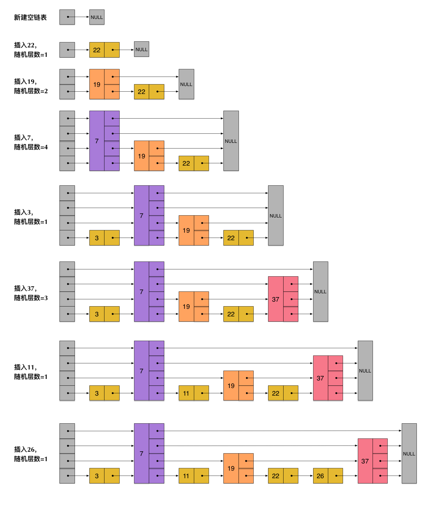

## String

Redis String 内部使用的 SDS（简单动态字符串）来进行编码，SDS 的定义为

```c
struct sdshdr {
    // 记录 buf 数组中已使用字节数量
    // 等于 SDS 所保存字符串的长度
    int len;
    // 记录 buf 数组未使用的字节数量
    int free;
    char buf[];
};
```

其相对于 C 字符串好处为

1. 获取字符串长度的复杂度为 $O(1)$
2. API 安全，不会造成缓冲区溢出
    1. 空间预分配
    2. 惰性空间释放
3. 修改字符串长度 N 次最多需要修改 N 次
4. 可以保存文本或者二进制数据

## 链表

List  列表底层实现之一就是链表，当一个列表将包含了数量较多的元素或者列表中包含的元素都是较长的字符串时，Redis 就会使用链表作为列表键的底层实现。

Redis 的链表是一个双端，无环，多态（支持多种数据类型）， 带链表长度，带头尾指针的链表。


## 压缩列表

zipList 是**列表和哈希**的底层实现之一。当一个列表键只包含少量列表项，而且每个列表项要么就是小整数值，要么为长度比较短的字符串，那么 Redis 就会使用压缩列表作为列表键底层实现。

压缩列表是为了节约内存开发的，由一系列特殊编码的连续内存块组成的顺序型数据结构。一个压缩列表可以包含任意多个节点（entry），每个节点可以保存一个字节数组或者一个整数值。

压缩列表组成部分

* zlbytes：记录整个压缩列表占用的内存字节数：用于对压缩列表进行内存重分配，或者计算 zlend 位置时使用
* zltail：记录压缩列表表尾节点距离压缩列表起始地址有多少字节：无需遍历压缩列表就可确定表尾节点地址
* zllen：记录压缩列表包含的节点数量：当这个属性值小于 65535 时，为节点数量，等于 65535 时需要遍历整个压缩列表才能得知
* entryX：列表节点
* zlend：特殊值，用于标记压缩列表末尾端

压缩列表节点构成 (entryX)

* previous_entry_length：记录前一个节点长度，可以通过指针运算根据当前节点起始地址计算出前一个节点的起始地址。

* encoding：记录节点 content 属性所保存数据类型以及长度
* content：保存节点的值

### 连锁更新

在压缩列表中，每个节点的 previous_entry_length 属性记录前一个节点的长度

1. 如果前一节点长度小于 254 字节，那么该属性需要用 1 字节长的空间保存这个长度值
2. 大于的话，则需要 5 字节空间保存长度值

当 e1 到 eN 节点都在 250 到 253 字节之间，此时 每个节点的 previous_entry_length 属性长度都为 1 字节。

插入一个大于 254 字节到 e1 到 eN 中间或者 e1 前时，会将之后所有节点的 previous_entry_length 全部更新为 5 字节，因为插入这个之后后面的字节全会被扩展到大于 254 字节。这种连续扩展空间就为连锁更新。

连锁更新会在插入或者删除节点时发生，最坏复杂度为 $O(n^2)$ 但是发生概率很低，条件苛刻。

所以可以认为 zipllistPush 等命令平均复杂度为 $O(n)$


## 字典（哈希）

Redis 字典底层使用哈希实现，一个哈希表里面可以有多个哈希表节点，而每个哈希表节点就保存了字典中的一个键值对，其实现为哈希表，哈希节点，字典

```c
typedef struct dictht {
    // 哈希表数组
    dictEntry **table;
    // 哈希表大小
    unsigned long size;
    // 哈希表大小掩码，用于计算索引值，总是等于 size - 1
    unsigned long sizemask;
    // 哈希表已有节点数量
    unsigned long used;
} dictht;

typedef struct dictEntry {
    // 键值对中的键
    void *key;
    // 键值对中的值，可以是 val 可以是指针，可以是 uint64_t 或 int64_t 整数
    union {
        void *val;
        uint64_t u64;
        int64_t s64;
    } v;
    // 指向下一个哈希表节点，形成链表
    struct dictEntry *next;
} dictEntry;

typedef struct dict {
    dictType *type;
    void *privdata;
    dictht ht[2];
    // rehash 索引，当 rehash 不在进行时，值为 -1
    int trehashidx;
} dict;

typedef struct dictType {
    // 计算哈希值函数
    unsigned int (*hashFunction) (const void *key);
    // 复制键函数
    void *(*keyDup) (void *privdata, const void *key);
    // 复制值函数
    void *(*valDup) (void *privdata, const void *obj);
    // 对比键函数
    int (*keyCompare) (void *privdata, const void *key1, const void *key2);
    // 销毁键函数
    void (*keyDestructor) (void *privdata, void *key);
    // 销毁值函数
    void (*valDestructor) (void *privdata, void *obj);
} dictType;
```

`dictEntry` 中 next 指针用于指向另一个哈希表节点，用于解决键冲突（拉链法），这个指针可以将多个哈希值相同的键值对连接起来。

`dict` 中 privdata 保存需要传给类型特定函数的可选参数， `ht` 属性为包含两个项的数组，一般情况下是使用 `ht[0] ` 的哈希表，`ht[1]` 是 rehash 操作中使用的。


### rehash

1. 为字典 `ht[1]` 分配空间，大小取决要执行的操作以及当前 `ht[0]` 包含的键值对 `ht[0].used` 
    1. 扩展操作：$ht[1]=ht[0].used*2$ 的 $2^n$ ，例如 ht[0].used = 4, 扩展时， ht[1] 大小则为 8，因为 8 刚好为 $2^3$ 
    2. 收缩操作：$ht[1]=ht[0].used$ 的 $2^n$ 
2. 将 `ht[0]` 中所有键值对 rehash 到 `ht[1]` 上
    * rehash 指重新计算键的哈希和索引值，然后将键值放到 `ht[1]` 指定位置上
3. 当 `ht[0]` 上所有键值都迁移到 `ht[1]` 上时，释放 `ht[0]`, 将 `ht[1]` 设置为 `ht[0]` 同时生成新的 `ht[1]`


### rehash 扩展和收缩触发时机

**扩展**

1. 服务器正在 BGSAVE 或者 BGREWRITEAOF 命令，且哈希表负载因子大于等于 5
2. 服务器不在进行上述命令操作，且哈希表负载因子大于等于 1

负载因子 `ht[0].used / ht[0].size`

**收缩**

服务器负载因此小于 0.1

### 渐进式 rehash

为了避免 rehash 对服务器性能造成影响，服务器不是一次性将 ht[0] 里面所有的键值对全部 rehash 到 ht[1]，而是分多次，渐进式地将 ht[0] 里面的键值对慢慢 rehash 到 ht[1];

1. 分配空间，让字典同时持有 ht[0] 和 ht[1] 两个哈希表
2. 是 rehashidx = 0 标记 rehash 工作开始，在 rehash 期间，每次对 redis 数据操作（CRUD）都会顺带将 ht[0] 在 rehashidx 索引上所有的键值对 rehash 到 ht[1] 上，rehash 完成后，将 rehashidx 增加一

渐进式 rehash 好处是分而治之，将庞大的一次性 rehash 的计算量分摊到对字典的每个删除，修改，查找，添加操作上。

> 由于有 ht[0], ht[1] 两个哈希表，每次删除，修改，查找操作时会同时在两个哈希表上进行，ht[0] 中没找到就去 ht[1] 中找，rehash 期间新添加的键一律放到 ht[1] 中


## 跳表

SkipList 是一种有序数据结构，查找复杂度平均 $O(logN)$ 最坏 $O(N)$ ，还可以通过顺序型操作来批量处理节点。

大多数情况下，跳表可以和平衡树媲美。

SkipList 是 Sorted Set （有序集合）的底层实现之一。

Redis 跳表由 `zskiplistNode` 和 `zskiplist` 两个结构定义

```c
typedef struct zskiplistNode {
    // 后退指针
    struct zskiplistNode *backward;
    // 分值
    double score;
    // 成员对象
    robj *obj;
    // 层
    struct zskiplistLevel {
        // 前进指针
        struct zskiplistNode *forward;
        // 跨度
        unsigned int span;
    } level[];
} zskiplistNode;

typedef struct zskiplist {
    // 表头节点和表尾节点
    struct zskiplistNode *header, *tail;
    // 表中节点的数量
    unsigned long length;
    // 表中层数最大的节点的层数
    int level;
} zskiplist;
```

**层 zskiplistLevel**

跳表节点的 level 数组可以包含多个元素，每个元素都包含一个指向其他节点的指针，程序可以通过这些层来加快访问其他节点的速度，一般来说，层数量越多，访问其他节点速度越快。

每个跳表节点被创建时，程序根据幂次定律（越大的数出现概率越小）随机生成一个 1 到 32 之间的值作为 level 数组大小。



**前进指针**

每层都有一个前进指针用于从表头到表尾访问节点。


**跨度**

`level[i].span` 用于记录两个节点之间的距离。

该属性用于计算排位（rank）：查找某个节点过程中将沿途访问过所有层的跨度累计起来，得到的结果就是目标节点再跳表中的排位。


**后退指针**

用于表尾到表头遍历，每个节点只有一个后退指针如上图所示。


**分值和成员（score 和 obj）**

分值为一个浮点数，跳表中所有节点都按分值从小到大排序

成员对象为一个指针，它指向一个字符串对象，字符串对象则保存一个 SDS 值。


## 整数集合（intset）

intset 是集合键（Set）的底层实现之一，当集合键只包含整数元素，并且数量不多时会使用 intset 作为底层实现。

intset 是 Redis 保存整数值的集合抽象数据结构，他可以保存类型为 `int16_t, int32_t, int64_t` 的整数值，并且保证集合中不会出现重复元素。其定义如下

```c
typedef struct intset {
    // 编码方式
    uint32_t encoding;
    // 集合包含的元素数量
    uint32_t length;
    // 保存元素的数组
    int8_t contents[];
} intset;
```

`contents` 数组是整数集合的底层实现：整数集合每个元素都是 contents 数组的一个数组项（item），各个项在数组中按值的大小从小到大有序排列，并且数组中不包含重复项。

`encoding` 表示 `contents` 中存储元素的类型。

### 升级

每当添加一个新元素到整数集合中，并且新元素类型比现有所有类型都要长时，整数集合需要进行升级，然后将新元素添加到整数集合中。

1. 根据新元素类型，扩充整数集合底层数组的空间大小，并为新元素分配空间。
2. 将底层所有元素都转换成和新元素相同的类型，并且转换后底层有序性不变
3. 将新元素添加到底层数组中

整数集合不支持降级操作


## Redis 对象

编码以及底层实现

```c
typedef struct redisObject {
    // 类型
    unsigned type:4;
    // 编码
    unsigned encoding:4;
    // 指向底层实现数据结构的指针
    void *ptr;
    // 引用计数
    int refcount;
    // 记录对象最后一次被命令程序访问的时间
    unsigned lru:22;
} robj;
```


1. String **字符串**

    比如说记录微博数，粉丝数等。

    内部编码：`int`, `raw`, `embstr`， embstr 保存长度小于 44 字节的字符串

2. Hash **字典**

    可以用于存储用户信息和商品信息

    内部编码：HT（拉链法），ZipList（压缩表）

3. List **列表**

    比如微博的关注列表，粉丝列表，消息列表等功能

    内部编码：QuickList（Ziplist【特殊编码（二进制）双向链表】 + 双向链表）

4. Set **集合**

    例如应用有共同关注、共同粉丝、共同喜好等

    内部编码：HT， INTSET

5. Sorted Set **有序集合** ( Zsest )

    用户列表，礼物排行榜，弹幕消息等应用

    内部编码：SkipList，ZipList

### 垃圾回收

Redis 采用引用计数实现内存回收机制，被引用加 1， 不再被引用减 1，计数变为 0 时被释放

### 对象共享

对象的引用计数属性还带有对象共享作用，将新建的键值对指向现有值对象，该对象计数加 1，该方法可以节约内存。

Redis 在服务创建时创建 10000 个字符串对象， 0 到 9999 的值为共享对象。

### 空转时长

redisObject 包含一个属性为 lru 的属性，记录对象最后一次被命令程序访问的时间

OBJECT IDLETIME 命令可以打印给定键的空转时长，这一时长就是由当前时间减去键的值对象的 lru 时间计算得出的，该命令不会修改 lru 属性