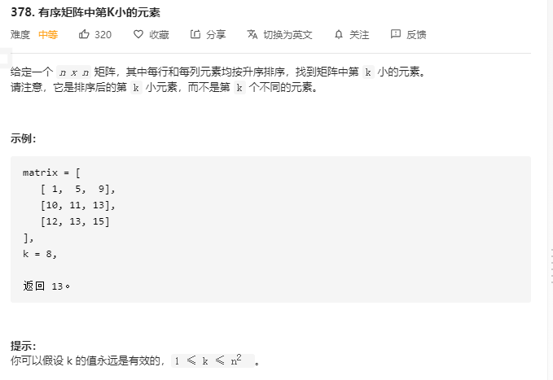

该题的矩阵从题目看为从左上到右下都为递增


由题意可知该矩阵中 $matrix[0][0]$ 为最小值 $matrix[n-1][n-1]$ 为最大值, 现在我们将其分别记作 l 和 r。

可以发现一个性质：任取一个数 mid 满足 l≤mid≤r，那么矩阵中不大于 mid 的数，肯定全部分布在矩阵的左上角。

例如下图，取 mid=8：


接下里我们可以写出该锯齿线的走法图:


走法:

- 初始位置在$ matrix[n - 1][0]$（即左下角）；
- 设当前位置为 $matrix[i][j]$。若 $matrix[i][j] \leq mid$，则将当前所在列的不大于 mid 的数的数量（即 i + 1）累加到答案中，并向右移动，否则向上移动；
- 不断移动直到走出格子为止。

不妨假设答案为 x，那么可以知道 $l\leq x\leq r$，这样就确定了二分查找的上下界。

每次对于「猜测」的答案 mid，计算矩阵中有多少数不大于 mid：

- 如果数量不少于 k，那么说明最终答案 x 不大于 mid；
- 如果数量少于 k，那么说明最终答案 x 大于 mid。

这样我们就可以计算出最终的结果 x 了。

```go
func kthSmallest(matrix [][]int, k int) int {
    n := len(matrix)
    l, r := matrix[0][0], matrix[n-1][n-1]
    for l < r {
        mid := l + (r - l) / 2
        if check(matrix, mid, k, n) {
            r = mid
        } else {
            l = mid + 1
        }
    }
    return l
}
// 矩阵路线
func check(matrix [][]int, mid, k, n int) bool {
    i, j := n - 1, 0
    num := 0
    for i >= 0 && j < n {
        if matrix[i][j] <= mid {
            num += i + 1
            j++
        } else {
            i--
        }
    }
    return num >= k
}
```

