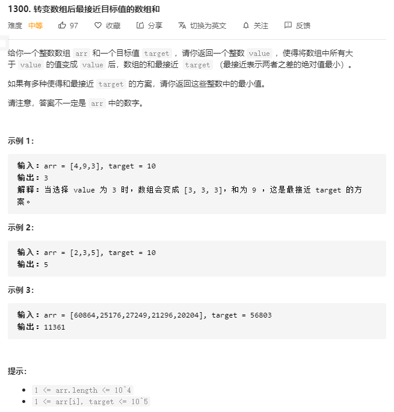

# 解题思路

二分查找, 首先可以想到对所有可能的 `value` 值进行枚举, 通过对题目分析, 可以得到:

1. `value` 下界为 0, 因为当其为 0 时, 数组和为 0, 因为 `target` 是正整数
2. `value` 上界为 `arr` 中的最大值

当枚举到 `value=x` 时, 需要将 `arr` 中所有大于 `value` 的数转化为 `value`, 这步可以通过排序找到索引 `i, arr[i+]>value` 然后此时数组和变为 


$$
arr[0]+\dots+arr[i-1]+x*(n-i)
$$
而为了求和更快可以先求出`arr` 的前缀和 `prefix[i] = prefix[i-1]+arr[i-1]`

但是当 `arr` 上界很大时, 枚举需要花费很多时间, 我们也可以对 `value` 再执行一次二分查找, 找到一个 `value` 使其最接近 `target` 但小于`target` 记为 `value_lower` , 再找到一个 `value` 使其最接近`target` 但大于 `target`, 记为 `value_upper`. 

我们需要找到的 `value` 就是这两个之一,  而 `value_upper` 肯定就是 `value_lower+1` 因为是严格单调增且是正整数.我们可以根据这个思路来编写二重二分查找

```go
import "sort"

func findBestValue(arr []int, target int) int {
	sort.Ints(arr)
	n := len(arr)
	prefix := make([]int, n + 1)
	for i := 1 ; i < n + 1; i++ {
		prefix[i] = prefix[i - 1] + arr[i - 1]
	}
	r := arr[n - 1]
	l, ans := 0, 0
	for l <= r {
		mid := (l + r) / 2
		index := sort.SearchInts(arr, mid)
		if index < 0 {
			index = -index - 1
		}
		cur := prefix[index] + (n - index) * mid
		if cur <= target {
			ans = mid
			l = mid + 1
		} else {
			r = mid - 1
		}
	}
	small := sum(arr, ans)
	big := sum(arr, ans + 1)
	if abs(small - target) > abs(big - target) {
		ans++
	}
	return ans
}

func sum(arr []int, x int) int {
	res := 0
	for _, v := range arr {
		res += min(v, x)
	}
	return res
}

func min(a, b int) int {
	if a < b {
		return a
	}
	return b
}

func abs(a int) int {
	if a >= 0 {
		return a
	}
	return -a
}
```


 

 