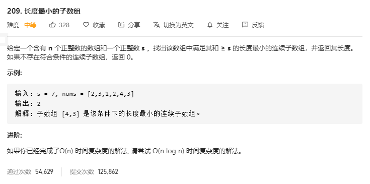

## 解题思路

使用前缀和＋二分查找

1. 首先创建一个数组 `prefix` 用于存储数组 `nums` 的前缀和, 其中 `prefix[i]` 为 $nums[0]+\dots+nums[i-1]$ 
2. 遍历 `nums` 通过二分查找找到大于等于 `i` 的最小下标 `index` , 使得 $sums[index]-sums[i-1]≥s$ 
3. 通过 index 和 i 来更新最小长度

> 因为这道题保证了数组中每个元素都为正，所以前缀和一定是递增的，这一点保证了二分的正确性。如果题目没有说明数组中每个元素都为正，这里就不能使用二分来查找这个位置了。
>

```go
func minSubArrayLen(s int, nums []int) int {
	n := len(nums)
	if n == 0 {
		return 0
	}
	ans := math.MaxInt32
	prefix := make([]int, n + 1)
    // 为了方便计算，令 size = n + 1 
    // sums[0] = 0 意味着前 0 个元素的前缀和为 0
    // sums[1] = A[0] 前 1 个元素的前缀和为 A[0]
    // 以此类推
	for i := 1; i <= n; i++ {
		prefix[i] = prefix[i - 1] + nums[i - 1]
	}

	for i := 1; i <= n; i++ {
		// 找到前缀和数组中大于等于 i 的最小下标 index, 使 prefix[index] - prefix[i - 1] >= s
		target := s + prefix[i - 1]
		index := sort.SearchInts(prefix, target)
		if index < 0 {
			index = - index - 1
		}
		// 更新 ans
		if index <= n {
			ans = min(ans, index - (i - 1))
		}
	}
	if ans == math.MaxInt32 {
		return 0
	}
	return ans

}

func min(a, b int) int {
	if a < b {
		return a
	}
	return b
}

```

