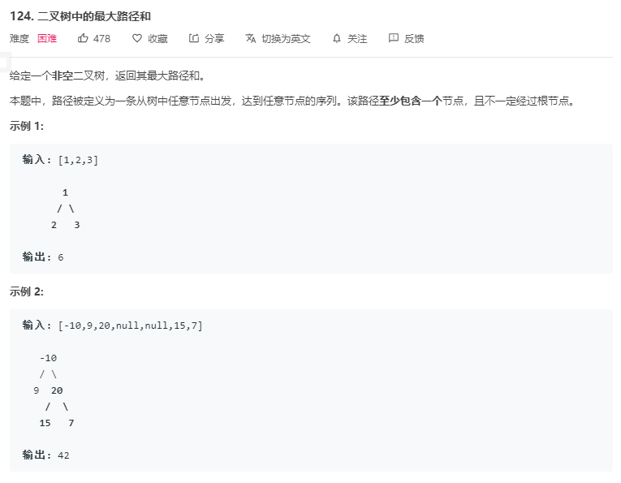

该题题意不一定经过根节点, 所以也需要对根节点的左右子树也进行求解, 即需要调用的是 `maxGain(node)` 

算法:

1. 初始化最大值 `maxNum`, 为`math.MinInt64` 并调用 `maxGain(root)`
    1. `maxGain` 实现: 对该节点左右孩子节点全部递归调用, 计算左右孩子最大权值, `left_gain = max(max_gain(node.left), 0)` 和 `right_gain = max(max_gain(node.right), 0)`
    2. 创建新的最大权值为 `node.Val + left.Val + right.Val` 如果大于 `maxNum` 则更新, 否则返回当前节点的最大路径, 计算结果为  `node.Val +max(left, right)`
    3. 因为路径只能单支, 所以返回新路径时需要走最大路径

```go
func maxPathSum(root *TreeNode) int {
	maxAns := math.MinInt64
	helper(root, &maxAns)
	return maxAns
}
func helper(root *TreeNode, maxAns *int) int {
	if root == nil {
		return 0
	}
	left := max(0, helper(root.Left, maxAns))
	right := max(0, helper(root.Right, maxAns))
	*maxAns = max(*maxAns, root.Val + left + right)
    // 返回最大新路径
	return root.Val + max(left, right)
}

func max(a, b int) int {
	if a > b {
		return a
	}
	return b
}
```

