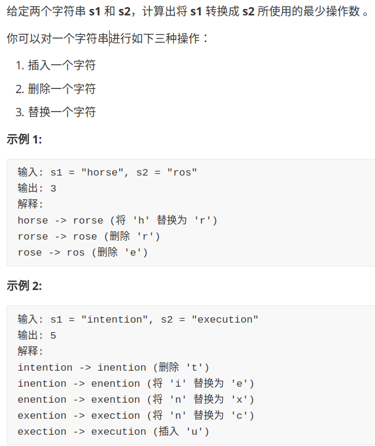
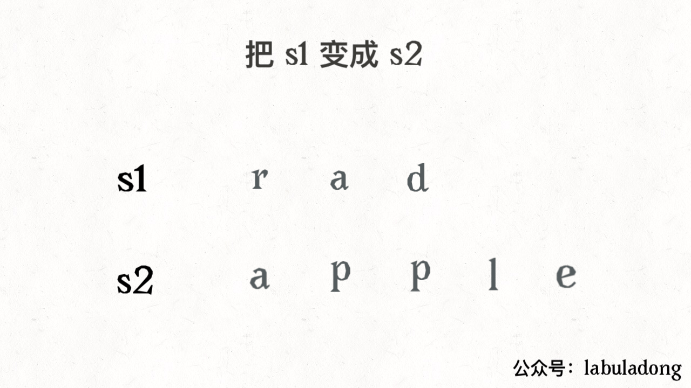
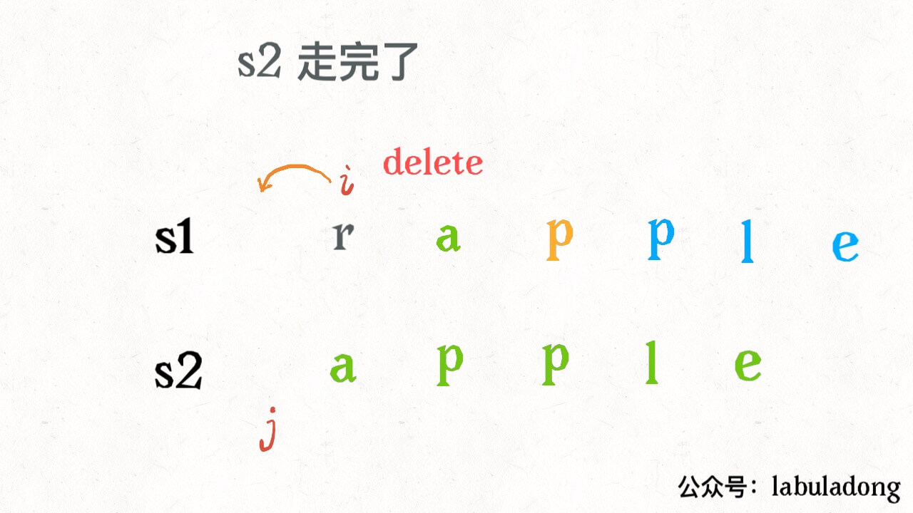

# 问题描述



# 思路



还有一个很容易处理的情况，就是 `j` 走完 `s2` 时，如果 `i` 还没走完 `s1`，那么只能用删除操作把 `s1` 缩短为 `s2`。比如这个情况：



类似的，如果 `i` 走完 `s1` 时 `j` 还没走完了 `s2`，那就只能用插入操作把 `s2` 剩下的字符全部插入 `s1`。

# 代码框架

```go
if s1[i] == s2[j] {
    skip
    i, j 指针向前移动
} else {
    三选一：
    插入(insert)
    delete
    replace
}
```

```python
def minDistance(s1, s2) -> int:

    # 返回 s1[i] 和 s2[j] 的最小编辑距离
    def dp(i, j) -> int: 
        # base case
        if i == -1: return j + 1
        if j == -1: return i + 1

        if s1[i] == s2[j]:
            return dp(i - 1, j - 1)  # 啥都不做
        else:
            return min(
                dp(i, j - 1) + 1,    # 插入
                # 解释：
                # 我直接在 s1[i] 插入一个和 s2[j] 一样的字符
                # 那么 s2[j] 就被匹配了，前移 j，继续跟 i 对比
                # 别忘了操作数加一
                dp(i - 1, j) + 1,    # 删除
                dp(i - 1, j - 1) + 1 # 替换
            )

    # i，j 初始化指向最后一个索引
    return dp(len(s1) - 1, len(s2) - 1)
```

# 优化

重叠子问题优化方法就是备忘录或者 DP table

## 1. 备忘录

```python
def minDistance(s1, s2) -> int:

    memo = dict() # 备忘录
    def dp(i, j):
        if (i, j) in memo: 
            return memo[(i, j)]
        ...

        if s1[i] == s2[j]:
            memo[(i, j)] = ...  
        else:
            memo[(i, j)] = ...
        return memo[(i, j)]

    return dp(len(s1) - 1, len(s2) - 1)
```

 

## 2. DP table


`dp[..][0]` 和 `dp[0][..]` 对应 base case，`dp[i][j]` 的含义和之前的 dp 函数类似：

```python
def dp(i, j) -> int
# 返回 s1[0..i] 和 s2[0..j] 的最小编辑距离

dp[i-1][j-1]
# 存储 s1[0..i] 和 s2[0..j] 的最小编辑距离
```

```go
func minDistance(s1, s2 string) int {
    m, n := len(s1), len(s2)
    var dp [m+1][n+1]int
    
    //base case
    for i := 1; i <= m; i++ {
        dp[i][0] = i
    }
    for j := 1; j <= n; j++ {
        dp[0][j] = j
    }
    
    for i := 1; i <= m; i++ {
        for j := 1; j <= n; j++ {
            if s1[i-1] == s2[i-1] {
                dp[i][j] = dp[i-1][j-1]
            } else {
                dp[i][j] = min(
                	dp[i-1][j] + 1,
                    dp[i - 1][j - 1],
                    dp[i][j - 1]
                )+1
            }
        }
    }
    return dp[m][n]
}

func min(a, b, c int) int {
    return math.min(a, math.min(b, c))
}
```

