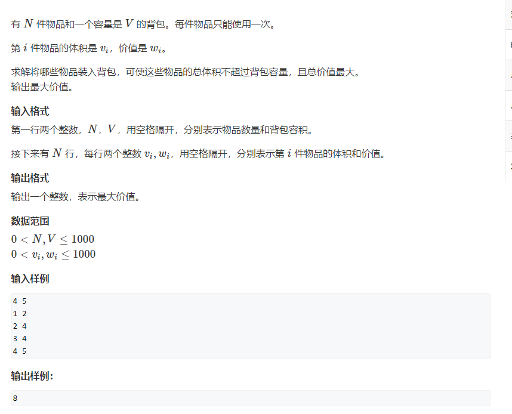
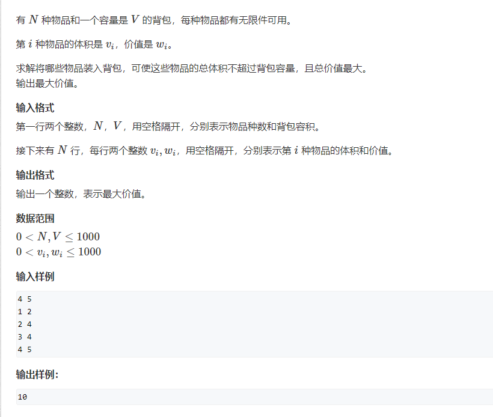

## 01 背包问题



规定状态 dp[i, j] 前 i 件物品，总体积为 j 的总价值

对于状态转移有

1. 不选第 i 个物品

    `dp[i][j] = dp[i-1][j]`

2. 选第 i 个物品

    `dp[i][j] = dp[i-1][j-v[i]]+w[i]`

`dp[i][j]=max{1, 2}`

### 初始化问题：

1. 如果要求背包恰好被装满，则在初始化时，除了 dp[0] = 0 ，其他 dp[1…V] = -INF， 均为负无穷，这样可以保证最  终得到的 dp[V] 是一种恰好装满背包的最优解
2. 不要求则是将所有 dp[0…V] = 0

主要逻辑代码，其中 c, w 皆以 1 起始 n 结束

```go
func zeroOneBag(c, w []int, n, v int) int {
	dp := make([][]int, n+1)
	for i := 0; i < n; i++ {
		dp[i] = make([]int, v+1)
	}

	for i := 1; i <= n; i++ {
		for j := 0; j <= v; j++ {
	 	    dp[i][j] = dp[i-1][j] 
			if j >= c[i] {
	 	        dp[i][j] = max(dp[i-1][j], dp[i-1][j-c[i]]+w[i])
	 	    }
	 	}
	 }
	 return dp[n][v]
}
```

  dp 状态压缩：空间优化

  对于每个 `dp[i][j] `与之关联的都是 dp[i-1] 

  可以将其压缩为一维 dp，要保证所有 `dp[i][j] `都能使用 dp[i-1]

  将状态从后往前遍历即可，如果从前向后遍历的话则意味着 `dp[i][j] `= `dp[i][j-c[i]]`

  而非 `dp[i-1][j-c[i]]`

```go
	dp := make([]int, v+1)
	for i := 1; i <= n; i++ {
		for j := v; j >= c[i]; j-- {
			dp[j] = max(dp[j], dp[j-c[i]]+w[i])
		}
	}
	return dp[v]
```


## 完全背包问题



大致为可以无限装物品的背包，其状态转移方程要比 01 背包多一个若干件物品 k

dp 状态转移方程为

`dp[i][j] = max{dp[i-1][j], dp[i-1][j-k*c[i]]+k*w[i]}`

使用一维 dp 大概代码为

```c++
for (int i = 0; i < n; i++) 
    for (int j = V; j >= c[i]; j--) 
        for (int k = 0; k * c[i] <= j; k++) 
            dp[j] = max(dp[j], dp[j-k*c[i]] + k * w[i]);
```

$$
dp[i][j] = max{(dp[i-1][j], dp[i-1][j-c[i]]+w[i], dp[i-1][j-2*c[i]]+2*w[i], ...., dp[i-1][j-k*c[i]]+k*w[i])}
$$

而将 $j$ 替换为 $j-c[i]$ 可以得到
$$
dp[i][j-c[i]]=max(dp[i-1][j-c[i]], dp[i-1][j-2*c[i]]+w[i])
$$
可以得到上式 $dp[i][j-c[i]]+w[i]$   即等于 $dp[i][j]$ max 表达式右边

即可以得到 $dp[i][j] = max(dp[i-1][j], dp[i][j-c[i]]+w[i])$

从前面 01 背包问题分析中可以得出在第二重循环中从 0 到 V 循环表示的是 `dp[i][j-[ci]]` 


代码为:

```c++
for (int i = 0; i < n; i++) 
    for (int j = c[i]; j <= V; j++)
        dp[j] = max(dp[j], dp[j-c[i]]+w[i])
```


## 多重背包问题

有 N 种物品和一个容量是 V 的背包。

第 i 种物品最多有 si 件，每件体积是 vi，价值是 wi。

求解将哪些物品装入背包，可使物品体积总和不超过背包容量，且价值总和最大。

**初始值**

`f[i] = 0, res = f[V]`

`f[0] = 0 f[i] = -INF res = max{f[0...V]}`


多重背包问题，为 01 背包与完全背包之间的问题，其核心在于在完全背包基础上加上了 si 的限制

大概代码

```c++
for (int i = 0; i < N; i++) 
    for (int j = V; j >= v[i]; j--)
        for(int k = 1; k * v[i] <= j && k <= s[i]; k++)
            dp[j] = max(dp[j], dp[j - k*v[i]] + k*w[i])
```

与完全背包第一段代码差别在于多了一段 `k <= s[i]` 


**优化**

上述代码的时间复杂度为 $O(NV\sum{k})$ 

我们希望可以把他可以优化为 01 背包的复杂度。

二进制优化方案，可以将 k 个物品，作为不同价值不同价格的种类的物品放入背包之后，使多重背包变为 01 背包问题

可以定义新背包如下

```c++
struct Goods {
    int v;
    int w;
}
```


我们可以将例如 5 个 v 重量， w 价值的物品，拆分成 `1, 2, 2` 个物品，将其加入背包中。

可以将每个物品均除以二加入背包中，`s = 1 + 2 +4 + 8 + ... + remainder` 其拆分过程为

```c++
for (int i = 0;i < N; i++) {
    for (int j = 1; j <= s[i]; j *= 2) {
        s[i] -= j;
        goods.emplace_back(v[i] * j, w[i] * j);
    }
    if (s[i] != 0) {
        goods.emplace_back(v[i] * s[i], w[i] * s[i]);
    }
}
```

后面对这个新背包使用 01 背包问题求解即可

```c++
int f[V+1];
memset(f, 0, sizeof f);
for (auto good : goods) {
	for (int j = V; j >= good.first ; --j) {
		f[j] = max(f[j], f[j - good.first] + good.second);
   	}
}
return f[V];
```


## 二维背包问题

有 N 件物品和一个容量是 V 的背包，背包能承受的最大重量是 M

每件物品只能使用一次，体积为 vi，重量为 mi，价值为 wi

其核心在于比一维 01 背包多了一层遍历和多一层状态

```c++
int f[V+1][M+1];
memset(f, 0, sizeof f);
for (int i = 0; i < N; ++i) {
    for (int j = V; j >= v[i] ; --j) {
        for (int k = M; k >= m[i] ; --k) {
            f[j][k] = max(f[j][k], f[j - v[i]][k - m[i]] + w[i]);
        }
    }
}
return f[V][M];
```


## 分组背包问题

```shell
分组背包问题
有 N 组物品和一个容量是 V 的背包。
每组物品有若干个，同一组内的物品最多只能选一个。
每件物品的体积是 vij，价值是 wij，其中 i 是组号，j 是组内编号。
求解将哪些物品装入背包，可使物品总体积不超过背包容量，且总价值最大
```

多重背包为分组背包的特殊情况

分组背包问题核心在于 `[i]` 组号中只能选取一个物品，而 `[j]` 编号中需要取出最大的

我们使用切片 `s[]` 用于存放每组中物品的数量，然后对其中每一个进行遍历，取出其中最大的加入背包中

```c++
int divide_bag(int N, int V, vector<int>& s, vector<vector<int>>& v, vector<vector<int>>& w) {
    int f[V+1];
    memset(f, 0, sizeof f);
    for (int i = 0; i < N; ++i) {
        for (int j = V; j >= 0 ; --j) {
            for (int k = 0; k < s[i]; ++k) {
                if (j >= v[i][k]) {
                    f[j] = max(f[j], f[j - v[i][k]] + w[i][k]);
                }
            }
        }
    }
    return f[V];
}

int main() {
    int N, V;
    cin >> N >> V;
    vector<int> s;
    vector<vector<int>> v(N);
    vector<vector<int>> w(N);
    for (int i = 0; i < N; ++i) {
        int s1;
        cin >> s1;
        s.push_back(s1);
        for (int j = 0; j < s1; ++j) {
            int v1, w1;
            cin >> v1 >> w1;
            v[i].push_back(v1);
            w[i].push_back(w1);
        }
    }
    cout << divide_bag(N, V, s, v, w);
}
```


