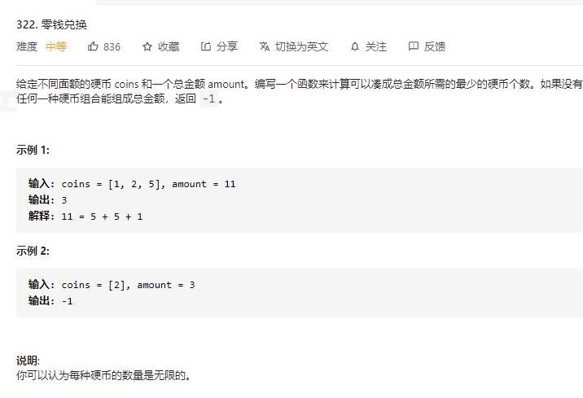
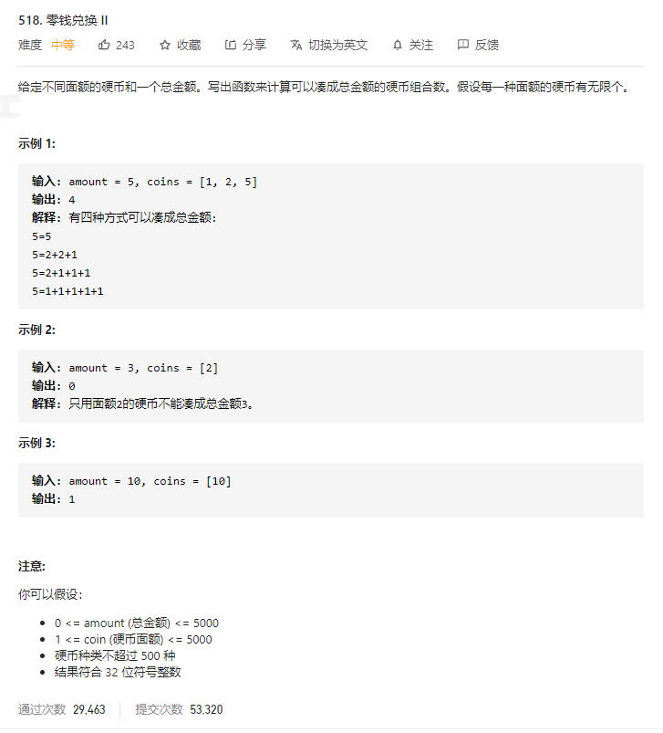
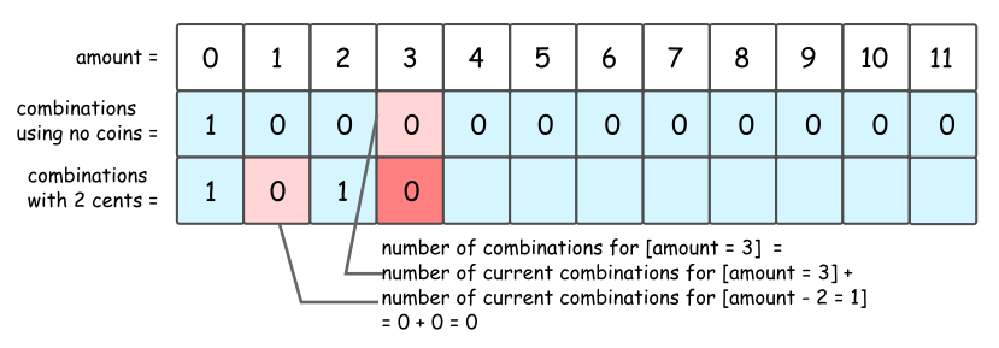
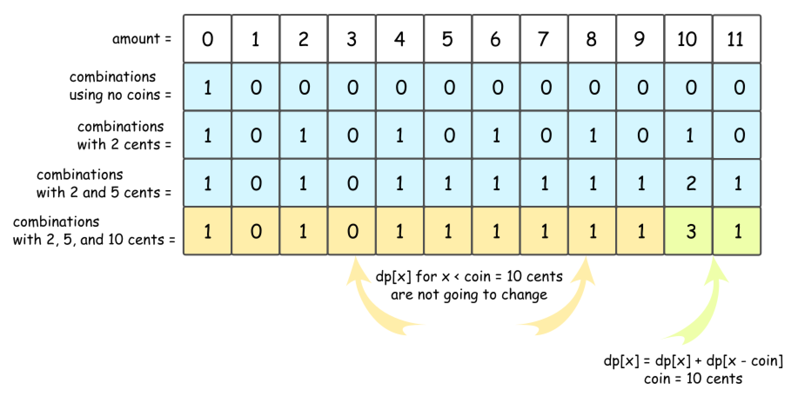

这实际上是一个完全背包问题，可以将`amount`看成是背包容量，而`coins`中的每个硬币对应一个商品，每种商品可以使用无数次。在这里我们先复习一下完全背包问题如何处理。我们可以定义函数f(x)表示`amount`为`x`的时候最少硬币个数，那么
$$
f(x)=min_{i=0}^nf(x-coins[i])+1
$$


最后思考边界条件，因为计算最小值，所以f ( 0... x )=inf。

代码为

```go
func coinChange(coins []int, amount int) int {
	if len(coins) == 0 || amount == 0 {
		return 0
	}
    // dp[0] = 0
    // 初始值 dp[i] = inf
	dp := make([]int, amount+1)
	for i := 1; i <= amount; i++ {
		dp[i] = amount + 1
	}
    // 完全背包模板
    // 
	for _, v := range coins {
		for i := v; i <= amount; i++ {
			dp[i] = min(dp[i], dp[i - v]+1)
		}
	}
	if dp[amount] == amount + 1 {
		return -1
	}
	return dp[amount]
}

func min(a, b int) int {
	if a > b {
		return b
	}
	return a
}
```

时间复杂度 $O(v*amout)$ 空间复杂度$O(n)$


## 零钱兑换2




这是一个经典动态规划题，首先需要想状态转移方程

基本情况：没有或 金币 = 0

如果总金额为 0，那么只有一个组合情况：0。
另一个基本情况是没有硬币，若 amount > 0，则组合情况为 0，若 amount == 0，则组合情况为 1。


当有 2 块钱的硬币时，金额为偶数的会有 1 中凑法，奇数为 0 种。

`amount = 1` 的组合数就等于 `amount = 0` 的组合数量。

`amount = 3` 的组合数就等于 `amount = 1` 的组合量，即为 0；



我们可以推到出 `DP` 公式为 `amount = x: dp[x] = dp[x] + dp[x - coin]`，其中 `coin = 2 美分`

可以延推到 5 块钱 10 块钱的情况：




结合 base case 和状态转移方程可得代码为:

```go
func change2(amount int, coins []int) int {
	dp := make([]int, amount + 1)
	dp[0] = 1
	for _, v := range coins {
		for i := v; i <= amount; i++ {
			dp[i] += dp[i - v]
		}
	}
	return dp[amount]
}
```

