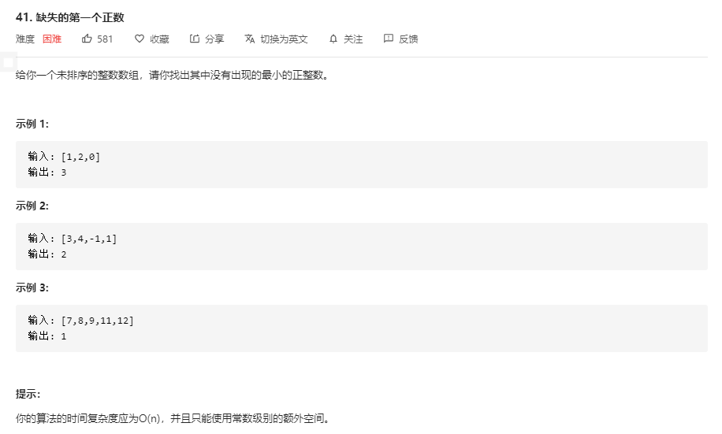

# 方法一 置换

将给定的数组「恢复」成下面的形式：

> 如果数组中包含$ x \in [1, N]$，那么恢复后，数组的第 x - 1个元素为 x。

在恢复后，数组应当有 `[1, 2, ..., N]` 的形式，但其中有若干个位置上的数是错误的，每一个错误的位置就代表了一个缺失的正数。以题目中的示例二 `[3, 4, -1, 1]` 为例，恢复后的数组应当为 `[1, -1, 3, 4]`，我们就可以知道缺失的数为 2。

恢复算法:

1. 遍历一遍数组对于遍历到的数`x=nums[i]` , 如果 $x \in [1,N]$ , 那它就应该在数组的 `x-1` 位置, 因此交换 `nums[i]` 和 `nums[x-1]` , 这样 x 就出现在正确的位置. 完成交换后，新的 nums[i] 可能还在 [1, N] 的范围内，我们需要继续进行交换操作，直到 $x \notin [1, N]$ 

    

```go
// 置换方法
func firstMissingPositive(nums []int) int {
	n := len(nums)
	for i := 0; i < n; i++ {
		// 确定 x = nums[i] 在 [1,N] 之间, 且 nums[i] = nums[x-1] 时要防止陷入死循环
		for nums[i] > 0 && nums[i] <= n && nums[nums[i] - 1] != nums[i] {
			nums[nums[i] - 1], nums[i] = nums[i], nums[nums[i] - 1]
		}
	}
	for i := 0; i < n; i++ {
		if nums[i] != i + 1 {
			return i + 1
		}
	}
	return n + 1
}
```

# 方法二 自身哈希

对于一个长度为 N的数组，其中没有出现的最小正整数只能在 [1, N+1] 中。这是因为如果 [1, N] 都出现了，那么答案是 N+1，否则答案是 [1, N] 中没有出现的最小正整数。

算法思路:

1. 遍历数组, 遍历到的数 `x` , 如果它在 [1, N] 范围内, 那么就将数组中 `x-1` 位置( 因为数组下标从 0 开始 ), 打上标记, 在遍历结束之后，如果所有的位置都被打上了标记，那么答案是 N+1，否则答案是最小的没有打上标记的位置加 1。

2. 标记定位将该数打为负数, 原数组中负数则改为比 N+1 大的数

3. 在遍历结束之后，如果所有的位置都被打上了标记，那么答案是 N+1，否则答案是最小的没有打上标记的位置加 1。

    


```go
func firstMissingPositiveHash(nums []int) int {
	n := len(nums)
	// 将原数组中负数和 0 变为 n+1 [最大未出现数]
	for i := 0 ; i < n; i++ {
		if nums[i] <= 0 {
			nums[i] = n + 1
		}
	}
	for i := 0; i < n; i++ {
		num := abs(nums[i])
		// 将小于 N 的数的下标所在数变为负数, 即打上标记
		if num <= n {
			nums[num - 1] = - abs(nums[num - 1])
		}
	}
	// 找到未标记的数, 未出现的数即为 i + 1
	for i := 0; i < n; i++ {
		if nums[i] > 0 {
			return i + 1
		}
	}
	return n + 1
}

```

