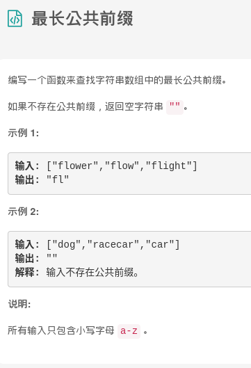

## 题解

题目需要求出字符串中的最长公共前缀，可以以字符串数组的第一个字符串作为基准，然后对后面所有的字符串都进行一个遍历判断。

* 对第一个字符串的每一个字符进行遍历，同时使用另一个循环遍历后面的字符串
* 依次进行每个字符串的字符和第一个字符进行比对，不相同就可以直接返回

```go
func longestCommonPrefix(strs []string) string {
	if len(strs) == 0 {
		return ""
	}
	for i := range strs[0] {
		for j := 1; j < len(strs); j++ {
			// 依次比对
			if i == len(strs[j]) || strs[j][i] != strs[0][i] {
				return strs[0][:i]
			}
		}
	}
	return strs[0]
}
```

