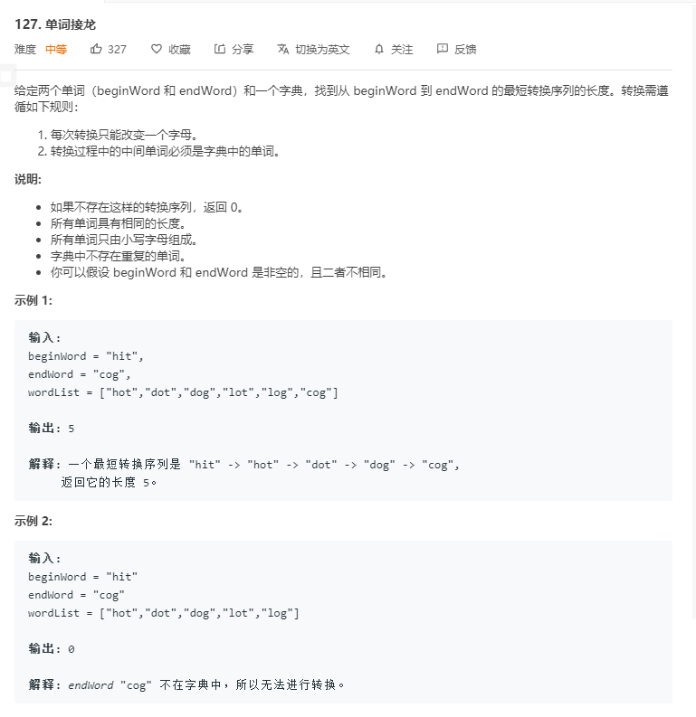
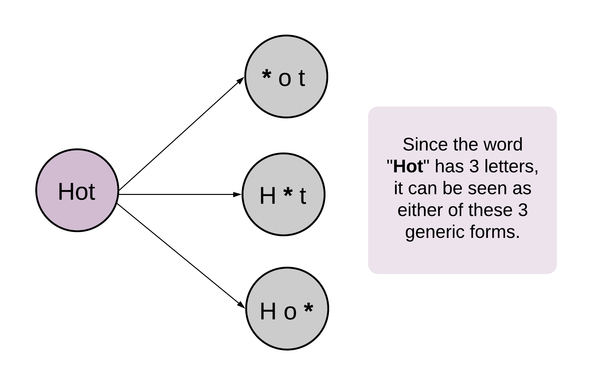

我们将问题抽象在一个无向无权图中，每个单词作为节点，差距只有一个字母的两个单词之间连一条边。问题变成找到从起点到终点的最短路径，如果存在的话。因此可以使用`广度优先搜索`方法。

算法中最重要的步骤是找出相邻的节点，也就是只差一个字母的两个单词。为了快速的找到这些相邻节点，我们对给定的 `wordList` 做一个预处理，将单词中的某个字母用 `*` 代替。



单向 BFS 

```go
func ladderLength(beginWord string, endWord string, wordList []string) int {
	dict := make(map[string]bool)

	for _, word := range wordList {
		dict[word] = true
	}

	if _, ok := dict[endWord]; !ok {
		return 0
	}

	var queue []string
	queue = append(queue, beginWord)

	l := len(beginWord)
	steps := 0

	for len(queue) > 0 {
		steps++
		size := len(queue)
		for i := size; i > 0; i-- {
			// 原始单词
			s := queue[0]
			queue = queue[1:]
			chs := []rune(s)
			for i := 0; i < l; i++ {
				// 当前单词的一位
				ch := chs[i]
				// 从 a-z
				for c := 'a'; c <= 'z'; c++ {
					if c == ch {
						continue
					}
					chs[i] = c
					t := string(chs)
					if t == endWord {
						return steps + 1
					}
					if _, ok := dict[t]; !ok {
						continue
					}
					// 从字典中删除该单词，因为已经访问过，若重复访问路径一定不是最短的
					delete(dict, t)
					// 将新的单词添加到队列
					queue = append(queue, t)
				}
				chs[i] = ch
			}
		}
	}
	return 0
}
```

双向 bfs

```go
func ladderLength(beginWord string, endWord string, wordList []string) int {
	dict := make(map[string]bool)

	for _, word := range wordList {
		dict[word] = true
	}

	if _, ok := dict[endWord]; !ok {
		return 0
	}

	q1 := make(map[string]bool)
	q2 := make(map[string]bool)
	// 头
	q1[beginWord] = true
	// 尾
	q2[endWord] = true
	l := len(beginWord)
	steps := 0

	for len(q1) > 0 && len(q2) > 0 {
		steps++
		// 先消耗更小的队列
		if len(q1) > len(q2) {
			q1, q2 = q2, q1
		}

		q := make(map[string]bool) // 临时队列 
		for k := range q1 {
			chs := []rune(k)
			for i := 0; i < l; i++ {
				ch := chs[i]
                // 从 a-z 寻找 dict 中存在的单词变换一个字母的值
				for c := 'a'; c <= 'z'; c++ {
					chs[i] = c
					t := string(chs)
					if _, ok := q2[t]; ok {
						return steps + 1
					}
					if _, ok := dict[t]; !ok {
						continue
					}
					delete(dict, t)
                    // 将新单词添加到队列中
					q[t] = true
				}
			    chs[i] = ch
			}
		}
		q1 = q
	}
	return 0
}
```

