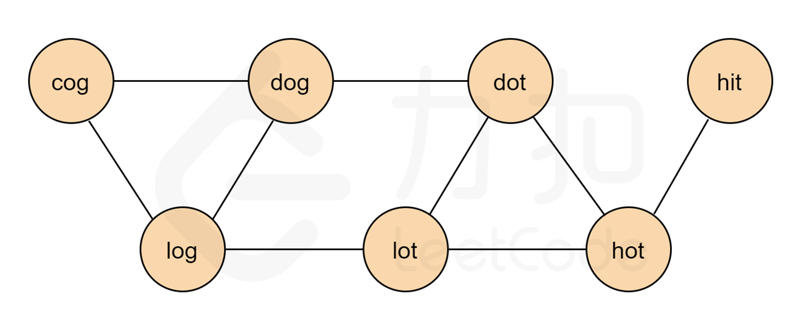
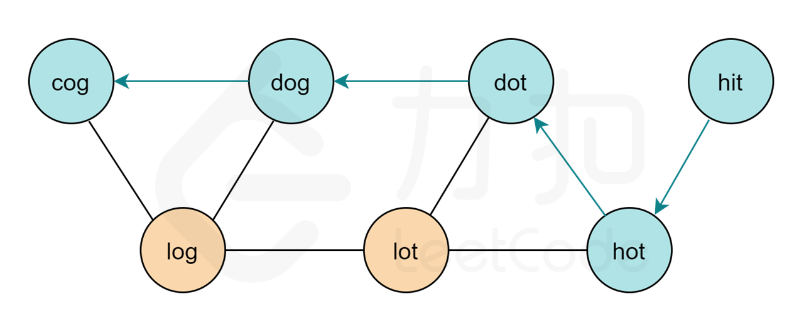

# 解题思路

该题要求求出最短转换序列, 看到最短首先想到 **BFS** , 想到 **BFS** 自然而然的就能想到图，但是本题并没有直截了当的给出图的模型，因此我们需要把它抽象成图的模型。



基于该图，我们以 `hit` 为图的起点， 以`cog` 为终点进行**广度优先搜索（BFS）**，寻找 `hit` 到 `cog` 的最短路径。下图即为答案中的一条路径。



算法

1. 首先将每个单词一个标记, 创建单词到 `id`  对应的映射 `wordId`, 将 `beginWord` 和 `wordList` 都放入其中, 然后检查 `endWord` 是否在其中, 不在则无解
2. 开始建图, 将所有能用一个单词互相转换的单词建立双向边, 建立图
3. 使用一个 `cost` 数组存放每个节点从起点开始的转化次数
4. 对于每次取出的节点  `now`, 每个节点都是一个数组, 最后一个元素为当前路径最后节点 `last` ,如果该节点为 `endWord` , 则将路径转化为单词保存至答案, 否则就遍历他连通的节点, 当该连通的节点`cost[to]` 大于当前时, 将其加入队列, 并更新其 `cost`, 否则该节点访问过了, 不必再考虑

```go
func findLadders(beginWord string, endWord string, wordList []string) [][]string {
	ids := map[string]int{}
	for i, word := range wordList {
		ids[word] = i
	}
	if _, ok := ids[beginWord]; ! ok {
		wordList = append(wordList, beginWord)
		ids[beginWord] = len(wordList) - 1
	}
	if _, ok := ids[endWord]; !ok {
		return [][]string{}
	}

	n := len(wordList)
	edges := make([][]int, len(wordList))
	// 建图, 将能互相转换的单词之间建立双向边
	for i := 0; i < n; i++ {
		for j := i + 1; j < n; j ++ {
			if transformCheck(wordList[i], wordList[j]) {
				// 建立双向边
				edges[i] = append(edges[i], j)
				edges[j] = append(edges[j], i)
			}
		}
	}

	res := [][]string{}
	cost := make([]int, n)
	// 将 beginword 入队
	queue := [][]int{[]int{ids[beginWord]}}

	for i := 0; i < n; i++{
		cost[i] = math.MaxInt32
	}
	cost[ids[beginWord]] = 0

	for i := 0; i < len(queue); i++ {
		now := queue[i]
		last := now[len(now) - 1]
		if last == ids[endWord] {
			tmp := []string{}
			for _, index := range now {
				tmp = append(tmp, wordList[index])
			}
			res = append(res, tmp)
		} else {
			for _, to := range edges[last] {
				if cost[last] + 1 <= cost[to] {
					cost[to] = cost[last] + 1
					tmp := make([]int, len(now))
					copy(tmp, now)
					tmp = append(tmp, to)
					queue = append(queue, tmp)
				}
			}
		}
	}
	return res
}

// 检查是否能通过换一个字母转化单词
func transformCheck(from, to string) bool {
	for i :=0; i < len(from); i++ {
		if from[i] != to[i] {
			return from[i+1:] == to[i+1:]
		}
	}
	return false
}
```

