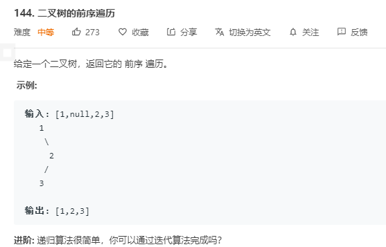
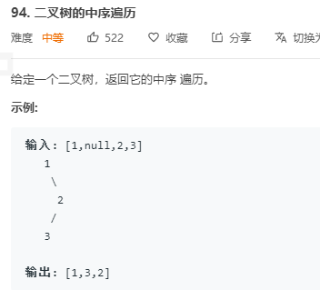

# 前序遍历



前序遍历顺序为 `根->左->右`, 可以通过递归算法快速完成, 而递归本质上也是栈, 所以也可以使用栈来完成

```go
// 根->左->右
func preOrder(root *TreeNode) []int {
	if root == nil {
		return nil
	}
	res := []int{}
	leftNode := preOrder(root.Left)
	rightNode := preOrder(root.Right)
    res = append(res, root.Val)
	res = append(res, leftNode...)
	res = append(res, rightNode...)
	return res
}

// 迭代法
func preOrderTraversal(root *TreeNode) []int {
	if root == nil {
		return nil
	}

	res := make([]int, 0)
	stack := make([]*TreeNode, 0)
	stack = append(stack, root)

	for len(stack) > 0 {
        // 获取栈顶部元素
		curNode := stack[len(stack) - 1]
		res = append(res, curNode.Val)
		stack = stack[:len(stack) - 1]
        // 依次将右子树和左子树压入栈, 出栈顺序为 根->左->右
		if curNode.Right != nil {
			stack = append(stack, curNode.Right)
		}

		if curNode.Left != nil {
			stack = append(stack, curNode.Left)
		}
	}

	return res
}
```

# 中序遍历



中序遍历为 左->根->右 遍历顺序, 在处理递归栈调用时, 需要主要将其左子树置为空


`4, 2, 5, 1, 6, 3, 7`

```go
// 左->根->右
func inOrder(root *TreeNode) []int {
	if root == nil {
		return nil
	}
	res := []int{}
	leftNode := preOrder(root.Left)
	rightNode := preOrder(root.Right)
	res = append(res, leftNode...)
	res = append(res, root.Val)
	res = append(res, rightNode...)
	return res
}
// 迭代
func inorderTraversal(root *TreeNode) []int {
	if root == nil {
		return nil
	}
	res := make([]int, 0, 10)
	stack := make([]*TreeNode, 0, 10)
	stack = append(stack, root)

	for len(stack) > 0 {
		curNode := stack[len(stack) - 1]
		if curNode == nil {
			break
		}

		if curNode.Left != nil {
			stack = append(stack, curNode.Left)
            // 防止其出栈时进入死循环
			curNode.Left = nil
		} else {
			stack = stack[:len(stack) - 1]
			res = append(res, curNode.Val)
			if curNode.Right != nil {
				stack = append(stack, curNode.Right)
			}
		}
	}
	return res
}
```

```go
// 简洁迭代法
func inorder(root *TreeNode) []int {
	res := make([]int, 0, 10)
	stack := make([]*TreeNode, 0, 10)
	// root != nil 为第一次 root 的判断
	for len(stack) > 0 || root != nil {
		for root != nil {
			stack = append(stack, root)
            // 移动至最左子树
			root = root.Left
		}
		cur := stack[len(stack) - 1]
		stack = stack[:len(stack) - 1]
		res = append(res, cur.Val)
		root = cur.Right
	}
	return res
}
```

# 后序遍历

遍历顺序为 左->右->根

递归解法

```go
func postorder(root *TreeNode) []int {
	if root == nil {
		return nil
	}

	res := []int{}
	leftNode := postorder(root.Left)
	rightNode := postorder(root.Right)
	res = append(res, leftNode)
	res = append(res, rightNode)
	res = append(res, root.Val)
	return res
}
```

迭代解法

```go
// 左右根
func postorderTraversal(root *TreeNode) []int {
	if root == nil {
		return nil
	}
	res := []int{}
	stack := []*TreeNode{root}
	for len(stack) > 0 {
		curNode := stack[len(stack) - 1]

		
		if curNode.Left == nil && curNode.Right == nil {
			stack = stack[:len(stack) - 1]
			res = append(res, curNode.Val)
		}

		if curNode.Right != nil {
			stack = append(stack, curNode.Right)
			curNode.Right = nil
		}
		if curNode.Left != nil {
			stack = append(stack, curNode.Left)
			curNode.Left = nil
		}
	}
	return res
}
```

后序遍历的难点和中序遍历一样, 在将当前节点的左右子树加入栈后, 需要将当前节点的 `left` 和 `right` 置为空, 否则就会出现无限死循环, 当遍历到叶子节点时( 左右子树均为空 ), 则将其出栈.


# 层次遍历

前中后序都为 `DFS` 算法, 运用栈或者递归可轻松求解, 而层序遍历则为 `BFS` 算法, 宽度优先, 将每一层的节点全部遍历一遍


该树的遍历顺序为 `1, 2, 3, 4, 5, 6, 7`

`BFS`  算法需要使用队列这种数据结构进行辅助

```go
func levelOrder(root *TreeNode) [][]int {
	ret := [][]int{}
	if root == nil {
		return ret
	}

	q := []*TreeNode{root}
     // 一层层遍历, 将每一层节点加入队列中, 同时使队首出列
    for len(q) > 0 {
        l := len(q)
        tmp := make([]int, 0)
        for j := 0; j < l; j++ {
            cur := q[j]
            tmp = append(tmp, cur.Val)
            if cur.Left != nil {
                q = append(q, cur.Left)
            }
            if cur.Right != nil {
                q = append(q, cur.Right)
            }
        }
        res = append(res, tmp)
        q = q[l:]
    }

	return ret
}
```

