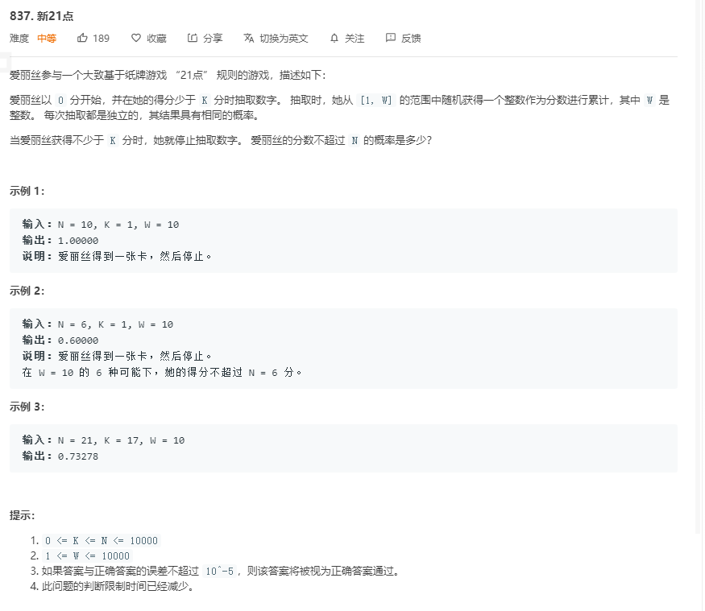
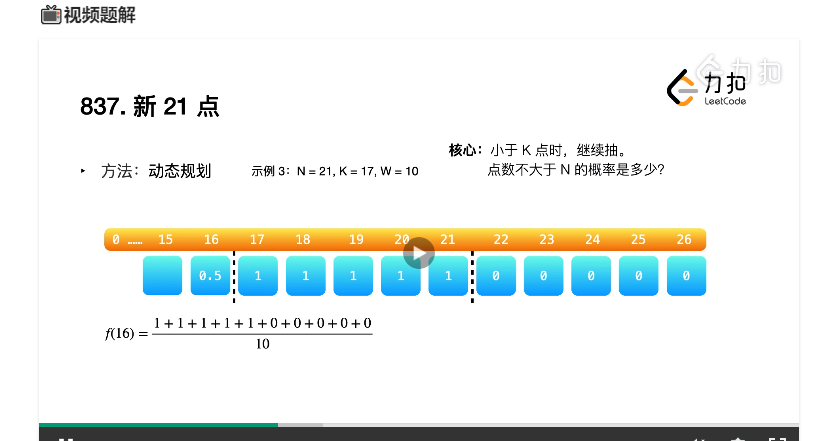

# 解题思路



根据题目意思, 当抽的点数为`16`( 刚好小于 17[K] )点时, 接下来再抽牌小等于 21 的概率就为 `0.5` 因为抽卡是抽到 `0-10` 的卡, 如果抽到的卡小于等于 `5` 就能小于等于 21 , 所以概率为 `0.5` .用方程为:
$$
d p[x]=\frac{d p[x+1]+d p[x+2]+\cdots+d p[x+W]}{W}
$$


照此推理, 可以的出点数为 `15` 时, 概率为 `(0.5+1+1+1+1+1+0+0+0+0)/10` 为 `0.55`

其状态转移方程为:
$$
d p[x-1]=\frac{d p[x+1]+d p[x+2]+\cdots+d p[x+W-1]}{W}
$$


由此可以推理出, 该动态规划的状态转移方程为:
$$
d p[x]=\frac{d p[x+1]+d p[x+2]+\cdots+d p[x+W]}{W}
$$
所以根据动态转移方程, 我们选择先初始化后面的数值, 再向前推, `dp[0]` 就是我们想要的结果.

对于如何初始化后面的数值, 我们从该例中可以看出, 应该初始化之后一直到 `N` 的数值, 

但是如果 `N` 大于了 `K+W-1` ( 所能抽的倒数第二张牌最大点数 ), 那就应该初始化 `k+W-1` 的数值


代码

```go
func new21Game(N int, K int, W int) float64 {
	if K == 0 {
		return 1.0
	}
	dp := make([]float64, K + W)

	for i := K, i < min(N+1, K + W); i++ {
		dp[i] = 1.0
	}

	for i := K-1; i >= 0; i-- {
		for j := 1; j <= W; j++ {
			dp[i] += dp[i + j] / float64(W)
		}
	}
	return dp[0]
}

func min(a, b int) int {
	if a < b {
		return a
	}
	return b
}
```

该题时间复杂度为 $O(N + KW)$ 

## 优化

通过差分计算我们可以发现
$$
d p[x]-d p[x+1]=\frac{d p[x+1]-d p[x+W+1]}{W}
$$
通过移位得到
$$
d p[x]=d p[x+1]-\frac{d p[x+W+1]-d p[x+1]}{W}(0\leq{x}<K-1)
$$


当 `x=K-1` 时, 其概率为 $\frac{dp[K]+dp[k+1]+...+dp[k+W-1]}{W}$ , 计算得到值为:
$$
d p[K-1]=\frac{\min (N, K+W-1)-K+1}{W}=\frac{\min (N-K+1, W)}{W}
$$
我们可以令 `S` 等于这个值, 每次只需要减去最后一个值, 再加上当前值即可计算下个 `x`


```go
func new21Game(N int, K int, W int) float64 {
	if K == 0 {
		return 1.0
	}
	dp := make([]float64, K + W)

	for i := K; i < min(N+1, K + W); i++ {
		dp[i] = 1.0
	}

	S := float64(min(N - K + 1, W))
	for i := K-1; i >= 0; i-- {
		dp[i] = S / float64(W)
		S += dp[i] - dp[i + W]
	}
	return dp[0]
}

func min(a, b int) int {
	if a < b {
		return a
	}
	return b
}
```


