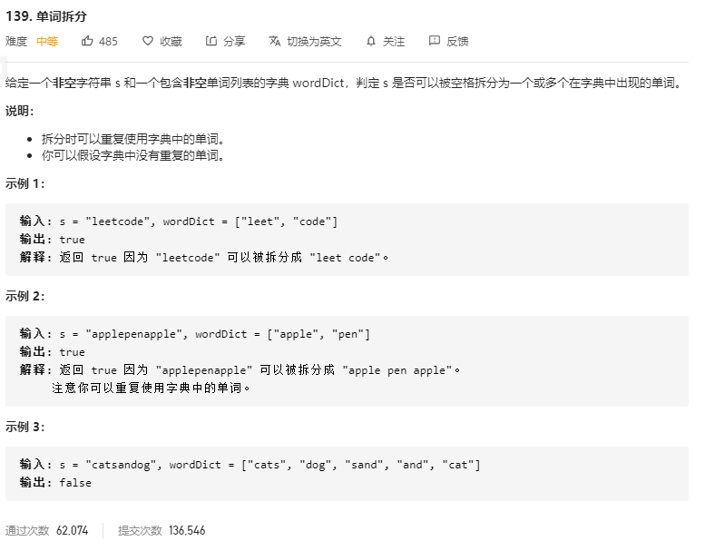

# 解题思路

首先可以定义 `dp` 数组, `dp[i]` 表示字符串 `s` 前 `i` 个字母能否被拆分成若干个字典中出现的单词, 接下来就是确定状态转移方程,  需要查看 $s[0..i-1]$ 的分割点 $s[0...j-1]$ $s[j...i-1]$ 这两个字符串是否都合法, 其中 $s[0...j-1]$ 即为 `dp[i]`, 所以可以确定其状态转移方程如下
$$
d p[i]=d p[j] \& \& \operatorname{check}(s[j . . i-1])
$$
其中check(s[j..i−1]) 表示子串 s[j..i-1]否出现在字典中。

```go
func wordBreak(s string, wordDict []string) bool {
	wordDictSet := make(map[string]bool)
    // 将单词表中的词存入字典中,出现过的则标记为 true
	for _, w := range wordDict {
		wordDictSet[w] = true
	}

	dp := make([]bool, len(s) + 1)
	dp[0] = true
	for i := 1; i <= len(s); i++ {
		for j := 0; j < i; j++ {
			if dp[j] && wordDictSet[s[j:i]] {
				dp[i] = true
				break
			}
		}	
	}
	return dp[len(s)]
}
```


