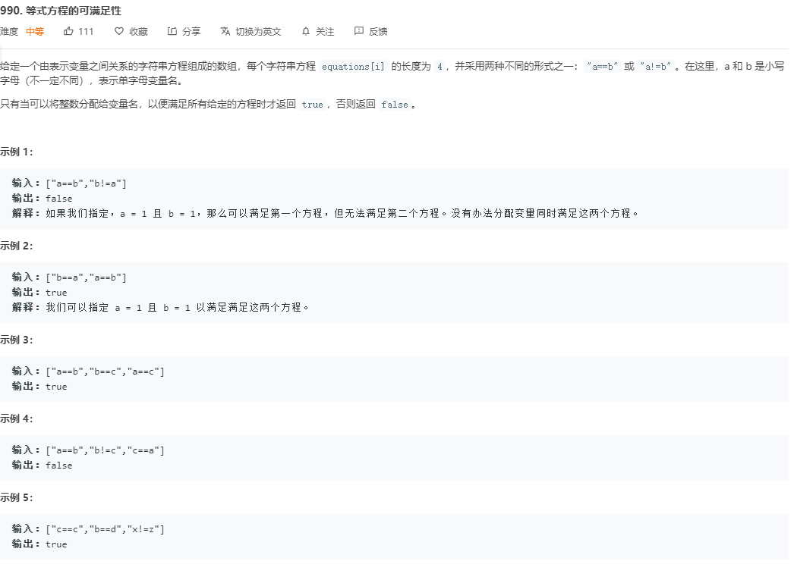

本题可以使用并查集解法来解决.

我们可以将每一个变量看成图中的一个节点, 把 `==` 看做为连接两个节点的边, 那么表示相等的方程式具有传递性, 即如果 `a==b` `b==c`, 那么 `a==c ` 也成立, 也就是说, 所有相等的变量属于同一个连通分量.可以使用并查集维持关系.

1. 遍历所有等式, 构造并查集, 同一等式两个变量属于一个连通分量, 将变量进行合并
2. 遍历所有不等式, 同一个不等式两个变量不能属于同一连通分量, 如果处于同一分量则返回 `false`
3. 遍历完如果没有矛盾则返回 `true`

```go
func equationsPossible(equations []string) bool {
    // parent 数组用于存储每个变量的连通分量信息
	parent := make([]int, 26)
    // 将父元素设置为自己
	for i := 0; i < 26; i++ {
		parent[i] = i
	}
	for _ , str := range equations {
		if str[1] == '=' {
			index1 := int(str[0] - 'a')
			index2 := int(str[3] - 'a')
            // 将两个分量进行连通
			union(parent, index1, index2)
		}
	}

	for _, str := range equations {
		if str[1] == '!' {
			index1 := int(str[0] - 'a')
			index2 := int(str[3] - 'a')
			if find(parent, index1) == find(parent, index2) {
				return false
			}
		}
	}
	return true
}

func union(parent []int, index1, index2 int)  {
	parent[find(parent, index1)] = find(parent, index2)
}

func find(parent []int, index int) int {
	for parent[index] != index {
		parent[index] = parent[parent[index]]
		index = parent[index]
	}
	return index
}
```