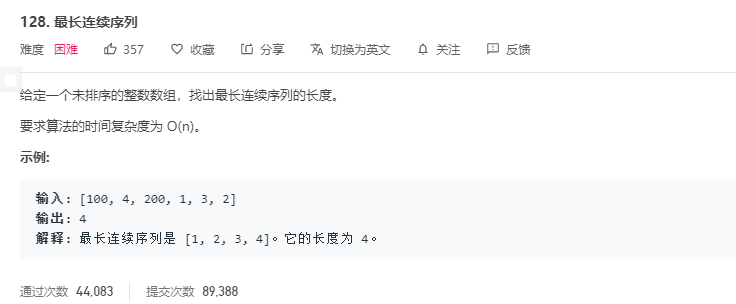

# 解题思路

题目要求求出, 连续序列, 即该序列中的数字为 `[x,x+1, x+2, …., x+n]`

所以我们对于该数组中的数, 都可以尝试以该数 `x` 为起点, 查找数组中是否存在 `x+1, x+2… x+n` 的数存在, 所以很容易想到 $O(n^2)$ 的解法, 但是题目要求 $O(n)$ 复杂度,

所以我们可以使用哈希表来存储数组中的所有值, 每次查找只用从哈希表中寻找即可. 

```go
func longestConsecutive(nums []int) int {
	numSet := make(map[int]bool, len(nums))
	// 存储哈希表中的值
	for i := 0; i < len(nums); i++ {
		numSet[nums[i]] = true
	}

	longestStreak := 0
	for i := 0; i < len(nums); i++ {
        // 如果是 x - 1 则直接跳过 我们需要遍历的是 [x, ...,x+n] 
		if !numSet[nums[i] - 1] {
			currentNum := nums[i]
			curStreak := 1
			for numSet[currentNum + 1] {
				currentNum++
				curStreak++
			}
			if curStreak > longestStreak {
				longestStreak = curStreak
			}
			
		}
	}
	return longestStreak
}
```


