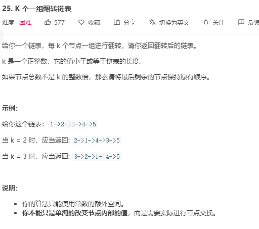

# 题目描述



# 解题思路

使用头插法进行翻转链表, 首先将建立一个伪头指针其 `next` 指向 `head` 指针

1. `pre` 指针指向伪头指针 `hair` , 对链表进行遍历, 将 `tail=pre` 指针指至 `k` 处, 若小于 `k` 则直接返回, 不进行翻转
2. 当 `tail` 指向第 `k` 位时, 首先记录当前 `tail.Next` 防止链表丢失, 然后对 `[head, tail]` 范围内进行逐个翻转
3. 将 `pre` 指向翻转后的 `tail` 指针, `head` 则移向 `tail.Next` 处, 开始下一组的翻转
4. 再挨个遍历对下个 `k` 范围内再进行如此操作

代码

```go
func reverseKGroup(head *ListNode, k int) *ListNode {
    hair := &ListNode{Next: head}
    pre := hair

    for head != nil {
        tail := pre
        for i := 0; i < k; i++ {
            tail = tail.Next
            if tail == nil {
                return hair.Next
            }
        }
        // pre, nex 作为标记位, 方便下一个 K 组翻转
        nex := tail.Next
        head, tail = myReverse(head, tail)
        pre.Next = head
        tail.Next = nex
        pre = tail
        head = tail.Next
    }
    return hair.Next
}
// 翻转 [head, tail] 之间的链表
func myReverse(head, tail *ListNode) (*ListNode, *ListNode) {
    prev := tail.Next
    p := head
    for prev != tail {
        nex := p.Next
        p.Next = prev
        prev = p
        p = nex
    }
    return tail, head
}
```

