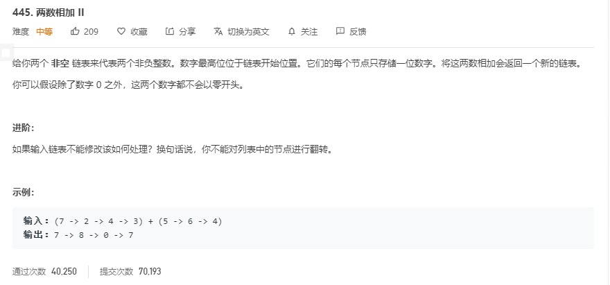

# 解题思路

## 1.链表反转

将两个链表分别反转后, 使用 [两数相加](./两数相加.md) 的方法, 最后返回反转的链表即可

```go
func addTwoNumbers(l1 *ListNode, l2 *ListNode) *ListNode {
	l1 = reverseList(l1)
	l2 = reverseList(l2)
	head := &ListNode{}
	cur := head
	add := 0
	for l1 != nil || l2 != nil || add > 0 {
		cur.Next = new(ListNode)
		cur = cur.Next
		if l1 != nil {
			num += l1.Val
			l1 = l1.Next
		}
		if l2 != nil {
			num += l2.Val
			l2 = l2.Next
		}
		cur.Val = num % 10
		num /= 10
	}
	return reverseList(head.Next)
}

func reverseList(head *ListNode) *ListNode {
	var pre *ListNode
	cur := head
	for cur != nil {
		nex := cur.Next
		cur.Next = pre
		pre = cur
		cur = nex
	}
	return pre
}
```

## 2.转化为数组(栈)

1. 将两个链表分别转化为栈(先进后出),
2. 分别遍历两个栈, 将值取出来相加即可( 注意进位 )

```go
func addTwoNumbers(l1 *ListNode, l2 *ListNode) *ListNode {
    // 转化为数组
	 l1List := make([]int, 0, 5)
	 l2List := make([]int, 0, 5)
	 for l1 != nil {
		 l1List = append(l1List, l1.Val)
		 l1 = l1.Next
	 }
	 for l2 != nil {
		 l2List = append(l2List, l2.Val)
		 l2 = l2.Next
	 }
   // 结果链表
	 var res *ListNode
    // 表示进位
	 carry := 0
	 l1Len, l2Len := len(l1List) - 1, len(l2List) - 1

	 for l1Len >= 0  || l2Len >= 0 {
		sum := carry
		if l1Len >= 0 {
			sum += l1List[l1Len]
			l1Len--
		}
		if l2Len >= 0 {
			sum += l2List[l2Len]
			l2Len--
		}
		node := &ListNode{
			Val: sum % 10,
			Next: nil,
		}
		if res == nil {
			res = node
		} else {
			node.Next = res
			res = node
		}
		carry = num / 10
	 }

	 if carry != 0 {
		 res = &ListNode{
			 Val: carry, 
			 Next: res,
		 }
	 }
	 return res
}
```


