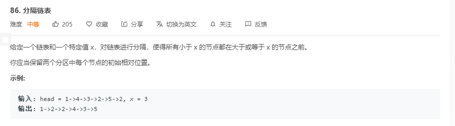

# 解题思路

创建两个新链表, 分别存储小于 `x` 和大于 `x` 的链表节点

```go
func partition(head *ListNode, x int) *ListNode {
	greatDummy := &ListNode{}
	lessDummy := &ListNode{}
	currGreat := greatDummy
	currLess := lessDummy
	for head != nil {
		if head.Val < x{
			currLess.Next = head
			currLess = head
		} else {
			currGreat.Next = head
			currGreat = head
		}
		head = head.Next
	}
    // 创建哑节点, 防止死循环
	currGreat.Next = nil
	currLess.Next= greatDummy.Next
	return lessDummy.Next
}
```

