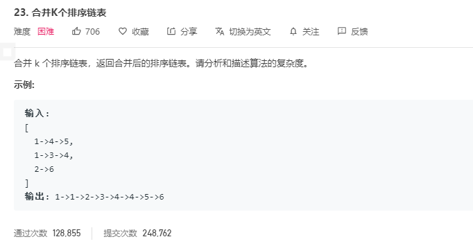

# 解题思路

首先想到的之前写过的`合并两个链表`, 可以使用暴力法, 直接对 `lists` 进行遍历, 对每个都进行 `mergeTwoLists` 操作, 但是这样做时间复杂度很高, 因为对每次合并的链表都需要重新遍历一边. 

暴力法

```go
func mergeKLists(lists []*ListNode) *ListNode {
	var resNode *ListNode

	for i := 0; i < len(lists); i++ {
		resNode = mergeTwoLists(resNode, lists[i])
	}
	return resNode
}

func mergeTwoLists(l1 *ListNode, l2 *ListNode) *ListNode {
	resNode := &ListNode{}
	curNode := resNode

	for l1 != nil && l2 != nil {
		if l1.Val >= l2.Val {
			curNode.Next = l2
			l2 = l2.Next
		} else {
			curNode.Next = l1
			l1 = l1.Next
		}
		curNode= curNode.Next
	}

	if l1 == nil {
		curNode.Next = l2
	} else {
        curNode.Next = l1
    }
	return resNode.Next
}
```

## 优化

可以使用 `归并排序` 进行分而治之, 将链表拆分为 1 个然后分别进行合并排序, 这样能大大降低时间复杂度

```go
func mergeKLists(lists []*ListNode) *ListNode {
	return merge(lists, 0, len(lists) - 1)
}

func merge(lists []*ListNode, left, right int) *ListNode {
	if left > right {
		return nil
	}
	if left == right {
		return list[left]
	}
	mid := (left + right) / 2
	l := merge(lists, left, mid)
	r := merge(lists, mid + 1, right)
	return mergeTwoLists(l, r)
}

func mergeTwoLists(l1 *ListNode, l2 *ListNode) *ListNode {
	resNode := &ListNode{}
	curNode := resNode

	for l1 != nil && l2 != nil {
		if l1.Val >= l2.Val {
			curNode.Next = l2
			l2 = l2.Next
		} else {
			curNode.Next = l1
			l1 = l1.Next
		}
		curNode= curNode.Next
	}

	if l1 != nil {
		curNode.Next = l1
	}
	if l2 != nil {
		curNode.Next = l2
	}
	return resNode.Next
}
```

