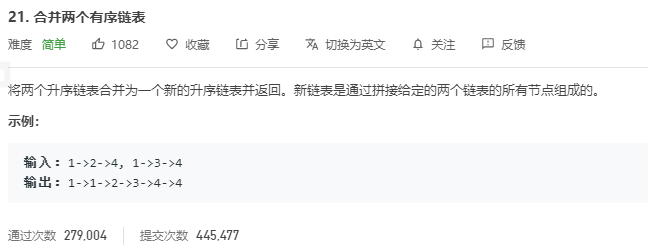

# 解题思路

## 递归

我们可以如下递归地定义两个链表里的 `merge` 操作（忽略边界情况，比如空链表等）：
$$
\left\{ \begin{array}{ll} list1[0] + merge(list1[1:], list2) & list1[0] < list2[0] \\ list2[0] + merge(list1, list2[1:]) & otherwise \end{array} \right.
$$
也就是说，两个链表头部值较小的一个节点与剩下元素的 `merge` 操作结果合并。

如果 `l1` 或者 `l2` 一开始就是空链表 ，那么没有任何操作需要合并，所以我们只需要返回非空链表。否则，我们要判断 `l1` 和 `l2` 哪一个链表的头节点的值更小，然后递归地决定下一个添加到结果里的节点。如果两个链表有一个为空，递归结束。

```go
func mergeTwoLists(l1, l2 *ListNode) *ListNode {
    if l1 == nil {
        return l2
    } else if l2 == nil {
        return l1
    } else if l1.Val < l2.Val {
        l1.Next = mergeTwoLists(l1.Next, l2)
        return l1
    } else {
        l2.Next = mergeTwoLists(l1, l2.Next)
        return l2
    }
}
```

## 迭代

比较两个链表节点值, 哪个大就指向哪个即可

```go
func mergeTwoLists(l1 *ListNode, l2 *ListNode) *ListNode {
	resNode := &ListNode{}
	cur := resNode
    curL1 := l1
    curL2 := l2
    for curL1 != nil && curL2 != nil {
		if curL1.Val <= curL2.Val {
            cur.Next = curL1
            curL1 = curL1.Next
        } else {
			cur.Next = curL2
			curL2 = curL2.Next
		}
		cur = cur.Next
	}
	if curL1 == nil {
		cur.Next = curL2
	} else {
		cur.Next = curL1
	}

	return resNode.Next
}

```

