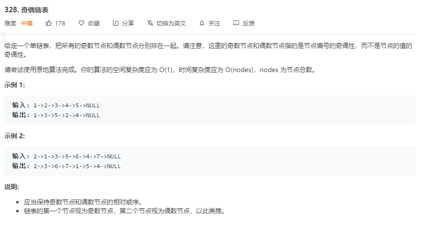

# 解题思路

1. 分别定义`odd`, `even` 两个指针, 分别表示链表奇节点, 和偶结点, 使用 `evenHead` 表示偶结点的头部
2. 分别将链表中的奇数节点和偶数节点插入到 `odd` 和 `even` 后面
3. 将`odd.Next` 指向 `evenHead` 即可

```go
func oddEvenList(head *ListNode) *ListNode {
	if head == nil || head.Next == nil {
		return head
	}

	odd, even := head, head.Next

	// 定义偶数链表的头
	evenHead := even

	for even != nil && even.Next != nil {
		odd.Next = even.Next
		even.Next = odd.Next.Next	
		odd = odd.Next				

		even = even.Next
	}

	odd.Next = evenHead
	return head
}
```

