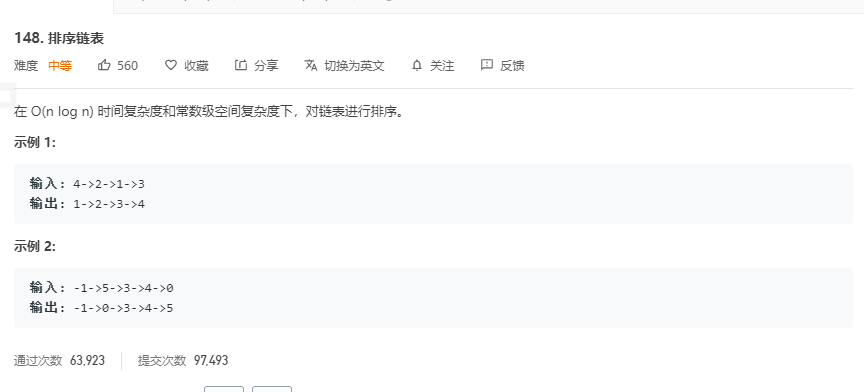

# 解题思路

题目要求 $O(n\log{n})$ 和常数级别的算法, 再排序算法中归并排序是符合条件的, 再该题中可以使用归并排序来求解.


1. 使用一个快指针 `fast`, 一个慢指针`slow`, 用于找出链表的二分位置
2. 将链表拆分为一个一个时, 再逐渐进行合并

```go
func sortList(head *ListNode) *ListNode {
	if head == nil || head.Next == nil {
		return head
	}

	slow, fast := head, head.Next.Next
	// 快指针到头时, slow.Next 刚好到达链表中间
	for fast != nil && fast.Next != nil {
		slow = slow.Next
		fast = fast.Next.Next
	}

	right := slow.Next
	slow.Next = nil

	sortedLeft := sortList(head)
	sortedRight := sortList(right)

	return mergeTwoLists(sortedLeft, sortedRight)
}

// 有序合并链表
func mergeTwoLists(l1 *ListNode, l2 *ListNode) *ListNode {
	if l1 == nil {
		return l2
	}

	if l2 == nil {
		return l1
	}
	dumHead := &ListNode{}
	cur := dumHead

	for l1 != nil && l2 != nil {
		if l1.Val > l2.Val {
			cur.Next = l2
			l2 = l2.Next
		} else {
			cur.Next = l1
			l1 = l1.Next
		}
		cur = cur.Next
	}

	if l1 == nil {
		cur.Next = l2
	}
	if l2 == nil {
		cur.Next = l1
	}
	return dumHead.Next
}
```

