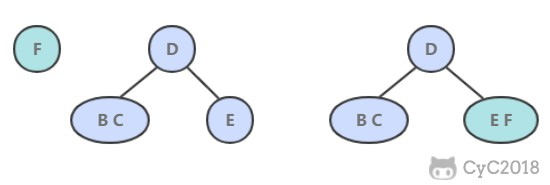
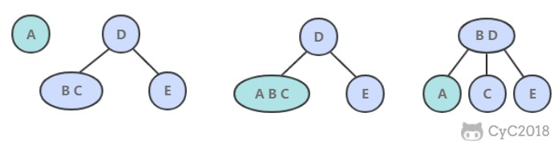
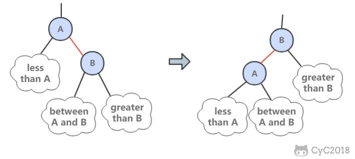
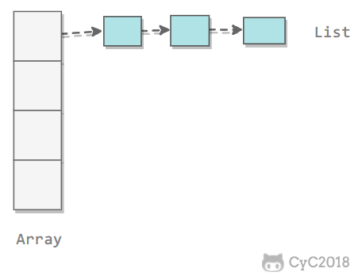
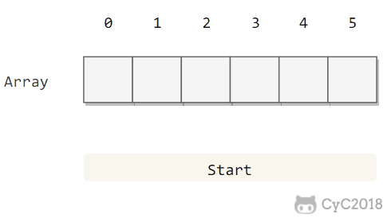
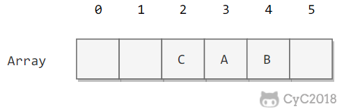

符号表（ Symbol Table ）是一种存储键值对的数据结构，可以快速进行查找和插入操作。其有两种操作 1. 插入（ put ），即将一组新的键值对存入表中。2. 查找 ( get ) ，根据给定的键获得相应的值。

符号表分为有序和无序两种，有序符号表主要指支持 min()、max() 等根据键大小关系来实现的操作。

有序的符号表的键需要实现 Comparable 接口，符号表可以利用有序性更好的实现  `get` 和 `put` 操作。


# 符号表整体结构设计

无序符号表接口：

```java
package com.eugeo.symboltable;

public interface UnorderedST<Key, Value> {
	/**
	 * 无序符号表的大小
	 * @return 大小
	 */
	int size();

	/**
	 * 根据 key 取得其 value
	 * @param key key
	 * @return value
	 */
	Value get(Key key);

	/**
	 * 向无序符号表中添加新的 kv
	 * @param key key
	 * @param value value
	 */
	void put(Key key, Value value);

	/**
	 * 根据 key 删除键值对
	 * @param key
	 */
	void delete(Key key);
}

```

有序符号表设计需要实现 Comparable 接口：

```java
package com.eugeo.symboltable;

import java.util.List;

public interface OrderedST<Key extends Comparable<Key>, Value> {
	/**
	 * 有序符号表的大小
	 * @return 大小
	 */
	int size();

	/**
	 * 根据 key 取得其 value
	 * @param key key
	 * @return value
	 */
	Value get(Key key);

	/**
	 * 向有序符号表中添加新的 kv
	 * @param key key
	 * @param value value
	 */
	void put(Key key, Value value);

	/**
	 * 有序表的最小键
	 * @return 最小键
	 */
	Key min();

	/**
	 * 有序表的最大键
	 * @return 最大键
	 */
	Key max();

	/**
	 * 根据 key 值返回其排名
	 * @param key
	 * @return
	 */
	int rank(Key key);

	/**
	 * 返回两个键排名之间的键
	 * @param l 低位键
	 * @param h 高位键
	 * @return  之间的健
	 */
	List<Key> keys(Key l, Key h);

}
```


## 1. 链表实现无序符号表

```java
/**
 * @author Administrator
 * 链表实现符号表
 */
public class ListUnorderedST<Key, Value> implements UnorderedST<Key, Value> {
	private class Node {
		Key key;
		Value value;
		Node next;

		Node(Key key, Value value, Node next) {
			this.key = key;
			this.value = value;
			this.next = next;
		}
	}

	private Node first;

	@Override
	public int size() {
		int cnt = 0;
		Node cur = first;
		while (cur != null) {
			cnt++;
			cur = cur.next;
		}
		return cnt;
	}

	@Override
	public Value get(Key key) {
		Node cur = first;
		while (cur != null) {
			if (cur.key.equals(key)) {
				return cur.value;
			}
			cur = cur.next;
		}
		return null;
	}

	@Override
	public void put(Key key, Value value) {
		Node cur = first;
		while (cur != null) {
			if (cur.key.equals(key)) {
				cur.value = value;
				return;
			}
			cur = cur.next;
		}
		first = new Node(key, value, first);
	}

	@Override
	public void delete(Key key) {
		if (first == null) {
			return;
		}
		if (first.key.equals(key)) {
			first = first.next;
		}
		Node pre = first, cur = first.next;
		while (cur != null) {
			if (cur.key.equals(key)) {
				pre.next = cur.next;
				return;
			}
			pre = pre.next;
			cur = cur.next;
		}
	}
}
```

## 2. 二分查找有序符号表

```java
/**
 * @author Administrator
 * 二分查找符号表（ 基于有序数组 ）
 */
public class BinarySearchOrderedST<Key extends Comparable<Key>, Value> implements OrderedST<Key, Value> {
	private Key[] keys;
	private Value[] values;
	private int N = 0;

	public BinarySearchOrderedST(int capacity) {
		keys = (Key[]) new Comparable[capacity];
		values = (Value[]) new Object[capacity];
	}
	@Override
	public int size() {
		return N;
	}

	@Override
	public Value get(Key key) {
		int index = rank(key);
		if (index < N && keys[index].compareTo(key) == 0) {
			return values[index];
		}
		return null;
	}

	@Override
	public void put(Key key, Value value) {
		int index = rank(key);
		// 如果找一个 key 和 插入的 key 值相同则更新该 key 的 value 为 value
		if (index < N && keys[index].compareTo(key) == 0) {
			values[index] = value;
			return;
		}
		// 插入新元素，需要将符号表中在这之前的元素都往前移一位
		for (int j = N; j > index; j--) {
			keys[j] = keys[j - 1];
			values[j] = values[j - 1];
		}
		keys[index] = key;
		values[index] = value;
		N++;
	}

	@Override
	public Key min() {
		return keys[0];
	}

	@Override
	public Key max() {
		return keys[N - 1];
	}

	/**
	 * 二分查找确定键的位置
	 * @param key 需要查找的键
	 * @return 键所在位置
	 */
	@Override
	public int rank(Key key) {
		int l = 0, h = N - 1;
		while (l <= h) {
			int m = l + (h - 1) / 2;
			int cmp = key.compareTo(keys[m]);
			if (cmp == 0) {
				return m;
			} else if (cmp < 0) {
				h = m - 1;
			} else {
				l = m + 1;
			}
		}
		return l;
	}

	@Override
	public List<Key> keys(Key l, Key h) {
		int index = rank(l);
		List<Key> list = new ArrayList<>();
		while (keys[index].compareTo(h) <= 0) {
			list.add(keys[index]);
			index++;
		}
		return list;
	}
}
```

优点：最优的查找效率和空间需求，能够进行有序性相关的操作

缺点：插入操作很慢（ 需遍历所有 rank(key) < key 的 key 并将它们前移【保持有序】 ）


# 二分查找树

**二叉查找树** （BST）是一颗二叉树，并且每个节点的值都大于等于其左子树中的所有节点的值而小于等于右子树的所有节点的值。

BST 有一个重要性质，就是它的中序遍历结果递增排序。

具体实现：

```java
/**
 * 二叉查找树实现
 * @author Administrator
 */
public class BinarySearchTree<Key extends Comparable<Key>, Value> implements OrderedST<Key, Value> {
	private class Node {
		Key key;
		Value value;
		Node left;
		Node right;
		// 以该节点为根的子树节点总数
		int N;
		// 红黑树中使用
		boolean color;

		Node(Key key, Value value, int N) {
			this.key = key;
			this.value = value;
			this.N = N;
		}
	}

	/**
	 * 定义根节点
	 */
	protected Node root;

	@Override
	public int size() {
		return size(root);
	}

	private int size(Node node) {
		if (node == null) {
			return 0;
		}
		return node.N;
	}

	/**
	 * 计算节点 x 的子树节点总数
	 * @param x 节点 x
	 */
	protected void recalculateSize(Node x) {
		x.N = size(x.left) + size(x.right) + 1;
	}

//	如果树是空的，则查找未命中；
//	如果被查找的键和根节点的键相等，查找命中；
//	否则递归地在子树中查找：如果被查找的键较小就在左子树中查找，较大就在右子树中查找。
	@Override
	public Value get(Key key) {
		return get(root, key);
	}

	/**
	 * 递归查找 key 的 value
	 * @param node 节点一般为根节点
	 * @param key  需要查找 value 的 key
	 * @return value
	 */
	private Value get(Node node, Key key) {
		if (node == null) {
			return null;
		}

		int cmp = key.compareTo(node.key);
		if (cmp == 0) {
			return node.value;
		} else if (cmp < 0) {
			return get(node.left, key);
		} else {
			return get(node.right, key);
		}
	}
//	当插入的键不存在于树中，需要创建一个新节点，
//	并且更新上层节点的链接指向该节点，使得该节点正确地链接到树中。
	@Override
	public void put(Key key, Value value) {
		root = put(root, key, value);
	}

	private Node put(Node node, Key key, Value value) {
		// 如果 key 存在于以 x 为根节点的子树中则更新它的值
		// 否则就以 key 和 value 生成新节点插入 x 子树中
		if (node == null) {
			return new Node(key, value, 1);
		}
		int cmp = key.compareTo(node.key);
		if (cmp == 0) {
			node.value = value;
		} else if (cmp < 0) {
			node.left = put(node.left, key, value);
		} else {
			node.right = put(node.right, key, value);
		}

		recalculateSize(node);
		return node;
	}

	/**
	 * floor(key)：小于等于键的最大键
	 *
	 * 如果键小于根节点的键，那么 floor(key) 一定在左子树中；
	 * 如果键大于根节点的键，需要先判断右子树中是否存在 floor(key)，
	 * 如果存在就返回，否则根节点就是 floor(key)。
	 *
	 * @param key 键
	 * @return 最大键
	 */
	public Key floor(Key key) {
		Node x = floor(root, key);
		if (x == null) {
			return null;
		}
		return x.key;
	}

	private Node floor(Node node, Key key) {
		if (node == null) {
			return null;
		}
		int cmp = key.compareTo(node.key);
		if (cmp == 0) {
			return node;
		} else if (cmp < 0) {
			return floor(node.left, key);
		}
		Node t = floor(node.right, key);
		return t != null ? t : node;
	}

	@Override
	public Key min() {
		return min(root).key;
	}

	private Node min(Node node) {
		if (node == null) {
			return null;
		}
		if (node.left == null) {
			return node;
		}
		return min(node.left);
	}

	@Override
	public Key max() {
		return max(root).key;
	}

	private Node max(Node node) {
		if (node == null) {
			return null;
		}
		if (node.right == null) {
			return node;
		}
		return max(node.left);
	}

	/**
	 * 令指向最小节点的链接指向最小节点的右子树
	 * 删除最小节点
	 */
	public void deleteMin() {
		root = deleteMin(root);
	}

	private Node deleteMin(Node node) {
		if (node.left == null) {
			return node.right;
		}
		node.left = deleteMin(node.left);
		recalculateSize(node);
		return node;
	}

	/**
	 * 如果待删除的节点只有一个子树， 那么只需要让指向待删除节点的链接指向唯一的子树即可；
	 * 否则，让右子树的最小节点替换该节点。
	 * @param key 需要删除的键
	 */
	public void delete(Key key) {
		root = delete(root, key);
	}

	private Node delete(Node node, Key key) {
		if (node == null) {
			return null;
		}
		int cmp = key.compareTo(node.key);
		if (cmp == 0) {
			if (node.left == null) {
				return node.right;
			} else if (node.right == null) {
				return node.left;
			}
			Node temp = node;
			node = min(temp.right);
			node.right = deleteMin(temp.right);
			node.left = temp.left;
		} else if (cmp < 0) {
			node.left =  delete(node.left, key);
		} else {
			node.right = delete(node.right, key);
		}
		recalculateSize(node);
		return node;
	}

	/**
	 * rank(key) 返回 key 的排名。
	 *
	 * 如果键和根节点的键相等，返回左子树的节点数；
	 * 如果小于，递归计算在左子树中的排名；
	 * 如果大于，递归计算在右子树中的排名，加上左子树的节点数，再加上 1（根节点）
	 * @param key 键
	 * @return 排名
	 */
	@Override
	public int rank(Key key) {
		return rank(root, key);
	}

	private int rank(Node node, Key key) {
		if (node == null) {
			return 0;
		}
		int cmp = key.compareTo(node.key);
		if (cmp == 0) {
			// 如果该节点为需要的节点则返回该节点的左子树的节点数
			return size(node.left);
		} else if (cmp < 0) {
			//如果小于则递归查找该节点左子树的所有节点
			return rank(node.left, key);
		} else {
			//如果大于该节点则加上该节点的左节点子树 + 1（根节点） + 该节点右子树
			return 1 + size(node.left) + rank(node.right, key);
		}
	}

	@Override
	public List<Key> keys(Key l, Key h) {
		return keys(root, l, h);
	}

	private List<Key> keys(Node node, Key l, Key h) {
		List<Key> list = new ArrayList<>();
		if (node == null) {
			return list;
		}
		int cmpL = l.compareTo(node.key);
		int cmpH = h.compareTo(node.key);
		if (cmpL < 0) {
			list.addAll(keys(node.left, l, h));
		}
		if (cmpL <= 0 && cmpH >= 0) {
			list.add(node.key);
		}
		if (cmpH > 0) {
			list.addAll(keys(node.right, l, h));
		}
		return list;
	}

}
```

代码大多是用递归，递归好理解且容易实现和调试，非递归效率高。

二叉查找树所有操作在最坏的情况下所需要的时间都和树的高度成正比。


# 平衡查找树

## 2-3 查找树

保证查找树的平衡性而引入，所以引出一个节点保存多个键的树。

2- 节点为标准二叉查找树中的节点（含有一个键和两条链接）

3- 节点为两个键和三条链接。

2-3查找树由 2- 节点和 3- 节点组成（ 让查找树平衡 ）。

性质：

完美平衡的 2-3 查找树所有空连接到根节点的距离应该是相同的。

### 1. 插入操作

插入操作和 BST 的插入操作有很大区别，BST 的插入操作是先进行一次未命中的查找，然后再将节点插入到对应的空链接上。但是 2-3 查找树如果也这么做的话，那么就会破坏了平衡性。它是将新节点插入到叶子节点上。

根据叶子节点的类型不同，有不同的处理方式：

- 如果插入到 2- 节点上，那么直接将新节点和原来的节点组成 3- 节点即可。




- 如果是插入到 3- 节点上，就会产生一个临时 4- 节点时，需要将 4- 节点分裂成 3 个 2- 节点，并将中间的 2- 节点移到上层节点中。如果上移操作继续产生临时 4- 节点则一直进行分裂上移，直到不存在临时 4- 节点。



### 2. 性质

2-3 查找树插入操作的变换都是局部的，除了相关的节点和链接之外不必修改或者检查树的其它部分，而这些局部变换不会影响树的全局有序性和平衡性。

2-3 查找树的查找和插入操作复杂度和插入顺序无关，在最坏的情况下查找和插入操作访问的节点必然不超过 logN 个，含有 10 亿个节点的 2-3 查找树最多只需要访问 30 个节点就能进行任意的查找和插入操作。

## 红黑树

红黑树是 2-3 查找树，但它不需要分别定义 2- 节点和 3- 节点，而是在普通的二叉查找树之上，为节点添加颜色。指向一个节点的链接颜色如果为红色，那么这个节点和上层节点表示的是一个 3- 节点，而黑色则是普通链接。

红黑树具有以下性质：

1. 红链接均为左连接
2. 没有任何一个节点同时和两条红链接相连
3. 该树是完美黑色平衡的，即任意空链接到根节点的路径上的黑链接数量相同  

### 1. 左旋转

当出现红色右链接时，需要进行左旋转操作



```java
/**
* 红黑树左旋转操作
* @param h 需要左旋转的父节点
* @return 旋转后的节点
*/
Node rotateLeft(Node h) {
    //获取需要旋转的链接即 h 的右链接
    Node x = h.right;
    h.right = x.left;
    x.left = h;
    //x 节点和 h 节点互换
    x.color = h.color;
    h.color = RED;
    x.N = h.N;
    recalculateSize(h);
    return x;
}
```

### 2. 右旋转

当出现两条连续的红链接时需要进行右旋转

```java
/**
* 红黑树右旋转操作
* @param h 需要旋转的节点 h
* @return  旋转后的节点
*/
public Node rotateRight(Node h) {
    Node x = h.left;
    h.left = x.right;
    x.right = h;
    x.color = h.color;
    h.color = RED; 
    x.N = h.N;
    recalculateSize(h);
    return x;
}
```

旋转操作主要用于插入新键时保证红黑树的`有序性`和`完美平衡性`

### 3. 插入操作

先将一个节点按二叉查找树的方法插入到正确位置，然后再进行如下颜色操作：

- 如果右子节点是红色的而左子节点是黑色的，进行左旋转；
- 如果左子节点是红色的，而且左子节点的左子节点也是红色的，进行右旋转；
- 如果左右子节点均为红色的，进行颜色转换。

```java
@Override
public void put(Key key, Value value) {
    root = put(root, key, value);
    root.color = BLACK;
}

private Node put(Node h, Key key, Value value) {
    if (h == null) {
        return new Node(key, value, 1, RED);
    }

    int cmp = key.compareTo(h.key);
    if (cmp < 0) {
        h.left = put(h.left, key, value);
    } else if (cmp > 0) {
        h.right = put(h.right, key, value);
    } else {
        h.value = value;
    }

    if (isRed(h.right) && !isRed(h.left)) {
        h = rotateLeft(h);
    }
    if (isRed(h.left) && isRed(h.left.left)) {
        h = rotateRight(h);
    }
    if (isRed(h.left) && isRed(h.right)) {
        flipColor(h);
    }
    recalculateSize(h);
    return h;
}
```

可以看到该插入操作和二叉查找树的插入操作类似，只是在最后加入了旋转和颜色变换操作即可。

根节点一定为黑色，因为根节点没有上层节点，也就没有上层节点的左链接指向根节点。flipColors() 有可能会使得根节点的颜色变为红色，每当根节点由红色变成黑色时树的黑链接高度加 1.

### 4. 分析

一颗大小为 N 的红黑树的高度不会超过 2logN。最坏的情况下是它所对应的 2-3 树，构成最左边的路径节点全部都是 3- 节点而其余都是 2- 节点。

红黑树大多数的操作所需要的时间都是对数级别的。

# 散列表

散列表类似于数组，可以把散列表的散列值看成数组的索引值。访问散列表和访问数组元素一样快速，它可以在常数时间内实现查找和插入操作。

由于无法通过散列值知道键的大小关系，因此散列表无法实现有序性操作。

## 1. 散列函数

对于一个大小为 M 的散列表，散列函数能够把任意键转换为 [0, M-1] 内的正整数，该正整数即为 hash 值。

散列表存在冲突，也就是两个不同的键可能有相同的 hash 值。

散列函数应该满足以下三个条件：

- 一致性：相等的键应当有相等的 hash 值，两个键相等表示调用 equals() 返回的值相等。
- 高效性：计算应当简便，有必要的话可以把 hash 值缓存起来，在调用 hash 函数时直接返回。
- 均匀性：所有键的 hash 值应当均匀地分布到 [0, M-1] 之间，如果不能满足这个条件，有可能产生很多冲突，从而导致散列表的性能下降。


### 1. 整数和浮点数

整数散列最常用的是除留余数法。选择大小为**素数** M 的数组，对于任意正整数 k 计算 k%M 的值能有效将键散布在 0 - M-1 范围内

键如果是 0-1 之间的实数，将键表示为二进制在使用除留余数法

### 2. 字符串和组合键

对于多部分组合的类型，每个部分都需要计算 hash 值，这些 hash 值都具有同等重要的地位。为了达到这个目的，可以将该类型看成 R 进制的整数，每个部分都具有不同的权值。

字符串实现如下：

```java
int hash = 0;
for (int i = 0; i < s.length(); i++)
    hash = (R * hash + s.charAt(i)) % M;
```

再比如，拥有多个成员的自定义类的哈希函数如下：

```java
int hash = (((day * R + month) % M) * R + year) % M;Copy to clipboardErrorCopied
```

R 通常取 31。

### 3. Java 的 hashCode() 方法

Java 中的 hashCode() 实现了哈希函数，但是默认使用对象的内存地址值。在使用 hashCode() 时，应当结合除留余数法来使用。因为内存地址是 32 位整数，我们只需要 31 位的非负整数，因此应当屏蔽符号位之后再使用除留余数法。

```java
int hash = (x.hashCode() & 0x7fffffff) % M;
```

### 4. 自定义 hashCode() 方法

使用 Java 的 HashMap 等自带的哈希表实现时，只需要去实现 Key 类型的 hashCode() 函数即可。Java 规定 hashCode() 能够将键均匀分布于所有的 32 位整数，Java 中的 String、Integer 等对象的 hashCode() 都能实现这一点。以下展示了自定义类型如何实现 hashCode():

```java
public class Transaction
{
    ...
    private final String who;
    private final Date when;
    private final double amount;
    public int hashCode()
    {
        int hash = 17;
        hash = 31 * hash + who.hashCode();
        hash = 31 * hash + when.hashCode();
        hash = 31 * hash + ((Double) amount).hashCode();
        return hash;
    }
}
```

## 2. 基于拉链法的散列表

拉链法使用链表来存储 hash 值相同的键，从而解决冲突。

查找需要分两步，首先查找 Key 所在的链表，然后在链表中顺序查找。

对于 N 个键，M 条链表 (N>M)，如果哈希函数能够满足均匀性的条件，每条链表的大小趋向于 N/M，因此未命中的查找和插入操作所需要的比较次数为 ~N/M。



## 3. 线性探测法

线性探测法使用空位来解决冲突，当冲突发生时，向前探测一个空位来存储冲突的键。

使用线性探测法，数组的大小 M 应当大于键的个数 N（M>N)。



```java
public class LinearProbingHashST<Key, Value> implements UnorderedST<Key, Value> {
	/**
	 * 符号表中键值对总数
	 */
	private int N = 0;
	// 线性探测表的大小
	private int M = 16;

	private Key[] keys;
	private Value[] values;
	public LinearProbingHashST() {
		init();
	}

	public LinearProbingHashST(int M) {
		this.M = M;
		init();
	}

	private void init() {
		keys = (Key[]) new Object[M];
		values = (Value[]) new Object[M];
	}

	private int hash(Key key) {
		return (key.hashCode() & 0x7fffffff) % M;
	}


	@Override
	public int size() {
		return N;
	}

	@Override
	public Value get(Key key) {
		for (int i = hash(key); keys[i] != null; i = (i + 1) % M) {
			if (keys[i].equals(key)) {
				return values[i];
			}
		}
		return null;
	}

	@Override
	public void put(Key key, Value value) {
		resize();
		putInternal(key, value);
	}

	private void putInternal(Key key, Value value) {
		int i;
		for (i = hash(key); keys[i] != null; i = (i + 1) % M) {
			if (keys[i].equals(key)) {
				values[i] = value;
				return;
			}
		}
		keys[i] = key;
		values[i] = value;
		N++;
	}

	/**
	 * 理论证明，当 α 小于 1/2 时探测的预计次数只在 1.5 到 2.5 之间。
	 * 为了保证散列表的性能，应当调整数组的大小，使得 α 在 [1/4, 1/2] 之间
	 */
	private void resize() {
		if (N > M / 2) {
			resize(2 * M);
		} else if (N < M / 8) {
			resize(M / 2);
		}
	}

	/**
	 * 调整数组大小，使栈具有伸缩性
	 * @param size 伸缩的大小
	 */
	private void resize(int size) {
		LinearProbingHashST<Key, Value> tmp = new LinearProbingHashST<>(size);
		for (int i = 0; i < M; i++) {
			if (keys[i] != null) {
				tmp.putInternal(keys[i], values[i]);
			}
		}
		keys = tmp.keys;
		values = tmp.values;
		M = tmp.M;
	}


	@Override
	public void delete(Key key) {
		int i = hash(key);
		while (keys[i] != null && !key.equals(keys[i])) {
			i = (i + 1) % M;
		}

		// 不存在，直接返回
		if (keys[i] == null) {
			return;
		}

		keys[i] = null;
		values[i] = null;
		i = (i + 1) % M;
		// 将之后相连的键值对重新插入
		while (keys[i] != null) {
			Key keyToRedo = keys[i];
			Value valueToRedo = values[i];
			keys[i] = null;
			values[i] = null;
			N--;
			put(keyToRedo, valueToRedo);
			i = (i + 1) % M;
		}
		N--;
		resize();
	}
}
```

删除操作应当将右侧所有相邻的键值对重新插入散列表中。

线性探测法的成本取决于连续条目的长度，连续条目也叫聚簇。当聚簇很长时，在查找和插入时也需要进行很多次探测。例如下图中 2~4 位置就是一个聚簇。




α = N/M，把 α 称为使用率。理论证明，当 α 小于 1/2 时探测的预计次数只在 1.5 到 2.5 之间。为了保证散列表的性能，应当调整数组的大小，使得 α 在 [1/4, 1/2] 之间。

# 各符号表算法比较

| 算法                     | 插入 | 查找 | 是否有序 |
| ------------------------ | ---- | ---- | -------- |
| 链表实现的无序符号表     | N    | N    | yes      |
| 二分查找实现的有序符号表 | N    | logN | yes      |
| 二叉查找树               | logN | logN | yes      |
| 2-3 查找树               | logN | logN | yes      |
| 拉链法实现的散列表       | N/M  | N/M  | no       |
| 线性探测法实现的散列表   | 1    | 1    | no       |

应当优先考虑散列表，当需要有序性操作时使用红黑树。

java.util.TreeMap 实现了红黑树

java.util.HashMap 实现了散列表