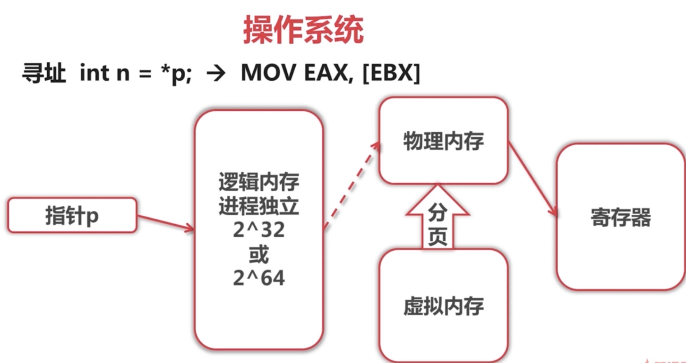
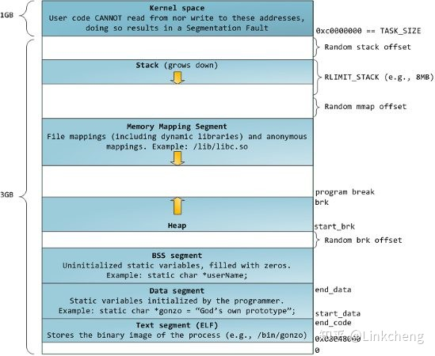

## 进程和线程

定义:   进程是资源分配的基本单位(最小资源管理单位)

​		    线程是独立调度的基本单位(最小执行单位)

进程:   由线程, 内存(逻辑内存), 文件/网络句柄组成

线程:   由调用栈, 程序计数器, TLS(线程内存) 组成, 其中程序计数器寄托于进程逻辑内存

区别: 

1. 进程之间不能共享资源,线程可以共享所在进程的地址空间和其他资源
2. 进程有自己独立的地址空间, 线程没有,线程必须依赖进程而存在

**作业调度**：作业调度是从慢速存储设备中的后备队列中挑选作业加载到主存中。

**进程调度**：进程调度是从主存中中的就绪队列中挑选进程占用处理器运行

### 进程调度算法

#### ①. 批处理系统（保证吞吐量和周转时间）

1. 先来先服务 （有利于长作业）
2. 短作业优先 （长作业可能饿死）
3. 最短剩余时间优先 （抢占式）

#### ②. 交互式系统（快速响应）

1. 时间片轮转
2. 优先级调度
3. 多级反馈队列

### 进程同步（控制多个进程按一定顺序执行）【目的】

目的:

1. 数据传输
2. 共享数据
3. 通知事件
4. 资源共享
5. 进程控制

#### 临界资源

进程互斥访问资源的资源叫做临界资源，对临界资源访问的代码称为**临界区**

#### 同步机制

信号量，自旋锁，管程机制，会和，分布式系统（消息和 rpc）

**信号量**是一个整型变量，可以对其执行 down 和 up 操作也就是  P 和 V 操作。

- **down** : 如果信号量大于 0 ，执行 -1 操作；如果信号量等于 0，进程睡眠，等待信号量大于 0；
- **up** ：对信号量执行 +1 操作，唤醒睡眠的进程让其完成 down 操作。

**管程**引入了条件变量以及相关操作：`wait` 和 `signal()` 来实行同步操作。其中对条件变量使用 `wait` 会导致调用进程阻塞，让出管程。 `signal()` 则用来唤醒阻塞进程。

### 进程通信方法（进程间传输信息）【手段】

1. 管道 PIPE ( 半双工通信[父子进程或兄弟进程] )
2. 命名管道 FIFO ( 去除管道的父子进程限制 )
3. 信号：是一种异步通信方式
4. 消息队列 ( 独立读写进程存在,避免了 FIFO 中同步管道的打开和关闭时可能产生的困难 )
5. 信号量 （为多进程提供对共享数据对象的访问）【同步互斥的机制】
6. 共享存储 （最快的通信方法 IPC）
7. 套接字 Socket （可用于不同机器间的通信）

**半双工通信**：若使用同一根传输线既作接收又作发送，虽然数据可以在两个方向上传送，但通信双方不能同时收发数据，这样的传送方式就是半双工制。如对讲机

**全双工通信**： 当数据的发送和接收分流，分别由两根不同的传输线传送时，通信双方都能在同一时刻进行发送和接收操作，这样的传送方式就是全双工制。如打电话

### 线程通信

**避免多线程竞争时有哪些手段**

1)   不可变对象；

2)   互斥锁；

3)   ThreadLocal 对象；

4)   CAS；

5）信号量；

6）临界区

### 进程和线程的区别

1. 进程有自己独立的地址空间，线程没有
2. 进程是资源分配最小单位，线程是 cpu 调度最小单位
3. 通信方式不同
4. 进程切换上下文开销大，而线程开销小

### 为什么进程上下文切换比线程上下文切换代价高？

**进程切换分两步：**

1. 切换页目录以使用新的地址空间
2. 切换内核栈和硬件上下文

**切换的性能消耗：**

1. 线程上下文切换和进程之间最大区别为切换虚拟内存空间依然是相同的
2. 进程切换上下文会扰乱处理器的缓存机制

## 内存

### 内存碎片

1. 内部碎片：由于采用固定大小的内存分区，当一个进程不能完全使用分给他的固定内存区域时就产生了内部碎片
2. 外部碎片：由于某些未分配的连续内存区域太小，以至于不能被进程利用

解决方法：使用分页存储管理方式，使用段页式存储管理方式

### 缓冲区（buffer）和缓存（cache）

**缓冲区（buffer）**

它是内存空间的一部分，在内存空间中预留了一定的存储空间，这些存储空间用来缓冲输入或输出的数据，这部分预留的空间就叫做缓冲区，显然缓冲区是具有一定大小的。

缓冲区根据其对应的是输入设备还是输出设备，分为输入缓冲区和输出缓冲区。

**作用**

1. 解除两者制约关系，数据可以直接送往缓冲区，高速设备不用再等待低速设备，提高了计算机的效率。
2. 减少数据 IO 次数

**缓冲区刷新**

* 缓冲区满时
* 关闭文件时

以上两种情况会引起缓冲区的刷新，当刷新缓冲区时，会进行真正的 IO 操作

**缓存（Cache）**

1. CPU Cache（高速缓冲存储器）：由于 CPU 运算速度快，内存数据读取跟不上，所以就设置缓存，内存优先从 Cache 中读取，Cache就是用来解决CPU与内存之间速度不匹配的问题，避免内存与辅助内存频繁存取数据，这样就提高了系统的执行效率。
2. 磁盘 Cache：它解决了总线接口的高速需求和读写硬盘的矛盾以及对某些扇区的反复读取。
3. 浏览器缓存：节约网络资源加速浏览

**缓存和缓冲区别**

Buffer 核心作用是缓冲，偏重于写

Cache 是加快取用速度，偏重于读

**缓冲区溢出及其危害**

缓冲区溢出是指当计算机向缓冲区填充数据时超出了缓冲区本身的容量，溢出的数据覆盖在合法数据上。

危害有以下两点：

（1）程序崩溃，导致拒绝服务

（2）跳转并且执行一段恶意代码

造成缓冲区溢出的主要原因是程序中没有仔细检查用户输入

### 常驻内存

指进程在使用过程中正在使用的内存。

### 共享内存

进程在运行过程中，会加载许多操作系统的动态库，比如 libc.so、libld.so 等。这些库对于每个进程而言都是公用的，它们在内存中实际只会加载一份，这部分称为共享内存。如上图中的A4和B3部分即为共享内存，实际都映射到同一块物理内存。

也是常住内存的一部分。

### 虚拟内存

虚拟内存的功能

1. 高效地使用内存，扩充物理内存【将主存看成是一个存储在磁盘的地址空间的高速缓存】
2. 简化内存管理【每个进程提供一致的地址空间】
3. 保护进程地址空间，不被其他进程破坏

操作系统寻址（虚拟寻址）时, 使用逻辑内存 ( 逻辑内存大于物理内存因此需要使用虚拟内存[硬盘中] ) 进行映射到物理内存中, 如果寻址的地址位于虚拟内存时, 则需要映射到物理内存中完成寻址, 无法直接使用 int 这种字节比对进行查找( 花销太大 ), 一般是通过分页, 将寻址指针所在分页放入物理内存中完成寻址.  当物理内存不够时, 则需要将物理内存中很久没有的一块交换到虚拟内存中, **这个过程就叫分页或者页面置换**. 

#### 虚拟内存布局

最小端地址为 0，最上端地址最高。自顶向下依次是

1. 内核空间
2. 栈空间：该空间有个栈随机偏移 (Random stack offset) ，该偏移量主要是安全起见，使每个栈的起始位置不同，可以防止恶意访问， Random brk offset 也是同理
3. 堆和内存映射段都属于堆空间，用于存放动态数据
4. BSS 段：存放全局/静态未初始化数据
5. 数据段：存放全局数据和局部数据
6. 代码段（ELF文件） 

**减少缺页错误方法**

访问局部性（locality of reference）满足进程要求

### 分页算法( 页面置换算法 )

目的是使页面置换频率最低（缺页率最低）

#### 1.最佳（ OPT ）

所选择的被换出的页面将是最长时间内不再访问的页，通常可以保证最低的缺页率。

是一种理论的算法，因为无法知道一个页多长时间不再被访问。

#### 2.最近最久未使用（ LRU ）

虽然无法知道将来要使用的页面情况，但是可以知道过去使用页面的情况。LRU 将最近最久未使用的页面换出。 

为了实现 LRU，需要在内存中维护一个所有页面的链表。当一个页面被访问时，将这个页面移到链表表头。这样就能保证链表表尾的页面是最近最久未访问的。

每次访问都需要更新链表，因此这种方式实现的 LRU 代价很高。

#### 3.最近未使用 （ NRU）

 每个页面都有两个状态位：R 与 M，当页面被访问时设置页面的 R=1，当页面被修改时设置 M=1。其中 R 位会定时被清零。可以将页面分成以下四类： 

- R=0，M=0
- R=0，M=1
- R=1，M=0
- R=1，M=1

当发生缺页中断时，NRU 算法随机地从类编号最小的非空类中挑选一个页面将它换出。

NRU 优先换出已经被修改的脏页面（R=0，M=1），而不是被频繁使用的干净页面（R=1，M=0）。

#### 4.先进先出 （ FIFO ）

选择换出的页面是最先进入的页面。

该算法会将那些经常被访问的页面也被换出，从而使缺页率升高。

#### 5.第二次机会算法

 FIFO 算法可能会把经常使用的页面置换出去，为了避免这一问题，对该算法做一个简单的修改： 

当页面被访问 (读或写) 时设置该页面的 R 位为 1。需要替换的时候，检查最老页面的 R 位。如果 R 位是 0，那么这个页面既老又没有被使用，可以立刻置换掉；如果是 1，就将 R 位清 0，并把该页面放到链表的尾端，修改它的装入时间使它就像刚装入的一样，然后继续从链表的头部开始搜索。 

#### 6.时钟

 第二次机会算法需要在链表中移动页面，降低了效率。时钟算法使用环形链表将页面连接起来，再使用一个指针指向最老的页面。 

#### 7. LFU 最少使用

LFU置换算法的页面访问图与 LRU 置换算法的访问图完全相同；或者说，利用这样一套硬件既可实现LRU算法，又可实现LFU算法。

### 分段

虚拟内存使用分页技术，将地址空间划分成**固定大小**的页，每一页再与内存进行映射。

分段是将每个表（程序编译过程中建立的多个表）分成段，一个段构成一个独立的地址空间。每个段的长度可以不同，并且可以**动态增长**，和分页一样都可以离散分配。

### 段页式

程序地址空间划分成多个拥有独立地址空间的段，每个段上的地址空间划分成大小相同的页。这样即拥有分段系统的共享和保护，又拥有分页系统的虚拟内存功能

### 分段和分页比较

1. **地址维度**：分页是一维地址，分段是二维地址
    1. 分页只需给出地址 a，根据页面大小就可以算出页号和页内偏移地址
    2. 分段给出段号，根据段表找出此段的起始地址，再根据段内地址进行定位，即需要段号和段内地址。
2. **大小可变**：分页大小不变，分段可以动态增长
3. **出现原因**：
    1. 分页主要用于实现虚拟内存，从而获得更大的地址空间；
    2. 分段主要是使程序和数据可以被划分为逻辑上独立的地址空间并且有助于共享和保护

**分页计算**

系统采用页式存储管理方案，若页号块号对应关系存于内存中，且内存的访问时间为 1μs，则当快表命中率为50%和85%时，有效的存取时间分别为（   ）

$50\%\times1+50\%(2 \times1)=1.5;$
$85\%\times1+15\%(2\times1)=1.15;$

快表命中率98%，访问时间是10ns，内存访问时间是100ns，平均访问时间？

平均访问时间=$98\%*(10+100)+（1-98\%）*（10+100+100）$

## 死锁

一组进程中每个进程持有某种资源但都在等待别的进程释放他或他们现在保持的资源，这就是死锁。

### 死锁计算

假设现在有 P 个进程，每个进程最多需要 m 个资源，并且有 r 个资源可用

所以避免死锁的条件是：
r ≥ p(m-1)+1

### 死锁条件

1. 互斥：资源必须是临界资源
2. 占有和等待：已经得到某个资源的进程可以再请求新的资源
3. 不可抢占：非抢占式
4. 环路等待

### 死锁处理方法

* 鸵鸟

* 死锁预防

    * 破坏互斥条件
    * 破坏占有和等待条件：进程开始时获取所有所需要的资源或者申请资源时本身不占用资源
    * 破坏不可抢占条件
    * 破坏环路等待

* 死锁检测与死锁恢复

    * 利用抢占恢复
    * 利用回滚恢复
    * 通过杀死进程恢复

* 死锁避免

    * 银行家算法

        系统对进程发出的每一个系统能够满足的资源申请进行动态检查，并根据检查结果决定是否分配资源，如果分配后系统可能发生死锁，则不予分配，否则予以分配。

## 程序

#### 1.程序从运行到结束的完整过程

1. 预处理：条件编译，头文件包含，宏替换处理，生成.i 文件
2. 编译：将预处理的文件转换成汇编语言
3. 汇编：汇编变为机器码
4. 链接：连接目标代码，生成可执行程序

#### 2. 操作系统启动过程

1. BIOS 将设备引导记录载入内存，并执行引导记录中的引导程序（Boot）
2. 引导程序将操作系统内核载入内存，并进入内核入口点开始执行
3. 操作系统内核完成系统初始化，并允许用户与操作系统进行交互

#### 3.静态链接库和动态链接库

**静态链接库**（.a）

在编译时期将牵涉到的函数库和对象文件链接成一个可执行文件。程序运行时，无需再调用函数，因为需要的函数已拷贝进程序中。

当静态库更新时，整个程序都需要重新进行链接（编译）；

对于 printf 这种标准函数库，如果每个程序都要有代码，这会极大浪费资源。

**动态链接库**（.so DLL）

将库函数调用推迟到程序运行时进行链接调用，这种方式使程序初始化时间较短，但运行期间的性能比不上静态链接的程序。

## Linux

### 1. 文件查看命令

`more` – 传统且基础的分页阅读工具，仅支持向下翻页和有限次数的向上翻页。

`less` – 比 `more` 功能丰富，支持向下翻页和向上翻页，也支持文本搜索。在打开大文件的时候，比 `vi` 这类文本编辑器启动得更快。

`most` – 在上述两个工具功能的基础上，还加入了同时打开多个文件、同时锁定或滚动多个屏幕、分屏等等大量功能。

### 2. mmap

共享内存允许两个或多个进程共享一给定的存储区，因为数据不需要来回复制，所以是最快的一种进程间通信机制。共享内存可以通过 mmap() 映射普通文件 （特殊情况下还可以采用匿名映射）机制实现，也可以通过 systemV 共享内存机制实现。

mmap() 系统调用使得一个文件或者其他对象映射进内存

#### mmap 和 write/read 比较

read/write 操作

1. 访问文件，用户态到内核态
2. 读取硬盘文件对应数据，内核采用预读方式先存储在 page cache 中
3. 将 read 中需要的数据，从 page cache 拷贝到缓冲区中

mmap 

1. 只需要一次系统调用，后续操作不需要系统调用
2. 访问的数据不需要在 page cache 和用户缓冲区中拷贝

频繁进行文件读取时，mmap 比 read 高效一些

### 3.文件系统

对分区进行格式化是为了在分区上建立文件系统。一个分区通常只能格式化为一个文件系统，但磁盘阵列技术可以将一个分区格式化为多个文件系统。

主要由以下几个部分组成

* inode：一个文件占用一个 inode，记录文件的属性，同时记录此文件的内容所在的 block 编号
* block：记录文件内容，文件太大时，会占用多个 block。

除此之外还有：

* superblock：记录文件系统整体信息，包括 inode 和 block 的总量、使用量、剩余量以及文件系统格式与相关信息
* block bitmap：记录 block 是否被使用的位图

文件查找通过 inode 找到 block 然后读取。

FAT 则是通过 block 查找 block。（没有 inode）

**文件恢复原理**

当文件被删除后， inode 的数据指针部分被清零，即使文件内容还在，也没有办法吧文件内容组合出来。而 ext3 ext4 文件系统中，文件被删除了，它的 inode 信息会在日志文件中保存一份，然后把要删除文件 inode 相关信息清零。

这个日志文件是循环使用的，当操作过多时，删除的文件的 inode 日志记录会被新的数据替换，这就彻底丧失了根据 inode 找回数据的机会了。

### 4.链接

#### 1.实体链接

`ln [-sf] source_filename dist_filename`

`-s 为符号链接 -f 如果目标文件存在则删除`

在目录下创建一个条目，记录文件名与 inode 编号，这个 inode 就是源文件的 inode。

删除任意一个条目，文件还是存在，只要引用数量不为 0。

不能跨越文件系统，不能链接目录

#### 2. 符号链接

符号链接文件保存着源文件所在的绝对路径，在读取时会定位到源文件上，可以理解为 Windows 的快捷方式。

可以链接目录。

### 5.进程管理

#### 父子进程交互

当一个子进程改变了他的状态时，父进程会得到 **SIGCHLD** 信号，`wait() 或者 waitpid()` 函数会调用返回

SIGCHLD 信号包含了子进程的信息，当子进程退出时，它的进程描述符不会立即释放，是为了让父进程获得其信息。

`wait() 或者 waitpid()` 当父进程收到 SIGCHLD 信号时，会销毁子进程并返回，第二个函数可以用于父进程关注某个子进程。

#### 孤儿进程

父进程退出，还在运行的子进程称为孤儿进程，将由 init 收养并释放。

#### 僵尸进程

当子进程退出时，父进程未调用 `wait() 或者 waitpid()`，那么子进程进程描述符还在系统中，该进程便为僵尸进程。僵尸进程多会导致系统不能产生新的进程，要消灭僵尸进程只需消灭其父进程即可。`kill -9` 杀不死的只需杀死其父进程即可。

#### kill -9 失效原因

1. 该进程为僵尸进程
2. 该进程处于内核态且在等待不可获得资源

#### 一个进程看具体系统调用

strace 命令

#### 子进程与父进程资源关系

在父进程执行 `fork()` 后创造出来的子进程

`fork` 实现分为以下两步

1. 复制进程资源
2. 执行该进程

复制进程的资源包括以下几步

1. 进程pcb
2. 程序体，即代码段数据段等
3. 用户栈
4. 内核栈
5. 虚拟内存池
6. 页表

**子进程独有**

* 进程号 PID
* 独立的地址空间

