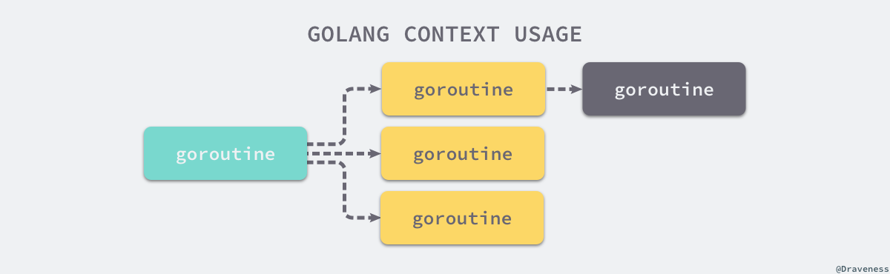
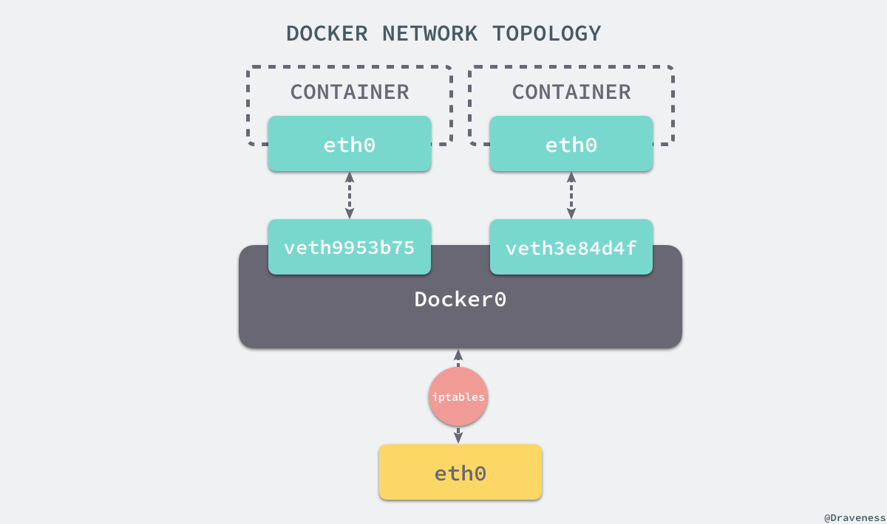

# Go 语言相关


## 语法问题

### 1. make 和 new 

- `make` 的作用是初始化内置的数据结构，也就是我们在前面提到的切片、哈希表和 Channel
- `new` 的作用是根据传入的类型分配一片内存空间并返回指向这片内存空间的指针


### 2. Golang 初始化顺序

 编译时, 根据 import 先后顺序执行, 先初始化常量再变量然后是 `init` 函数, 最后是 `main` 函数   

### 3. interface  和 nil 的区别

interface 底层有两个成员来实现, 一个是 type 一个是 data, 只有两个都为 `nil` 的时候才能判断为 `nil`. interface 判空: 

在知道类型可以使用, `ai, ok := i.(*int) ai == nil` 

不知道的话需要用反射来判断类型

 1. ```go
    func IsNil(i interface{}) bool {
        defer func() {
            recover()
        }()
        vi := reflect.ValueOf(i)
        return vi.IsNil()
    }
    
    // 不使用 defer recover
    func IsNil(i iterface{}) bool {
        vi := reflect.ValueOf(i)
        if vi.Kind() == reflect.Ptr {
            return vi.IsNil()
        }
        return false
    }
    ```

### 4. 并发安全的 Map : 加锁以及 sync.Map{} 的实现

| 实现方式    | 原理                                                         | 适用场景                                                     |
| ----------- | ------------------------------------------------------------ | ------------------------------------------------------------ |
| map+Mutex   | 通过Mutex互斥锁来实现多个goroutine对map的串行化访问          | 读写都需要通过Mutex加锁和释放锁，适用于读写比接近的场景      |
| map+RWMutex | 通过RWMutex来实现对map的读写进行读写锁分离加锁，从而实现读的并发性能提高 | 同Mutex相比适用于读多写少的场景                              |
| sync.Map    | 底层通分离读写map和原子指令来实现读的近似无锁，并通过延迟更新的方式来保证读的无锁化 | 读多修改少，元素增加删除频率不高的情况，在大多数情况下替代上述两种实现 |

### 5. slice 和 array 的区别

1. `array` 是固定长度的数组，使用前需要确定数组的长度。`array` 是值类型, 如果将数组值付给另一个数组, 实际上是整个数组拷贝一份.
    1. `array` 作为函数传递,传递的是数组的拷贝, 而不是数组的指针
    2. `array` 长度也是 type 的一部分 `[10]int` 和 `[20]int` 是不同的
2. `slice` 是一个引用类型, 是一个动态的指向数组切片的指针
    1. 是不定长的, 总是指向底层数组 `array` 的数据结构
    2. 扩容机制和 `vector` 相似, 1024字节下每次`cap`增加一倍, 1024 以上增加 $\frac{1}{4}$  

###  6. defer, panic 和 recover

1. `defer` 确保在函数结束后发生，先进后出（栈），即使 `panic` 也会执行
2. `panic` 只会触发当前 goroutine 的 `defer` 函数调用


如上图所示，多个 Goroutine 之间没有太多的关联，一个 Goroutine 在 `panic` 时也不应该执行其他 Goroutine 的延迟函数。

3. `recover` 只有在发生 `panic` 之后调用才会生效否则会只返回 `nil`，所以一般需要使用 `defer` 关键字修饰 `recover`保证其在 `panic` 之后执行


### 7.Map

Go 语言使用拉链法来解决哈希碰撞的问题实现哈希表

**哈希冲突**：理想情况哈希函数应该能把不同键映射到不同索引上，这要求**哈希函数输出范围大于输入范围**，但是由于键的数量会远远大于映射的范围，所以哈希碰撞，即键不同其哈希值却相同此时需要通过遍历来寻找值，最差会有 $O(n)$ 复杂度。

哈希冲突解决方法

1. **开放寻址法**

    核心思想是**对数组中的元素依次探测和比较以判断目标键值对是否存在于哈希表中**，其核心数据结构就为数组，因为数组长度有限，存储键值 `(author, draven)` 这个键值对时会从如下的索引开始遍历：

    ```go
    index := hash("author") % array.len
    ```


开放寻址法对性能影响最大的就是**装载因子**，它是数组中元素数量与数组大小的比值，当其增大时哈希表性能会下降。

2. **拉链法**

    拉链法一般是使用数组加上链表，其各个用于存储的节点的内存都是动态申请的，可以节省比较多的存储空间；有些语言会在拉链法哈希中加入红黑树以优化性能，其构成如下图所示


其加入键值对方式如下：

1. 找到键相同的键值对 —— 更新键对应的值；
2. 没有找到键相同的键值对 —— 在链表的末尾追加新键值对；

其性能也是受**装载因子**影响，越大读写性能就越差

> 装载因子 = 元素数量 / 桶数量


## 反射

`reflect` 实现了运行时的反射能力，能够让程序操作不同类型的对象[1](https://draveness.me/golang/docs/part2-foundation/ch04-basic/golang-reflect/#fn:1)。反射包中有两对非常重要的函数和类型，`reflect.TypeOf` 能获取类型信息，`reflect.ValueOf`能获取数据的运行时表示，另外两个类型是 `Type` 和 `Value`，它们与函数是一一对应的关系：


### 三大法则

运行时反射是程序在运行期间检查其自身结构的一种方式。反射带来的灵活性是一把双刃剑，反射作为一种元编程方式可以减少重复代码，但是过量的使用反射会使我们的程序逻辑变得难以理解并且运行缓慢。


## 并发编程

### 1. Golang 的 channel

Go 的 channel 来源于 CSP 模型（并发执行的实体组成，实体之间通过发送消息进行通信），Channel 是 Go 的一个核心类型，可以看成是一个管道，通过它并发核心单元可以进行发送或者接受数据进行通讯

```go
// 创建 channel
bufferChan := make(chan int, N) // 缓冲 channel
unBufferChan := make(chan int) //无缓冲 channel
```

如果没有 make 会出现 dead lock 错误：

```go
fatal error: all goroutines are asleep - deadlock!

goroutine 1 [chan receive (nil chan)]:
```

>   channel 分为无缓冲 channel 和有缓冲 channel。两者的区别如下：
>
>   *   无缓冲：发送和接收动作是同时发生的。如果没有 goroutine 读取 channel （<- channel），则发送者 (channel <-) 会一直阻塞。同步 channel
>   *   缓冲：缓冲 channel 类似一个有容量的队列。当队列满的时候发送者会阻塞；当队列空的时候接收者会阻塞。


### 2. Go 的协程

​    协程为非抢占式调度。用户态模拟进程线程的切换的具体实现，并非 OS 内核提供的功能。有程序员主动控制协程之间的切换。

   golang 提供一种基于消息机制而非共享内存的通信模型。

消息机制认为每个并发单元都是自包含的独立个体，并且拥有自己的变量，但在不同并发单元间这些变量不共享。每个并发单元输入输出都是消息。


### 3. 创建多个 goroutine 在多核的情况下是如何分配的

首先多核分配多个 goroutine 分别进行执行，如果一个核 M 在执行完后，该核上下文 P 会定期检查全局 runqueue 中的 goroutine，如果有则加入到自己的 runqueue 中进行执行，如果没有，则从其他运行中的 P 中 runqueue 中偷取一半 goroutine 到自己队列中，如果未获取到则会停止这个 M。


其中 G 为处理器线程 P 为线程和 Goroutine 的中间层， G 为 Goroutine

1.14 更新基于信号的抢占式调度，之前是基于协作的抢占式调度

### 4.并发协程如何优雅退出

1. for-range 结构退出:

    ```go
    go func(in <-chan int) {
        // Using for-range to exit goroutine
        // range has the ability to detect the close/end of a channel
        for x := range in {
            fmt.Printf("Process %d\n", x)
        }
    }(inCh)
    ```

2. for-select 结构退出

    1. 使用 ok 来退出

    ```go
    go func() {
    	// in for-select using ok to exit goroutine
    	for {
    		select {
    		case x, ok := <-in:
    			if !ok {
    				return
    			}
    			fmt.Printf("Process %d\n", x)
    			processedCnt++
    		case <-t.C:
    			fmt.Printf("Working, processedCnt = %d\n", processedCnt)
    		}
    	}
    }()
    ```

    2. 使用一个标记位 `stopCh` 来退出

        ```go
        func worker(stopCh <-chan struct{}) {
        	go func() {
        		defer fmt.Println("worker exit")
        		// Using stop channel explicit exit
        		for {
        			select {
        			case <-stopCh:
        				fmt.Println("Recv stop signal")
        				return
        			case <-t.C:
        				fmt.Println("Working .")
        			}
        		}
        	}()
        	return
        }
        ```


### 5. Context (上下文)

上下文 `Context` 用来设置截止日期、同步信号、传递请求相关值的结构体，与 `Goroutine` 有比较密切的关系，其接口有 4 个待实现的方法

```go
type Context interface {
    // 返回 context 被取消的时间，也就是完成工作的截止日期
	Deadline() (deadline time.Time, ok bool)
    // 返回一个 channel 该 channel 会在当前工作完成或者上下文被取消后关闭，多次调用 done 返回同一个 channel
	Done() <-chan struct{}
    // 返回 context 结束的原因，只在 Done 的 channel 被关闭时才会返回非空值
    // 被取消则是  Canceled 错误
    // 超时则是    DeadlineExceeded 错误
	Err() error
    // 从 context 中获取键相应的值
	Value(key interface{}) interface{}
}
```

其作用为在 Gouroutine 构成的树形结构中对信号进行同步以减少计算资源浪费。

当创建多个 Goroutine 来处理一次请求时，context 作用就是在不同 Goroutine 之间同步请求特定数据、取消信号以及处理请求的截止日期。如图为 Context 和 Goroutine 树



每个 context 都会从顶层一层一层传递到下层，如果不使用 context 同步信号，在上层 Goroutine 出现问题时，下次感知不到且还会继续运行，造成资源的浪费。当使用时则可以同步信号取消下层 goroutine 运行，减少资源浪费。


`context.WithTimeout` 可以设置一个上下文过期时间来控制超时事件。

`context.Background` 为上下文默认值，所有上下文都是他衍生出来；和 `context.TODO` 互为别名

`context.TODO` 应该只在不确定应该使用哪种上下文时使用，大多数情况使用上面那个上下文

context 使用方法和设计原理 — 多个 Goroutine 同时订阅 `ctx.Done()` 管道中的消息，一旦接收到取消信号就立刻停止当前正在执行的工作。如下函数所示

```go
func main() {
	ctx, cancel := context.WithTimeout(context.Background(), 1*time.Second)
	defer cancel()

	go handle(ctx, 500*time.Millisecond)
	select {
	case <-ctx.Done():
		fmt.Println("main", ctx.Err())
	}
}

func handle(ctx context.Context, duration time.Duration) {
	select {
	case <-ctx.Done():
		fmt.Println("handle", ctx.Err())
	case <-time.After(duration):
		fmt.Println("process request with", duration)
	}
}
// 输出 
// process request with 500ms
// main context deadline exceeded
```

**取消信号**

`context.WithCancel` 可以衍生出一个新的子上下文并返回用去取消该上下文的函数。一但执行取消函数，当前上下文及其子上下文都会被取消，所有的 Goroutine 都会同步收到这一取消信号。

其会调用两个子函数 `newCancelCtx` 和 `propagateCancel`

`propageteCancel` 调用会产生三种不同情况：

1. 当 `parent.Done() == nil`，也就是 `parent` 不会触发取消事件时，当前函数会直接返回；
2. 当 `child` 的继承链包含可以取消的上下文时，会判断 `parent `是否已经触发了取消信号；
    - 如果已经被取消，`child` 会立刻被取消；
    - 如果没有被取消，`child` 会被加入 `parent` 的 `children` 列表中，等待 `parent` 释放取消信号；
3. 在默认情况下
    1. 运行一个新的 Goroutine 同时监听 `parent.Done()` 和 `child.Done()` 两个 Channel
    2. 在 `parent.Done()` 关闭时调用 `child.cancel` 取消子上下文；

其作用为在 `parent` 和 `child` 之间同步取消和结束信号，保证不发生状态不一致问题。


 `context.WithDeadline` 和 `context.WithTimeout` 都可以创建可以被取消的计时器上下文 `context.timerCtx` 通过其持有的 `timer` 和截止时间 `deadline`来实现定时取消这一功能。


### 6. Sync 包和锁机制

Go 语言在 `sync` 中用于同步的常用原语如下图


这些基本原语提高了较为基础的同步功能，但是它们是一种相对原始的同步机制，在多数情况下，我们都应该使用抽象层级的更高的 Channel 实现同步。

#### 基本原语

1. Sync.Mutex（互斥锁）

    1. 互斥锁的加锁过程比较复杂
        1. 加锁如果处于初始化，则直接置位 `mutexLocked` 加锁
        2. 不在初始化且在**普通模式**工作，就会进入自旋【多线程同步机制，当前的进程在进入自旋的过程中会一直保持 CPU 的占用，持续检查某个条件是否为真。在多核的 CPU 上，自旋可以避免 Goroutine 的切换，使用恰当会对性能带来很大的增益，但是使用的不恰当就会拖慢整个程序】，执行 30 次 PAUSE 指令，消耗 CPU 时间等待锁的释放
        3. 如果等待锁时间超过 1 ms 就会进入**饥饿模式**
            1. 饥饿模式：互斥锁直接交给等待队列最前面的 Goroutine，新 Goroutine 在该状态无法获取锁也无法进入自旋状态
        4. 在正常模式会使用函数将尝试获取锁的 Goroutine 切换至休眠状态，等待锁的持有者唤醒当前 Goroutine
        5. 如果当前 Goroutine 是互斥锁上最后一个等待的协程或者等待的时间小于 1ms，则会切换回正常模式
    2. 互斥锁解锁
        1. 如果已经被解锁则抛出异常
        2. 处于饥饿模式则将锁的所有权交给下个等待者
        3. 处于正常模式，如果没有 Goroutine 等待锁释放或者已经有被唤醒的 Goroutine 获得了锁，就会直接返回，否则唤醒对应的 Goroutine

2. Sync.RWMutex(读写锁)

    | 读写兼容性 | 读   | 写   |
    | ---------- | ---- | ---- |
    | 读         | Y    | N    |
    | 写         | N    | N    |

3. sync.WaitGroup
    1. `sync.WaitGroup` 可以等待一组 Goroutine 的返回，一个比较常见的使用场景是批量发出 RPC 或者 HTTP 请求，可以通过它将原本顺序执行的代码在多个 Goroutine 中并发执行，加快程序处理速度
    2. WaitGroup 的方法函数
        1. `sync.WaitGroup.Add` 更新 waitGroup 中的计数器 `counter`，如果传入负数，就会崩溃并唤醒所有等待的 Goroutine 
        2. `wait` 会在 `counter` 大于 0，且不存在等待的 goroutine 时，进入睡眠状态
        3. `Done` 函数就是在 `Add` 中传入负数调用


4. sync.Once

    通过互斥锁和 `sync/atomic` 包实现某个函数在程序运行期间只能执行一次

5. Cond

    条件变量，可以让一系列 Goroutine 都在满足特定条件时被唤醒

    - `sync.Cond.Wait`方法在调用之前一定要使用获取互斥锁，否则会触发程序崩溃；
    - `sync.Cond.Signal` 方法唤醒的 Goroutine 都是队列最前面、等待最久的 Goroutine；
    - `sync.Cond.Broadcast`会按照一定顺序广播通知等待的全部 Goroutine；

#### 扩展原语

1. **ErrGroup**
    1. 在一组 Goroutine 中提供了同步、错误传播以及上下文取消的功能
    2. 只有第一个出现的错误才会被返回，剩余的错误都会被直接抛弃；

2. **Semaphore（信号量）**

3. **SingleFlight**

    能够在一个服务中抑制对下游的多次重复请求，常见的应用场景是发生缓存击穿问题时，大量的流量都会打到数据  库上进而影响服务的尾延时。

    

### 7. Channel

设计模式：通过通信来共享内存。CSP 并发模型（通信顺序进程）


Channel 遵循了先入先出设计（FIFO）

发送数据 `ch <- i`

1. 如果当前 Channel 的 recvq 队列上存在已被阻塞的 Goroutine，那么会直接将数据发送给最先等待的  Goroutine 并将其设置为下一个运行的 Goroutine
2. 如果是有缓冲区的 Channel，则将数据发送到缓冲区存储
3. 不满足以上情况，则当前 Goroutine 会陷入阻塞等待其他协程从 Channel 接收数据

接受数据 `i <- ch 或者  i, ok <- ch`

1. Channel 为空，就会挂起当前 Goroutine 直到有数据发送
2. Channel 已经关闭并且缓冲区无数据，会直接返回
3. Channel 的 sendq 队列中有挂起的 Goroutine，就会将 recvx 索引所在数据拷贝到接收变量 `i` 所在的内存空间上并将 sendq 队列中 Goroutine 的数据拷贝到缓冲区
4. Channel 缓冲区包含数据就会直接读取 recvx 索引对应的数据
5. 默认情况会挂起当前 Goroutine，将 sudog 结构加入 recvq 队列并陷入休眠等待调度器唤醒


## 垃圾回收机制

Golang 使用的垃圾回收机制是三色标记法配合混合写屏障和辅助 GC，三色标记法是标记-清除法的一种增强版本。

三色标记法：

1. 将根节点标记为**灰色**，然后遍历其引用的节点
2. 遍历后将根节点标记为**黑色**，在将其引用的节点标记为**灰色**
3. 重复上述操作，然后将没有颜色的白色节点清除


# Docker

## 1. docker 如何映射端口

```dockerfile
docker run -d \
-p 8080:80 # 指定端口映射，将容器80端口映射到主机8080端口
```

  如果不指定端口映射参数，在容器外部无法通过网络来访问容器内的网络应用和服务的。

 

docker 中包含 bridge, host, none 三种网络，还有 container 第四种网络。其中 bridge 是默认网络 none 是无网络， host是宿主机网络， container 是与指定容器共享网络。


bridge 是 通过 iptables 将流量打到 docker0 的子网上的， iptables 将来自 8080 端口的流量打到 80 端口上。


## 2. 容器(docker) 和镜像的区别

容器 = 镜像 + 可读层. 这并非为运行态容器. 

运行态容器则是在容器的基础上加上隔离的进程空间 ( 文件系统隔离 )


## 3. Docker 容器技术原理

### 隔离

Docker 通过 Linux 的 Namespaces 对不同容器进行隔离；Namespaces 是 LInux 提供的用于分离进程树、网络接口、挂载点以及进程间通信的方法。


这样在宿主机中仅有几个 docker 进程，而 docker 进程对于宿主机或者其他容器进程一无所知

**物理隔离**：使用 CGroup 将 cpu 等物理资源在 docker 内进行隔离

### 网络

每一个 `docker run` 启动的容器都有单独的网络命名空间，其有 4 种不同的网络模式， Host，Container，None 和 Bridge


**Bridge 模式（网桥模式）**

这种模式下，除了单独的网络命名空间外，还会为所有容器设置 IP 地址。当 docker 服务器在主机上启动后会创建新的虚拟网桥 docker0，随后在该主机启动的全部服务与其相连



网桥 docker0 通过 iptables 转发到 docker0 并由网桥分发给对应的机器。


# 项目相关

## Go 项目相关

### 1. 实现 `sql` 连接池

1. 初始化 DB : `db, err := sql.Open("mysql", "xxxx")`
    1. `sql.Open()`是取出对应的db，这时mysql还没有建立连接，只是初始化了一个`sql.DB`结构，这是非常重要的一个结构，所有相关的数据都保存在此结构中；Open同时启动了一个`connectionOpener`协程
2. 获取链接: `rows, err := db.Query("select * from test")` 
    1. 只有等使用时才会真正建立连接

### 2. 控制查询超时

1. `select` + `time.After`

    1. 代码实现

        ```go
        ch := make(chan string)
        
        go func() {
            time.Sleep(time.Second * 2)
        
            ch <- "result"
        }()
        
        select {
            case res := <-ch:
            fmt.Println(res)
            case <-time.After(time.Second * 1):
            fmt.Println("timeout")
        }
        ```

2. `context` 超时控制

    1.  `context.WithTimeout`  设置超时时间


## JWT （JSON Web Token）

该 token 被设计为紧凑且安全的，特别适用于单点登录场景（SSO）


JWT 由 `Header` `Payload` `Signature` 三部分组成。

>1.  Header：通常由两部分组成，令牌类型和签名所使用的算法
>2.  Payload(有效载荷)：包含 claims，通常是用户数据结构与其他数据的声明
>3.  Signature ：签名用于验证消息在整个过程中没有更改，并且对于使用私钥进行签名的令牌，它还可以验证 JWT 的发送者是他所说的真实身份

## Git 相关

### 1. git 如何切换分支

创建分支，删除分支，重命名分支，列出所有分支：`git branch`

切换分支 `git checkout`

合并分支 `git merge`

### 2. git 如何和两个远程仓库连接

  

```bash
git remote add 代号 仓库地址

# 推到仓库
git push 代称 分支
```


## 如何应对高并发

1）客户端发出请求层面：

*   尽量减少请求数量：
    *   尽量利用浏览器缓存功能，减少访问服务端
    *   考虑使用压缩传输的功能，减少网络流量
    *   使用异步请求，分批获取数据
*   尽量减少对服务端资源的不必要耗费
    *   重复使用某些资源

2）从服务端看

*   增加资源供给
    *   更大的网络带宽
    *   配置更好的服务器
    *   高性能数据库
*   请求分流
    *   集群
    *   分布式系统架构
*   应用优化
    *   更高效的编程语言
    *   优化处理业务逻辑的算法
    *   优化访问数据库的 SQL


## Nginx

### 为什么使用 Nginx（好处）？

* 跨平台，配置简单、高并发连接，内存消耗小
* 健康检查功能，节省宽带，稳定性高，异步请求
* 性能高：采用异步非阻塞事件处理机制，运用了 epoll 模型，提供队列，排队解决
* 可以反向代理，负载均衡：隐藏源服务器的存在和特征

缺点

* 动态处理差：nginx 处理静态文件好，耗费内存少，处理动态页面很鸡肋


### Nginx 限流

- Nginx 限流就是限制用户请求速度，防止服务器受不了
- 限流有3种
    1. 正常限制访问频率（正常流量）
    2. 突发限制访问频率（突发流量）
    3. 限制并发连接数
- Nginx 的限流都是基于漏桶流算法


### 漏桶算法和令牌桶算法

**漏桶算法**

漏桶可以看作是一个带有常量服务时间的单服务器队列，如果漏桶（包缓存）溢出，那么数据包会被丢弃。 在网络中，漏桶算法可以控制端口的流量输出速率，平滑网络上的突发流量，实现流量整形，从而为网络提供一个稳定的流量。


**令牌桶算法**

令牌桶算法的原理是系统会以一个恒定的速度往桶里放入令牌，而如果请求需要被处理，则需要先从桶里获取一个令牌，当桶里没有令牌可取时，则拒绝服务。从原理上看，令牌桶算法和漏桶算法是相反的，一个“进水”，一个是“漏水”。


### Nginx 负载均衡

- 为了避免服务器崩溃，大家会通过负载均衡的方式来分担服务器压力。将对台服务器组成一个集群，当用户访问时，先访问到一个转发服务器，再由转发服务器将访问分发到压力更小的服务器。
- Nginx负载均衡实现的策略有以下五种：
    - 轮询（默认）
        - 每个请求按时间顺序逐一分配到不同的后端服务器，如果后端某个服务器宕机，能自动剔除故障系统。
    - 权重 Weight
        - 权重越大访问概率越高
    -  ip_hash( IP绑定)
        - 每个请求按访问 IP 的哈希结果分配，使来自同一个 IP 的访客固定访问一台后端服务器，`并且可以有效解决动态网页存在的 session 共享问题`
    - fair（第三方插件）
        - 对比 weight、ip_hash 更加智能的负载均衡算法，fair 算法可以根   据页面大小和加载时间长短智能地进行负载均衡，响应时间短的优先分配。
    - url_hash（第三方插件）
        - 按访问 url 的 hash 结果来分配请求，使每个 url 定向到同一个后端服务器，可以进一步提高后端缓存服务器的效率。


## 海量数据处理

海量数据处理的困难用一句话概括，就是时空资源不够。具体来说，

- 时间受限：无法在有限时间内，完成针对海量数据的某项处理工作；
- 空间受限：无法将海量数据一次性读入内存

对于时间受限的问题，我们一般的解决办法是高效的算法配合恰当的数据结构，比如哈希表，Bloom Filter，堆，倒排索引，tire 树；

而对于空间受限的问题，一般的解决办法是“大而化小，分而治之”的策略，既然一次性行不通，那就一部分一部分读，每读入一部分可以生成一个小文件，小文件是可以直接读入内存的，我们这样分割大数据之后，再依次处理小文件的数据

### 海量数据处理方法归纳

#### 1. 哈希映射 + 统计 + 排序

**解决问题**：海量数据不能一次性读入内存，而我们需要对海量数据进行的计数、排序等操作
**使用工具**：hash 函数（hash表）；堆

先借助哈希算法，计算每一条数据的 hash `hash(key) % N` 值，按照 hash 值将海量数据分布存储到多个桶中（所谓桶，一般可以用小文件实现）。根据 hash 函数的唯一性，相同的数据一定在同一个桶中。如此，我们再依次处理这些小文件，最后做合并运算即可（有点类似于 Map-Reduce 的思想）。


解决问题

1. **top-k 筛选问题**
    1. 依次遍历这些文件，通过 hash 映射，将每个文件的每条数据映射到新构造的多个小文件中（设生成了 n 个小文件）；
    2. 依次统计每个小文件中出现次数最多的 k 条数据，构成 hash 表，hash 表中每个键值对的形式为 `dataItem: count`；
    3. 利用堆排序，依次遍历这些 hash 表，在 n∗k 条数据中，找出`count`值最大的 k 个；

2. **对比查重**：现有 A,B 两个大文件，每个文件都有海量数据，要求给出 A,B 中重复数据
    1. 遍历A中的所有数据，通过 hash 映射将他们分布存储在 n 个小文件中，记为 {a1,a2,…,an}；
    2. 遍历B中的所有数据，通过 hash 映射将他们分布存储在 n 个小文件中，记为 {b1,b2,…,bn}；
    3. 根据 hash 函数性质可知，A 和 B 中的相同数据一定被映射到序号相同的小文件，所以我们依次比较 {ai,bi} 即可；
    4. 如果问题更进一步，要求返回重复次数最多的 k 条数据，则可以将对比小文件找到的数据存入 hash 表，键为数据，值为该数据出现的次数。再用大小为 k 的堆，排序找出即可。

#### 2. Trie 树处理海量字符串数据

**解决问题**：当需要处理的是海量字符串数据时，有时 Trie 树会比直接上面说的 hash 映射的策略更高效。
**使用工具**：Trie 树；堆

**问题3 数据去重**：一个超大文件（不能直接读入内存），里面包含海量字符串数据，但字符串数据种类有限（可见含有大量重复），现需要对字符串去重。并统计去重后每个字符串出现的次数
**解决思路**：

- 将大文件分割成多个小文件，依次遍历每个小文件，读取其中存储的每一个字符串，构建 Trie 树，并在每一个终止节点记录该节点代表的字符串（即从根节点到该节点的字符组成的字符串）当前出现的次数，解决问题的时间复杂度为 O(N∗len)，其中 N 为字符串总数，len 为字符串的平均长度；
- 如果问题更进一步，需要排序，那就再建一个堆，读取 Trie 树，将字符串依次插入堆，时间复杂度为O(N′∗len∗logN′)，其中 N’ 是去重后字符串的数量；

总结一下，Trie 树对于海量字符串数据，在数据种类有限（构建的 Trie 树可以完全读入内存）时，能够使我们轻松的进行存储，查找，计数等工作。

#### 3. Bloom Filter 布隆过滤器

**解决问题**：数据字典的构建；判定目标数据是否存在于一个海量数据集；集合求交
**使用工具**：Bloom Filter；hash 函数

**问题4 集合求交**：与上面的问题2类似，只不过现在不是A和B两个大文件，而是A, B, C, D….多个大文件。
**解决思路**：

- 依次遍历每个大文件中的每条数据，遍历每条数据时，都将它插入Bloom Filter；
- 如果已经存在，则在另外的集合（记为 S）中记录下来；
- 如果不存在，则插入Bloom Filter；
- 最后，得到的 S 即为所有这些大文件中元素的交

**问题5 unsigned int 型整数存在性判定**：判定一个 unsigned int 型整数是否在一个大的 unsigned int 型整数数据集中。
**解决思路**：

- 假设 unsigned int 型整数数据集长度为 N，则申请一个大小为 512M 的数组作为 Bloom Filter；
- 遍历数据集，按照遍历到的整数（记为 a ）将 Bloom Filter 的第 a 位变成 1；
- 检查 Bloom Filter 中，目标数据所代表的位是 0 还是 1；


## 长网址映射短网址

1. DNS首先解析获得 [http://t.cn](https://link.jianshu.com?t=http%3A%2F%2Ft.cn) 的 `IP` 地址

2. 当 `DNS` 获得 `IP` 地址以后（比如：74.125.225.72），会向这个地址发送 `HTTP` `GET` 请求，查询短码 `RlB2PdD`

3. [http://t.cn](https://link.jianshu.com?t=http%3A%2F%2Ft.cn) 服务器会通过短码 `RlB2PdD` 获取对应的长 URL

4. 请求通过 `HTTP` `301` 转到对应的长 URL [https://m.helijia.com](https://link.jianshu.com?t=https%3A%2F%2Fm.helijia.com) 。

### 算法实现

**1.自增序列算法（永不重复算法）**

设置 id 自增，一个 10 进制 id 对应一个 62 进制的数值，1 对 1，也就不会出现重复的情况。这个利用的就是低进制转化为高进制时，字符数会减少的特性。

短址的长度一般设为 6 位，而每一位是由 `[a - z, A - Z, 0 - 9]` 总共 62 个字母组成的，所以 6 位的话，总共会有 62^6 ~= 568亿种组合


**2.md5 算法**

md5 加密后为 128位 （bit）16 字节

1. 将长网址 `md5` 生成 32 位签名串,分为 4 段, 每段 8 个字节

2. 对这四段循环处理, 取 8 个字节, 将他看成 16 进制串与 0x3fffffff(30位1) 与操作, 即超过 30 位的忽略处理

3. 这 30 位分成 6 段, 每 5 位的数字作为字母表的索引取得特定字符, 依次进行获得 6 位字符串

4. 总的 `md5` 串可以获得 4 个 6 位串,取里面的任意一个就可作为这个长 url 的短 url 地址


## JSON，XML，Protobuf


## REST 和 RPC 

**REST ful 代表表现层状态转移**，是一种软件架构风格，用于约束客户端和服务器交互，操作对象即为资源，使用方法（GET, POST, PUT, DELETE），参数都放在 URL 上，采用的是 HTTP 协议。


**RPC 是代表远程过程调用**，用于解决分布式系统服务间调用的一种方式，采用 TCP/UDP 协议，客户端根据约定的接口（常见为通过 IDL 定义或者是代码定义）以类似本地方法调用的方式来进行交互，客户端根据约定传输调用函数+参数给服务端，服务端处理完按照约定将返回值返回给客户端。


RPC 服务治理框架设计哪些模块？

可分为两大部分 RPC + 服务治理

1. RPC部分 = IDL  +客户端/服务端实现层 + 协议层 + 数据传输层
2. 服务治理 = 服务管理（注册中心）+ 服务监控 + 服务容灾 + 服务鉴权


# 分布式系统

## 分布式锁

在单机场景下，可以使用语言的内置锁来实现进程同步。但是在分布式场景下，需要同步的进程可能位于不同的节点上，那么就需要使用分布式锁。


### Redis 的 SETNX 指令

使用 SETNX（set if not exist）指令插入一个键值对，如果 Key 已经存在，那么会返回 False，否则插入成功并返回 True。SETNX 指令和数据库的唯一索引类似，保证了只存在一个 Key 的键值对，那么可以用一个 Key 的键值对是否存在来判断是否存于锁定状态。

EXPIRE 指令可以为一个键值对设置一个过期时间，从而避免了数据库唯一索引实现方式中释放锁失败的问题。


#### Redis Redlock 算法【防止单点故障】

使用了多个 Redis 实例来实现分布式锁，这是为了保证在发生单点故障时仍然可用。

- 尝试从 N 个互相独立 Redis 实例获取锁；
- 计算获取锁消耗的时间，只有时间小于锁的过期时间，并且从大多数（N / 2 + 1）实例上获取了锁，才认为获取锁成功；
- 如果获取锁失败，就到每个实例上释放锁。


### Zookeeper

Zookeeper 提供了一种树形结构的命名空间，/app1/p_1 节点的父节点为 /app1


其节点类型有

- 永久节点：不会因为会话结束或者超时而消失；
- 临时节点：如果会话结束或者超时就会消失；
- 有序节点：会在节点名的后面加一个数字后缀，并且是有序的，例如生成的有序节点为 /lock/node-0000000000，它的下一个有序节点则为 /lock/node-0000000001，以此类推。

**分布式锁实现**

- 创建一个锁目录 /lock；
- 当一个客户端需要获取锁时，在 /lock 下创建临时的且有序的子节点；
- 客户端获取 /lock 下的子节点列表，判断自己创建的子节点是否为当前子节点列表中序号最小的子节点，如果是则认为获得锁；否则监听自己的前一个子节点，获得子节点的变更通知后重复此步骤直至获得锁；
- 执行业务代码，完成后，删除对应的子节点。

**会话超时设置**

如果一个已经获得锁的会话超时了，因为创建的是临时节点，所以该会话对应的临时节点会被删除，其它会话就可以获得锁了。可以看到，这种实现方式不会出现数据库的唯一索引实现方式释放锁失败的问题。


## 分布式事务

事务四大特性 ACID 

A：原子性

C：一致性

I：隔离性

D：持久性

分布式事务指事务的操作位于不同的节点上，需要保证事务的 ACID 特性。

例如在下单场景下，库存和订单如果不在同一个节点上，就涉及分布式事务。


**强一致性，弱一致性，最终一致性**

强一致性是指任何一次读都能读到某个数据的最近一次写的数据，在任意时刻，所有节点的数据是一样的

弱一致性是指数据更新后能容忍后续的访问只能访问到部分或者访问不到。

最终一致性是指不保证任意时刻任意节点上的同一份数据都是相同的。就是在一段时间后，节点间的数据会最终达到一致状态。


### **CAP 定理**

CAP 定理是指在一个分布式系统中，一致性（C），可用性（A），分区容错性（P），三者不可得兼


一致性（C）：

> 在分布式系统中的所有数据备份，在同一时刻是否同样的值。（等同于所有节点访问同一份最新的数据副本）

可用性（A）：

> 在集群中一部分节点故障后，集群整体是否还能响应客户端的读写请求。（对数据更新具备高可用性）

分区容错性（P）：

> 以实际效果而言，分区相当于对通信的时限要求。系统如果不能在时限内达成数据一致性，就意味着发生了分区的情况，必须就当前操作在 C 和 A 之间做出选择。


### **BASE 理论**

BASE 是基本可用（Basically Available）、软状态（Soft State）和最终一致性（Eventually Consistent）三个短语的缩写。

BASE 理论是对 CAP 中一致性和可用性权衡的结果，它的核心思想是：即使无法做到强一致性，但每个应用都可以根据自身业务特点，采用适当的方式来使系统达到最终一致性。是对 AP 的一个补充。


### **分布式事务解决方案**

#### **1. 两段式提交**

分两步提交

存在一个负责协调各个本地资源管理器的事务管理器，本地资源管理器一般是由数据库实现，事务管理器在第一阶段的时候询问各个资源管理器是否都就绪？如果收到每个资源的回复都是 yes，则在第二阶段提交事务，如果其中任意一个资源的回复是 no, 则回滚事务。


**存在的问题**

1. 同步阻塞：所有事务参与者在等待其他参与者响应的时候都处于同步阻塞等待状态
2. 单点故障：一旦事务管理器出现故障，整个系统不可用
3. 数据不一致：在提交阶段，如果协调者只发送了部分 Commit 消息，此时网络发生异常，那么只有部分参与者接收到 Commit 消息，也就是说只有部分参与者提交了事务，使得系统数据不一致。
4. 太过保守：任意一个节点失败就会整个事务失败，没有完善的容错机制。

#### 2. TCC

TCC（Try-Confirm-Cancel）

TCC 事务机制相比于上面介绍的 XA，解决了其几个缺点：

1. 解决了协调者单点，由主业务方发起并完成这个业务活动。业务活动管理器也变成多点，引入集群。
2. 同步阻塞：引入超时，超时后进行补偿，并且不会锁定整个资源，将资源转换为业务逻辑形式，粒度变小。
3. 数据一致性，有了补偿机制之后，由业务活动管理器控制一致性


#### 3. 本地消息表

本地消息表与业务数据表处于同一个数据库中，这样就能利用本地事务来保证在对这两个表的操作满足事务特性，并且使用了消息队列来保证最终一致性。


## 分布式选举算法

### 1. Paxos

### 2.Raft


# 数据结构与算法

## 排序

| 算法             | 稳定性 | 时间复杂度                   | 空间复杂度 | 备注                     |
| ---------------- | ------ | ---------------------------- | ---------- | ------------------------ |
| 选择排序         | ×      | N2                           | 1          |                          |
| 冒泡排序         | √      | N2                           | 1          |                          |
| 插入排序         | √      | N ~ N2                       | 1          | 时间复杂度和初始顺序有关 |
| 希尔排序         | ×      | N 的若干倍乘于递增序列的长度 | 1          | 改进版插入排序           |
| 快速排序         | ×      | NlogN                        | logN       |                          |
| 三向切分快速排序 | ×      | N ~ NlogN                    | logN       | 适用于有大量重复主键     |
| 归并排序         | √      | NlogN                        | N          |                          |
| 堆排序           | ×      | NlogN                        | 1          | 无法利用局部性原理       |

插入排序 (n - 1)次交换，3(n - 1)次移动


## 最短路径算法

1.Dijkstra算法是计算图中的一个点到其它点的最小路径.  

算法思路: 贪心算法.   

 将图中所有点分成  S (已求出解)和 U (未求出解)2个点集.dist[i] 表示 v0 到 v[i] 当前已求得得最短路径.`A[n][n]`为边集    

​	 1.从剩下的边集合中选出dist最短的边并将边的另一顶点vi从U中加入S.   

​	 2.更新与vi连接的所有且并未在S中的点的dist矩阵值,dist[vk]=min(dist[vk],dist[vi]+A(i,k)).    

​	 3.重复上述操作直到U中无与S中的点相连的点. 


2.Floyd 算法计算图中任意一对点的最短路径.  算法思路:  T(n)=O(n^3).   动态规划法: Dis(i,j) =min(Dis(i,j), Dis(i,k) + Dis(k,j)). 

Floyd 不能有负权值的回路

```c++
for(k=0;k<n;k++) 　{       
	//A[i][j]初始为每点的边长. 
	for(i=0;i<n;i++) 
		for(j=0;j<n;j++) 
			if(A[i][j]>(A[i][k]+A[k][j]))             　　
			{                   　　
				A[i][j]=A[i][k]+A[k][j];                   　　
				path[i][j]=k;              　 
			}     　
} 
```


3.Dijkstra 算法为啥不能存在负数边?
 Dijkstra中 S (已求出解)中的每一个点解即最短路径是已求出的,若存在负数路径,可能存在已求出的解不是最优解.


# 设计模式

## 创建型

### 单例模式

确保一个类只有一个实例，并提供该实例的全局访问点

使用一个私有构造函数、一个私有静态变量以及一个公有静态函数来实现。

私有构造函数保证了不能通过构造函数来创建对象实例，只能通过公有静态函数返回唯一的私有静态变量。


### 简单工厂

在创建一个对象时不向客户暴露内部细节，并提供一个创建对象的通用接口


### 工厂方法

定义了一个创建对象的接口，但由子类决定要实例化哪个类。工厂方法把实例化操作推迟到子类。


### 抽象工厂

提供一个接口，用于创建 **相关的对象家族** 。


### 生成器

封装一个对象的构造过程，并允许按步骤构造


### 原型模式

使用原型实例指定要创建对象的类型，通过复制（clone）这个原型来创建新对象。


## 行为型

### 责任链模式

使多个对象都有机会处理请求，从而避免请求的发送者和接收者之间的耦合关系。将这些对象连成一条链，并沿着这条链发送该请求，直到有一个对象处理它为止


### 命令模式

请求以命令的形式包裹在对象中，并传给调用对象。调用对象寻找可以处理该命令的合适的对象，并把该命令传给相应的对象，该对象执行命令。


### 解释器模式

这种模式实现了一个表达式接口，该接口解释一个特定的上下文。这种模式被用在 SQL 解析、符号处理引擎等。


### 迭代器模式

这种模式用于顺序访问集合对象的元素，不需要知道集合对象的底层表示。


### 中介者模式

降低多个对象和类之间的通信复杂性。这种模式提供了一个中介类，该类通常处理不同类之间的通信，并支持松耦合，使代码易于维护


### 备忘录模式

保存一个对象的某个状态，以便在适当的时候恢复对象


### 观察者模式

当对象间存在一对多关系时，则使用观察者模式（Observer Pattern）。比如，当一个对象被修改时，则会自动通知依赖它的对象


### 状态模式

在状态模式（State Pattern）中，类的行为是基于它的状态改变的


### 策略模式

一个类的行为或其算法可以在运行时更改


### 模板模式

一个抽象类公开定义了执行它的方法的方式/模板。它的子类可以按需要重写方法实现，但调用将以抽象类中定义的方式进行


### 空对象模式

一个空对象取代 NULL 对象实例的检查。Null 对象不是检查空值，而是反应一个不做任何动作的关系。这样的 Null 对象也可以在数据不可用的时候提供默认的行为。


### 访问者模式

我们使用了一个访问者类，它改变了元素类的执行算法。通过这种方式，元素的执行算法可以随着访问者改变而改变


## 结构型

### 适配器模式

作为两个不兼容的接口之间的桥梁。这种类型的设计模式属于结构型模式，它结合了两个独立接口的功能


### 桥接模式

桥接（Bridge）是用于把抽象化与实现化解耦，使得二者可以独立变化


### 组合模式

把一组相似的对象当作一个单一的对象。组合模式依据树形结构来组合对象，用来表示部分以及整体层次


### 装饰器模式

允许向一个现有的对象添加新的功能，同时又不改变其结构


### 外观模式

外观模式（Facade Pattern）隐藏系统的复杂性，并向客户端提供了一个客户端可以访问系统的接口


### 享元模式

享元模式（Flyweight Pattern）主要用于减少创建对象的数量，以减少内存占用和提高性能


### 代理模式

代理模式（Proxy Pattern）中，一个类代表另一个类的功能